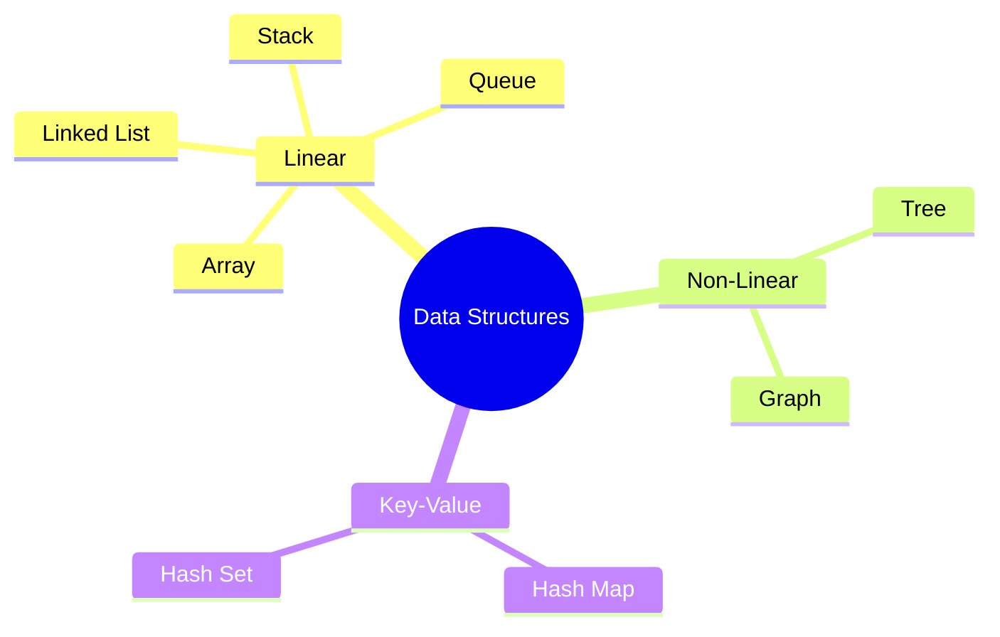
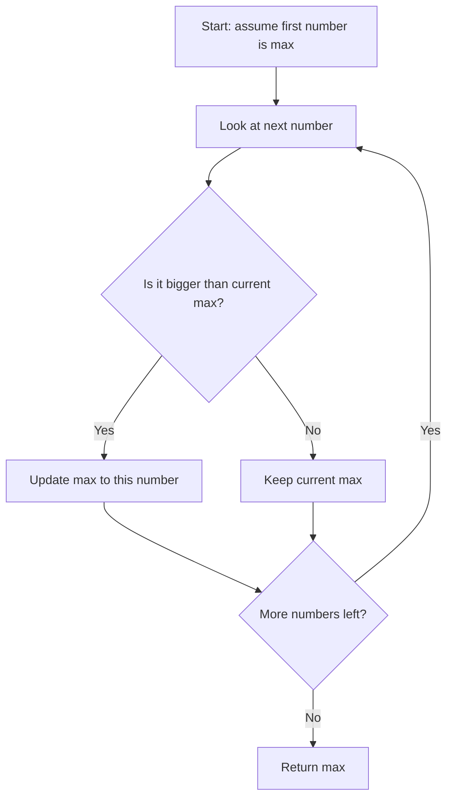
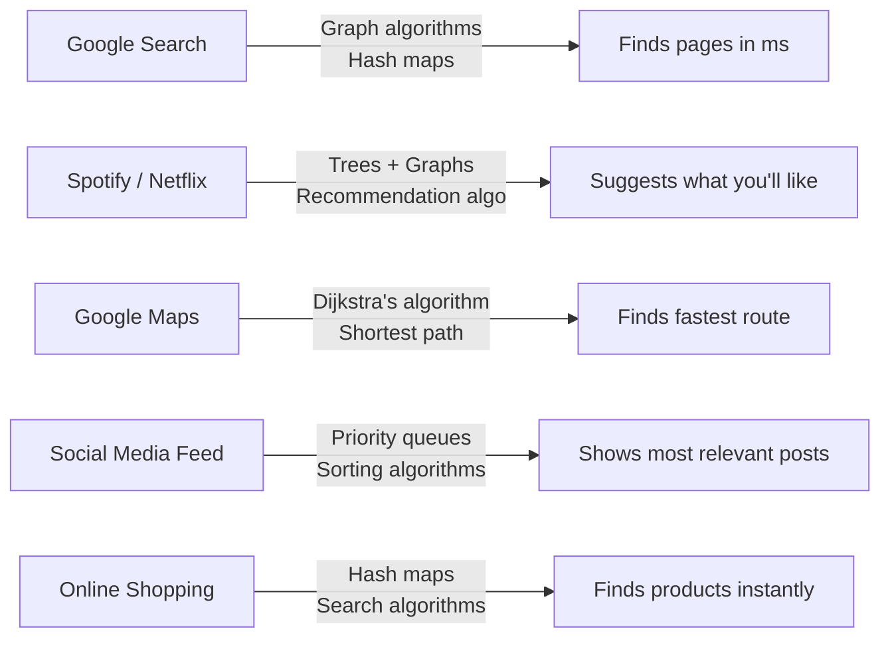
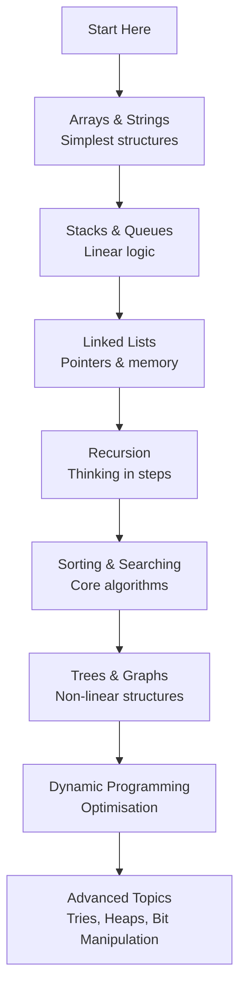

# What is DSA? — Data Structures & Algorithms Explained in Plain English

> **One-line summary:**
> A **Data Structure** is how you _store_ your data. An **Algorithm** is how you _work with_ it.
> Together, they make your code fast, efficient, and ready to handle real-world scale.

---

## Table of Contents

1. [The Book Analogy — Why DSA Exists](#1-the-book-analogy--why-dsa-exists)
2. [What is a Data Structure?](#2-what-is-a-data-structure)
3. [Common Types of Data Structures](#3-common-types-of-data-structures)
4. [What is an Algorithm?](#4-what-is-an-algorithm)
5. [Simple Algorithm Example — Find the Max Number](#5-simple-algorithm-example--find-the-max-number)
6. [Data Structure vs Algorithm — What's the Difference?](#6-data-structure-vs-algorithm--whats-the-difference)
7. [Why Does DSA Matter?](#7-why-does-dsa-matter)
8. [DSA in Apps You Use Every Day](#8-dsa-in-apps-you-use-every-day)
9. [How to Start Learning DSA](#9-how-to-start-learning-dsa)
10. [Key Takeaways](#10-key-takeaways)

---

## 1. The Book Analogy — Why DSA Exists

Imagine you have **1000 books scattered on the floor**.
Finding one specific book? You'd have to check every single one. That could take ages.

Now imagine those books are **arranged on shelves by genre, then alphabetically**.
You find any book in seconds.

That's exactly what DSA does for your code:

- **Data Structure** = the shelves (how you organize things)
- **Algorithm** = the strategy you use to find/sort/arrange the books

```
Without DSA:                    With DSA:
[book][book][book]...           Shelf A: Fiction  → sorted A-Z
[book][book][book]...           Shelf B: Science  → sorted A-Z
[book][book][book]...           Shelf C: History  → sorted A-Z

Finding a book = scan all 1000  Finding a book = go to shelf, scan ~20
```

---

## 2. What is a Data Structure?

A data structure is a **container** for your data.

Just like in real life, different containers suit different purposes:

| Real Life                       | Programming Equivalent |
| ------------------------------- | ---------------------- |
| Row of lockers (numbered 1–100) | Array                  |
| Chain of paper clips            | Linked List            |
| Stack of plates                 | Stack                  |
| Queue at a coffee shop          | Queue                  |
| Dictionary (word → meaning)     | Hash Map               |
| Family tree                     | Tree                   |
| Road map (cities + roads)       | Graph                  |

> **The Golden Rule:** Always pick the container that makes your most common operation the fastest.
> Storing soup in a paper bag _technically_ works — but it's a disaster. Same with wrong data structures.

---

## 3. Common Types of Data Structures



### Quick overview

| Structure       | Best for                                     | Real-world analogy                   |
| --------------- | -------------------------------------------- | ------------------------------------ |
| **Array**       | Storing items in order, fast access by index | Row of numbered lockers              |
| **Linked List** | Frequent insert/delete in the middle         | Chain of paper clips                 |
| **Stack**       | Undo/redo, function call tracking            | Stack of plates                      |
| **Queue**       | Processing tasks in order                    | Line at a coffee shop                |
| **Hash Map**    | Super-fast lookups by key                    | A dictionary                         |
| **Tree**        | Hierarchical data                            | Company org chart / folder structure |
| **Graph**       | Connections between things                   | Google Maps road network             |

---

## 4. What is an Algorithm?

An algorithm is just a **list of steps to solve a problem**.

You already use algorithms in real life:

- Following a recipe → cooking algorithm
- GPS directions → shortest path algorithm
- Googling something → search algorithm

In code, a good algorithm:

- Gets the job done ✅
- Does it quickly ✅
- Doesn't waste memory ✅

A bad algorithm might also get the job done — but becomes **painfully slow** once your data grows large.

---

## 5. Simple Algorithm Example — Find the Max Number

**Problem:** Given a list of numbers, find the largest one.

**How a human thinks:** Start with the first number. Look at each one. If it's bigger than what you have, update your "current biggest."



### Python

```python
def find_max(numbers):
    # Start by assuming the first number is the biggest
    max_val = numbers[0]

    # Go through every other number in the list
    for i in range(1, len(numbers)):
        if numbers[i] > max_val:
            max_val = numbers[i]   # found something bigger — update!

    return max_val


# Example
scores = [42, 87, 15, 93, 60]
print(find_max(scores))   # Output: 93
```

### C++ (simple)

```cpp
#include <iostream>
#include <vector>
using namespace std;

int findMax(vector<int> numbers) {
    // Start by assuming the first number is the biggest
    int maxVal = numbers[0];

    // Go through every other number in the list
    for (int i = 1; i < numbers.size(); i++) {
        if (numbers[i] > maxVal) {
            maxVal = numbers[i];   // found something bigger — update!
        }
    }

    return maxVal;
}

int main() {
    vector<int> scores = {42, 87, 15, 93, 60};
    cout << findMax(scores) << endl;   // Output: 93
    return 0;
}
```

### C++ (LeetCode class style)

```cpp
#include <vector>
using namespace std;

class Solution {
public:
    // Return the maximum value in a non-empty array
    int findMax(vector<int>& numbers) {
        int maxVal = numbers[0];  // assume first element is the biggest
        for (int i = 1; i < numbers.size(); i++) {
            if (numbers[i] > maxVal)
                maxVal = numbers[i];  // found something bigger — update
        }
        return maxVal;  // return the largest value found
    }
};
```

**Step-by-step trace for `[42, 87, 15, 93, 60]`:**

| Step  | Current number | Current max | Updated? |
| ----- | -------------- | ----------- | -------- |
| Start | 42             | 42          | —        |
| 1     | 87             | 87          | Yes      |
| 2     | 15             | 87          | No       |
| 3     | 93             | 93          | Yes      |
| 4     | 60             | 93          | No       |
| Done  | —              | **93**      | ✅       |

---

## 6. Data Structure vs Algorithm — What's the Difference?

People often mix these up. Here's a clean breakdown:

|                | Data Structure               | Algorithm                              |
| -------------- | ---------------------------- | -------------------------------------- |
| **What it is** | A way to organize/store data | A set of steps to solve a problem      |
| **Focus**      | How data is arranged         | How operations are performed           |
| **Examples**   | Array, Stack, Tree, Graph    | Sort, Search, Traverse, Find           |
| **Analogy**    | A filing cabinet             | The instructions for filing a document |
| **Goal**       | Efficient storage and access | Efficient problem solving              |

They always work **together**:

- You pick a **data structure** to hold your data
- You use an **algorithm** to work with that data

```
Data Structure + Algorithm = Efficient Software
```

---

## 7. Why Does DSA Matter?

### Performance at Scale

When your app has **10 users**, almost any code works.
When your app has **10 million users**, inefficient code crashes everything.

**Real example — searching 1 million items:**

| Approach                          | Steps needed    | Time (rough estimate) |
| --------------------------------- | --------------- | --------------------- |
| Scan every item one by one        | 1,000,000 steps | Slow                  |
| Binary Search (smarter algorithm) | ~20 steps       | Instant               |

That's the power of knowing the right algorithm.

### It Gets You Hired

Every top tech company — Google, Amazon, Microsoft, Meta — tests DSA heavily in interviews.
Not because you'll write binary search from scratch every day at work, but because it shows:

- How you _think_ through problems
- Whether you understand _efficiency_
- Whether you can handle _pressure and complexity_

DSA knowledge is often the difference between landing your dream job and missing out.

### It Makes You a Better Developer

Even without big-tech interviews, DSA helps you:

- Write code that scales
- Debug performance problems
- Pick the right tool for the right job
- Understand how popular libraries and databases work under the hood

---

## 8. DSA in Apps You Use Every Day

You interact with DSA every day without realizing it:



| App               | Data Structure Used | Algorithm Used                           |
| ----------------- | ------------------- | ---------------------------------------- |
| Google Search     | Hash Map, Graph     | PageRank, Indexing                       |
| Google Maps       | Graph               | Dijkstra's shortest path                 |
| Spotify / Netflix | Tree, Graph         | Recommendation / collaborative filtering |
| Social Media Feed | Priority Queue      | Sorting by relevance                     |
| Online Shopping   | Hash Map            | Search / autocomplete                    |

---

## 9. How to Start Learning DSA



### Tips for beginners

| Tip                                            | Why it helps                                                       |
| ---------------------------------------------- | ------------------------------------------------------------------ |
| **Code every concept**                         | Reading alone doesn't build skill — your fingers need to type it   |
| **Trace through examples by hand**             | Draw it out on paper — it makes it click much faster               |
| **Understand, don't memorize**                 | If you understand _why_ it works, you can adapt it to new problems |
| **30 minutes a day beats 5 hours on weekends** | Consistency builds real pattern recognition                        |
| **Start easy, get harder**                     | Build confidence first, challenge yourself second                  |

---

## 10. Key Takeaways

```
✅ A Data Structure is how you organize/store data
✅ An Algorithm is the step-by-step process to solve a problem
✅ They always work together — one without the other is incomplete
✅ Bad DSA = slow, crashy apps at scale
✅ Good DSA = fast, efficient software that handles millions of users
✅ Every top tech company tests DSA in interviews
✅ You already interact with DSA every day (Google, Maps, Netflix, etc.)
✅ Start simple, practice daily, understand before memorizing
```

---

_Next up → [Time Complexity: Big O Notation Explained](../02_time_complexity.md)_
