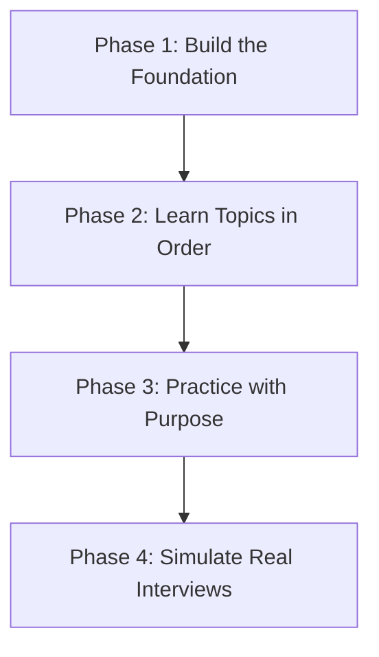
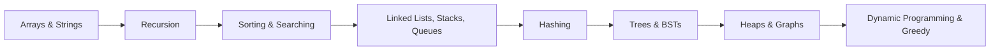
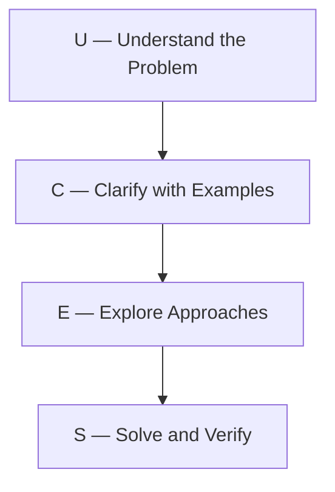

# DSA Preparation Roadmap — From Zero to Interview-Ready

> **One-line summary:**
> DSA preparation is not about solving 500 problems — it's about understanding patterns, following the right order, and practicing with purpose.

---

## Table of Contents

1. [Why DSA Feels Overwhelming at First](#1-why-dsa-feels-overwhelming-at-first)
2. [Understand Your Goal First](#2-understand-your-goal-first)
3. [The Four-Phase Roadmap](#3-the-four-phase-roadmap)
4. [How to Approach a Single Problem — UCES Framework](#4-how-to-approach-a-single-problem--uces-framework)
5. [Common Mistakes Beginners Make](#5-common-mistakes-beginners-make)
6. [Building a Daily Study Routine](#6-building-a-daily-study-routine)
7. [Choosing the Right Language](#7-choosing-the-right-language)
8. [Tracking Your Progress](#8-tracking-your-progress)
9. [FAQs](#9-faqs)
10. [Key Takeaways](#10-key-takeaways)

---

## 1. Why DSA Feels Overwhelming at First

You open a problem. You stare at it. You feel lost in 30 seconds. You're not alone — this happens to almost everyone who jumps straight into solving problems without a plan.

Think of learning DSA like learning to drive:

- You don't start on a highway
- First you learn the controls
- Then practice in an empty lot
- Then gradually move to busier roads

Same idea here. You need a **sequence** — not just hustle.

---

## 2. Understand Your Goal First

Your goal changes what you should focus on. But the foundation is always the same.

| Goal                        | Focus Area                         | Key Skill                         |
| --------------------------- | ---------------------------------- | --------------------------------- |
| **Campus Placement**        | Problem-solving speed and patterns | Recognize problem types quickly   |
| **Product Company (FAANG)** | Optimization and edge cases        | Analyze time and space complexity |
| **Real-World Coding**       | Clean and efficient code           | Apply the right data structure    |

> **Bottom line:** Whether it's placements or a job, you need to understand the _why_ behind every concept — not just memorize solutions.

---

## 3. The Four-Phase Roadmap



### Phase 1 — Build the Foundation

Before solving any problem, get these basics down:

- Write clean code in your chosen language (Python, Java, or C++)
- Understand what happens step-by-step when your code runs
- Get comfortable with loops, conditions, and functions
- Understand **Big-O notation** (non-negotiable for interviews)

### Phase 2 — Learn Topics in the Right Order

Jumping to graphs before understanding arrays is like running before you can walk. Follow this order:



Each topic builds on the one before it. Skipping ahead = more confusion later.

### Phase 3 — Practice with Purpose

Random practice doesn't work. Use this 3-step cycle for every topic:

| Step                         | What to do                                                                        |
| ---------------------------- | --------------------------------------------------------------------------------- |
| **1. Understand**            | Read/watch until the concept clicks. Don't touch code yet.                        |
| **2. Solve easy problems**   | Start with the simplest version. Don't skip this even if you feel confident.      |
| **3. Analyze your solution** | Ask — can this be faster? What's the time complexity? What edge cases did I miss? |

### Phase 4 — Simulate Real Interviews

Knowing how to solve a problem and solving it under pressure are two different skills.

- Practice with a timer
- **Talk out loud** as you code — say _"I'm using a loop here because..."_
- Most candidates fail not from lack of knowledge, but from not being able to communicate their approach

---

## 4. How to Approach a Single Problem — UCES Framework

Every problem, no matter how complex, can be broken down into four steps:



### Step 1 — Understand

Read the problem **twice**. Write down in your own words:

- What is the input?
- What is the expected output?
- What edge cases exist? (empty input, negatives, single element?)

### Step 2 — Clarify with Examples

Create 2–3 small examples by hand before writing any code.

```
Problem: Find the largest number in a list

Input:  [3, 7, 1, 9, 4]   →   Output: 9
Input:  [-5, -2, -8]       →   Output: -2   (negatives work too)
Input:  [42]               →   Output: 42   (single element edge case)
```

Tracing examples by hand catches misunderstandings early and gives you test cases.

### Step 3 — Explore Approaches

Before writing code, think of at least two ways to solve it:

- **Brute force** — simple but possibly slow (always think of this first)
- **Optimized** — fewer steps, better complexity

For the largest number: brute force = compare every number with every other. Better = single pass through the list.

### Step 4 — Solve and Verify

Write clean code. Test it against your examples from Step 2, including edge cases.

#### Python

```python
def find_largest(numbers):
    # Start by assuming the first number is the largest
    largest = numbers[0]

    # Go through every number in the list
    for num in numbers:
        # If we find something bigger, update our answer
        if num > largest:
            largest = num

    return largest


# Test it
print(find_largest([3, 7, 1, 9, 4]))  # Output: 9
print(find_largest([-5, -2, -8]))     # Output: -2
print(find_largest([42]))             # Output: 42
```

#### C++ (simple)

```cpp
#include <iostream>
#include <vector>
using namespace std;

int findLargest(vector<int> numbers) {
    // Start by assuming the first number is the largest
    int largest = numbers[0];

    // Go through every number in the list
    for (int i = 0; i < numbers.size(); i++) {
        // If we find something bigger, update our answer
        if (numbers[i] > largest) {
            largest = numbers[i];
        }
    }

    return largest;
}

int main() {
    vector<int> nums1 = {3, 7, 1, 9, 4};
    vector<int> nums2 = {-5, -2, -8};
    vector<int> nums3 = {42};

    cout << findLargest(nums1) << endl;  // Output: 9
    cout << findLargest(nums2) << endl;  // Output: -2
    cout << findLargest(nums3) << endl;  // Output: 42

    return 0;
}
```

#### C++ (LeetCode class style)

```cpp
#include <vector>
using namespace std;

class Solution {
public:
    // Return the maximum value in a non-empty array
    int findLargest(vector<int>& numbers) {
        int largest = numbers[0];  // assume first is the largest
        for (int i = 1; i < numbers.size(); i++) {
            if (numbers[i] > largest)
                largest = numbers[i];  // found something bigger — update
        }
        return largest;  // largest value after full scan
    }
};
```

This goes through the list exactly once → **Time complexity: O(n)**

---

## 5. Common Mistakes Beginners Make

| Mistake                          | Why it hurts                        | Fix                                      |
| -------------------------------- | ----------------------------------- | ---------------------------------------- |
| **Jumping to code too fast**     | You code the wrong solution         | Spend 5 min planning before typing       |
| **Skipping arrays and strings**  | Every advanced topic builds on them | Never skip fundamentals                  |
| **Only reading solutions**       | You can't write what you only read  | Close the solution, write it from memory |
| **Ignoring complexity analysis** | Your code times out on large inputs | Always check time and space complexity   |

---

## 6. Building a Daily Study Routine

Consistency beats intensity. 1 hour every day > 7 hours once a week.

```
┌─────────────────────────────────────────────────────┐
│  Daily 1-Hour Routine                               │
│                                                     │
│  First 15 min  →  Review yesterday's topic/problem  │
│  Next 30 min   →  Learn a new concept               │
│  Last 15 min   →  Solve one easy related problem    │
└─────────────────────────────────────────────────────┘
```

As you get more comfortable, increase problem-solving time and move to medium difficulty. But in the beginning — 1 focused hour beats 3 distracted hours every time.

---

## 7. Choosing the Right Language

The language matters far less than your understanding of the concepts. Pick one and stick with it throughout your preparation.

| Language   | Pros for DSA                              | Best For                     |
| ---------- | ----------------------------------------- | ---------------------------- |
| **Python** | Short syntax, easy to read                | Beginners, quick prototyping |
| **Java**   | Strongly typed, widely used in enterprise | Campus placements            |
| **C++**    | Fast execution, STL has useful built-ins  | Competitive programming      |

> **Rule:** Pick one. Don't switch midway — it resets your muscle memory and wastes time.

---

## 8. Tracking Your Progress

If you don't track it, you won't see growth — even when you're improving.

Keep a simple log (spreadsheet or notebook):

| Topic  | Problem          | Approach    | Time Complexity | Difficulty |
| ------ | ---------------- | ----------- | --------------- | ---------- |
| Arrays | Find max in list | Single pass | O(n)            | Easy       |
| Arrays | Two sum          | Hash map    | O(n)            | Easy       |

Revisit hard problems after a week. This is **spaced repetition** — one of the most proven learning techniques.

---

## 9. FAQs

**How long does DSA prep take for placements?**
Most beginners become placement-ready in 3–6 months with consistent daily practice. Rushing without understanding = you'll keep revisiting the same mistakes.

**How many problems should I solve?**
150–200 well-understood problems across all major topics is enough for most placement interviews. 500 problems without understanding patterns = far less effective.

**What if I'm stuck for 30+ minutes on a problem?**
Give yourself a 20–30 minute time limit. If still stuck — look at a hint (not the full solution). Code it yourself from the hint. Come back after 2–3 days and solve it again from scratch. That's how real learning happens.

---

## 10. Key Takeaways

- DSA prep without a plan = wasted time. Follow the four phases in order.
- **Match your goal** — placements, FAANG, and real-world coding each have a different focus.
- Use the **UCES framework** for every problem: Understand → Clarify → Explore → Solve.
- **1 focused hour daily** beats cramming every time.
- Track your progress — it keeps you honest and motivated.
- Pick **one language**, learn it deeply, don't switch.
- Always check **time and space complexity** after solving. A working solution that times out is not a good solution.
