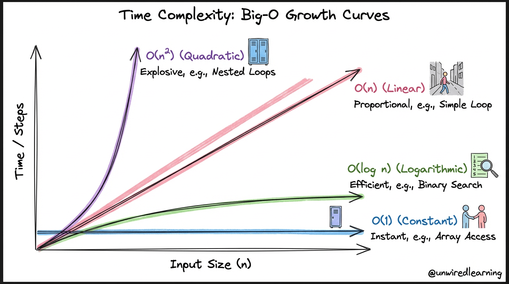
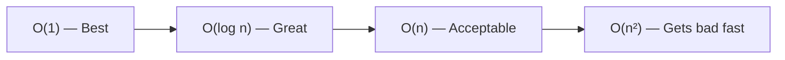

# Time Complexity Explained — Big O with Real Examples

> **One-line summary:**
> Time complexity measures how the running time of your code grows as the input size grows — it's how you compare two solutions before writing a single line of code.

---



---

## Table of Contents

1. [What is Time Complexity?](#1-what-is-time-complexity)
2. [Why It Matters](#2-why-it-matters)
3. [Big-O Notation Basics](#3-big-o-notation-basics)
4. [Common Time Complexities Explained](#4-common-time-complexities-explained)
5. [Comparing Complexities Side by Side](#5-comparing-complexities-side-by-side)
6. [How to Calculate Time Complexity](#6-how-to-calculate-time-complexity)
7. [Real-World Examples](#7-real-world-examples)
8. [Best, Average, and Worst Case](#8-best-average-and-worst-case)
9. [Quick Tips](#9-quick-tips)
10. [Key Takeaways](#10-key-takeaways)
11. [FAQs](#11-faqs)

---

## 1. What is Time Complexity?

Ever wondered why some programs feel instant and others make you stare at a loading screen?

The answer is usually **time complexity** — a way to measure how the running time of your code grows as the input size increases.

**Analogy:** You're searching for a name in a phone book.

- 10 names → you find it fast, any method works
- 10 million names → the _method_ you use suddenly matters a lot

Time complexity helps you compare those methods fairly — without running the code on real hardware.

---

## 2. Why It Matters

Real apps don't deal with 10 items. They deal with thousands or millions.

A slow algorithm that works fine for 100 items can **crash your app** at 1 million items.

Time complexity gives you a language to talk about efficiency and **pick the smarter solution before you even write code**.

---

## 3. Big-O Notation Basics

Big-O is the standard way to express time complexity. It describes the **worst-case** growth of your algorithm as input size `n` grows.

Key points:

- `n` = the size of the input
- Big-O tells you the **shape of growth**, not the exact time
- `O(n)` means: if you double the input, the time roughly doubles too

```
Growth shapes (slowest to fastest growing):

O(1) → flat line       (best)
O(log n) → gentle curve
O(n) → straight line
O(n²) → steep curve   (gets bad fast)
```

---

## 4. Common Time Complexities Explained

### O(1) — Constant Time

**Always takes the same time, regardless of input size.**

Analogy: Looking up locker #42. You go directly there — doesn't matter if there are 100 or 10,000 lockers.

#### Python

```python
def get_first_element(arr):
    return arr[0]   # Always one step, no matter how big arr is

print(get_first_element([10, 20, 30]))   # Output: 10
print(get_first_element([10, 20, 30, 40, 50, 60, 70]))   # Still: 10, still O(1)
```

#### C++ (simple)

```cpp
#include <iostream>
#include <vector>
using namespace std;

int getFirstElement(vector<int> arr) {
    return arr[0];   // Always one step, no matter how big arr is
}

int main() {
    vector<int> arr = {10, 20, 30};
    cout << getFirstElement(arr) << endl;   // Output: 10
    return 0;
}
```

---

### O(log n) — Logarithmic Time

**Each step cuts the problem roughly in half.**

Analogy: Guessing a number between 1 and 100. If you always guess the middle, you find the answer in about 7 guesses — not 100. That's O(log n).

```
Searching 1024 items:
Step 1: 1024 → 512
Step 2: 512  → 256
Step 3: 256  → 128
Step 4: 128  → 64
Step 5: 64   → 32
Step 6: 32   → 16
Step 7: 16   → 8
Step 8: 8    → 4
Step 9: 4    → 2
Step 10: Found it!   ← only 10 steps for 1024 items!
```

#### Python

```python
def binary_search(arr, target):
    left = 0
    right = len(arr) - 1

    while left <= right:
        mid = (left + right) // 2   # Find the middle index

        if arr[mid] == target:
            return mid              # Found it
        elif arr[mid] < target:
            left = mid + 1          # Target is in the right half
        else:
            right = mid - 1         # Target is in the left half

    return -1   # Not found


sorted_arr = [2, 5, 8, 12, 16, 23, 38, 56, 72, 91]
print(binary_search(sorted_arr, 23))   # Output: 5 (index of 23)
print(binary_search(sorted_arr, 10))   # Output: -1 (not found)
```

#### C++ (simple)

```cpp
#include <iostream>
#include <vector>
using namespace std;

int binarySearch(vector<int> arr, int target) {
    int left = 0;
    int right = arr.size() - 1;

    while (left <= right) {
        int mid = (left + right) / 2;   // Find the middle index

        if (arr[mid] == target)
            return mid;              // Found it
        else if (arr[mid] < target)
            left = mid + 1;          // Target is in the right half
        else
            right = mid - 1;         // Target is in the left half
    }

    return -1;   // Not found
}

int main() {
    vector<int> arr = {2, 5, 8, 12, 16, 23, 38, 56, 72, 91};
    cout << binarySearch(arr, 23) << endl;   // Output: 5
    cout << binarySearch(arr, 10) << endl;   // Output: -1
    return 0;
}
```

#### C++ (LeetCode class style)

```cpp
#include <vector>
using namespace std;

class Solution {
public:
    // LeetCode 704: Binary Search
    int search(vector<int>& nums, int target) {
        int left = 0, right = nums.size() - 1;
        while (left <= right) {
            int mid = left + (right - left) / 2;  // avoids overflow vs (l+r)/2
            if (nums[mid] == target) return mid;  // found at mid
            else if (nums[mid] < target) left = mid + 1;  // target in right half
            else right = mid - 1;                         // target in left half
        }
        return -1;  // not found
    }
};
```

---

### O(n) — Linear Time

**Time grows directly with the input size.**

Analogy: Checking every house on a street to find a specific door color. 100 houses → check up to 100. 1,000 houses → check up to 1,000.

#### Python

```python
def print_all(arr):
    for item in arr:
        print(item)   # Runs once for each element in arr

# 5 items → 5 prints
print_all([1, 2, 3, 4, 5])
```

#### C++ (simple)

```cpp
#include <iostream>
#include <vector>
using namespace std;

void printAll(vector<int> arr) {
    for (int i = 0; i < arr.size(); i++) {
        cout << arr[i] << endl;   // Runs once for each element
    }
}

int main() {
    vector<int> arr = {1, 2, 3, 4, 5};
    printAll(arr);   // Runs 5 times for 5 elements
    return 0;
}
```

---

### O(n²) — Quadratic Time

**A loop inside a loop, both running through the input.**

Analogy: Every student in a class shakes hands with every other student. 10 students → ~100 handshakes. 100 students → ~10,000 handshakes. It explodes fast.

#### Python

```python
def print_pairs(arr):
    for i in range(len(arr)):
        for j in range(len(arr)):
            print(arr[i], arr[j])   # Runs n × n times total

# 3 items → 9 pairs printed
print_pairs([1, 2, 3])
```

#### C++ (simple)

```cpp
#include <iostream>
#include <vector>
using namespace std;

void printPairs(vector<int> arr) {
    for (int i = 0; i < arr.size(); i++) {
        for (int j = 0; j < arr.size(); j++) {
            cout << arr[i] << " " << arr[j] << endl;   // Runs n × n times
        }
    }
}

int main() {
    vector<int> arr = {1, 2, 3};
    printPairs(arr);   // 3 × 3 = 9 pairs
    return 0;
}
```

---

## 5. Comparing Complexities Side by Side

| Complexity   | Name        | n = 10 | n = 100 | n = 1,000 |
| ------------ | ----------- | ------ | ------- | --------- |
| **O(1)**     | Constant    | 1      | 1       | 1         |
| **O(log n)** | Logarithmic | 3      | 7       | 10        |
| **O(n)**     | Linear      | 10     | 100     | 1,000     |
| **O(n²)**    | Quadratic   | 100    | 10,000  | 1,000,000 |

O(n²) does **1 million operations** for just 1,000 items. Always aim for lower complexity when possible.



---

## 6. How to Calculate Time Complexity

### Simple Rules

| What you see in code                   | Complexity |
| -------------------------------------- | ---------- |
| A single statement                     | O(1)       |
| One loop from 1 to n                   | O(n)       |
| Two nested loops from 1 to n           | O(n²)      |
| Dividing the problem in half each step | O(log n)   |

### Dropping Constants and Smaller Terms

Big-O always simplifies. Rules:

- Drop constants: `3n` → `O(n)`
- Drop smaller terms: `n² + n` → `O(n²)`

Only the **dominant term** (the one that grows fastest) matters.

#### Python

```python
def two_loops(arr):
    # First loop: O(n)
    for item in arr:
        print(item)

    # Second loop: also O(n)
    for item in arr:
        print(item * 2)

    # Total: O(n) + O(n) = O(2n) = O(n) after simplification
    # Two separate loops do NOT make it O(n²) — they're not nested
```

#### C++ (simple)

```cpp
void twoLoops(vector<int> arr) {
    // First loop: O(n)
    for (int i = 0; i < arr.size(); i++) {
        cout << arr[i] << endl;
    }

    // Second loop: also O(n)
    for (int i = 0; i < arr.size(); i++) {
        cout << arr[i] * 2 << endl;
    }
    // Total: O(n) + O(n) = O(2n) = O(n)
}
```

> **Key rule:** Two separate loops = O(n). Two **nested** loops = O(n²). Don't confuse them.

---

## 7. Real-World Examples

### Finding a Name in a List — O(n)

Go through the list one by one until you find the name.

#### Python

```python
def find_name(names, target):
    for i in range(len(names)):
        if names[i] == target:
            return i   # Return the position when found
    return -1          # Not found


students = ["Alice", "Bob", "Charlie", "David"]
print(find_name(students, "Charlie"))   # Output: 2
print(find_name(students, "Eve"))       # Output: -1
```

#### C++ (simple)

```cpp
int findName(vector<string> names, string target) {
    for (int i = 0; i < names.size(); i++) {
        if (names[i] == target) return i;   // Found it
    }
    return -1;   // Not found
}
```

#### C++ (LeetCode class style)

```cpp
#include <vector>
#include <string>
using namespace std;

class Solution {
public:
    // Return the index of target in names, or -1 if not found
    int findName(vector<string>& names, string target) {
        for (int i = 0; i < names.size(); i++) {
            if (names[i] == target) return i;  // found at index i
        }
        return -1;  // target not in the list
    }
};
```

Worst case: the name is last (or not there) → you check all `n` names → **O(n)**.

---

### Checking for Duplicates — O(n²) naive approach

Compare every element with every other element.

#### Python

```python
def has_duplicate(arr):
    for i in range(len(arr)):
        for j in range(i + 1, len(arr)):   # Start j after i to avoid self-comparison
            if arr[i] == arr[j]:
                return True   # Duplicate found
    return False   # No duplicates


print(has_duplicate([1, 2, 3, 2]))   # Output: True
print(has_duplicate([1, 2, 3, 4]))   # Output: False
```

#### C++ (simple)

```cpp
bool hasDuplicate(vector<int> arr) {
    for (int i = 0; i < arr.size(); i++) {
        for (int j = i + 1; j < arr.size(); j++) {
            if (arr[i] == arr[j]) return true;   // Duplicate found
        }
    }
    return false;
}
```

#### C++ (LeetCode class style)

```cpp
#include <vector>
using namespace std;

class Solution {
public:
    // Return true if any value appears more than once in the array
    bool containsDuplicate(vector<int>& nums) {
        for (int i = 0; i < nums.size(); i++) {
            for (int j = i + 1; j < nums.size(); j++) {
                if (nums[i] == nums[j]) return true;  // found a duplicate pair
            }
        }
        return false;  // no duplicates found
    }
};
```

For 10,000 elements this does up to **100 million comparisons** — a performance problem. A smarter approach using a hash set brings this down to **O(n)**, which we'll cover in the Hashing section.

---

## 8. Best, Average, and Worst Case

Time complexity can vary based on the input. Here's linear search as an example:

| Case        | Scenario                          | Complexity    |
| ----------- | --------------------------------- | ------------- |
| **Best**    | Target is the first element       | O(1)          |
| **Average** | Target is somewhere in the middle | O(n/2) → O(n) |
| **Worst**   | Target is last or not found       | O(n)          |

Big-O notation **almost always refers to worst case** — because that's what you need to plan for in real-world apps.

---

## 9. Quick Tips

- Identify every loop in your code first
- Nested loops = at least O(n²)
- Single loop = usually O(n)
- Direct access with no loops = usually O(1)
- Halving the problem each step = O(log n)
- Always drop constants and smaller terms when writing Big-O
- Don't aim for perfection at first — aim for understanding

---

## 10. Key Takeaways

- **Time complexity** = how your code's running time scales with input size
- **Big-O** = worst-case growth rate (not exact step count)
- O(1) < O(log n) < O(n) < O(n²) — lower is better
- Two separate loops = O(n). Two nested loops = O(n²). Don't confuse them.
- Always drop constants: `O(3n)` → `O(n)`, `O(n² + n)` → `O(n²)`
- A solution that works for 100 items but times out for 1 million is **not a good solution**

---

## 11. FAQs

**What does Big-O actually mean?**
It describes how the running time grows relative to input size, in the worst case. It's a way to compare algorithms fairly — not to measure exact milliseconds.

**Is O(n²) always bad?**
Not always. For small inputs (say, under 1,000 items), it's perfectly fine. It becomes a problem at scale. Always consider the actual size of your data.

**How do I improve my algorithm's time complexity?**
Look for nested loops and ask: can I eliminate one? Often the answer involves using a smarter data structure (like a hash map) or a different algorithm approach (like sorting first). This gets clearer as you learn more topics in this series.
