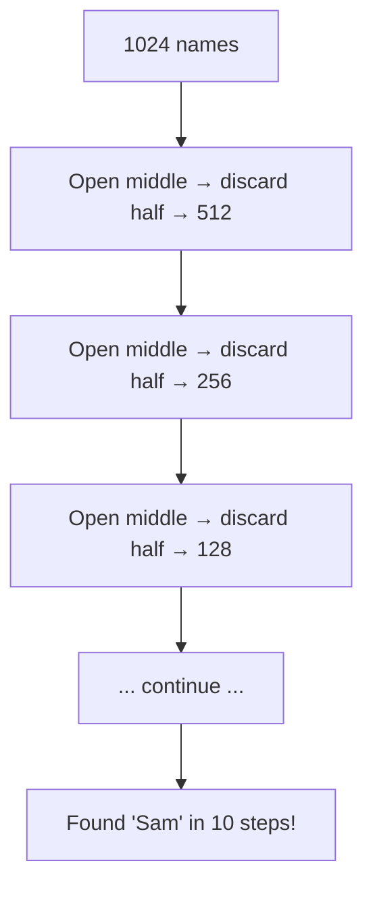

# Logarithms for Programmers — Understanding O(log n)

> **One-line summary:**
> A logarithm answers "how many times do I need to halve to reach 1?" — and that's exactly why O(log n) algorithms are blazing fast even on massive inputs.

---

## Table of Contents

1. [What is a Logarithm?](#1-what-is-a-logarithm)
2. [Logarithm Definition in Simple Terms](#2-logarithm-definition-in-simple-terms)
3. [Log Base 2 — Why Programmers Care](#3-log-base-2--why-programmers-care)
4. [The Halving Analogy](#4-the-halving-analogy)
5. [O(log n) in Big-O Notation](#5-olog-n-in-big-o-notation)
6. [Common log₂ Values to Know](#6-common-log₂-values-to-know)
7. [log n vs log₂ n — Does the Base Matter?](#7-log-n-vs-log₂-n--does-the-base-matter)
8. [Where Does O(log n) Show Up in Algorithms?](#8-where-does-olog-n-show-up-in-algorithms)
9. [O(log n) vs O(n) vs O(n log n) — Quick Summary](#9-olog-n-vs-on-vs-on-log-n--quick-summary)
10. [Key Takeaways](#10-key-takeaways)
11. [FAQs](#11-faqs)

---

## 1. What is a Logarithm?

Have you played the "higher or lower" guessing game? Someone picks a number between 1 and 100, and you guess while they say "higher" or "lower." You zero in on the answer in about 7 guesses — not 100.

That game is a logarithm in action.

A logarithm answers the question: **"How many times do I need to divide (or multiply) to reach a target?"**

That's it. Everything else builds from there.

---

## 2. Logarithm Definition in Simple Terms

Logarithm is the **inverse of exponentiation** — the same way division is the inverse of multiplication.

- If `2³ = 8`, then `log₂(8) = 3`
- Translation: _"2 raised to what power gives 8? Answer: 3"_

```
Exponentiation:   2^3 = 8         (multiply)
Logarithm:        log₂(8) = 3     (how many times?)

2^1 = 2    →   log₂(2)    = 1
2^2 = 4    →   log₂(4)    = 2
2^3 = 8    →   log₂(8)    = 3
2^4 = 16   →   log₂(16)   = 4
2^10 = 1024 →  log₂(1024) = 10
```

Notice the pattern: **every time you double the number, the log only goes up by 1.** That's the magic — and why O(log n) algorithms scale so well.

---

## 3. Log Base 2 — Why Programmers Care

In DSA, `log n` almost always means **log base 2** (`log₂`), because algorithms frequently work by **dividing things in half** — and computers are binary at their core.

The key question base-2 answers: _"How many times can I cut this in half before I reach 1?"_

```
n = 16:
16 → 8 → 4 → 2 → 1   =  4 cuts  =  log₂(16) = 4
```

---

## 4. The Halving Analogy

**Phone book example:** 1,024 names, sorted. Find "Sam."

Instead of reading page by page, you open the middle, check if "Sam" comes before or after, and discard half. Repeat.



```
Step 1:  1024 → 512
Step 2:   512 → 256
Step 3:   256 → 128
Step 4:   128 →  64
Step 5:    64 →  32
Step 6:    32 →  16
Step 7:    16 →   8
Step 8:     8 →   4
Step 9:     4 →   2
Step 10:    2 →   1   ← found it!

log₂(1024) = 10   ✓
```

For **1 million** names: only ~20 steps. That's O(log n) in action.

---

## 5. O(log n) in Big-O Notation

O(log n) means the runtime grows **logarithmically** — extremely slowly. This is a very good thing.

| n (input size) | O(1) | O(log n) | O(n)      | O(n²)     |
| -------------- | ---- | -------- | --------- | --------- |
| 1              | 1    | 0        | 1         | 1         |
| 8              | 1    | 3        | 8         | 64        |
| 16             | 1    | 4        | 16        | 256       |
| 1,024          | 1    | 10       | 1,024     | 1,048,576 |
| 1,000,000      | 1    | ~20      | 1,000,000 | 10¹²      |

When n = 1 million: O(log n) takes **~20 steps**. O(n) takes a **million steps**. O(n²) takes a **trillion steps**.

---

## 6. Common log₂ Values to Know

Memorize these — they'll help you estimate algorithm performance instantly in interviews.

```
log₂(1)           = 0
log₂(2)           = 1
log₂(4)           = 2
log₂(8)           = 3
log₂(16)          = 4
log₂(32)          = 5
log₂(64)          = 6
log₂(128)         = 7
log₂(256)         = 8
log₂(512)         = 9
log₂(1,024)       = 10
log₂(1,048,576)   = 20   ← ~1 million
log₂(1,000,000,000) ≈ 30  ← 1 billion
```

Even for **1 billion elements**, an O(log n) algorithm needs only ~30 steps. That's why programmers love it.

---

## 7. log n vs log₂ n — Does the Base Matter?

In **mathematics**: yes, different bases give different values.
In **Big-O**: no — the base is irrelevant.

Why? Changing the logarithm base only multiplies by a constant, and Big-O drops constants.

$$\log_2(n) = \frac{\log_{10}(n)}{\log_{10}(2)} = \log_{10}(n) \times \text{constant}$$

So `O(log₂ n)` and `O(log₁₀ n)` are both just **O(log n)**.

| Notation        | Base       | Common Use                           |
| --------------- | ---------- | ------------------------------------ |
| `log₂(n)`       | 2          | DSA, Binary Search, Computer Science |
| `log₁₀(n)`      | 10         | Mathematics, general engineering     |
| `ln(n)`         | e (2.718…) | Calculus, natural growth             |
| `log n` (Big-O) | Any        | Algorithm analysis — base ignored    |

> **Rule of thumb:** When you see O(log n) in DSA, always think **base 2** — algorithms that halve their input each step.

---

## 8. Where Does O(log n) Show Up in Algorithms?

### Counting Halvings — The Core Pattern

Any loop that **halves** its input each iteration runs in O(log n):

#### Python

```python
def count_halvings(n):
    count = 0

    while n > 1:
        n = n // 2   # halve n each step
        count += 1

    return count


print(count_halvings(16))    # Output: 4   (log₂(16) = 4)
print(count_halvings(1024))  # Output: 10  (log₂(1024) = 10)
print(count_halvings(8))     # Output: 3   (log₂(8) = 3)
```

#### C++ (simple)

```cpp
#include <iostream>
using namespace std;

int countHalvings(int n) {
    int count = 0;

    while (n > 1) {
        n = n / 2;   // halve n each step
        count++;
    }

    return count;
}

int main() {
    cout << countHalvings(16)   << endl;   // Output: 4
    cout << countHalvings(1024) << endl;   // Output: 10
    cout << countHalvings(8)    << endl;   // Output: 3
    return 0;
}
```

The loop runs exactly `log₂(n)` times → **O(log n)**.

---

### Binary Search — O(log n) in Practice

The classic example. Cut the search space in half at every step.

#### Python

```python
def binary_search(arr, target):
    left = 0
    right = len(arr) - 1

    while left <= right:
        mid = (left + right) // 2   # find the middle

        if arr[mid] == target:
            return mid              # found it
        elif arr[mid] < target:
            left = mid + 1          # target is in the right half
        else:
            right = mid - 1         # target is in the left half

    return -1   # not found


sorted_arr = list(range(1, 1025))          # 1024 elements
print(binary_search(sorted_arr, 1000))    # Found in at most 10 steps
print(binary_search(sorted_arr, 9999))    # Output: -1
```

#### C++ (simple)

```cpp
#include <iostream>
#include <vector>
using namespace std;

int binarySearch(vector<int> arr, int target) {
    int left = 0;
    int right = arr.size() - 1;

    while (left <= right) {
        int mid = (left + right) / 2;   // find the middle

        if (arr[mid] == target)
            return mid;              // found it
        else if (arr[mid] < target)
            left = mid + 1;          // right half
        else
            right = mid - 1;         // left half
    }

    return -1;
}

int main() {
    vector<int> arr;
    for (int i = 1; i <= 1024; i++) arr.push_back(i);

    cout << binarySearch(arr, 1000) << endl;   // Found in ≤ 10 steps
    cout << binarySearch(arr, 9999) << endl;   // Output: -1
    return 0;
}
```

#### C++ (LeetCode class style)

```cpp
#include <vector>
using namespace std;

class Solution {
public:
    // LeetCode 704: Binary Search
    int search(vector<int>& nums, int target) {
        int left = 0, right = nums.size() - 1;
        while (left <= right) {
            int mid = left + (right - left) / 2;  // safe mid calculation (avoids overflow)
            if (nums[mid] == target) return mid;  // found at mid
            else if (nums[mid] < target) left = mid + 1;  // target in right half
            else right = mid - 1;                         // target in left half
        }
        return -1;  // target not in array
    }
};
```

1,024 elements → at most **10 comparisons**. This is why Binary Search is O(log n).

---

### Balanced Trees

When you learn Trees (Section 10), a balanced binary tree with `n` nodes has a height of **log₂(n)**. Search, insert, and delete all travel root → leaf, so they run in **O(log n)**.

```
Balanced tree with 15 nodes:
Height = log₂(15) ≈ 4 levels

        1
      /   \
    2       3
   / \     / \
  4   5   6   7
 /\ /\ /\ /\
8 9...          ← 4 levels deep for 15 nodes
```

---

## 9. O(log n) vs O(n) vs O(n log n) — Quick Summary

| Complexity     | Name         | Growth Speed               | Example            |
| -------------- | ------------ | -------------------------- | ------------------ |
| **O(1)**       | Constant     | Doesn't grow               | Array index access |
| **O(log n)**   | Logarithmic  | Very slow growth           | Binary Search      |
| **O(n)**       | Linear       | Grows with n               | Simple loop        |
| **O(n log n)** | Linearithmic | Slightly worse than linear | Merge Sort         |
| **O(n²)**      | Quadratic    | Grows very fast            | Nested loops       |

O(n log n) = you loop through n items, and each item involves a log n operation. Slightly worse than O(n), but vastly better than O(n²). You'll see this in Merge Sort (Section 5).

---

## 10. Key Takeaways

- A logarithm answers: **"how many times do I halve to reach 1?"**
- `log₂(n)` = the number of times you can cut `n` in half
- **O(log n) is extremely fast** — 1 billion items = ~30 steps
- In Big-O, the base of the log doesn't matter — `O(log₂ n) = O(log n)`
- **Spot O(log n):** look for loops or recursion that halve the input each step
- Binary Search is the most common O(log n) algorithm you'll encounter
- Balanced trees have height O(log n) → most tree operations are O(log n)
- You don't need to compute exact log values in interviews — just know `log₂(10⁶) ≈ 20` and `log₂(10⁹) ≈ 30`

---

## 11. FAQs

**Does the base of the log matter in Big-O?**
No. Changing the base multiplies by a constant, and constants are dropped in Big-O. O(log₂ n) and O(log₁₀ n) are both just O(log n).

**How do I know if an algorithm is O(log n)?**
Look for repeated halving or splitting. If the input gets cut in half at each step, it's O(log n). Binary Search and balanced tree traversals are the two most common examples.

**Why is O(log n) so much better than O(n)?**
Because logarithmic growth is extremely slow. At n = 1,000,000: O(n) = 1,000,000 steps, O(log n) = ~20 steps. The gap widens enormously as input grows.
