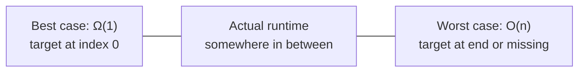
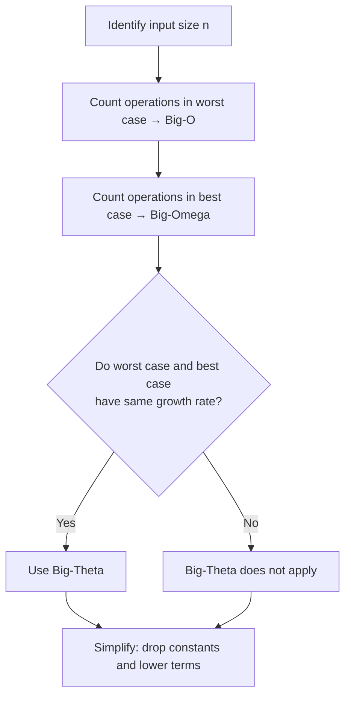

# Asymptotic Analysis Explained — Big-O, Theta, and Omega

> **One-line summary:**
> Big-O is worst case, Big-Omega is best case, Big-Theta is when both are the same — together they give you the full picture of how an algorithm behaves.

---

## Table of Contents

1. [What is Asymptotic Analysis?](#1-what-is-asymptotic-analysis)
2. [Why Three Notations?](#2-why-three-notations)
3. [Big-O — The Upper Bound (Worst Case)](#3-big-o--the-upper-bound-worst-case)
4. [Big-Omega — The Lower Bound (Best Case)](#4-big-omega--the-lower-bound-best-case)
5. [Big-Theta — The Tight Bound (Exact Rate)](#5-big-theta--the-tight-bound-exact-rate)
6. [Comparing All Three on One Algorithm](#6-comparing-all-three-on-one-algorithm)
7. [Dropping Constants and Lower Terms](#7-dropping-constants-and-lower-terms)
8. [Nested Loops and Quadratic Complexity](#8-nested-loops-and-quadratic-complexity)
9. [How to Identify the Right Notation](#9-how-to-identify-the-right-notation)
10. [Common Mistakes](#10-common-mistakes)
11. [Quick Summary Table](#11-quick-summary-table)
12. [Key Takeaways](#12-key-takeaways)
13. [FAQs](#13-faqs)

---

## 1. What is Asymptotic Analysis?

Imagine comparing two delivery services. One is fast for small orders but slows down for large ones. The other is consistent regardless of order size. To compare them fairly, you look at how they behave **as orders grow** — not on just one day.

That's asymptotic analysis for algorithms. Instead of measuring exact seconds, we describe the **trend** — the shape of growth as input size `n` gets larger and larger.

This is where Big-O, Big-Theta, and Big-Omega come in.

---

## 2. Why Three Notations?

Think of planning a road trip:

- **Best possible time** → no traffic, all green lights
- **Worst possible time** → traffic jams, road closures
- **Typical time** → your realistic average

Same idea for algorithms:

| Notation          | Measures                 | Analogy                    |
| ----------------- | ------------------------ | -------------------------- |
| **Big-O**         | Worst case (upper bound) | Worst possible travel time |
| **Big-Omega (Ω)** | Best case (lower bound)  | Best possible travel time  |
| **Big-Theta (Θ)** | Tight bound (both match) | Always takes the same time |

---

## 3. Big-O — The Upper Bound (Worst Case)

Big-O is the most commonly used notation in interviews. When someone says an algorithm is `O(n)`, they mean: **in the worst case**, it won't take more than a linear number of steps.

**Formal definition (plain English):** After a certain input size, `g(n)` multiplied by some constant is always a ceiling for `f(n)`.

### Example — Linear Search

#### Python

```python
def linear_search(arr, target):
    for i in range(len(arr)):      # loops through all n elements
        if arr[i] == target:
            return i               # found it
    return -1                      # not found


print(linear_search([3, 7, 2, 9, 5], 9))   # Output: 3 (index of 9)
# Worst case: target is last or not present → n comparisons → O(n)
```

#### C++ (simple)

```cpp
#include <iostream>
#include <vector>
using namespace std;

int linearSearch(vector<int> arr, int target) {
    for (int i = 0; i < arr.size(); i++) {   // loops through all n elements
        if (arr[i] == target) return i;       // found it
    }
    return -1;                                // not found
}

int main() {
    vector<int> arr = {3, 7, 2, 9, 5};
    cout << linearSearch(arr, 9) << endl;   // Output: 3
    return 0;
}
```

#### C++ (LeetCode class style)

```cpp
#include <vector>
using namespace std;

class Solution {
public:
    // Linear search: scan every element until target is found
    int linearSearch(vector<int>& arr, int target) {
        for (int i = 0; i < arr.size(); i++) {  // visit each element once
            if (arr[i] == target) return i;      // found at index i
        }
        return -1;  // target not present
    }
};
```

Worst case: the target is the last element, or not there at all → loop runs `n` times → **O(n)**.

Even if the code has extra constant steps, we drop them. `O(3n + 2)` → `O(n)`.

### Common Big-O Classes

| Notation   | Name         | Example                     |
| ---------- | ------------ | --------------------------- |
| O(1)       | Constant     | Array index access          |
| O(log n)   | Logarithmic  | Binary Search               |
| O(n)       | Linear       | Linear Search, print all    |
| O(n log n) | Linearithmic | Merge Sort                  |
| O(n²)      | Quadratic    | Nested loops                |
| O(2ⁿ)      | Exponential  | Recursive subset generation |

---

## 4. Big-Omega — The Lower Bound (Best Case)

Big-Omega (Ω) gives the **best-case scenario** — the minimum work an algorithm must do, no matter what.

**Formal definition (plain English):** `g(n)` is a floor — `f(n)` will never go below it.

### Example — Linear Search Best Case

What if the target is the very first element? The loop runs once and returns immediately.

#### Python

```python
def linear_search(arr, target):
    for i in range(len(arr)):
        if arr[i] == target:
            return i
    return -1


# Best case: target is at index 0 → only 1 comparison
print(linear_search([9, 3, 7, 2, 5], 9))   # Output: 0
# Best-case time complexity: Ω(1)
```

#### C++ (simple)

```cpp
// Best case: target found at first index
// linearSearch({9, 3, 7, 2, 5}, 9) → returns 0 after 1 comparison
// Best-case time complexity: Ω(1)
```

The algorithm is **guaranteed** to take at least 1 step (you always check at least once) → **Ω(1)**.

---

## 5. Big-Theta — The Tight Bound (Exact Rate)

Big-Theta (Θ) is the most precise. It means the algorithm **always** grows at exactly this rate — not faster, not slower. It's both upper and lower bound at the same time.

**Formal definition (plain English):** `g(n)` sandwiches `f(n)` from both sides — best case and worst case are the same growth rate.

### Example — Print All Elements

No matter what the input looks like, this always visits every element exactly once.

#### Python

```python
def print_all(arr):
    for item in arr:
        print(item)   # runs exactly n times, always


print_all([1, 2, 3, 4, 5])
# Output: 1, 2, 3, 4, 5
# Whether arr has 5 or 5 million items → always n steps → Θ(n)
```

#### C++ (simple)

```cpp
void printAll(vector<int> arr) {
    for (int i = 0; i < arr.size(); i++) {
        cout << arr[i] << endl;   // runs exactly n times, always
    }
}
// Best case = Worst case = n steps → Θ(n)
```

Best case equals worst case here. → **Θ(n)** — a tight bound.

---

## 6. Comparing All Three on One Algorithm

Using Linear Search as the example:

| Notation      | What It Measures         | Linear Search     | Meaning                        |
| ------------- | ------------------------ | ----------------- | ------------------------------ |
| **Big-O**     | Worst case (upper bound) | O(n)              | Could check all n elements     |
| **Big-Omega** | Best case (lower bound)  | Ω(1)              | Target found at first position |
| **Big-Theta** | Tight bound              | ❌ Not applicable | Best ≠ worst case              |



> **Key rule:** Big-Theta only applies when best case and worst case have the **same growth rate**. Linear search doesn't qualify — its best is O(1) and worst is O(n).

`printAll` qualifies for Θ(n) because it **always** runs exactly n times, no exceptions.

---

## 7. Dropping Constants and Lower Terms

In asymptotic analysis, constants and smaller terms are **always dropped**. Why? As `n` grows very large, they become irrelevant compared to the dominant term.

### Rules

| What you see    | Simplified to |
| --------------- | ------------- |
| O(5n)           | O(n)          |
| O(3n + 2)       | O(n)          |
| O(n² + n)       | O(n²)         |
| O(n² + 3n + 10) | O(n²)         |

### Two Separate Loops — Still O(n)

#### Python

```python
def two_loops(arr):
    # First loop: n steps
    for item in arr:
        print(item)

    # Second loop: also n steps
    for item in arr:
        print(item * 2)

    # Total: n + n = 2n → O(n) after dropping constant
    # NOT O(n²) — loops are sequential, not nested
```

#### C++ (simple)

```cpp
void twoLoops(vector<int> arr) {
    for (int i = 0; i < arr.size(); i++)
        cout << arr[i] << endl;          // n steps

    for (int i = 0; i < arr.size(); i++)
        cout << arr[i] * 2 << endl;      // n steps

    // Total: O(n) + O(n) = O(2n) = O(n)
}
```

---

## 8. Nested Loops and Quadratic Complexity

When one loop runs **inside** another, complexity multiplies → O(n²).

#### Python

```python
def compare_all_pairs(arr):
    for i in range(len(arr)):          # n iterations
        for j in range(len(arr)):      # n iterations for each i
            print(arr[i], arr[j])      # runs n × n = n² times total


compare_all_pairs([1, 2, 3])
# Pairs: (1,1),(1,2),(1,3),(2,1),(2,2),(2,3),(3,1),(3,2),(3,3)
# Total = 9 = 3² → confirms O(n²)
```

#### C++ (simple)

```cpp
void compareAllPairs(vector<int> arr) {
    for (int i = 0; i < arr.size(); i++) {       // n iterations
        for (int j = 0; j < arr.size(); j++) {   // n iterations per i
            cout << arr[i] << " " << arr[j] << endl;   // n² total
        }
    }
}
```

> **Rule:** Each additional level of nesting adds a power. One loop = O(n). Two nested = O(n²). Three nested = O(n³).

---

## 9. How to Identify the Right Notation

Follow these steps for any algorithm:



In interviews: **always lead with Big-O** (worst case). Mention Omega or Theta only if asked about best or average case.

---

## 10. Common Mistakes

| Mistake                         | Reality                                            |
| ------------------------------- | -------------------------------------------------- |
| "Big-O = exact time in seconds" | Big-O is a growth rate, not actual seconds         |
| "O(n²) is always bad"           | Fine for small inputs — only a problem at scale    |
| Forgetting to simplify          | Always drop constants: O(3n) → O(n)                |
| Using Theta when cases differ   | Theta only applies when best = worst growth rate   |
| "All loops are O(n)"            | Depends on iterations — a halving loop is O(log n) |

---

## 11. Quick Summary Table

| Notation      | Symbol | Bound              | Answers                        |
| ------------- | ------ | ------------------ | ------------------------------ |
| **Big-O**     | O()    | Upper (worst case) | How slow can it get?           |
| **Big-Omega** | Ω()    | Lower (best case)  | How fast can it be?            |
| **Big-Theta** | Θ()    | Tight (both match) | What is the exact growth rate? |

**Airport analogy:**

- **Big-O** → worst wait on the busiest day
- **Big-Omega** → walk right through when it's empty
- **Big-Theta** → VIP lane that always takes exactly the same time

---

## 12. Key Takeaways

- **Big-O** = worst case — the ceiling. Most used in interviews.
- **Big-Omega** = best case — the floor. How fast it _can_ go.
- **Big-Theta** = tight bound — only when best and worst are the same growth rate.
- Always **drop constants and lower terms**: `O(5n² + 3n)` → `O(n²)`
- Two **sequential** loops = O(n). Two **nested** loops = O(n²). Don't confuse them.
- Most interview discussions focus on **Big-O** — know worst case cold.

---

## 13. FAQs

**Is Big-O always the same as Big-Theta?**
No. Big-O is an upper bound and can be loose. Big-Theta requires both upper and lower bounds to match. Linear search is O(n) but NOT Θ(n) — its best case is O(1), not O(n).

**Which notation should I use in interviews?**
Use Big-O for worst-case time complexity — that's what interviewers want by default. Mention Omega or Theta only if specifically asked about best or average case.

**Does O(1) mean exactly one step?**
No. O(1) means a _constant_ number of steps regardless of input size. It could be 1 step or 100 steps — as long as it doesn't grow with `n`, it's O(1). The constant is irrelevant in asymptotic analysis.
