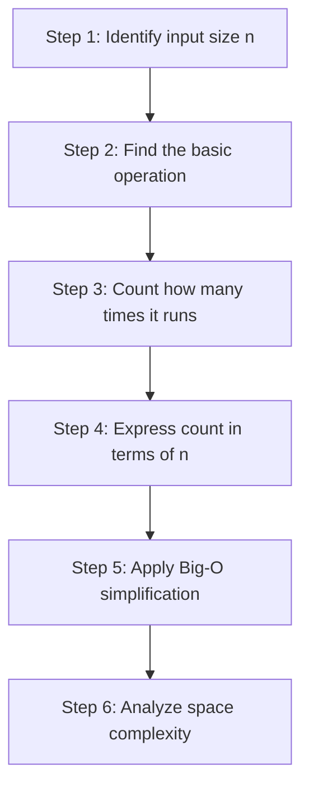

# Algorithm Analysis — Step-by-Step Time and Space Complexity

> **One-line summary:**
> Algorithm analysis is a repeatable 6-step process — identify the input, find the core operation, count it, express it, simplify to Big-O, then check space.

---

## Table of Contents

1. [What Does Algorithm Analysis Mean?](#1-what-does-algorithm-analysis-mean)
2. [The 6-Step Analysis Framework](#2-the-6-step-analysis-framework)
3. [Step 1 — Identify the Input Size](#3-step-1--identify-the-input-size)
4. [Step 2 — Find the Basic Operation](#4-step-2--find-the-basic-operation)
5. [Step 3 — Count How Many Times It Runs](#5-step-3--count-how-many-times-it-runs)
6. [Step 4 — Express the Count in Terms of n](#6-step-4--express-the-count-in-terms-of-n)
7. [Step 5 — Apply Big-O Simplification](#7-step-5--apply-big-o-simplification)
8. [Step 6 — Analyze Space Complexity](#8-step-6--analyze-space-complexity)
9. [Full Walkthrough Example](#9-full-walkthrough-example)
10. [Common Code Patterns to Recognize](#10-common-code-patterns-to-recognize)
11. [Common Mistakes](#11-common-mistakes)
12. [Key Takeaways](#12-key-takeaways)
13. [FAQs](#13-faqs)

---

## 1. What Does Algorithm Analysis Mean?

Ever followed a recipe and wondered why one method takes 10 minutes and another takes an hour? Analyzing an algorithm is exactly that — figuring out how long a solution takes and how much memory it needs.

This post brings together everything from the earlier sections — time complexity, space complexity, Big-O, logarithms, asymptotic analysis — into one repeatable process you can apply to any piece of code.

---

## 2. The 6-Step Analysis Framework

Think of it like inspecting a car before a long drive — check each part one at a time.



---

## 3. Step 1 — Identify the Input Size

Every algorithm takes input. The **size of that input** is what we call `n`. This is the foundation of every analysis.

| Input Type | What n Means                                           |
| ---------- | ------------------------------------------------------ |
| Array      | Number of elements                                     |
| String     | Number of characters                                   |
| Number     | Value itself, or number of digits (depends on problem) |

**Always ask:** what grows as the input gets larger? That's your `n`.

#### Python

```python
def sum_array(arr):
    total = 0              # runs once
    for num in arr:
        total += num       # runs n times (n = len(arr))
    return total           # runs once

# n = len(arr) — as the array grows, so does the work
```

#### C++

```cpp
int sumArray(vector<int> arr) {
    int total = 0;                        // runs once
    for (int i = 0; i < arr.size(); i++) {
        total += arr[i];                  // runs n times (n = arr.size())
    }
    return total;                         // runs once
}
```

---

## 4. Step 2 — Find the Basic Operation

The basic operation is the **single action that runs most often** — usually inside the innermost loop or recursive call.

Everything else (variable declarations, return statements) runs too rarely to matter at scale.

In `sumArray` above, the basic operation is `total += arr[i]` — that's the line doing the real work, repeated every iteration.

> **Analogy:** Like counting how many times you stir a pot tells you how hard the recipe is — the basic operation tells you how hard the algorithm works.

---

## 5. Step 3 — Count How Many Times It Runs

Trace through the loops carefully.

### Single Loop — O(n)

#### Python

```python
def print_all(arr):
    for item in arr:
        print(item)   # runs exactly n times

# n = 5  → prints 5 times
# n = 1000 → prints 1000 times
# Time Complexity: O(n)
```

#### C++

```cpp
void printAll(vector<int> arr) {
    for (int i = 0; i < arr.size(); i++) {
        cout << arr[i] << endl;   // runs exactly n times
    }
}
// Time Complexity: O(n)
```

---

### Nested Loops — O(n²)

#### Python

```python
def print_pairs(arr):
    for i in range(len(arr)):        # outer: n times
        for j in range(len(arr)):    # inner: n times per outer iteration
            print(arr[i], arr[j])    # runs n × n = n² times total

# n = 4  → 16 prints
# n = 100 → 10,000 prints
# Time Complexity: O(n²)
```

#### C++

```cpp
void printPairs(vector<int> arr) {
    for (int i = 0; i < arr.size(); i++) {       // outer: n times
        for (int j = 0; j < arr.size(); j++) {   // inner: n times per outer
            cout << arr[i] << " " << arr[j] << endl;   // n² total
        }
    }
}
// Time Complexity: O(n²)
```

The inner loop runs `n` times for **every** iteration of the outer loop → multiply → **O(n²)**.

---

## 6. Step 4 — Express the Count in Terms of n

Write the total operations as a mathematical expression using `n`. Don't simplify yet — just get the raw count right.

### Mixed Operations Example

#### Python

```python
def mixed_ops(arr):
    result = 0                           # 1 operation

    for num in arr:
        result += num                    # n operations

    for i in range(len(arr)):
        for j in range(len(arr)):
            result += arr[i] * arr[j]   # n × n = n² operations

    return result                        # 1 operation

# Raw count: 1 + n + n² + 1 = n² + n + 2
```

#### C++

```cpp
int mixedOps(vector<int> arr) {
    int result = 0;                              // 1 op

    for (int i = 0; i < arr.size(); i++)
        result += arr[i];                        // n ops

    for (int i = 0; i < arr.size(); i++)
        for (int j = 0; j < arr.size(); j++)
            result += arr[i] * arr[j];           // n² ops

    return result;                               // 1 op
}
// Raw count: 1 + n + n² + 1 = n² + n + 2
```

---

## 7. Step 5 — Apply Big-O Simplification

Big-O is about what **dominates** as `n` grows large. Drop constants and lower-order terms.

### Rules

| What you see            | Simplified             |
| ----------------------- | ---------------------- |
| Drop constants          | `3n` → `O(n)`          |
| Drop lower terms        | `n² + n` → `O(n²)`     |
| Keep dominant term only | `n² + n + 2` → `O(n²)` |

### Simplification Reference

| Raw Count   | Big-O | Reason                     |
| ----------- | ----- | -------------------------- |
| 5           | O(1)  | Constant, no n             |
| 3n + 10     | O(n)  | Drop constant and +10      |
| n² + 5n + 3 | O(n²) | n² dominates               |
| 2n³ + n²    | O(n³) | n³ dominates               |
| log(n) + n  | O(n)  | n grows faster than log(n) |

From the `mixedOps` example: `n² + n + 2` → **O(n²)** because n² dominates everything else for large `n`.

---

## 8. Step 6 — Analyze Space Complexity

Time isn't the only resource. Always check: **does the extra memory used grow with `n`?**

### O(n) Space — Creating a Copy

#### Python

```python
def copy_array(arr):
    copy = []
    for num in arr:
        copy.append(num)   # extra list grows with input
    return copy

# Space: O(n) — copy grows proportionally with arr
```

#### C++

```cpp
vector<int> copyArray(vector<int> arr) {
    vector<int> copy;
    for (int i = 0; i < arr.size(); i++)
        copy.push_back(arr[i]);   // extra vector grows with input
    return copy;
}
// Space: O(n)
```

---

### O(1) Space — No Extra Structures

#### Python

```python
def sum_only(arr):
    total = 0          # single variable — never grows
    for num in arr:
        total += num
    return total

# Space: O(1) — only 'total' exists, regardless of arr size
```

#### C++

```cpp
int sumOnly(vector<int> arr) {
    int total = 0;   // single variable — never grows
    for (int i = 0; i < arr.size(); i++)
        total += arr[i];
    return total;
}
// Space: O(1)
```

---

## 9. Full Walkthrough Example

**Problem:** Check if any two elements in the array sum to a target.

#### Python

```python
def has_pair_with_sum(arr, target):
    for i in range(len(arr)):           # outer loop
        for j in range(i + 1, len(arr)):  # inner loop (starts after i)
            if arr[i] + arr[j] == target:  # basic operation
                return True
    return False


print(has_pair_with_sum([1, 3, 5, 7], 8))   # Output: True  (1+7 or 3+5)
print(has_pair_with_sum([1, 2, 3], 10))      # Output: False
```

#### C++

```cpp
bool hasPairWithSum(vector<int> arr, int target) {
    for (int i = 0; i < arr.size(); i++) {          // outer loop
        for (int j = i + 1; j < arr.size(); j++) {  // inner loop
            if (arr[i] + arr[j] == target)           // basic operation
                return true;
        }
    }
    return false;
}
```

**Applying the 6 steps:**

| Step                   | Result                                                              |
| ---------------------- | ------------------------------------------------------------------- |
| **1. Input size**      | `n` = number of elements in `arr`                                   |
| **2. Basic operation** | `arr[i] + arr[j] == target` inside inner loop                       |
| **3. Count**           | Outer runs `n` times, inner runs up to `n-1`, `n-2`... ≈ n²/2 total |
| **4. Expression**      | ≈ n²/2                                                              |
| **5. Big-O**           | Drop constant (1/2) → **O(n²)**                                     |
| **6. Space**           | Only loop counters — no extra arrays → **O(1)**                     |

**Final answer: Time O(n²), Space O(1)**

---

## 10. Common Code Patterns to Recognize

With practice, certain structures always map to the same complexity:

| Code Pattern                         | Time Complexity |
| ------------------------------------ | --------------- |
| Single statement, no loop            | O(1)            |
| Single loop from 0 to n              | O(n)            |
| Two **sequential** loops from 0 to n | O(n)            |
| Two **nested** loops from 0 to n     | O(n²)           |
| Three nested loops from 0 to n       | O(n³)           |
| Loop that **halves** n each step     | O(log n)        |
| Loop + inner halving loop            | O(n log n)      |

```
Sequential loops → ADD  →  n + n = 2n = O(n)
Nested loops    → MULTIPLY → n × n = n² = O(n²)
```

---

## 11. Common Mistakes

### Mistake 1 — Counting Every Line

Not every line matters equally. A variable declaration runs once. A loop body may run a million times. **Focus only on what grows with n.**

### Mistake 2 — Forgetting Nested vs Sequential

#### Python

```python
# Sequential loops — ADD → O(n)
for i in range(n):
    pass   # n times
for j in range(n):
    pass   # n times
# Total: n + n = 2n = O(n)

# Nested loops — MULTIPLY → O(n²)
for i in range(n):
    for j in range(n):
        pass   # n × n = n² times
# Total: O(n²)
```

### Mistake 3 — Ignoring Space Complexity

Time gets most of the attention, but memory matters too — especially for large inputs. Always ask: _am I creating any extra data structures that grow with the input?_

---

## 12. Key Takeaways

- Algorithm analysis is a **6-step repeatable process** — not guesswork
- **n** = the size of the input. Always identify it first.
- Focus on the **basic operation** — what runs the most
- Sequential loops **add**. Nested loops **multiply**.
- After counting, **drop constants and lower terms** to get Big-O
- Always check **space** separately — time and space are two different costs
- Practice on simple examples first: single loop → nested loops → mixed patterns

---

## 13. FAQs

**Do I need strong math skills to analyze algorithms?**
No. Basic algebra and understanding how loops work is enough. The concepts from the earlier posts in this series are all you need.

**What if two terms grow at the same rate?**
If both are O(n), the combined result is still O(n). For example, `5n + 3n = 8n` → O(n). Constants are dropped.

**Should I always analyze the worst case?**
In most interviews and real-world discussions, yes. Worst case tells you the upper bound — the most useful guarantee for planning and reliability.
