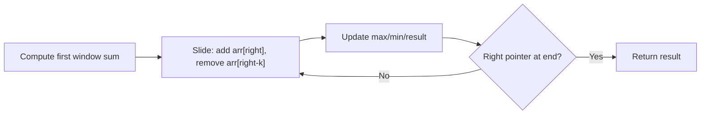

# Sliding Window Technique — A Clear Guide

> **One-line summary:**
> Instead of recalculating every subarray from scratch, maintain a window of elements and slide it across — add what comes in on the right, remove what leaves on the left. O(n²) becomes O(n).

---

## Table of Contents

1. [What is the Sliding Window Technique?](#1-what-is-the-sliding-window-technique)
2. [The Problem with Brute Force](#2-the-problem-with-brute-force)
3. [How the Sliding Window Works](#3-how-the-sliding-window-works)
4. [Fixed Window vs Variable Window](#4-fixed-window-vs-variable-window)
5. [Fixed Window Example — Maximum Sum of K Elements](#5-fixed-window-example--maximum-sum-of-k-elements)
6. [Fixed Window Example — Maximum Average of K Elements](#6-fixed-window-example--maximum-average-of-k-elements)
7. [Variable Window Example — Smallest Subarray with Sum >= Target](#7-variable-window-example--smallest-subarray-with-sum--target)
8. [When to Use Sliding Window](#8-when-to-use-sliding-window)
9. [Time and Space Complexity](#9-time-and-space-complexity)
10. [Common Mistakes](#10-common-mistakes)
11. [Key Takeaways](#11-key-takeaways)
12. [FAQs](#12-faqs)

---

## 1. What is the Sliding Window Technique?

Imagine looking through a small window on a moving train. The window stays the same size, but the scenery changes as the train moves. That's the sliding window technique.

Instead of checking every possible subarray combination from scratch, you **maintain a window of elements and slide it** across the array — reusing the previous calculation and only adjusting for what enters and exits.

```
Array:  [2, 1, 5, 1, 3, 2]   k = 3

Window 1: [2, 1, 5] → sum = 8
Window 2:    [1, 5, 1] → sum = 8 - 2 + 1 = 7   (don't recalculate, just adjust)
Window 3:       [5, 1, 3] → sum = 7 - 1 + 3 = 9
Window 4:          [1, 3, 2] → sum = 9 - 5 + 2 = 6
```

---

## 2. The Problem with Brute Force

**Problem:** Find the maximum sum of any 3 consecutive elements in `[2, 1, 5, 1, 3, 2]`.

A beginner approach: two nested loops — one for the start, one to sum the next `k` elements.

#### Python (Brute Force — Don't use this)

```python
def max_sum_brute(arr, k):
    n = len(arr)
    max_sum = 0

    for i in range(n - k + 1):          # outer loop: O(n)
        window_sum = 0
        for j in range(i, i + k):       # inner loop: O(k)
            window_sum += arr[j]
        max_sum = max(max_sum, window_sum)

    return max_sum

print(max_sum_brute([2, 1, 5, 1, 3, 2], 3))   # Output: 9
# Time: O(n × k)  — too slow for large inputs
```

For n = 100,000 and k = 1,000: that's 100 million operations. The sliding window does the same in 100,000.

---

## 3. How the Sliding Window Works

The core idea: **reuse the previous window's result**.

```
Add the new element entering from the right →
Remove the element leaving from the left ←

Like a conveyor belt — you don't re-weigh everything,
you just adjust for what changed.
```



---

## 4. Fixed Window vs Variable Window

| Type                | Window Size       | Common Use Case                       |
| ------------------- | ----------------- | ------------------------------------- |
| **Fixed Window**    | Constant `k`      | Max/min/avg of k consecutive elements |
| **Variable Window** | Grows and shrinks | Smallest subarray with sum ≥ target   |

---

## 5. Fixed Window Example — Maximum Sum of K Elements

**Problem:** Given `[2, 1, 5, 1, 3, 2]` and `k = 3`, find the maximum sum of any 3 consecutive elements.

**Step-by-step trace:**

| Window | Elements  | Calculation | Sum         |
| ------ | --------- | ----------- | ----------- |
| 1      | [2, 1, 5] | 2 + 1 + 5   | 8           |
| 2      | [1, 5, 1] | 8 - 2 + 1   | 7           |
| 3      | [5, 1, 3] | 7 - 1 + 3   | **9** ← max |
| 4      | [1, 3, 2] | 9 - 5 + 2   | 6           |

#### Python

```python
def max_sum_fixed_window(arr, k):
    n = len(arr)

    # Step 1: compute sum of the first window
    window_sum = sum(arr[:k])
    max_sum = window_sum

    # Step 2: slide the window from index k to the end
    for i in range(k, n):
        # add element entering from right, remove element leaving from left
        window_sum += arr[i] - arr[i - k]
        max_sum = max(max_sum, window_sum)

    return max_sum


arr = [2, 1, 5, 1, 3, 2]
print(max_sum_fixed_window(arr, 3))   # Output: 9
```

#### C++

```cpp
#include <iostream>
#include <vector>
using namespace std;

int maxSumFixedWindow(vector<int> arr, int k) {
    int n = arr.size();

    // Step 1: compute sum of the first window
    int windowSum = 0;
    for (int i = 0; i < k; i++)
        windowSum += arr[i];

    int maxSum = windowSum;

    // Step 2: slide the window
    for (int i = k; i < n; i++) {
        // add new element on right, remove element on left
        windowSum += arr[i] - arr[i - k];
        maxSum = max(maxSum, windowSum);
    }

    return maxSum;
}

int main() {
    vector<int> arr = {2, 1, 5, 1, 3, 2};
    cout << maxSumFixedWindow(arr, 3) << endl;   // Output: 9
    return 0;
}
```

We never re-added all three numbers from scratch — just adjusted the running sum. That's the power of sliding window.

---

## 6. Fixed Window Example — Maximum Average of K Elements

**Problem:** Given `[1, 3, 2, 6, 4, 2]` and `k = 4`, find the maximum average of any 4 consecutive elements.

**Trace:** Windows: [1,3,2,6]=12, [3,2,6,4]=15, [2,6,4,2]=14 → max sum = 15 → average = 15/4 = **3.75**

#### Python

```python
def max_average(arr, k):
    n = len(arr)

    # Build first window sum
    window_sum = sum(arr[:k])
    max_sum = window_sum

    # Slide the window
    for i in range(k, n):
        window_sum += arr[i] - arr[i - k]
        max_sum = max(max_sum, window_sum)

    return max_sum / k   # return average of max sum window


arr = [1, 3, 2, 6, 4, 2]
print(max_average(arr, 4))   # Output: 3.75
```

#### C++

```cpp
double maxAverage(vector<int> arr, int k) {
    int n = arr.size();

    int windowSum = 0;
    for (int i = 0; i < k; i++)
        windowSum += arr[i];

    int maxSum = windowSum;

    for (int i = k; i < n; i++) {
        windowSum += arr[i] - arr[i - k];
        maxSum = max(maxSum, windowSum);
    }

    return (double)maxSum / k;
}

int main() {
    vector<int> arr = {1, 3, 2, 6, 4, 2};
    cout << maxAverage(arr, 4) << endl;   // Output: 3.75
    return 0;
}
```

---

## 7. Variable Window Example — Smallest Subarray with Sum >= Target

**Problem:** Given `[2, 3, 1, 2, 4, 3]` and `target = 7`, find the length of the smallest subarray whose sum is ≥ 7.

**How it works:**

- `right` pointer expands the window (adds elements)
- When sum ≥ target, try to **shrink from the left** to find a smaller valid window
- Track minimum length found

```
arr = [2, 3, 1, 2, 4, 3],  target = 7

right=0: sum=2  → expand
right=1: sum=5  → expand
right=2: sum=6  → expand
right=3: sum=8  ≥ 7 → length=4, shrink left
         sum=6  < 7  → expand
right=4: sum=10 ≥ 7 → length=4, shrink left
         sum=7  ≥ 7 → length=3, shrink left
         sum=6  < 7  → expand
right=5: sum=9  ≥ 7 → length=3, shrink left
         sum=7  ≥ 7 → length=2 ← minimum! ([4,3])
         sum=3  < 7  → stop

Answer: 2
```

#### Python

```python
def smallest_subarray_with_sum(arr, target):
    n = len(arr)
    left = 0
    current_sum = 0
    min_length = float('inf')   # start with infinity

    for right in range(n):
        current_sum += arr[right]   # expand window on the right

        # shrink from left while condition is still satisfied
        while current_sum >= target:
            min_length = min(min_length, right - left + 1)
            current_sum -= arr[left]   # remove leftmost element
            left += 1

    return -1 if min_length == float('inf') else min_length


arr = [2, 3, 1, 2, 4, 3]
print(smallest_subarray_with_sum(arr, 7))   # Output: 2  ([4, 3])
print(smallest_subarray_with_sum([1, 1, 1], 10))   # Output: -1 (not possible)
```

#### C++

```cpp
#include <climits>

int smallestSubarrayWithSum(vector<int> arr, int target) {
    int n = arr.size();
    int left = 0;
    int currentSum = 0;
    int minLength = INT_MAX;   // start with max possible value

    for (int right = 0; right < n; right++) {
        currentSum += arr[right];   // expand window on the right

        // shrink from left while condition is still satisfied
        while (currentSum >= target) {
            minLength = min(minLength, right - left + 1);
            currentSum -= arr[left];   // remove leftmost element
            left++;
        }
    }

    return minLength == INT_MAX ? -1 : minLength;
}

int main() {
    vector<int> arr = {2, 3, 1, 2, 4, 3};
    cout << smallestSubarrayWithSum(arr, 7) << endl;   // Output: 2
    return 0;
}
```

Both `left` and `right` only move **forward** — so total operations are at most 2n → **O(n)**.

---

## 8. When to Use Sliding Window

Look for these clues in a problem:

| Clue in problem                                  | What it suggests              |
| ------------------------------------------------ | ----------------------------- |
| "k consecutive elements"                         | Fixed window                  |
| "subarray with sum equal to / at least target"   | Variable window               |
| "longest/shortest subarray where..."             | Variable window               |
| Brute force needs two nested loops over an array | Sliding window likely applies |
| "contiguous subarray or substring"               | Sliding window                |

> **Mental check:** Is the problem asking about a contiguous chunk of the array? If yes, think sliding window first.

---

## 9. Time and Space Complexity

| Approach                   | Time     | Space |
| -------------------------- | -------- | ----- |
| Brute force (nested loops) | O(n × k) | O(1)  |
| Sliding window (fixed)     | O(n)     | O(1)  |
| Sliding window (variable)  | O(n)     | O(1)  |

Each element is **added once** and **removed once** → at most 2n operations → **O(n)**.

Both fixed and variable windows use constant extra space — only a few pointers and a running sum. No extra array needed.

---

## 10. Common Mistakes

| Mistake                                           | Fix                                                                |
| ------------------------------------------------- | ------------------------------------------------------------------ |
| Forgetting to compute first window before sliding | Always build the first window sum separately                       |
| Wrong index when removing outgoing element        | For window of size k ending at i, outgoing element is `arr[i - k]` |
| Not moving `left` pointer inside while loop       | Every iteration of the while loop must increment `left`            |
| Off-by-one in window length                       | Window length = `right - left + 1`, not `right - left`             |

Always **trace through a small example by hand** before coding. This catches 90% of bugs.

---

## 11. Key Takeaways

- Sliding window turns **O(n × k) brute force into O(n)** by reusing previous calculations
- **Fixed window:** size `k` stays constant — add `arr[right]`, remove `arr[right - k]`
- **Variable window:** size changes — `right` expands, `left` shrinks when condition is met
- Both use **O(1) extra space** — just pointers and a running sum
- Spot it when: problem asks about **contiguous subarrays**, k consecutive elements, or min/max window size
- Both pointers only move **forward** — that's why it's O(n)

---

## 12. FAQs

**What's the difference between sliding window and two pointers?**
Both use two pointers, but sliding window specifically focuses on a **contiguous subarray or window**. Two pointers is more general — used for pairs, reversals, etc. Sliding window is essentially a specialized form of two pointers.

**When should I NOT use sliding window?**
When the problem involves **non-contiguous elements** or combinations from different positions. In those cases, recursion, dynamic programming, or hashing are more appropriate.

**Does the window always move one step at a time?**
In fixed windows, yes — one step at a time. In variable windows, the right pointer moves one step at a time but the left pointer can jump multiple steps in one iteration of the while loop.
