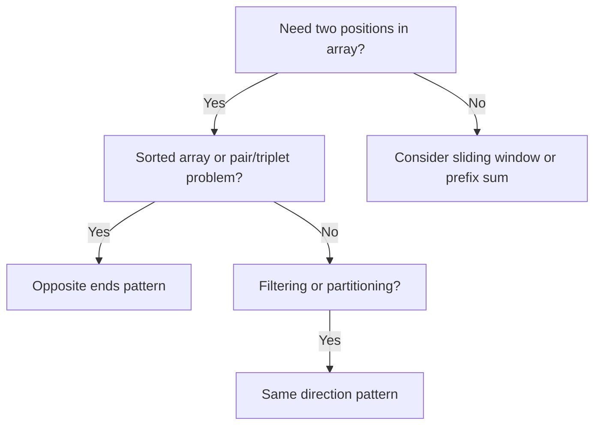

# Two Pointer Technique — A Simple Guide

> **One-line summary:**
> Use two index variables instead of nested loops — move them smartly toward each other or forward together — and turn O(n²) brute force into O(n).

---

## Table of Contents

1. [What is the Two Pointer Technique?](#1-what-is-the-two-pointer-technique)
2. [Why Use Two Pointers?](#2-why-use-two-pointers)
3. [Two Patterns](#3-two-patterns)
4. [Example 1 — Pair with Target Sum](#4-example-1--pair-with-target-sum)
5. [Example 2 — Remove Duplicates from Sorted Array](#5-example-2--remove-duplicates-from-sorted-array)
6. [Example 3 — Reverse an Array](#6-example-3--reverse-an-array)
7. [Example 4 — Check if Array is a Palindrome](#7-example-4--check-if-array-is-a-palindrome)
8. [Two Pointer vs Brute Force vs Sliding Window](#8-two-pointer-vs-brute-force-vs-sliding-window)
9. [When to Use Two Pointers](#9-when-to-use-two-pointers)
10. [Common Mistakes](#10-common-mistakes)
11. [Key Takeaways](#11-key-takeaways)
12. [FAQs](#12-faqs)

---

## 1. What is the Two Pointer Technique?

Imagine a row of numbered cards on a table. You want to find two cards that add up to a target. One approach: check every pair — slow. Better approach: put one finger at the start, one at the end, and move them smartly toward each other.

That's the two pointer technique — **two index variables scanning through the array**, moved based on a condition rather than blindly looping through all combinations.

```
arr = [1, 3, 5, 7, 9, 11],  target = 10

left → 1                    11 ← right
       sum = 12 > 10  →  move right left

left → 1              9 ← right
       sum = 10 == 10  →  found!
```

---

## 2. Why Use Two Pointers?

Brute force: two nested loops → O(n²). Two pointers: one pass → O(n).

> **Analogy:** Two people searching a book from opposite ends to find a matching sentence. Instead of one person reading all pages twice, they meet in the middle — half the work.

Works especially well on **sorted arrays**, and is one of the most frequently tested patterns in placement interviews.

---

## 3. Two Patterns

### Opposite Ends Pattern

One pointer at index `0`, one at index `n-1`. They move **toward each other** based on a condition.

```
[  1,  3,  5,  7,  9,  11 ]
  ↑                       ↑
 left                   right
```

Use for: **pair sum problems**, palindrome check, reverse array.

---

### Same Direction Pattern

Both pointers start at the same end and move **forward**. One is slow (writes), one is fast (reads).

```
[  1,  1,  2,  3,  3,  4 ]
   ↑   ↑
 slow fast   →  fast scans, slow marks unique positions
```

Use for: **removing duplicates**, partitioning, filtering.

---

## 4. Example 1 — Pair with Target Sum

**Problem:** Given a sorted array, find if any two elements add up to the target.

**Logic:**

- `sum < target` → move `left` right (need bigger value)
- `sum > target` → move `right` left (need smaller value)
- `sum == target` → found it

#### Python

```python
def has_pair_with_sum(arr, target):
    left = 0
    right = len(arr) - 1

    while left < right:
        current_sum = arr[left] + arr[right]

        if current_sum == target:
            return True          # found a valid pair
        elif current_sum < target:
            left += 1            # need bigger → move left forward
        else:
            right -= 1           # need smaller → move right backward

    return False   # no pair found


arr = [1, 3, 5, 7, 9, 11]
print(has_pair_with_sum(arr, 10))   # Output: True  (1 + 9)
print(has_pair_with_sum(arr, 20))   # Output: False

# Time: O(n)   Space: O(1)
# ⚠️ Array must be sorted for this to work
```

#### C++

```cpp
#include <iostream>
#include <vector>
using namespace std;

bool hasPairWithSum(vector<int> arr, int target) {
    int left = 0;
    int right = arr.size() - 1;

    while (left < right) {
        int currentSum = arr[left] + arr[right];

        if (currentSum == target)
            return true;          // found
        else if (currentSum < target)
            left++;               // need bigger
        else
            right--;              // need smaller
    }

    return false;
}

int main() {
    vector<int> arr = {1, 3, 5, 7, 9, 11};
    cout << hasPairWithSum(arr, 10) << endl;   // Output: 1 (true)
    cout << hasPairWithSum(arr, 20) << endl;   // Output: 0 (false)
    return 0;
}
```

**Trace for target = 10:**

| Step | left | right | arr[left] | arr[right] | sum | Action                      |
| ---- | ---- | ----- | --------- | ---------- | --- | --------------------------- |
| 1    | 0    | 5     | 1         | 11         | 12  | sum > 10 → right--          |
| 2    | 0    | 4     | 1         | 9          | 10  | sum == 10 → **return True** |

---

## 5. Example 2 — Remove Duplicates from Sorted Array

**Problem:** Remove duplicates from a sorted array in-place. Return count of unique elements.

**Logic:** `slow` tracks the last unique position. `fast` scans ahead. When `fast` finds a new value, advance `slow` and copy there.

```
arr = [1, 1, 2, 3, 3, 4, 5, 5]

slow=0, fast=1: arr[1]==arr[0] → skip
slow=0, fast=2: arr[2]!=arr[0] → slow=1, arr[1]=2  → [1, 2, 2, 3, 3, 4, 5, 5]
slow=1, fast=3: arr[3]!=arr[1] → slow=2, arr[2]=3  → [1, 2, 3, 3, 3, 4, 5, 5]
...
Result: [1, 2, 3, 4, 5, ...],  count = 5
```

#### Python

```python
def remove_duplicates(arr):
    if not arr:
        return 0

    slow = 0   # points to last unique element placed

    for fast in range(1, len(arr)):
        if arr[fast] != arr[slow]:   # found a new unique value
            slow += 1
            arr[slow] = arr[fast]    # place it after the last unique

    return slow + 1   # count of unique elements


arr = [1, 1, 2, 3, 3, 4, 5, 5]
count = remove_duplicates(arr)
print(count)          # Output: 5
print(arr[:count])    # Output: [1, 2, 3, 4, 5]

# Time: O(n)   Space: O(1) — in-place, no extra array
```

#### C++

```cpp
int removeDuplicates(vector<int>& arr) {
    if (arr.empty()) return 0;

    int slow = 0;   // last unique position

    for (int fast = 1; fast < arr.size(); fast++) {
        if (arr[fast] != arr[slow]) {   // new unique found
            slow++;
            arr[slow] = arr[fast];
        }
    }

    return slow + 1;
}

int main() {
    vector<int> arr = {1, 1, 2, 3, 3, 4, 5, 5};
    int count = removeDuplicates(arr);
    cout << count << endl;   // Output: 5
    for (int i = 0; i < count; i++)
        cout << arr[i] << " ";   // Output: 1 2 3 4 5
    return 0;
}
```

---

## 6. Example 3 — Reverse an Array

Swap elements at opposite ends and move inward until pointers meet.

#### Python

```python
def reverse_array(arr):
    left = 0
    right = len(arr) - 1

    while left < right:
        arr[left], arr[right] = arr[right], arr[left]   # swap
        left += 1
        right -= 1

    return arr


print(reverse_array([1, 2, 3, 4, 5]))   # Output: [5, 4, 3, 2, 1]
# Time: O(n)   Space: O(1) — in-place
```

#### C++

```cpp
void reverseArray(vector<int>& arr) {
    int left = 0;
    int right = arr.size() - 1;

    while (left < right) {
        swap(arr[left], arr[right]);
        left++;
        right--;
    }
}
```

n/2 swaps total. Stops when pointers meet or cross.

---

## 7. Example 4 — Check if Array is a Palindrome

Start from both ends. Compare elements moving inward. First mismatch → not a palindrome.

#### Python

```python
def is_palindrome(arr):
    left = 0
    right = len(arr) - 1

    while left < right:
        if arr[left] != arr[right]:
            return False   # mismatch found
        left += 1
        right -= 1

    return True   # all pairs matched


print(is_palindrome([1, 2, 3, 2, 1]))   # Output: True
print(is_palindrome([1, 2, 3, 4, 5]))   # Output: False
# Time: O(n)   Space: O(1)
```

#### C++

```cpp
bool isPalindrome(vector<int> arr) {
    int left = 0;
    int right = arr.size() - 1;

    while (left < right) {
        if (arr[left] != arr[right])
            return false;
        left++;
        right--;
    }

    return true;
}
```

---

## 8. Two Pointer vs Brute Force vs Sliding Window

| Approach                       | Time  | Space | Best For                             |
| ------------------------------ | ----- | ----- | ------------------------------------ |
| **Brute Force** (nested loops) | O(n²) | O(1)  | Small arrays, simple problems        |
| **Two Pointer**                | O(n)  | O(1)  | Sorted arrays, pair/triplet problems |
| **Sliding Window**             | O(n)  | O(1)  | Contiguous subarray/window problems  |

Two pointer and sliding window are related but different:

- **Two pointer** → two positions compared or moved based on logic (often opposite ends)
- **Sliding window** → a contiguous window that expands/shrinks (always a range)

---

## 9. When to Use Two Pointers

| Problem type                               | Pattern                              |
| ------------------------------------------ | ------------------------------------ |
| Find a pair with given sum in sorted array | Opposite ends                        |
| Find a triplet with given sum              | Opposite ends (with outer loop)      |
| Remove duplicates from sorted array        | Same direction (slow/fast)           |
| Reverse an array                           | Opposite ends                        |
| Check palindrome                           | Opposite ends                        |
| Partition array by condition               | Same direction                       |
| Merge two sorted arrays                    | Same direction (two separate arrays) |

**Key signal:** You need **two positions** in the array to compare or make a decision, and moving them reduces the search space.



---

## 10. Common Mistakes

| Mistake                                         | Why it breaks                | Fix                                               |
| ----------------------------------------------- | ---------------------------- | ------------------------------------------------- |
| Using on unsorted array for pair sum            | Wrong or missed answers      | Sort first (adds O(n log n))                      |
| Using `left <= right` instead of `left < right` | Compares element with itself | Always use `left < right`                         |
| Not moving a pointer inside the loop            | Infinite loop                | Every iteration must advance at least one pointer |
| Forgetting to sort before using opposite ends   | Incorrect results            | Always check if array needs to be sorted          |

---

## 11. Key Takeaways

- Two pointer = **two index variables** moved based on a condition — not blindly nested
- **Opposite ends pattern:** left starts at 0, right at n-1, move toward each other
- **Same direction pattern:** slow + fast both move forward; slow tracks result, fast scans
- Replaces O(n²) nested loops with **O(n) single pass, O(1) space**
- Works best on **sorted arrays** for pair/triplet problems
- For pair sum: move left if sum too small, right if sum too big
- Always use `left < right` as loop condition (not `<=`)

---

## 12. FAQs

**Does two pointer always need a sorted array?**
The opposite ends pattern for pair sum requires sorted input. The same direction pattern (duplicates, partitioning) does not necessarily need sorted data — depends on the problem.

**What's the difference between two pointer and sliding window?**
Two pointer has two indices that may move independently (toward each other or at different speeds). Sliding window maintains a contiguous window and adjusts its size. They're related ideas — sliding window is essentially a specialized form of two pointer focused on contiguous ranges.

**What is the time complexity?**
O(n) — each pointer traverses the array at most once. Combined they do at most 2n steps, which simplifies to O(n). A massive improvement over O(n²) nested loops.
