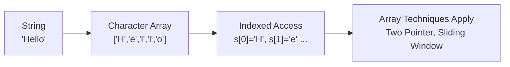

# String Basics — Common String Operations

> **One-line summary:**
> A string is a sequence of characters — essentially a character array — with built-in operations for length, slicing, searching, splitting, and more.

---

## Table of Contents

1. [What is a String?](#1-what-is-a-string)
2. [Strings and Arrays: The Connection](#2-strings-and-arrays-the-connection)
3. [Declaring Strings](#3-declaring-strings)
4. [Finding the Length](#4-finding-the-length)
5. [Accessing Characters by Index](#5-accessing-characters-by-index)
6. [String Concatenation](#6-string-concatenation)
7. [Slicing and Substring](#7-slicing-and-substring)
8. [Converting Case](#8-converting-case)
9. [Checking if a String Contains a Substring](#9-checking-if-a-string-contains-a-substring)
10. [Splitting and Joining](#10-splitting-and-joining)
11. [Trimming Whitespace](#11-trimming-whitespace)
12. [Replacing Characters or Substrings](#12-replacing-characters-or-substrings)
13. [String Immutability](#13-string-immutability)
14. [Iterating Over a String](#14-iterating-over-a-string)
15. [String Comparison](#15-string-comparison)
16. [Quick Reference Table](#16-quick-reference-table)
17. [Practical Example — Reversing a String](#17-practical-example--reversing-a-string)
18. [Key Takeaways](#18-key-takeaways)
19. [FAQs](#19-faqs)

---

## 1. What is a String?

When you type your name into a website form, that name is a string. A **string is a sequence of characters** stored together — letters, digits, spaces, or symbols.

> **Analogy:** Think of a string like a necklace where each bead is a character. The order of beads matters, and you can look at any bead by its position number.

Strings are **zero-indexed** — the first character is at index 0, the second at index 1, and so on.

```
s = "Hello"

Index:   0   1   2   3   4
Char:    H   e   l   l   o
```

---

## 2. Strings and Arrays: The Connection

A string is essentially a **character array under the hood**. In C, strings literally are arrays of characters ending with a null terminator (`'\0'`).



In Python and C++, strings come with built-in methods — but the core idea is the same: characters arranged in order, accessible by index. This means **every array technique** (two pointers, sliding window, frequency counting) works on strings too.

---

## 3. Declaring Strings

```python
# Python
name = "Alice"
greeting = 'Hello, World!'   # single or double quotes both work
```

```cpp
// C++
#include <string>

std::string name = "Alice";
std::string greeting = "Hello, World!";
// Note: single quotes '' are for single characters (char), not strings
```

---

## 4. Finding the Length

The length tells you how many characters are in the string — one of the most-used operations.

```python
# Python
s = "Hello"
print(len(s))   # Output: 5
# "Hello" has 5 characters: H, e, l, l, o
```

```cpp
// C++
#include <iostream>
#include <string>

std::string s = "Hello";
std::cout << s.length() << std::endl;  // Output: 5
// .length() and .size() both work in C++
```

> **Time complexity:** O(1) — length is stored internally, not counted each time.

---

## 5. Accessing Characters by Index

Since strings are indexed like arrays, you can grab any character by its position.

```python
# Python
s = "Hello"
print(s[0])   # Output: H   (first character)
print(s[1])   # Output: e
print(s[4])   # Output: o   (last character)
print(s[-1])  # Output: o   (negative index = count from end)
print(s[-2])  # Output: l
```

```cpp
// C++
std::string s = "Hello";
std::cout << s[0] << std::endl;     // Output: H
std::cout << s[4] << std::endl;     // Output: o
std::cout << s.at(1) << std::endl;  // Output: e  (.at() does bounds checking)
```

**Index reference for `"Hello"`:**

| Index (positive) | 0 | 1 | 2 | 3 | 4 |
|---|---|---|---|---|---|
| Character | H | e | l | l | o |
| Index (negative) | -5 | -4 | -3 | -2 | -1 |

> **Time complexity:** O(1) — direct index lookup, same as arrays.

---

## 6. String Concatenation

Concatenation means joining two strings together end-to-end.

> **Analogy:** Like linking two chains — the second chain gets attached to the tail of the first.

```python
# Python
first = "Hello"
second = "World"
result = first + " " + second
print(result)   # Output: Hello World

# WARNING: avoid concatenation inside a loop — creates new string each time
# Bad (slow for large n):
s = ""
for char in ["a", "b", "c"]:
    s = s + char        # creates a new string on every iteration

# Good (fast):
s = "".join(["a", "b", "c"])   # builds once at the end → O(n)
```

```cpp
// C++
std::string first = "Hello";
std::string second = "World";
std::string result = first + " " + second;
std::cout << result << std::endl;   // Output: Hello World

// C++ strings are mutable, so += is efficient
std::string s = "";
s += "Hello";   // modifies in place — no copy penalty like Python
```

> **Time complexity:** O(n) per concatenation — a new string of combined length is created.

---

## 7. Slicing and Substring

Slicing lets you extract a portion of a string — like cutting a specific piece from a ribbon.

```python
# Python — s[start:end]  (end index is exclusive)
s = "Hello World"

print(s[0:5])   # Output: Hello  (index 0 to 4)
print(s[6:11])  # Output: World  (index 6 to 10)
print(s[6:])    # Output: World  (from index 6 to the end)
print(s[:5])    # Output: Hello  (from start to index 4)
print(s[::-1])  # Output: dlroW olleH  (reverse the whole string)
```

```cpp
// C++ — s.substr(start, length)
#include <string>

std::string s = "Hello World";
std::cout << s.substr(0, 5) << std::endl;   // Output: Hello  (start=0, take 5 chars)
std::cout << s.substr(6, 5) << std::endl;   // Output: World  (start=6, take 5 chars)
std::cout << s.substr(6) << std::endl;      // Output: World  (start=6 to end)
```

> **Time complexity:** O(n) — creates a new string of length n.

---

## 8. Converting Case

Changing all characters to uppercase or lowercase. Useful when you need **case-insensitive comparisons**.

> **Analogy:** Sorting a contact list — convert everything to lowercase first so "Alice" and "alice" are treated as the same name.

```python
# Python
s = "Hello World"
print(s.upper())   # Output: HELLO WORLD
print(s.lower())   # Output: hello world

# Common use: case-insensitive comparison
def same_word(a, b):
    return a.lower() == b.lower()

print(same_word("Alice", "ALICE"))   # Output: True
```

```cpp
// C++
#include <algorithm>  // for transform
#include <string>

std::string s = "Hello World";

// Convert to uppercase
std::string upper = s;
std::transform(upper.begin(), upper.end(), upper.begin(), ::toupper);
std::cout << upper << std::endl;   // Output: HELLO WORLD

// Convert to lowercase
std::string lower = s;
std::transform(lower.begin(), lower.end(), lower.begin(), ::tolower);
std::cout << lower << std::endl;   // Output: hello world
```

> **Time complexity:** O(n) — visits every character once.

---

## 9. Checking if a String Contains a Substring

Check whether one string exists inside another — like checking if an email has an "@" symbol.

```python
# Python
s = "Hello World"

# Boolean check
print("World" in s)     # Output: True
print("Python" in s)    # Output: False

# Find starting index
print(s.find("World"))  # Output: 6   (index where it starts)
print(s.find("Python")) # Output: -1  (not found)

# Check prefix / suffix
print(s.startswith("Hello"))  # Output: True
print(s.endswith("World"))    # Output: True
```

```cpp
// C++
#include <string>

std::string s = "Hello World";

// find() returns the index, or string::npos if not found
size_t pos = s.find("World");
if (pos != std::string::npos) {
    std::cout << "Found at index: " << pos << std::endl;  // Output: Found at index: 6
} else {
    std::cout << "Not found" << std::endl;
}
```

> **Time complexity:** O(n × m) for naive search, where n = string length and m = pattern length.

---

## 10. Splitting and Joining

**Split** breaks a string into a list of parts. **Join** does the opposite — glues parts back together.

> **Analogy:** Splitting a sentence into words is like cutting a ribbon at every space. Joining is gluing the pieces back in order with a different separator.

```python
# Python — split
sentence = "apple banana cherry"
words = sentence.split(" ")          # split on space
print(words)   # Output: ['apple', 'banana', 'cherry']

# Split on comma
csv = "1,2,3,4"
parts = csv.split(",")
print(parts)   # Output: ['1', '2', '3', '4']

# Python — join (glue a list back into a string)
result = ", ".join(words)
print(result)  # Output: apple, banana, cherry

# Efficient way to build a string from many pieces
chars = ["H", "e", "l", "l", "o"]
print("".join(chars))   # Output: Hello
```

```cpp
// C++ — no built-in split; use stringstream
#include <sstream>
#include <vector>
#include <string>

std::string sentence = "apple banana cherry";
std::istringstream stream(sentence);
std::string word;
std::vector<std::string> words;

while (stream >> word) {
    words.push_back(word);   // reads word by word, splitting on whitespace
}
// words = {"apple", "banana", "cherry"}

// Join using a loop
std::string result = "";
for (int i = 0; i < words.size(); i++) {
    if (i > 0) result += ", ";   // add separator before every item except first
    result += words[i];
}
// result = "apple, banana, cherry"
```

> **Time complexity:** O(n) for both split and join.

---

## 11. Trimming Whitespace

Extra spaces at the start or end of a string can cause silent bugs — especially with user input.

```python
# Python
s = "   Hello World   "
print(s.strip())    # Output: "Hello World"   (both sides)
print(s.lstrip())   # Output: "Hello World   " (left side only)
print(s.rstrip())   # Output: "   Hello World"  (right side only)

# Always trim user input before processing
user_input = "   Alice   "
name = user_input.strip()   # "Alice" — safe to compare now
```

```cpp
// C++ — no built-in trim; remove leading and trailing spaces manually
#include <algorithm>
#include <string>

std::string s = "   Hello World   ";

// Remove leading spaces
s.erase(s.begin(), std::find_if(s.begin(), s.end(), [](char c){ return !isspace(c); }));

// Remove trailing spaces
s.erase(std::find_if(s.rbegin(), s.rend(), [](char c){ return !isspace(c); }).base(), s.end());

std::cout << s << std::endl;   // Output: Hello World
```

---

## 12. Replacing Characters or Substrings

Replace one piece of a string with something else — like find-and-replace in a text editor.

```python
# Python — replace(old, new) replaces ALL occurrences by default
s = "I love cats. Cats are great."
print(s.replace("cats", "dogs"))   # Output: I love dogs. Cats are great.
# Note: "Cats" (capital C) was NOT replaced — case sensitive

# Replace a single character
s2 = "hello"
s2 = s2.replace("l", "r")   # replaces all 'l' → Output: herro
print(s2)
```

```cpp
// C++ — no built-in replace-all; use a loop or regex
#include <string>

std::string s = "I love cats. Cats are great.";
std::string from = "cats";
std::string to = "dogs";

size_t pos = 0;
while ((pos = s.find(from, pos)) != std::string::npos) {
    s.replace(pos, from.length(), to);   // replace at found position
    pos += to.length();                  // move past the replacement
}
std::cout << s << std::endl;   // Output: I love dogs. Cats are great.
```

> **Time complexity:** O(n) — scans the entire string.

---

## 13. String Immutability

In Python (and Java), **strings are immutable** — once created, you cannot change an individual character. Every modification creates a brand new string.

> **Analogy:** A string is like a printed book page. You can't change one letter on it. To make a change, you must print an entirely new page.

```python
# Python
s = "Hello"
# s[0] = 'h'   # ERROR: TypeError — strings don't support item assignment

# Correct approach: build a new string
s = 'h' + s[1:]   # takes everything from index 1 onward
print(s)           # Output: hello

# When you need to modify many characters, convert to a list first
chars = list("Hello")   # ['H', 'e', 'l', 'l', 'o']
chars[0] = 'h'          # lists ARE mutable
s = "".join(chars)      # join back into a string
print(s)                # Output: hello
```

```cpp
// C++ — strings ARE mutable
std::string s = "Hello";
s[0] = 'h';               // works fine in C++
std::cout << s << std::endl;   // Output: hello
```

**Immutability impact on complexity:**

| Operation | Python | C++ |
|---|---|---|
| Change one character | O(n) — new string created | O(1) — direct modification |
| Concatenate in a loop | O(n²) total — avoid! | O(n) total — efficient |
| Build string from parts | Use `"".join(list)` → O(n) | Use `+=` → O(n) |

---

## 14. Iterating Over a String

Loop through each character — fundamental to most string problems.

```python
# Python — iterate directly
s = "Hello"
for char in s:
    print(char)
# Output: H e l l o  (each on a new line)

# Iterate with index
for i in range(len(s)):
    print(f"s[{i}] = {s[i]}")
# Output:
# s[0] = H
# s[1] = e
# s[2] = l
# s[3] = l
# s[4] = o

# Practical: count vowels
def count_vowels(s):
    vowels = set("aeiouAEIOU")
    count = 0
    for char in s:
        if char in vowels:   # O(1) lookup in a set
            count += 1
    return count

print(count_vowels("Hello World"))   # Output: 3 (e, o, o)
```

```cpp
// C++
#include <string>
#include <iostream>

std::string s = "Hello";

// Range-based for loop
for (char c : s) {
    std::cout << c << std::endl;
}

// Index-based for loop
for (int i = 0; i < s.length(); i++) {
    std::cout << "s[" << i << "] = " << s[i] << std::endl;
}
```

> **Time complexity:** O(n) — visits every character once.

---

## 15. String Comparison

Strings are compared **lexicographically** — character by character based on ASCII values. This is exactly how a dictionary orders words.

```python
# Python
print("apple" == "apple")   # Output: True
print("apple" == "Apple")   # Output: False  (case sensitive — 'a' vs 'A' differ)
print("apple" < "banana")   # Output: True   ('a' ASCII 97 < 'b' ASCII 98)
print("cat" > "bat")        # Output: True   ('c' ASCII 99 > 'b' ASCII 98)
print("abc" < "abd")        # Output: True   (first 2 chars equal, 'c' < 'd')

# Case-insensitive comparison
print("Apple".lower() == "apple".lower())   # Output: True
```

```cpp
// C++
#include <string>

std::string a = "apple";
std::string b = "banana";

// == compares for exact equality
std::cout << (a == a) << std::endl;   // Output: 1 (true)
std::cout << (a == b) << std::endl;   // Output: 0 (false)

// < > compare lexicographically
std::cout << (a < b) << std::endl;    // Output: 1 (true — 'a' < 'b')

// compare() returns 0 (equal), negative (less), positive (greater)
std::cout << a.compare(b) << std::endl;   // Output: negative number
```

**ASCII values you should know:**

| Character range | ASCII range |
|---|---|
| `'0'` to `'9'` | 48 to 57 |
| `'A'` to `'Z'` | 65 to 90 |
| `'a'` to `'z'` | 97 to 122 |

> Key insight: lowercase letters have *higher* ASCII values than uppercase. `'a'` (97) > `'Z'` (90).

---

## 16. Quick Reference Table

| Operation | Python | C++ | Time Complexity |
|---|---|---|---|
| Length | `len(s)` | `s.length()` | O(1) |
| Access by index | `s[i]` | `s[i]` or `s.at(i)` | O(1) |
| Concatenation | `s1 + s2` | `s1 + s2` | O(n) |
| Substring / Slice | `s[start:end]` | `s.substr(start, len)` | O(n) |
| Find substring | `s.find(sub)` | `s.find(sub)` | O(n×m) |
| Replace | `s.replace(a, b)` | loop + `s.replace()` | O(n) |
| Split | `s.split(sep)` | `istringstream` | O(n) |
| Trim | `s.strip()` | manual / `erase` | O(n) |
| Upper / Lower | `s.upper()` / `s.lower()` | `transform` + `toupper/tolower` | O(n) |
| Compare | `==`, `<`, `>` | `==`, `<`, `.compare()` | O(n) |
| Iterate | `for char in s` | `for (char c : s)` | O(n) |

---

## 17. Practical Example — Reversing a String

Reversing a string combines several concepts above and is a classic beginner problem.

```python
# Python — Method 1: Slicing (simplest, one line)
s = "Hello"
print(s[::-1])   # Output: olleH
# s[::-1] means: start=end, stop=start, step=-1 (go backwards)

# Python — Method 2: Loop (character by character)
s = "Hello"
result = ""
for char in s:
    result = char + result   # prepend each character to front
print(result)   # Output: olleH
# WARNING: this is O(n²) due to string immutability — each + creates a new string

# Python — Method 3: Two-pointer (most interview-friendly)
chars = list("Hello")   # convert to list first — lists are mutable
left = 0
right = len(chars) - 1

while left < right:
    chars[left], chars[right] = chars[right], chars[left]  # swap
    left += 1    # move inward
    right -= 1   # move inward

print("".join(chars))   # Output: olleH
```

**Two-pointer trace for `"Hello"`:**

| Step | left | right | chars | Action |
|---|---|---|---|---|
| Start | 0 | 4 | `['H','e','l','l','o']` | swap `H` and `o` |
| 1 | 1 | 3 | `['o','e','l','l','H']` | swap `e` and `l` |
| 2 | 2 | 2 | `['o','l','l','e','H']` | left == right, stop |
| Done | — | — | `['o','l','l','e','H']` | `"olleH"` |

```cpp
// C++ — Method 1: built-in reverse
#include <algorithm>
#include <string>

std::string s = "Hello";
std::reverse(s.begin(), s.end());   // modifies in place — strings are mutable in C++
std::cout << s << std::endl;        // Output: olleH

// C++ — Method 2: Two-pointer (same logic as Python above)
std::string s2 = "Hello";
int left = 0;
int right = s2.length() - 1;

while (left < right) {
    std::swap(s2[left], s2[right]);  // swap characters
    left++;
    right--;
}
std::cout << s2 << std::endl;   // Output: olleH
```

> **Time complexity:** O(n) — visits each character once.  
> **Space complexity:** O(1) — two-pointer swaps in place (for the list version in Python: O(n) for the list copy).

---

## 18. Key Takeaways

- A string is a **sequence of characters**, indexed from 0, behaving like a character array.
- In Python, strings are **immutable** — every modification creates a new string. Use `list` + `join` when you need to modify characters.
- In C++, strings are **mutable** — you can change individual characters directly.
- Array techniques — **two pointers, sliding window, frequency counting** — all work directly on strings.
- **Concatenation inside a loop** is a common performance trap in Python. Always prefer `"".join(list)`.
- **Case conversion** before comparison prevents silent bugs when matching user input.
- **Lexicographic comparison** is how strings are ordered — character by character using ASCII values.

---

## 19. FAQs

**Q: What is the difference between a string and a character array?**  
A character array is a low-level construct (used in C) where text is stored as `char[]` ending with `'\0'`. A string is a higher-level object that wraps the array and adds built-in methods. In Python and C++, you work with string objects directly, not raw arrays.

**Q: Why are strings immutable in Python?**  
Immutability makes strings safe to share across different parts of a program without risk of accidental changes. It also lets Python optimize memory by reusing the same string object when the same value appears multiple times. The trade-off: every modification allocates a new string.

**Q: How does lexicographic comparison work?**  
Characters are compared one by one using their ASCII (or Unicode) value. `"apple" < "banana"` because `'a'` (97) < `'b'` (98) at the very first character. If the first characters are equal, compare the second, and so on. This is exactly how a dictionary orders words.

**Q: When should I convert a string to a list in Python?**  
When you need to modify individual characters. Since strings are immutable, `s[0] = 'x'` raises an error. Convert to `list(s)`, make your changes, then `"".join(result)` to get the final string back.

**Q: Are `s.length()` and `s.size()` the same in C++?**  
Yes — both return the number of characters. `length()` is the traditional string method; `size()` is inherited from the container interface. They are identical in behavior.
