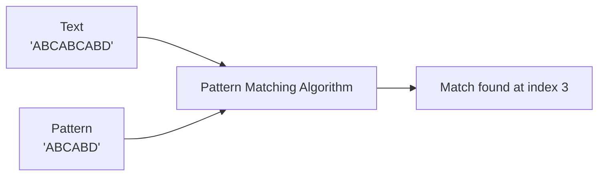

# String Pattern Matching — Naive Search and KMP

> **One-line summary:**
> Pattern matching finds where a smaller string (pattern) appears inside a larger string (text) — naive search checks every position; KMP skips positions intelligently using precomputed data.

---

## Table of Contents

1. [What is Pattern Matching?](#1-what-is-pattern-matching)
2. [Key Terms](#2-key-terms)
3. [Naive Pattern Matching (Brute Force)](#3-naive-pattern-matching-brute-force)
4. [Naive Search — Step-by-Step Dry Run](#4-naive-search--step-by-step-dry-run)
5. [Naive Search Code](#5-naive-search-code)
6. [Time Complexity of Naive Search](#6-time-complexity-of-naive-search)
7. [KMP Algorithm — Smarter Pattern Matching](#7-kmp-algorithm--smarter-pattern-matching)
8. [The LPS Array — Heart of KMP](#8-the-lps-array--heart-of-kmp)
9. [Building the LPS Array](#9-building-the-lps-array)
10. [KMP Search Code](#10-kmp-search-code)
11. [Time Complexity of KMP](#11-time-complexity-of-kmp)
12. [Naive vs KMP — Quick Comparison](#12-naive-vs-kmp--quick-comparison)
13. [Common Problem Types](#13-common-problem-types)
14. [Tips for Beginners Practicing Pattern Matching](#14-tips-for-beginners-practicing-pattern-matching)
15. [Key Takeaways](#15-key-takeaways)
16. [FAQs](#16-faqs)

---

## 1. What is Pattern Matching?

Have you ever pressed **Ctrl+F** to find a word in a document? That is pattern matching. You give the computer a piece of text (the **pattern**) and ask it to find where that text appears inside a bigger block of text (the **text**).

Pattern matching shows up everywhere:

- Search engines finding keywords in pages
- Text editors highlighting all occurrences of a word
- DNA analysis searching for gene sequences
- Spam filters looking for suspicious phrases



In this topic, we cover two approaches: **Naive search** (simple, brute force) and **KMP** (smart, skips redundant work).

---

## 2. Key Terms

| Term            | Meaning                              | Example         |
| --------------- | ------------------------------------ | --------------- |
| **Text (T)**    | The main string we search inside     | `"hello world"` |
| **Pattern (P)** | The smaller string we look for       | `"world"`       |
| **Match**       | Pattern found starting at some index | index 6         |
| **Index**       | Zero-based position in the text      | `T[0]` = `'h'`  |

> **Analogy:** Think of it like searching for a name in a long list. You scan each entry and check if it matches the name you are looking for.

---

## 3. Naive Pattern Matching (Brute Force)

The simplest approach: slide the pattern one position at a time from left to right across the text. At each position, compare character by character. If all characters match, record the index.

```
Text:    A B C A B C A B D
         ^
Pattern: A B C A B D
         ^

Slide one step at a time:
Position 0 → check all → mismatch at pos 5
Position 1 → check all → mismatch at pos 0
Position 2 → check all → mismatch at pos 0
Position 3 → check all → ALL MATCH → found at index 3
```

This works, but it may repeat a lot of comparisons for large inputs.

---

## 4. Naive Search — Step-by-Step Dry Run

**Text:** `ABCABCABD`  
**Pattern:** `ABCABD` (length 6)

| Step | Text window (i to i+5) | Pattern       | First mismatch   | Result               |
| ---- | ---------------------- | ------------- | ---------------- | -------------------- |
| i=0  | `A B C A B C`          | `A B C A B D` | pos 5: `C` ≠ `D` | skip                 |
| i=1  | `B C A B C A`          | `A B C A B D` | pos 0: `B` ≠ `A` | skip                 |
| i=2  | `C A B C A B`          | `A B C A B D` | pos 0: `C` ≠ `A` | skip                 |
| i=3  | `A B C A B D`          | `A B C A B D` | no mismatch      | **MATCH at index 3** |

The outer loop runs `n - m + 1` times (9 - 6 + 1 = 4 here). The inner loop compares up to `m` characters each time.

---

## 5. Naive Search Code

```python
def naive_search(text, pattern):
    n = len(text)     # length of the text
    m = len(pattern)  # length of the pattern
    results = []      # stores all match starting indices

    # Try every possible starting position in the text
    # Only go up to n-m so the window fits
    for i in range(n - m + 1):
        match = True

        # Compare pattern with the current window in text
        for j in range(m):
            if text[i + j] != pattern[j]:
                match = False  # mismatch found — stop early
                break

        if match:
            results.append(i)  # pattern found starting at index i

    return results

# Example
text = "ABCABCABD"
pattern = "ABCABD"
print(naive_search(text, pattern))   # Output: [3]
```

```cpp
// C++
#include <iostream>
#include <vector>
#include <string>

std::vector<int> naive_search(const std::string& text, const std::string& pattern) {
    int n = text.length();
    int m = pattern.length();
    std::vector<int> results;

    for (int i = 0; i <= n - m; i++) {
        bool match = true;

        for (int j = 0; j < m; j++) {
            if (text[i + j] != pattern[j]) {
                match = false;   // mismatch — stop comparing
                break;
            }
        }

        if (match) {
            results.push_back(i);   // match found at index i
        }
    }
    return results;
}

int main() {
    std::string text = "ABCABCABD";
    std::string pattern = "ABCABD";
    std::vector<int> result = naive_search(text, pattern);

    for (int idx : result) {
        std::cout << "Match at index: " << idx << std::endl;
    }
    // Output: Match at index: 3
}
```

---

## 6. Time Complexity of Naive Search

| Case  | Time     | When it happens                           |
| ----- | -------- | ----------------------------------------- |
| Best  | O(n)     | Pattern mismatch at first char every time |
| Worst | O(n × m) | Pattern almost matches at every position  |
| Space | O(1)     | No extra data structures used             |

**Worst-case example:** Text = `"AAAAAAB"`, Pattern = `"AAAB"` — nearly every position compares all `m` characters before finding a mismatch.

For large inputs (text of 1 million chars, pattern of 1000 chars), O(n × m) = 1 billion comparisons. That is too slow — we need KMP.

---

## 7. KMP Algorithm — Smarter Pattern Matching

**Knuth-Morris-Pratt (KMP)** avoids redundant comparisons. The key insight: when a mismatch happens, you already know something about the characters you matched so far — use that knowledge to skip positions.

> **Analogy:** You are reading a sentence to find a phrase. You match the first 5 words, then the 6th word doesn't match. Naive: go back to the very start. KMP: remember that the first 2 words you matched also appear at the end of what you already read — so jump forward intelligently instead of backtracking all the way.

```mermaid
flowchart TD
    A["Start: i=0 in text, j=0 in pattern"] --> B{text[i] == pattern[j]?}
    B -- Yes --> C["i++, j++"]
    C --> D{j == m?}
    D -- Yes --> E["Record match at i-j\nSet j = lps[j-1]"]
    D -- No --> B
    B -- No --> F{j == 0?}
    F -- Yes --> G["i++  (no prefix to fall back on)"]
    F -- No --> H["j = lps[j-1]  (skip using LPS, don't move i)"]
    G --> B
    H --> B
    E --> B
```

---

## 8. The LPS Array — Heart of KMP

KMP uses a helper called the **LPS array** (Longest Proper Prefix which is also a Suffix). It is built from the pattern only — not the text.

**What is a proper prefix that is also a suffix?**

For a string `S`, a proper prefix is any prefix that is NOT the full string itself.

| Pattern    | Proper prefix also a suffix | LPS value |
| ---------- | --------------------------- | --------- |
| `"A"`      | none                        | 0         |
| `"AB"`     | none                        | 0         |
| `"ABA"`    | `"A"`                       | 1         |
| `"ABAB"`   | `"AB"`                      | 2         |
| `"ABCABC"` | `"ABC"`                     | 3         |
| `"ABCABD"` | none at end                 | 0         |

**LPS array for `"ABCABD"`:**

| Index | 0   | 1   | 2   | 3   | 4   | 5   |
| ----- | --- | --- | --- | --- | --- | --- |
| Char  | A   | B   | C   | A   | B   | D   |
| LPS   | 0   | 0   | 0   | 1   | 2   | 0   |

- `lps[3] = 1` → prefix `"A"` matches suffix `"A"` in substring `"ABCA"`
- `lps[4] = 2` → prefix `"AB"` matches suffix `"AB"` in substring `"ABCAB"`
- `lps[5] = 0` → no prefix matches a suffix in `"ABCABD"`

When a mismatch happens at pattern position `j`, we jump to `lps[j-1]` — this is how far back we need to go.

---

## 9. Building the LPS Array

```python
def build_lps(pattern):
    m = len(pattern)
    lps = [0] * m   # all zeros to start
    length = 0      # length of the current longest prefix-suffix
    i = 1           # start from the second character

    while i < m:
        if pattern[i] == pattern[length]:
            # Current char extends the prefix-suffix
            length += 1
            lps[i] = length
            i += 1
        else:
            if length != 0:
                # Fall back: use the LPS value we already computed
                # Do NOT increment i — re-check same i with new length
                length = lps[length - 1]
            else:
                # No prefix-suffix possible here
                lps[i] = 0
                i += 1

    return lps

# Example
pattern = "ABCABD"
print(build_lps(pattern))   # Output: [0, 0, 0, 1, 2, 0]
```

**Step-by-step LPS build for `"ABCABD"`:**

| i   | pattern[i] | length | Comparison                         | LPS[i] |
| --- | ---------- | ------ | ---------------------------------- | ------ |
| 1   | B          | 0      | B ≠ A → length stays 0, i++        | 0      |
| 2   | C          | 0      | C ≠ A → length stays 0, i++        | 0      |
| 3   | A          | 0      | A == A → length=1, i++             | 1      |
| 4   | B          | 1      | B == B → length=2, i++             | 2      |
| 5   | D          | 2      | D ≠ C → fall back: length=lps[1]=0 | —      |
| 5   | D          | 0      | D ≠ A → length stays 0, i++        | 0      |

```cpp
// C++
#include <vector>
#include <string>

std::vector<int> build_lps(const std::string& pattern) {
    int m = pattern.length();
    std::vector<int> lps(m, 0);
    int length = 0;
    int i = 1;

    while (i < m) {
        if (pattern[i] == pattern[length]) {
            length++;
            lps[i] = length;
            i++;
        } else {
            if (length != 0) {
                length = lps[length - 1];   // fall back
            } else {
                lps[i] = 0;
                i++;
            }
        }
    }
    return lps;
}
```

---

## 10. KMP Search Code

```python
def kmp_search(text, pattern):
    n = len(text)
    m = len(pattern)
    lps = build_lps(pattern)   # preprocess pattern — O(m)

    results = []   # stores starting indices of all matches
    i = 0          # pointer into text
    j = 0          # pointer into pattern

    while i < n:
        if text[i] == pattern[j]:
            i += 1   # both match — advance both pointers
            j += 1

        if j == m:
            # Full pattern matched — record where it started
            results.append(i - j)
            # Use LPS to look for the next possible match
            j = lps[j - 1]

        elif i < n and text[i] != pattern[j]:
            if j != 0:
                # Use LPS to skip — do NOT move i back
                j = lps[j - 1]
            else:
                # j is 0, no fallback possible — advance text
                i += 1

    return results

# Example
text = "ABCABCABD"
pattern = "ABCABD"
print(kmp_search(text, pattern))   # Output: [3]
```

**KMP search trace for `text="ABCABCABD"`, `pattern="ABCABD"`, `lps=[0,0,0,1,2,0]`:**

| Step | i   | j   | text[i] | pattern[j]                 | Action                     |
| ---- | --- | --- | ------- | -------------------------- | -------------------------- |
| 1    | 0   | 0   | A       | A                          | match → i=1, j=1           |
| 2    | 1   | 1   | B       | B                          | match → i=2, j=2           |
| 3    | 2   | 2   | C       | C                          | match → i=3, j=3           |
| 4    | 3   | 3   | A       | A                          | match → i=4, j=4           |
| 5    | 4   | 4   | B       | B                          | match → i=5, j=5           |
| 6    | 5   | 5   | C       | D                          | mismatch, j≠0 → j=lps[4]=2 |
| 7    | 5   | 2   | C       | C                          | match → i=6, j=3           |
| 8    | 6   | 3   | A       | A                          | match → i=7, j=4           |
| 9    | 7   | 4   | B       | B                          | match → i=8, j=5           |
| 10   | 8   | 5   | D       | D                          | match → i=9, j=6           |
| 11   | —   | 6   | j==m    | MATCH at i-j = 9-6 = **3** | record 3, j=lps[5]=0       |

Notice step 6: instead of resetting `i` back to 4, we only reset `j` to 2 — we reused the `"AB"` we already matched.

```cpp
// C++
#include <iostream>
#include <vector>
#include <string>

std::vector<int> kmp_search(const std::string& text, const std::string& pattern) {
    int n = text.length();
    int m = pattern.length();
    std::vector<int> lps = build_lps(pattern);

    std::vector<int> results;
    int i = 0;   // text pointer
    int j = 0;   // pattern pointer

    while (i < n) {
        if (text[i] == pattern[j]) {
            i++;
            j++;
        }

        if (j == m) {
            results.push_back(i - j);   // match found
            j = lps[j - 1];             // look for next match
        } else if (i < n && text[i] != pattern[j]) {
            if (j != 0) {
                j = lps[j - 1];   // skip using LPS
            } else {
                i++;   // no fallback, move text pointer
            }
        }
    }
    return results;
}
```

---

## 11. Time Complexity of KMP

| Phase     | Time         | Why                                                     |
| --------- | ------------ | ------------------------------------------------------- |
| Build LPS | O(m)         | Single pass through the pattern                         |
| Search    | O(n)         | `i` never goes backward — moves forward at most n times |
| **Total** | **O(n + m)** | LPS build + search combined                             |
| Space     | O(m)         | The LPS array of size m                                 |

Compare to naive: O(n × m). For `n = 1,000,000` and `m = 1000`, naive does up to **1 billion** comparisons; KMP does at most **1,001,000**.

---

## 12. Naive vs KMP — Quick Comparison

| Feature               | Naive Search                  | KMP Algorithm                       |
| --------------------- | ----------------------------- | ----------------------------------- |
| Time Complexity       | O(n × m)                      | O(n + m)                            |
| Space Complexity      | O(1)                          | O(m) for LPS array                  |
| Preprocessing         | None                          | Builds LPS array                    |
| Best for              | Small inputs, quick prototype | Large texts and patterns            |
| Skips positions?      | No — restarts from scratch    | Yes — uses LPS to jump              |
| Ease of understanding | Very easy                     | Moderate                            |
| Interview relevance   | Good to know                  | Preferred for performance questions |

---

## 13. Common Problem Types

### Count all occurrences

```python
text = "AABABAB"
pattern = "AB"
results = kmp_search(text, pattern)
print("Count:", len(results))    # Output: Count: 3
print("Indices:", results)       # Output: Indices: [1, 3, 5]
```

### Check if pattern exists

```python
def contains_pattern(text, pattern):
    return len(kmp_search(text, pattern)) > 0

print(contains_pattern("hello world", "world"))   # Output: True
print(contains_pattern("hello world", "earth"))   # Output: False
```

### Python built-in (simplest option)

```python
# Python has pattern matching built in — good to know for quick solutions
text = "ABCABCABD"
pattern = "ABCABD"

# Find first occurrence
print(text.find(pattern))          # Output: 3  (-1 if not found)

# Find all occurrences manually using find()
def find_all(text, pattern):
    results = []
    start = 0
    while True:
        pos = text.find(pattern, start)   # search starting from 'start'
        if pos == -1:
            break
        results.append(pos)
        start = pos + 1   # move past current match to find overlapping ones
    return results

print(find_all("AABABAB", "AB"))   # Output: [1, 3, 5]
```

---

## 14. Tips for Beginners Practicing Pattern Matching

1. **Start with naive search** — implement the double loop from scratch before touching KMP. Make sure you understand `range(n - m + 1)` and why the window stops there.
2. **Build the LPS array manually on paper** — take a pattern like `"AABAABAAB"` and fill in the LPS values by hand before coding the function. This makes the logic click faster than reading code.
3. **Trace KMP step by step** — use a short text like `"AABAABAAB"` and pattern `"AABA"`. Write out `i`, `j`, `text[i]`, `pattern[j]`, and `lps` at each step so you can see the jumps happen.
4. **Add print statements** — inside the KMP loop, print `i` and `j` every iteration. Watching the values change shows exactly when LPS kicks in and why `i` never goes backward.
5. **Practice on LeetCode problem 28** — "Find the Index of the First Occurrence in a String" is the canonical pattern matching problem. Once you can solve it with KMP, you have truly internalized the algorithm.

---

## 15. Key Takeaways

- **Pattern matching** finds where a pattern occurs inside a text — used everywhere from Ctrl+F to DNA sequencing.
- **Naive search** slides the pattern one step at a time and compares character by character — O(n × m), simple but slow for large inputs.
- **KMP** uses an **LPS array** precomputed from the pattern to skip redundant comparisons — O(n + m) total.
- The **LPS array** encodes the longest proper prefix of the pattern that is also a suffix — this tells KMP how far to fall back on a mismatch without re-checking the text.
- For small strings or quick solutions, use Python's built-in `str.find()`. For performance-critical work, use KMP.
- In interviews: implement naive first to show understanding, then mention KMP for the optimized solution.

---

## 16. FAQs

**Q: What is the difference between naive search and KMP?**  
Naive search checks every position from scratch — O(n × m). KMP uses the LPS array to skip unnecessary comparisons — O(n + m). KMP is significantly faster for large inputs.

**Q: Why do we need the LPS array?**  
When a mismatch occurs at pattern position `j`, we know characters `pattern[0..j-1]` matched the text. The LPS array tells us the longest prefix of the pattern that also appears as a suffix in that matched portion — so we can reuse that matched part instead of starting over.

**Q: When should I use naive search instead of KMP?**  
Use naive when the text and pattern are both short, or when you need a quick working solution and cannot recall KMP details. For performance-critical or large-scale problems, prefer KMP or the language's built-in function.

**Q: Does KMP handle overlapping matches?**  
Yes. After recording a match at position `i - j`, KMP sets `j = lps[j - 1]` (not `j = 0`), which allows it to find overlapping occurrences.

**Q: What does `string::npos` mean in C++?**  
`std::string::npos` is a special constant (usually the maximum value of `size_t`) returned by `s.find()` when the pattern is not found. Always compare against it: `if (pos != std::string::npos)`.
