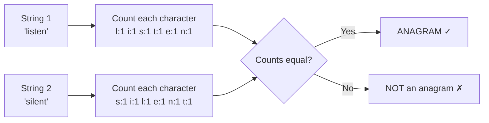

# Anagram Problems — Frequency Counting

> **One-line summary:**
> Two strings are anagrams if they contain the same characters the same number of times — frequency counting checks this in O(n) time using an array or hashmap.

---

## Table of Contents

1. [What is an Anagram?](#1-what-is-an-anagram)
2. [A Real-Life Analogy](#2-a-real-life-analogy)
3. [Frequency Counting Explained](#3-frequency-counting-explained)
4. [Why Use Frequency Counting?](#4-why-use-frequency-counting)
5. [Approach 1 — Count Array](#5-approach-1--count-array)
6. [Approach 2 — HashMap](#6-approach-2--hashmap)
7. [Approach Comparison](#7-approach-comparison)
8. [Group Anagrams Problem](#8-group-anagrams-problem)
9. [Frequency Counting Beyond Anagrams](#9-frequency-counting-beyond-anagrams)
10. [Common Mistakes to Avoid](#10-common-mistakes-to-avoid)
11. [Key Takeaways](#11-key-takeaways)
12. [FAQs](#12-faqs)

---

## 1. What is an Anagram?

Have you ever played word puzzles where you rearrange letters to form a new word? For example, **"listen"** can be rearranged to form **"silent"**. That is an anagram.

> **Definition:** Two strings are anagrams of each other if one can be formed by rearranging the letters of the other. Both strings must use the **same characters the same number of times**.

```
"listen"  →  l i s t e n
"silent"  →  s i l e n t

Same characters, just in a different order → ANAGRAM ✓

"hello"   →  h e l l o
"world"   →  w o r l d

Different characters → NOT an anagram ✗
```

---

## 2. A Real-Life Analogy

> Imagine two bags of colored marbles.
>
> - Bag A: 3 red, 2 blue, 1 green
> - Bag B: 3 red, 2 blue, 1 green
>
> Even if the marbles are arranged differently inside each bag, both bags contain the **same marbles**. They are essentially the same.

That is exactly what anagram checking is. Instead of marbles, we count **character frequencies** in both strings and compare them.



---

## 3. Frequency Counting Explained

Frequency counting means keeping track of **how many times each character appears** in a string. We store this in an array or hashmap.

**Example — `"aab"`:**

| Character | Count |
| --------- | ----- |
| `'a'`     | 2     |
| `'b'`     | 1     |

We can store this as:

- A **count array** of size 26 (one slot per letter `'a'` to `'z'`)
- A **hashmap** mapping each character to its count

---

## 4. Why Use Frequency Counting?

The naive way to check anagrams is to **sort both strings** and compare. That works, but sorting takes O(n log n).

Frequency counting does the same job in **O(n)** — a significant improvement for large strings.

| Method                    | Time Complexity | Space                 |
| ------------------------- | --------------- | --------------------- |
| Sort + compare            | O(n log n)      | O(1) or O(n)          |
| Frequency count (array)   | O(n)            | O(1) — fixed 26 slots |
| Frequency count (hashmap) | O(n)            | O(k) — k unique chars |

This makes frequency counting the **go-to pattern** whenever you need to compare character distributions between strings.

---

## 5. Approach 1 — Count Array

Since we deal with lowercase English letters, we use an array of size 26. Each index represents a letter from `'a'` to `'z'`.

**The idea:**

- Increment count for each character in string 1
- Decrement count for each character in string 2
- If all counts are zero at the end → anagram

**Step-by-step for `"listen"` and `"silent"`:**

| Step | Action                          | Count array change              |
| ---- | ------------------------------- | ------------------------------- |
| 1    | Check lengths: 6 == 6           | pass                            |
| 2    | Loop `"listen"`: increment each | `l:+1 i:+1 s:+1 t:+1 e:+1 n:+1` |
| 3    | Loop `"silent"`: decrement each | `s:-1 i:-1 l:-1 e:-1 n:-1 t:-1` |
| 4    | All counts == 0?                | Yes → **anagram**               |

#### Python

```python
# Python — Count Array approach
def is_anagram(s, t):
    # Step 1: lengths must match
    if len(s) != len(t):
        return False

    # Step 2: count array for 26 lowercase letters
    count = [0] * 26

    # Step 3: increment for s, decrement for t
    for i in range(len(s)):
        count[ord(s[i]) - ord('a')] += 1
        count[ord(t[i]) - ord('a')] -= 1

    # Step 4: all counts must be zero
    return all(c == 0 for c in count)


# Example usage
print(is_anagram("listen", "silent"))   # Output: True
print(is_anagram("hello", "world"))     # Output: False
```

#### C++ (simple):

```cpp
#include <iostream>
#include <string>
#include <vector>
using namespace std;

// Plain function — check if s and t are anagrams using a count array
bool is_anagram(const string& s, const string& t) {
    if (s.length() != t.length()) return false;  // different lengths — can't be anagrams

    vector<int> count(26, 0);  // one slot per letter 'a' to 'z'

    for (int i = 0; i < (int)s.length(); i++) {
        count[s[i] - 'a']++;   // increment for character in s
        count[t[i] - 'a']--;   // decrement for character in t
    }

    for (int val : count) {
        if (val != 0) return false;  // unequal frequency found
    }
    return true;
}

int main() {
    cout << is_anagram("listen", "silent") << endl;   // Output: 1 (true)
    cout << is_anagram("hello", "world") << endl;     // Output: 0 (false)
}
```

#### C++ (LeetCode class style):

```cpp
#include <string>
#include <vector>
using namespace std;

class Solution {
public:
    bool isAnagram(string s, string t) {
        if (s.length() != t.length()) return false;  // quick length check first

        vector<int> count(26, 0);  // fixed-size array for 26 lowercase letters

        for (int i = 0; i < (int)s.length(); i++) {
            count[s[i] - 'a']++;   // increment for s
            count[t[i] - 'a']--;   // decrement for t
        }

        for (int val : count) {
            if (val != 0) return false;  // any non-zero means frequencies differ
        }
        return true;  // all counts balanced — anagram confirmed
    }
};
```

**Why `ord(s[i]) - ord('a')` in Python / `s[i] - 'a'` in C++?**

Characters are stored as ASCII numbers internally. `'a'` = 97, `'b'` = 98, ..., `'z'` = 122. Subtracting `'a'` maps each letter to an index 0–25.

```
'a' - 'a' = 0   → index 0
'b' - 'a' = 1   → index 1
'z' - 'a' = 25  → index 25
```

> **Time complexity:** O(n) — one pass through each string.  
> **Space complexity:** O(1) — fixed array of 26 integers, regardless of input size.

---

## 6. Approach 2 — HashMap

When strings contain characters beyond lowercase letters (digits, spaces, Unicode), a **hashmap** is more flexible.

The logic is the same — count characters in string 1, then subtract for string 2. If any count goes negative or a key is missing, not an anagram.

#### Python

```python
# Python — HashMap approach
def is_anagram_map(s, t):
    if len(s) != len(t):
        return False

    count = {}   # maps character → frequency

    # Count characters in s
    for c in s:
        count[c] = count.get(c, 0) + 1

    # Subtract counts using t
    for c in t:
        if c not in count:
            return False           # character in t but not in s
        count[c] -= 1
        if count[c] < 0:
            return False           # t has more of this character than s

    return True


# Example usage
print(is_anagram_map("anagram", "nagaram"))   # Output: True
print(is_anagram_map("rat", "car"))           # Output: False
```

#### C++ (simple):

```cpp
#include <iostream>
#include <string>
#include <unordered_map>
using namespace std;

// Plain function — check anagram using an unordered_map for any character set
bool is_anagram_map(const string& s, const string& t) {
    if (s.length() != t.length()) return false;  // lengths must match

    unordered_map<char, int> count;  // maps each character to its frequency

    for (char c : s) {
        count[c]++;   // build frequency map from s
    }

    for (char c : t) {
        if (count.find(c) == count.end()) return false;  // char in t but not in s
        count[c]--;                                       // subtract for t
        if (count[c] < 0) return false;                  // t has more of this char
    }

    return true;
}

int main() {
    cout << is_anagram_map("anagram", "nagaram") << endl;   // Output: 1 (true)
    cout << is_anagram_map("rat", "car") << endl;           // Output: 0 (false)
}
```

#### C++ (LeetCode class style):

```cpp
#include <string>
#include <unordered_map>
using namespace std;

class Solution {
public:
    bool isAnagram(string s, string t) {
        if (s.length() != t.length()) return false;  // quick length check

        unordered_map<char, int> count;  // maps char to its net frequency

        for (char c : s) {
            count[c]++;   // increment for each char in s
        }

        for (char c : t) {
            if (count.find(c) == count.end()) return false;  // char not seen in s
            count[c]--;                                       // reduce the count
            if (count[c] < 0) return false;                  // t uses this char more than s
        }

        return true;  // all characters balanced
    }
};
```

> **Time complexity:** O(n) — one pass through each string.  
> **Space complexity:** O(k) — k is the number of unique characters.

**Python shortcut using `Counter`:**

```python
from collections import Counter

def is_anagram_counter(s, t):
    return Counter(s) == Counter(t)

print(is_anagram_counter("listen", "silent"))   # Output: True
```

`Counter` builds a frequency map automatically. Use this for quick solutions, but know the manual approach for interviews.

---

## 7. Approach Comparison

| Feature            | Count Array            | HashMap               |
| ------------------ | ---------------------- | --------------------- |
| Time Complexity    | O(n)                   | O(n)                  |
| Space Complexity   | O(1) — fixed 26 slots  | O(k) — k unique chars |
| Works with Unicode | No                     | Yes                   |
| Simpler Code       | Yes                    | Slightly more complex |
| Best For           | Lowercase letters only | Any character set     |

> **Interview rule of thumb:** Use the count array for lowercase-only problems. It is simpler, has no hash collision risk, and uses constant space. Use a hashmap when the problem allows any characters.

---

## 8. Group Anagrams Problem

A classic follow-up: given a list of words, group all anagrams together.

**Example:**

```
Input:  ["eat", "tea", "tan", "ate", "nat", "bat"]
Output: [["eat", "tea", "ate"], ["tan", "nat"], ["bat"]]
```

**The trick:** Sort each word's characters — all anagrams produce the **same sorted string**. Use that as the hashmap key.

```
"eat" → sorted → "aet"
"tea" → sorted → "aet"   ← same key, same group
"ate" → sorted → "aet"   ← same key, same group

"tan" → sorted → "ant"
"nat" → sorted → "ant"   ← same key, same group

"bat" → sorted → "abt"   ← unique group
```

#### Python

```python
# Python — Group Anagrams
def group_anagrams(words):
    groups = {}   # maps sorted_word → list of anagrams

    for word in words:
        key = "".join(sorted(word))   # sort characters to make the key

        if key not in groups:
            groups[key] = []
        groups[key].append(word)

    return list(groups.values())


# Example usage
words = ["eat", "tea", "tan", "ate", "nat", "bat"]
print(group_anagrams(words))
# Output: [['eat', 'tea', 'ate'], ['tan', 'nat'], ['bat']]
```

#### C++ (simple):

```cpp
#include <vector>
#include <string>
#include <unordered_map>
#include <algorithm>
using namespace std;

// Plain function — group words that are anagrams of each other
vector<vector<string>> group_anagrams(vector<string>& words) {
    unordered_map<string, vector<string>> groups;  // key: sorted word, value: anagram group

    for (const string& word : words) {
        string key = word;
        sort(key.begin(), key.end());   // sorting chars makes anagrams share the same key
        groups[key].push_back(word);    // add word to its group
    }

    vector<vector<string>> result;
    for (auto& pair : groups) {
        result.push_back(pair.second);  // collect each anagram group
    }
    return result;
}
```

#### C++ (LeetCode class style):

```cpp
#include <vector>
#include <string>
#include <unordered_map>
#include <algorithm>
using namespace std;

class Solution {
public:
    vector<vector<string>> groupAnagrams(vector<string>& strs) {
        unordered_map<string, vector<string>> groups;  // sorted key → list of anagrams

        for (const string& word : strs) {
            string key = word;
            sort(key.begin(), key.end());   // all anagrams produce the same sorted key
            groups[key].push_back(word);    // bucket the word under its key
        }

        vector<vector<string>> result;
        for (auto& pair : groups) {
            result.push_back(pair.second);  // each map entry is one anagram group
        }
        return result;
    }
};
```

> **Time complexity:** O(n × k log k) — n words, each sorted in O(k log k) where k is the max word length.  
> **Space complexity:** O(n × k) — storing all words in the hashmap.

---

## 9. Frequency Counting Beyond Anagrams

Frequency counting is not just for anagram checks — it is a general pattern for any problem involving **character distribution**. Common uses:

| Problem                             | How Frequency Counting Helps                 |
| ----------------------------------- | -------------------------------------------- |
| First non-repeating character       | Find the first char with count == 1          |
| All unique characters               | Check if any count > 1                       |
| Characters appearing more than once | Collect all chars with count > 1             |
| Sliding window with constraints     | Track character counts in the current window |
| Minimum window substring            | Compare two frequency maps                   |

Once you get comfortable with frequency counting, you will recognise it appearing as a building block in many harder problems.

---

## 10. Common Mistakes to Avoid

**1. Forgetting the length check**  
Two strings of different lengths can never be anagrams. Always check this first — it avoids unnecessary work.

```python
# Always do this before any counting
if len(s) != len(t):
    return False
```

**2. Ignoring case sensitivity**  
`"Listen"` and `"Silent"` are NOT anagrams unless you normalise case first.

```python
s = s.lower()
t = t.lower()
```

**3. Assuming sorted comparison is always fine**  
Sorting works but takes O(n log n). In interviews, always mention that frequency counting achieves O(n).

**4. Wrong index calculation in count array**  
Always subtract `'a'` (or `ord('a')`) to map the character to a 0-based index.

```python
# Correct
count[ord(c) - ord('a')] += 1

# Wrong — this would use the raw ASCII value (97-122) as the index
count[ord(c)] += 1   # array would need size 123, wastes space
```

---

## 11. Key Takeaways

- Two strings are **anagrams** if they contain the same characters with the same frequencies.
- **Frequency counting** solves anagram problems in O(n) — faster than sorting at O(n log n).
- Use a **count array of size 26** for lowercase letter problems — simple and O(1) space.
- Use a **hashmap** when the character set can be anything (digits, spaces, Unicode).
- The **Group Anagrams** pattern uses a sorted string as a hashmap key to bucket anagrams together.
- Frequency counting is a **reusable building block** — it appears in sliding window, minimum window substring, and many other problems.

---

## 12. FAQs

**Q: Do spaces and punctuation matter when checking anagrams?**  
It depends on the problem. Some problems consider only alphabetic characters — in that case, strip out spaces and punctuation before comparing. Always read the problem statement carefully.

**Q: Why not just sort both strings and compare?**  
Sorting works and is easy to code, but takes O(n log n). Frequency counting achieves O(n). For interviews, knowing the optimal approach demonstrates stronger problem-solving skills.

**Q: Can two strings with Unicode characters be anagrams?**  
Yes. The hashmap approach handles this naturally — any character can be a key, so Unicode works without any modification to the logic.

**Q: What is `Counter` in Python and when should I use it?**  
`Counter` from the `collections` module builds a frequency map in one line: `Counter("listen")` gives `{'l':1, 'i':1, 's':1, 't':1, 'e':1, 'n':1}`. Use it for quick solutions or when clarity matters. Know the manual array/hashmap approach for interviews where you may be asked to implement from scratch.

**Q: What is the space complexity of the count array approach?**  
O(1) — the array is always size 26, regardless of the input string length. This is true constant space.
