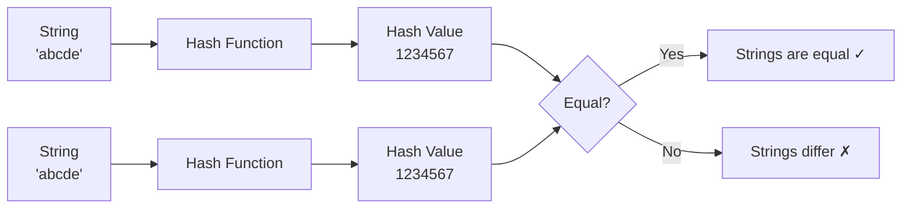

# String Hashing Basics — Fast String Comparisons

> **One-line summary:**
> String hashing converts a string into a number (hash value) so you can compare strings or substrings in O(1) time instead of O(n), after an O(n) preprocessing step.

---

## Table of Contents

1. [What is String Hashing?](#1-what-is-string-hashing)
2. [Why Do We Need String Hashing?](#2-why-do-we-need-string-hashing)
3. [How a Hash Function Works](#3-how-a-hash-function-works)
4. [Polynomial Rolling Hash Formula](#4-polynomial-rolling-hash-formula)
5. [Mapping Characters to Numbers](#5-mapping-characters-to-numbers)
6. [Computing a Simple Hash](#6-computing-a-simple-hash)
7. [Prefix Hashing for Substrings](#7-prefix-hashing-for-substrings)
8. [Comparing Substrings Using Hashing](#8-comparing-substrings-using-hashing)
9. [Hash Collisions and How to Handle Them](#9-hash-collisions-and-how-to-handle-them)
10. [Hashing vs Direct Comparison](#10-hashing-vs-direct-comparison)
11. [Practical Applications](#11-practical-applications)
12. [Key Takeaways](#12-key-takeaways)
13. [FAQs](#13-faqs)

---

## 1. What is String Hashing?

Imagine you have two long books and you want to check if they are identical. Reading every page would take forever. What if you could generate a **short unique code** for each book and just compare those two codes?

That is exactly what string hashing does.

> **String hashing** converts a string into a single number called a **hash value** (or hash code). Instead of comparing characters one by one, you compare hash values — much faster.



---

## 2. Why Do We Need String Hashing?

Comparing two strings of length `n` takes **O(n)** time. If you need to do this thousands of times across many substrings, it becomes very slow.

String hashing reduces each comparison to **O(1)** after an O(n) preprocessing step.

| Scenario                            | Without Hashing | With Hashing                      |
| ----------------------------------- | --------------- | --------------------------------- |
| One comparison                      | O(n)            | O(n) preprocessing + O(1) compare |
| 1000 comparisons on the same string | O(1000n)        | O(n) + O(1000)                    |
| Find duplicate substrings           | O(n³) naive     | O(n) with prefix hash             |

This is especially useful in pattern matching (Rabin-Karp), anagram variants, and substring equality checks.

---

## 3. How a Hash Function Works

A hash function takes a string as input and returns a number. The goal: produce **different numbers for different strings** as reliably as possible.

The most common approach in competitive programming is **polynomial rolling hashing**.

```
Input string  →  Hash Function  →  A single integer
"abc"         →  h(s)           →  1026
"xyz"         →  h(s)           →  (different number)
```

---

## 4. Polynomial Rolling Hash Formula

Each character is treated as a number and combined into a weighted sum using a prime base `p` and a large prime modulus `M`.

$$\text{hash}(s) = s[0] \cdot p^{n-1} + s[1] \cdot p^{n-2} + \ldots + s[n-1] \cdot p^{0} \pmod{M}$$

Or equivalently, building left to right with increasing powers:

$$\text{hash}(s) = \sum_{i=0}^{n-1} \text{val}(s[i]) \cdot p^{i} \pmod{M}$$

**Common choices:**

| Parameter | Value     | Why                                               |
| --------- | --------- | ------------------------------------------------- |
| `p`       | `31`      | Prime that fits 26 lowercase letters well         |
| `M`       | `10⁹ + 9` | Large prime — keeps numbers in safe integer range |

Using a **prime base** means each character maps to a unique weighted contribution. The **modulo** keeps the hash value from overflowing integer limits.

---

## 5. Mapping Characters to Numbers

For lowercase English letters, map `'a' → 1`, `'b' → 2`, ..., `'z' → 26`.

```python
char_value = ord(ch) - ord('a') + 1
# 'a' → 1,  'b' → 2,  'c' → 3, ...,  'z' → 26
```

```cpp
int char_value = ch - 'a' + 1;
```

> **Why not start at 0?** If `'a'` mapped to 0, then `"a"`, `"aa"`, `"aaa"` would all hash to 0, causing collisions. Starting at 1 avoids this.

---

## 6. Computing a Simple Hash

**Step-by-step for `"abc"` with `p = 31`, `M = 10⁹ + 9`:**

$$\text{hash} = 1 \cdot 31^0 + 2 \cdot 31^1 + 3 \cdot 31^2 = 1 + 62 + 961 = 1024$$

| Character | Value | Power     | Contribution |
| --------- | ----- | --------- | ------------ |
| `'a'`     | 1     | 31⁰ = 1   | 1            |
| `'b'`     | 2     | 31¹ = 31  | 62           |
| `'c'`     | 3     | 31² = 961 | 2883         |
| **Total** |       |           | **2946**     |

#### Python

```python
# Python — Simple hash computation
def compute_hash(s):
    p = 31
    M = 10**9 + 9
    h = 0
    p_power = 1   # starts at p^0 = 1

    for ch in s:
        h = (h + (ord(ch) - ord('a') + 1) * p_power) % M
        p_power = (p_power * p) % M

    return h


print(compute_hash("abc"))   # Output: 2946
print(compute_hash("bca"))   # Output: different value
```

#### C++ (simple):

```cpp
#include <iostream>
#include <string>
using namespace std;

// Plain function — compute polynomial rolling hash of a string
long long compute_hash(const string& s) {
    const long long p = 31;      // prime base fitting 26 lowercase letters
    const long long M = 1e9 + 9; // large prime modulus to prevent overflow
    long long h = 0;
    long long p_power = 1;   // starts at p^0 = 1

    for (char ch : s) {
        h = (h + (ch - 'a' + 1) * p_power) % M;  // add weighted char contribution
        p_power = (p_power * p) % M;               // move to next power of p
    }
    return h;
}

int main() {
    cout << compute_hash("abc") << endl;   // Output: 2946
    cout << compute_hash("bca") << endl;   // Different value
}
```

#### C++ (LeetCode class style):

```cpp
#include <string>
using namespace std;

class Solution {
public:
    // Compute a polynomial rolling hash for the given string
    long long computeHash(string s) {
        const long long p = 31;       // prime base for 26 lowercase letters
        const long long M = 1e9 + 9;  // large prime modulus
        long long h = 0;
        long long p_power = 1;  // represents p^i at each step

        for (char ch : s) {
            h = (h + (ch - 'a' + 1) * p_power) % M;  // accumulate hash
            p_power = (p_power * p) % M;               // increment power
        }
        return h;
    }
};
```

> Notice `"abc"` and `"bca"` produce **different hashes** even though they contain the same characters. Position matters in the formula — this distinguishes hashing from frequency counting.

---

## 7. Prefix Hashing for Substrings

The most powerful use of string hashing: compute the hash of **any substring in O(1)** after an O(n) setup.

This is the string equivalent of **prefix sums** — instead of cumulative totals, we build cumulative hashes.

### Building the Prefix Hash Array

```
s = "abcde"

prefix_hash[0] = 0
prefix_hash[1] = hash("a")
prefix_hash[2] = hash("ab")
prefix_hash[3] = hash("abc")
prefix_hash[4] = hash("abcd")
prefix_hash[5] = hash("abcde")
```

#### Python

```python
# Python — Build prefix hash array
def build_prefix_hash(s):
    p = 31
    M = 10**9 + 9
    n = len(s)

    prefix_hash = [0] * (n + 1)   # prefix_hash[0] = 0
    p_power = [1] * (n + 1)       # p_power[i] = p^i % M

    for i in range(1, n + 1):
        prefix_hash[i] = (prefix_hash[i - 1] + (ord(s[i - 1]) - ord('a') + 1) * p_power[i - 1]) % M
        p_power[i] = (p_power[i - 1] * p) % M

    return prefix_hash, p_power


s = "abcde"
prefix_hash, p_power = build_prefix_hash(s)
print(prefix_hash)   # [0, 1, 63, 2946, ...]
```

#### C++ (simple):

```cpp
#include <vector>
#include <string>
using namespace std;

// Plain function — build cumulative hash array so any substring hash is O(1)
pair<vector<long long>, vector<long long>>
build_prefix_hash(const string& s) {
    const long long p = 31;
    const long long M = 1e9 + 9;
    int n = s.length();

    vector<long long> prefix_hash(n + 1, 0);  // prefix_hash[0] = 0
    vector<long long> p_power(n + 1, 1);       // p_power[i] = p^i % M

    for (int i = 1; i <= n; i++) {
        prefix_hash[i] = (prefix_hash[i - 1] + (s[i - 1] - 'a' + 1) * p_power[i - 1]) % M;
        p_power[i] = (p_power[i - 1] * p) % M;  // precompute next power
    }

    return {prefix_hash, p_power};
}
```

#### C++ (LeetCode class style):

```cpp
#include <vector>
#include <string>
using namespace std;

class Solution {
public:
    // Precompute prefix hashes and powers for O(1) substring hash queries
    void buildPrefixHash(const string& s,
                         vector<long long>& prefix_hash,
                         vector<long long>& p_power) {
        const long long p = 31;
        const long long M = 1e9 + 9;
        int n = s.length();

        prefix_hash.assign(n + 1, 0);  // index 0 is sentinel with value 0
        p_power.assign(n + 1, 1);       // p_power[i] = p^i mod M

        for (int i = 1; i <= n; i++) {
            prefix_hash[i] = (prefix_hash[i - 1] + (s[i - 1] - 'a' + 1) * p_power[i - 1]) % M;
            p_power[i] = (p_power[i - 1] * p) % M;  // build power table alongside
        }
    }
};
```

---

## 8. Comparing Substrings Using Hashing

To compare two substrings `s[l1..r1]` and `s[l2..r2]`, extract their hashes and compare. Since each substring starts at a different position, we normalise by multiplying by the appropriate power of `p` before comparing.

**The comparison formula:**

$$\text{hash}(s[l..r]) \cdot p^{l_2} \equiv \text{hash}(s[l_2..r_2]) \cdot p^{l_1} \pmod{M}$$

#### Python

```python
# Python — Compare two substrings in O(1)
def are_substrings_equal(s, l1, r1, l2, r2):
    M = 10**9 + 9
    prefix_hash, p_power = build_prefix_hash(s)

    # Raw hash of each substring (not yet position-normalised)
    hash1 = (prefix_hash[r1 + 1] - prefix_hash[l1] + M) % M
    hash2 = (prefix_hash[r2 + 1] - prefix_hash[l2] + M) % M

    # Normalise by cross-multiplying with the other substring's power offset
    lhs = (hash1 * p_power[l2]) % M
    rhs = (hash2 * p_power[l1]) % M

    return lhs == rhs


s = "abcabc"
print(are_substrings_equal(s, 0, 2, 3, 5))   # Output: True  ("abc" == "abc")
print(are_substrings_equal(s, 0, 1, 2, 3))   # Output: False ("ab"  != "ca")
```

#### C++ (simple):

```cpp
#include <vector>
#include <string>
using namespace std;

// Plain function — compare two substrings of s in O(1) using prefix hashes
bool areSubstringsEqual(const string& s,
                        const vector<long long>& prefix_hash,
                        const vector<long long>& p_power,
                        int l1, int r1, int l2, int r2) {
    const long long M = 1e9 + 9;

    // Extract raw hash for each substring (+ M to avoid negative values from subtraction)
    long long hash1 = (prefix_hash[r1 + 1] - prefix_hash[l1] + M) % M;
    long long hash2 = (prefix_hash[r2 + 1] - prefix_hash[l2] + M) % M;

    // Cross-multiply to account for different starting positions
    long long lhs = (hash1 * p_power[l2]) % M;
    long long rhs = (hash2 * p_power[l1]) % M;

    return lhs == rhs;  // equal hashes — substrings match
}
```

#### C++ (LeetCode class style):

```cpp
#include <vector>
#include <string>
using namespace std;

class Solution {
public:
    // Check if two substrings of s are equal in O(1) using prefix hashes
    bool areSubstringsEqual(string s, int l1, int r1, int l2, int r2) {
        const long long p = 31, M = 1e9 + 9;
        vector<long long> ph, pw;
        buildPrefixHash(s, ph, pw);  // O(n) setup

        // Raw hash for each substring; + M prevents negative after subtraction
        long long hash1 = (ph[r1 + 1] - ph[l1] + M) % M;
        long long hash2 = (ph[r2 + 1] - ph[l2] + M) % M;

        // Normalise positions before comparing
        return (hash1 * pw[l2]) % M == (hash2 * pw[l1]) % M;
    }

private:
    void buildPrefixHash(const string& s,
                         vector<long long>& ph,
                         vector<long long>& pw) {
        const long long p = 31, M = 1e9 + 9;
        int n = s.length();
        ph.assign(n + 1, 0);
        pw.assign(n + 1, 1);
        for (int i = 1; i <= n; i++) {
            ph[i] = (ph[i - 1] + (s[i - 1] - 'a' + 1) * pw[i - 1]) % M;  // accumulate hash
            pw[i] = (pw[i - 1] * p) % M;                                   // next power
        }
    }
};
```

**Why `+ M` before `% M`?** The subtraction `prefix_hash[r+1] - prefix_hash[l]` can go negative due to modular arithmetic. Adding `M` before taking mod ensures the result stays positive.

---

## 9. Hash Collisions and How to Handle Them

A **collision** happens when two different strings produce the same hash value. It is rare but theoretically possible — like two different people having the same fingerprint.

### Double Hashing Technique

Compute **two independent hashes** with different bases and moduli. Two strings are considered equal only if **both** hashes match. This reduces collision probability to practically zero.

#### Python

```python
# Python — Double hashing
def compute_double_hash(s):
    p1, M1 = 31, 10**9 + 9
    p2, M2 = 37, 10**9 + 7

    h1, h2 = 0, 0
    pow1, pow2 = 1, 1

    for ch in s:
        val = ord(ch) - ord('a') + 1
        h1 = (h1 + val * pow1) % M1   # first hash using base p1
        h2 = (h2 + val * pow2) % M2   # second hash using base p2
        pow1 = (pow1 * p1) % M1
        pow2 = (pow2 * p2) % M2

    return (h1, h2)   # return a pair — both must match for equality


print(compute_double_hash("abc"))   # (num1, num2)
print(compute_double_hash("abc"))   # Same pair — strings are equal
print(compute_double_hash("bca"))   # Different pair
```

#### C++ (simple):

```cpp
#include <string>
#include <utility>
using namespace std;

// Plain function — compute two independent hashes to reduce collision risk
pair<long long, long long> compute_double_hash(const string& s) {
    const long long p1 = 31, M1 = 1e9 + 9;  // first hash parameters
    const long long p2 = 37, M2 = 1e9 + 7;  // second hash parameters

    long long h1 = 0, h2 = 0;
    long long pow1 = 1, pow2 = 1;

    for (char ch : s) {
        int val = ch - 'a' + 1;             // map 'a'→1, ..., 'z'→26
        h1 = (h1 + val * pow1) % M1;        // accumulate first hash
        h2 = (h2 + val * pow2) % M2;        // accumulate second hash
        pow1 = (pow1 * p1) % M1;            // advance first power
        pow2 = (pow2 * p2) % M2;            // advance second power
    }

    return {h1, h2};  // both must agree for strings to be equal
}
```

#### C++ (LeetCode class style):

```cpp
#include <string>
#include <utility>
using namespace std;

class Solution {
public:
    // Compute two independent hashes; both must match for string equality
    pair<long long, long long> computeDoubleHash(string s) {
        const long long p1 = 31, M1 = 1e9 + 9;  // first base and modulus
        const long long p2 = 37, M2 = 1e9 + 7;  // second base and modulus

        long long h1 = 0, h2 = 0;
        long long pow1 = 1, pow2 = 1;

        for (char ch : s) {
            int val = ch - 'a' + 1;          // char value starting from 1
            h1 = (h1 + val * pow1) % M1;     // update hash 1
            h2 = (h2 + val * pow2) % M2;     // update hash 2
            pow1 = (pow1 * p1) % M1;         // next power for hash 1
            pow2 = (pow2 * p2) % M2;         // next power for hash 2
        }
        return {h1, h2};  // pair — equality requires both components to match
    }
};
```

> **Rule of thumb:** Use single hashing for learning and most competitive programming. Use double hashing when correctness is critical or the problem has anti-hash tests.

---

## 10. Hashing vs Direct Comparison

| Criteria            | Direct Comparison   | String Hashing                  |
| ------------------- | ------------------- | ------------------------------- |
| Time per comparison | O(n)                | O(1) after preprocessing        |
| Preprocessing time  | None                | O(n)                            |
| Risk of error       | None                | Rare collision possible         |
| Best use case       | One-time comparison | Many comparisons on same string |
| Memory needed       | O(1)                | O(n) for prefix hash array      |

Use **direct comparison** when you only compare strings once. Use **hashing** when you need many substring comparisons on the same string efficiently.

---

## 11. Practical Applications

String hashing shows up in many real-world and competitive programming scenarios:

| Application                      | How Hashing Helps                                                  |
| -------------------------------- | ------------------------------------------------------------------ |
| **Rabin-Karp pattern search**    | Hash the pattern, slide a hash window across text — O(n+m) average |
| **Finding duplicate substrings** | Hash every substring, check for matching hashes                    |
| **Checking string rotations**    | A rotation of `s` is a substring of `s + s` — compare hashes       |
| **Plagiarism detection**         | Compare document segments as hash values                           |
| **Longest common substring**     | Binary search on length + hashing to check existence               |

In all these cases, hashing avoids repeated O(n) comparisons and brings overall complexity down significantly.

---

## 12. Key Takeaways

- **String hashing** maps a string to a number so comparisons become O(1) instead of O(n).
- The **polynomial rolling hash** formula uses a prime base `p` and a large prime modulus `M` to produce distinct hash values.
- Map characters as `'a' → 1, 'b' → 2, ..., 'z' → 26` — never start at 0 to avoid collisions on repeated characters.
- **Prefix hashing** precomputes cumulative hashes in O(n), enabling any substring hash to be retrieved in O(1) — just like prefix sums but for strings.
- **Hash collisions** are rare but possible. Use **double hashing** (two different base/modulus pairs) for near-zero collision probability.
- Common standard choices: `p = 31`, `M = 10⁹ + 9` for single hash; add `p = 37`, `M = 10⁹ + 7` for double hash.

---

## 13. FAQs

**Q: What base and modulus should I use?**  
Use `p = 31` and `M = 10⁹ + 9` as a standard starting point for lowercase letters. For double hashing, add a second pair: `p = 37` and `M = 10⁹ + 7`.

**Q: Is string hashing the same as using a HashMap?**  
Not exactly. A HashMap uses hashing internally to store key-value pairs. String hashing here means computing a numeric fingerprint of a string or substring for fast comparison. They share the same underlying concept but serve different purposes.

**Q: Can string hashing replace all direct string comparisons?**  
For most competitive programming problems, yes. However, since collisions are theoretically possible, in production code you should verify with a direct comparison when correctness is critical. Double hashing reduces collision risk to nearly zero in practice.

**Q: Why do we add `M` before taking modulo when computing substring hashes?**  
The subtraction `prefix_hash[r+1] - prefix_hash[l]` can produce a negative number in modular arithmetic. Adding `M` before `% M` guarantees the result is non-negative: `(a - b + M) % M` is always in `[0, M-1]`.

**Q: How does Rabin-Karp use string hashing?**  
Rabin-Karp computes the hash of the pattern, then slides a hash window of the same length across the text. At each position, it computes the window's hash in O(1) using a rolling update. If the hashes match, it verifies with a direct comparison. This gives O(n + m) average time for pattern searching.
