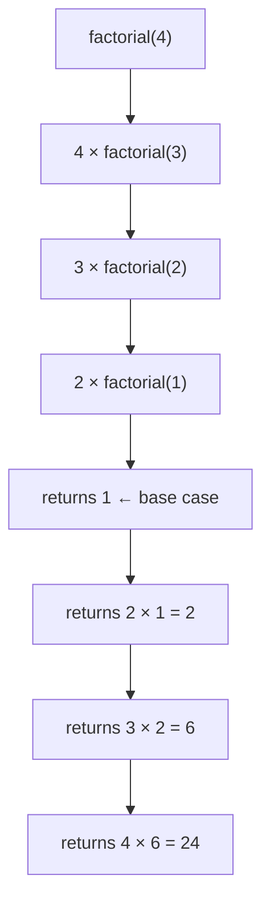

# Recursion Basics — Think in Reverse with Simple Examples

> **One-line summary:**
> Recursion is when a function calls itself to solve a smaller version of the same problem — every recursive solution needs a base case (to stop) and a recursive case (that moves closer to the base case).

---

## Table of Contents

1. [What is Recursion?](#1-what-is-recursion)
2. [A Real-Life Analogy](#2-a-real-life-analogy)
3. [The Two Key Parts of Every Recursive Function](#3-the-two-key-parts-of-every-recursive-function)
4. [Example 1 — Countdown Timer](#4-example-1--countdown-timer)
5. [Example 2 — Factorial of a Number](#5-example-2--factorial-of-a-number)
6. [Understanding the Call Stack](#6-understanding-the-call-stack)
7. [Example 3 — Sum of an Array](#7-example-3--sum-of-an-array)
8. [Recursion vs Iteration](#8-recursion-vs-iteration)
9. [Common Mistakes Beginners Make](#9-common-mistakes-beginners-make)
10. [Tips for Thinking Recursively](#10-tips-for-thinking-recursively)
11. [Key Takeaways](#11-key-takeaways)
12. [FAQs](#12-faqs)

---

## 1. What is Recursion?

Have you ever stood between two mirrors facing each other and seen a never-ending reflection? That feeling of something repeating itself, getting smaller and smaller, is very close to how recursion works in programming.

> **Recursion** is when a function calls itself to solve a smaller version of the same problem. Instead of writing a loop, you break the problem down into a **base case** and a **smaller subproblem**, and let the function handle the rest.



---

## 2. A Real-Life Analogy

> Imagine you are standing in a queue and you want to know what position you are at. You do not know the total count, so you ask the person in front of you their position. That person asks the person in front of them, and so on. The person at the very front says "I am at position 1." Everyone then adds 1 to that answer and passes it back. You finally get your position.

That chain of asking and answering **is** recursion:
- Each person = a function call
- The person at the front = the **base case** (the chain stops and returns an answer)
- Passing the answer back = the **return values unwinding** up the call stack

---

## 3. The Two Key Parts of Every Recursive Function

Every recursive function must have **both** of these. Missing either causes bugs or infinite loops.

### The Base Case

The condition that **stops** the recursion. Think of it as the exit door. When the function reaches this condition, it stops calling itself and starts returning values.

> Without a base case, the function calls itself forever → **stack overflow error**.

### The Recursive Case

Where the function **calls itself with a smaller or simpler input**. Each call must move closer to the base case. If it does not, recursion never ends.

```
Base case   →  the simplest version you can answer directly
Recursive case  →  current problem = small step + solution to a smaller version
```

---

## 4. Example 1 — Countdown Timer

Count down from a given number to zero. Before writing code, think through the pattern:

> To count down from 5: print 5, then count down from 4.  
> To count down from 4: print 4, then count down from 3.  
> ...continue until 0 — that is your base case.

```python
# Python — Recursive countdown
def countdown(n):
    # Base case: stop when n goes below 0
    if n < 0:
        return

    print(n)           # print current number
    countdown(n - 1)   # recursive case: call with n-1


countdown(5)
# Output:
# 5
# 4
# 3
# 2
# 1
# 0
```

```cpp
// C++ — Recursive countdown
#include <iostream>

void countdown(int n) {
    // Base case
    if (n < 0) return;

    std::cout << n << std::endl;   // print current number
    countdown(n - 1);              // recursive case
}

int main() {
    countdown(5);
    // Output: 5 4 3 2 1 0  (each on a new line)
}
```

Each call reduces `n` by 1. When `n` becomes `-1`, the base case triggers and the function stops.

---

## 5. Example 2 — Factorial of a Number

Factorial: `n! = n × (n-1) × (n-2) × ... × 1`

```
5! = 5 × 4 × 3 × 2 × 1 = 120
```

**Recursive definition:**

$$n! = \begin{cases} 1 & \text{if } n \leq 1 \quad \text{(base case)} \\ n \times (n-1)! & \text{if } n > 1 \quad \text{(recursive case)} \end{cases}$$

```python
# Python — Recursive factorial
def factorial(n):
    # Base case: factorial of 0 or 1 is 1
    if n <= 1:
        return 1

    # Recursive case: n × factorial(n-1)
    return n * factorial(n - 1)


print(factorial(5))   # Output: 120
print(factorial(3))   # Output: 6
```

```cpp
// C++ — Recursive factorial
#include <iostream>

int factorial(int n) {
    // Base case
    if (n <= 1) return 1;

    // Recursive case
    return n * factorial(n - 1);
}

int main() {
    std::cout << factorial(5) << std::endl;   // Output: 120
    std::cout << factorial(3) << std::endl;   // Output: 6
}
```

**Execution trace for `factorial(5)`:**

```
factorial(5)
  → 5 × factorial(4)
       → 4 × factorial(3)
            → 3 × factorial(2)
                 → 2 × factorial(1)
                      → returns 1   ← base case
                 → returns 2 × 1 = 2
            → returns 3 × 2 = 6
       → returns 4 × 6 = 24
  → returns 5 × 24 = 120
```

This **unwinding** — where the function returns values back up — is the key to understanding how recursion executes.

---

## 6. Understanding the Call Stack

Every function call is added to the **call stack**. Think of it like a pile of plates — each recursive call adds a new plate on top. When the base case is reached, plates are removed one by one from the top.

**Call stack for `factorial(3)`:**

| Stack (top to bottom) | State |
|---|---|
| `factorial(1)` | Returns 1 — base case, plate removed |
| `factorial(2)` | Waiting for `factorial(1)` → gets 1, returns 2×1=2 |
| `factorial(3)` | Waiting for `factorial(2)` → gets 2, returns 3×2=6 |

```
factorial(3)  → waits for factorial(2)
  factorial(2)  → waits for factorial(1)
    factorial(1)  → returns 1        ← base case
  factorial(2)  → returns 2 × 1 = 2
factorial(3)  → returns 3 × 2 = 6
```

> This is why recursion is called **"thinking in reverse"** — you go deep into the problem first, reach the simplest answer, then build the full answer on the way back up.

**Stack overflow** occurs when there are too many plates (too many recursive calls without hitting the base case). Each function call uses memory — if recursion goes too deep, you run out.

---

## 7. Example 3 — Sum of an Array

Using recursion to sum all elements of an array — a good example of applying recursion to a data structure you already know.

**The pattern:**

> Sum of array = first element + sum of the rest of the array.  
> Base case: empty array → sum is 0.

```python
# Python — Recursive array sum
def sum_array(arr, index):
    # Base case: reached the end of the array
    if index == len(arr):
        return 0

    # Recursive case: current element + sum of the rest
    return arr[index] + sum_array(arr, index + 1)


numbers = [1, 2, 3, 4, 5]
print(sum_array(numbers, 0))   # Output: 15
```

```cpp
// C++ — Recursive array sum
#include <iostream>
#include <vector>

int sum_array(const std::vector<int>& arr, int index) {
    // Base case
    if (index == arr.size()) return 0;

    // Recursive case
    return arr[index] + sum_array(arr, index + 1);
}

int main() {
    std::vector<int> numbers = {1, 2, 3, 4, 5};
    std::cout << sum_array(numbers, 0) << std::endl;   // Output: 15
}
```

**Execution trace for `[1, 2, 3, 4, 5]`:**

```
sum_array([1,2,3,4,5], 0)
  → 1 + sum_array([1,2,3,4,5], 1)
       → 2 + sum_array([1,2,3,4,5], 2)
            → 3 + sum_array([1,2,3,4,5], 3)
                 → 4 + sum_array([1,2,3,4,5], 4)
                      → 5 + sum_array([1,2,3,4,5], 5)
                           → returns 0   ← base case
                      → returns 5 + 0 = 5
                 → returns 4 + 5 = 9
            → returns 3 + 9 = 12
       → returns 2 + 12 = 14
  → returns 1 + 14 = 15
```

---

## 8. Recursion vs Iteration

Both approaches can solve the same problems. Here is when to choose each:

| Feature | Recursion | Iteration (Loops) |
|---|---|---|
| Code readability | Cleaner for trees, backtracking, divide & conquer | Easier to read for simple repetition |
| Memory usage | Uses call stack for each call | Generally uses less memory |
| Performance | Slight overhead from function calls | Usually faster for simple loops |
| Termination | Needs a base case | Loop condition handles it |
| Best for | Trees, graphs, backtracking, subsets, permutations | Counting, array traversal |

> As you progress into backtracking, tree traversal, and merge sort in this series, recursion will feel more natural and produce cleaner code than writing equivalent loops.

---

## 9. Common Mistakes Beginners Make

### 1. Missing or wrong base case

Forgetting the base case means the function calls itself forever. You will see a **"Maximum call stack size exceeded"** or **stack overflow** error. Always write your base case first.

```python
# WRONG — no base case, infinite recursion
def countdown_bad(n):
    print(n)
    countdown_bad(n - 1)   # never stops

# CORRECT
def countdown(n):
    if n < 0: return       # base case first
    print(n)
    countdown(n - 1)
```

### 2. Not reducing the problem

Each recursive call must move the input **closer** to the base case. Calling with the same or larger input means recursion never ends.

```python
# WRONG — n never changes
def bad_factorial(n):
    return n * bad_factorial(n)   # infinite loop

# CORRECT — n-1 moves toward base case
def factorial(n):
    if n <= 1: return 1
    return n * factorial(n - 1)
```

### 3. Forgetting to return the recursive call

If you forget `return` before the recursive call, the function runs but does not pass the result back — giving `None` or wrong results.

```python
# WRONG — missing return
def factorial_bad(n):
    if n <= 1: return 1
    n * factorial_bad(n - 1)   # result is computed but not returned

# CORRECT
def factorial(n):
    if n <= 1: return 1
    return n * factorial(n - 1)   # return is required
```

---

## 10. Tips for Thinking Recursively

1. **Find the base case first** — ask: *what is the smallest version of this problem I can solve directly?*
2. **Find the recursive case** — ask: *if I already had the answer to a smaller version, how would I build the full answer?*
3. **Trace 2–3 small examples by hand** before writing code.
4. **Draw the call stack on paper** — visualising the chain of calls makes the pattern obvious.
5. **Trust the recursion** — do not try to trace the full depth in your head. Verify the base case works, verify the recursive step is correct, then trust the pattern.

---

## 11. Key Takeaways

- **Recursion** is a function calling itself with a smaller input to solve a problem by breaking it down.
- Every recursive function needs a **base case** (stops recursion) and a **recursive case** (moves toward the base case).
- The **call stack** stores each active function call. Reaching the base case unwinds the stack, returning values back up.
- A missing base case causes **stack overflow**. A recursive call that does not reduce the problem also causes infinite recursion.
- Recursion is the foundation for **backtracking, tree traversal, merge sort**, and many other upcoming topics in this series.
- When in doubt: write the base case first, then figure out how one step connects to the solution of the smaller problem.

---

## 12. FAQs

**Q: Can every recursive function be replaced with a loop?**  
Yes, technically any recursive function can be rewritten using iteration with an explicit stack. However, for problems like tree traversal and backtracking, recursion produces much cleaner and easier-to-understand code.

**Q: What causes a stack overflow in recursion?**  
A stack overflow happens when there are too many recursive calls without hitting the base case — filling up call stack memory. It is almost always caused by a missing or incorrect base case.

**Q: When should I use recursion instead of a loop?**  
Use recursion when the problem naturally breaks into smaller versions of the same problem: trees, graphs, subsets, permutations, backtracking, divide and conquer algorithms. For simple counting or linear array traversal, a loop is usually better.

**Q: Does recursion always use more memory than a loop?**  
Yes — each recursive call adds a frame to the call stack. A loop reuses the same frame. For deep recursion on large inputs, this matters. Some languages support **tail call optimisation** (TCO) which eliminates the extra stack frames when the recursive call is the very last operation, but Python does not do this by default.

**Q: What is the difference between direct and indirect recursion?**  
**Direct recursion**: function A calls itself. **Indirect recursion**: function A calls function B, which calls function A. Both follow the same rules — you still need a base case and a reducing step.
