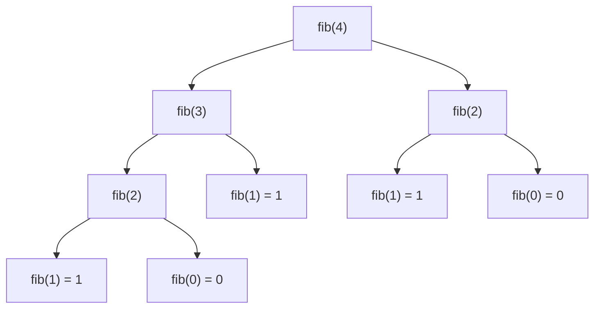

# Recursion Tree Method — Visualize Recursive Calls

> **One-line summary:**
> The recursion tree method maps every recursive call as a node in a tree — draw it to count total calls, find time complexity, and spot repeated work that would be invisible when tracing code line by line.

---

## Table of Contents

1. [What is the Recursion Tree Method?](#1-what-is-the-recursion-tree-method)
2. [Why Use a Recursion Tree?](#2-why-use-a-recursion-tree)
3. [How to Draw a Recursion Tree](#3-how-to-draw-a-recursion-tree)
4. [Example 1 — Recursive Countdown (Linear Tree)](#4-example-1--recursive-countdown-linear-tree)
5. [Example 2 — Fibonacci (Branching Tree)](#5-example-2--fibonacci-branching-tree)
6. [Counting Total Calls and Time Complexity](#6-counting-total-calls-and-time-complexity)
7. [Example 3 — Sum of Digits](#7-example-3--sum-of-digits)
8. [Recursion Tree vs Tracing by Hand](#8-recursion-tree-vs-tracing-by-hand)
9. [Common Mistakes](#9-common-mistakes)
10. [Practice Problems](#10-practice-problems)
11. [Key Takeaways](#11-key-takeaways)
12. [FAQs](#12-faqs)

---

## 1. What is the Recursion Tree Method?

Have you ever tried to trace what happens when a function calls itself multiple times? It can feel like watching a chain reaction with no clear end. That is exactly where the recursion tree method helps.

> The **recursion tree method** is a visual technique to map every recursive call a function makes. Each call is a node, each branch represents a subproblem, and each leaf is a base case.

Think of it like drawing a family tree — but instead of people, you place function calls.



In the previous post we learned how recursion breaks a problem into smaller subproblems. Now we use the tree to see all those subproblems at once.

---

## 2. Why Use a Recursion Tree?

> Imagine peeling an onion layer by layer. Each layer reveals a smaller onion underneath until there is nothing left. A recursion tree shows every layer at once.

A recursion tree helps you:

| Goal                            | How the tree helps                                     |
| ------------------------------- | ------------------------------------------------------ |
| Understand total function calls | Count all nodes                                        |
| Visualise recursion depth       | Count the levels (height of the tree)                  |
| Calculate time complexity       | Sum the work across all levels                         |
| Spot repeated subproblems       | Look for identical nodes — key for Dynamic Programming |
| Debug recursive functions       | See exactly which calls happen and when                |

Most beginners struggle with recursion because they try to trace it in their head. Drawing it out makes everything much clearer.

---

## 3. How to Draw a Recursion Tree

Follow these four steps for any recursive function:

**Step 1 — Identify the root call**  
Write the original function call at the top. This is the root node. Note the input value.

**Step 2 — Expand each call**  
For each node, draw the recursive calls it makes as children below it. Connect them with lines. Keep expanding until you hit the base case.

**Step 3 — Mark the base cases**  
Base cases are leaf nodes — they make no further calls. Mark them clearly (e.g., write the return value).

**Step 4 — Count the work at each level**  
Once the tree is drawn, count nodes per level. If each node does O(1) work, the total work at a level = number of nodes at that level. Sum all levels for total time complexity.

---

## 4. Example 1 — Recursive Countdown (Linear Tree)

```python
# Python — Recursive countdown
def countdown(n):
    if n == 0:
        print(0)
        return
    print(n)
    countdown(n - 1)

countdown(3)
# Output:
# 3
# 2
# 1
# 0
```

**C++ (simple):**

```cpp
// C++ (simple) — Recursive countdown
#include <iostream>

void countdown(int n) {
    if (n == 0) { std::cout << 0 << std::endl; return; }   // base case
    std::cout << n << std::endl;   // print current number
    countdown(n - 1);              // recursive case: move toward base case
}
```

**C++ (LeetCode class style):**

```cpp
// C++ (LeetCode class style) — Recursive countdown
class Solution {
public:
    void countdown(int n) {
        if (n == 0) { std::cout << 0 << std::endl; return; }   // base case
        std::cout << n << std::endl;   // print current number
        countdown(n - 1);              // recursive case: move toward base case
    }
};
```

**Recursion tree for `countdown(3)`:**

```
countdown(3)
    │
countdown(2)
    │
countdown(1)
    │
countdown(0)   ← base case
```

This is a **linear tree** — each call makes exactly one recursive call. The tree has depth `n` with `n + 1` total nodes.

| Property            | Value                   |
| ------------------- | ----------------------- |
| Branching factor    | 1 (one child per node)  |
| Depth               | n                       |
| Total nodes         | n + 1                   |
| **Time complexity** | **O(n)**                |
| Space complexity    | O(n) — call stack depth |

---

## 5. Example 2 — Fibonacci (Branching Tree)

Each Fibonacci call makes **two** recursive calls — this creates a binary tree.

```python
# Python — Recursive Fibonacci
def fib(n):
    if n == 0: return 0   # base case
    if n == 1: return 1   # base case
    return fib(n - 1) + fib(n - 2)

print(fib(4))   # Output: 3
```

**C++ (simple):**

```cpp
// C++ (simple) — Recursive Fibonacci
int fib(int n) {
    if (n == 0) return 0;   // base case
    if (n == 1) return 1;   // base case
    return fib(n - 1) + fib(n - 2);   // recursive case: sum of two smaller subproblems
}
```

**C++ (LeetCode class style):**

```cpp
// C++ (LeetCode class style) — Recursive Fibonacci
class Solution {
public:
    int fib(int n) {
        if (n == 0) return 0;   // base case
        if (n == 1) return 1;   // base case
        return fib(n - 1) + fib(n - 2);   // recursive case: sum of two smaller subproblems
    }
};
```

**Recursion tree for `fib(4)`:**

```
                    fib(4)
                  /        \
            fib(3)           fib(2)
            /    \           /    \
        fib(2)  fib(1)   fib(1)  fib(0)
        /    \
    fib(1)  fib(0)
```

**Key observation — overlapping subproblems:**

| Subproblem | Times computed |
| ---------- | -------------- |
| `fib(2)`   | 2              |
| `fib(1)`   | 3              |
| `fib(0)`   | 2              |

`fib(2)` is computed **twice** — this is wasted work. This pattern is called **overlapping subproblems** and is exactly why Dynamic Programming (memoisation) exists. We will revisit this later in the series.

**Counting nodes per level for `fib(n)`:**

| Level | Nodes | Work |
| ----- | ----- | ---- |
| 0     | 1     | 1    |
| 1     | 2     | 2    |
| 2     | 4     | 4    |
| 3     | 8     | 8    |
| ...   | ...   | ...  |
| n     | 2ⁿ    | 2ⁿ   |

At each level the number of calls roughly doubles. Total nodes ≈ $2^n$.

| Property            | Value                       |
| ------------------- | --------------------------- |
| Branching factor    | 2                           |
| Depth               | n                           |
| Total nodes         | ≈ 2ⁿ                        |
| **Time complexity** | **O(2ⁿ)** — exponential     |
| Space complexity    | O(n) — max call stack depth |

---

## 6. Counting Total Calls and Time Complexity

### Branching Factor Formula

The **branching factor** is how many recursive calls each node makes.

$$\text{Total nodes} \approx \text{branching\_factor}^{\text{depth}}$$

| Function       | Branching factor | Depth | Total nodes | Time       |
| -------------- | ---------------- | ----- | ----------- | ---------- |
| `countdown(n)` | 1                | n     | n           | O(n)       |
| `fib(n)`       | 2                | n     | 2ⁿ          | O(2ⁿ)      |
| Binary search  | 1                | log n | log n       | O(log n)   |
| Merge sort     | 2                | log n | n           | O(n log n) |

### Work Done Per Level

If each node does O(1) work and there are $b^k$ nodes at level $k$, total work at level $k$ is $O(b^k)$. Summing all levels from 0 to depth gives total time complexity.

```
For fib(n):
  Level 0:  1 node  × O(1) = O(1)
  Level 1:  2 nodes × O(1) = O(2)
  Level 2:  4 nodes × O(1) = O(4)
  ...
  Level n:  2^n nodes      = O(2^n)
  ────────────────────────────────
  Total ≈ O(2^n)
```

---

## 7. Example 3 — Sum of Digits

Find the sum of all digits of a number recursively.

```python
# Python — Sum of digits
def sum_of_digits(n):
    if n < 10:
        return n   # base case: single digit

    return (n % 10) + sum_of_digits(n // 10)   # last digit + rest

print(sum_of_digits(123))   # Output: 6  (1 + 2 + 3)
```

**C++ (simple):**

```cpp
// C++ (simple) — Sum of digits
int sum_of_digits(int n) {
    if (n < 10) return n;                              // base case: single digit
    return (n % 10) + sum_of_digits(n / 10);          // last digit + sum of remaining digits
}
```

**C++ (LeetCode class style):**

```cpp
// C++ (LeetCode class style) — Sum of digits
class Solution {
public:
    int sumOfDigits(int n) {
        if (n < 10) return n;                          // base case: single digit
        return (n % 10) + sumOfDigits(n / 10);        // last digit + sum of remaining digits
    }
};
```

**Recursion tree for `sum_of_digits(123)`:**

```
sum_of_digits(123)
        │
    3 + sum_of_digits(12)
                │
            2 + sum_of_digits(1)
                        │
                    return 1   ← base case
```

Another linear tree. Depth = number of digits in `n` = $d$.

| Property            | Value                     |
| ------------------- | ------------------------- |
| Branching factor    | 1                         |
| Depth               | d (number of digits)      |
| **Time complexity** | **O(d)** — extremely fast |

---

## 8. Recursion Tree vs Tracing by Hand

| Feature                        | Tracing by Hand | Recursion Tree     |
| ------------------------------ | --------------- | ------------------ |
| Simple linear recursion        | Fine            | Fine               |
| Branching recursion (2+ calls) | Confusing       | Very clear         |
| Counting total calls           | Error-prone     | Easy — count nodes |
| Finding time complexity        | Hard            | Straightforward    |
| Spotting repeated work         | Difficult       | Visual and obvious |

> Use hand-tracing for simple single-branch recursion. Switch to the recursion tree the moment a function makes two or more recursive calls.

---

## 9. Common Mistakes

**1. Forgetting to draw the base case**  
Without marking leaf nodes, your tree looks infinite. Always identify the base case first before expanding any calls.

**2. Mixing up levels**  
Every call at the same depth belongs to the same level. Placing nodes on the wrong row makes counting impossible. Keep all nodes at depth `k` on the same horizontal row.

**3. Ignoring return values**  
The tree shows calls going downward, but return values travel back **upward**. After hitting the base case, trace the return values up the tree to verify your answer is correct.

```
fib(3) tree with return values:

fib(3) = 2
   ├── fib(2) = 1
   │     ├── fib(1) = 1  ← base case
   │     └── fib(0) = 0  ← base case
   └── fib(1) = 1  ← base case
```

---

## 10. Practice Problems

Draw the recursion tree for each of these on paper, then verify by tracing the code:

1. **`factorial(5)`** — how many nodes? What is the depth?
2. **`fib(5)`** — count the total number of nodes. How many times is `fib(3)` computed?
3. **Maximum digit in a number** — write a recursive function and draw its tree.
4. **Print all elements of an array recursively** — draw the tree for `[1, 2, 3, 4]`.

> **Tip:** Start with paper and pencil. Once you can draw the tree before writing code, your recursion skills will improve dramatically.

---

## 11. Key Takeaways

- The recursion tree maps every function call as a node — each branch is a subproblem, each leaf is a base case.
- **Linear trees** (branching factor = 1) give O(n) time. **Binary trees** (branching factor = 2) give O(2ⁿ) time.
- **Total nodes ≈ branching_factor^depth** — use this formula to estimate time complexity quickly.
- **Overlapping subproblems** (same node appearing multiple times) signal that memoisation or Dynamic Programming can drastically improve the solution.
- Summing the work across all levels of the tree gives you the total time complexity.
- The recursion tree is the foundation for understanding backtracking, merge sort, and Dynamic Programming — all coming up in this series.

---

## 12. FAQs

**Q: When should I use the recursion tree method?**  
Use it whenever you are analysing a recursive function and want to understand its time complexity or visualise how calls unfold. It is essential when the function makes more than one recursive call per invocation.

**Q: Does the recursion tree always give the exact time complexity?**  
For most common functions it gives the exact answer. For some complex cases (e.g., unbalanced trees) you may need additional mathematical analysis like the Master Theorem, but the tree gets you most of the way there.

**Q: What is the difference between a recursion tree and the call stack?**  
The **call stack** is how the computer tracks active function calls in memory at runtime — it only holds the current path from root to the currently executing node. The **recursion tree** is a diagram showing all possible calls at once, used for analysis. The tree helps you think; the call stack is how the machine executes.

**Q: How does the recursion tree connect to Dynamic Programming?**  
When you draw the tree and see the same subproblem appearing multiple times (like `fib(2)` being computed twice), that is a sign that caching the result (memoisation) would eliminate redundant work. This is the core idea behind top-down Dynamic Programming.
