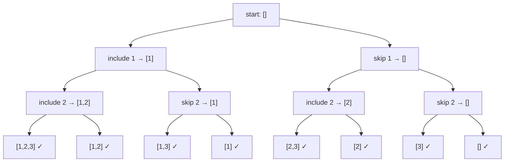

# Backtracking in DSA — Fundamentals for Beginners

> **One-line summary:**
> Backtracking is structured recursion with an undo button — you make a choice, explore it deeply, then reverse it and try the next option, pruning dead-end branches early to avoid wasted work.

---

## Table of Contents

1. [What is Backtracking?](#1-what-is-backtracking)
2. [A Real-Life Analogy](#2-a-real-life-analogy)
3. [How Backtracking Works](#3-how-backtracking-works)
4. [The General Backtracking Template](#4-the-general-backtracking-template)
5. [Example 1 — Generate All Subsets of an Array](#5-example-1--generate-all-subsets-of-an-array)
6. [Dry Run of Subset Generation](#6-dry-run-of-subset-generation)
7. [Example 2 — Combinations That Sum to a Target](#7-example-2--combinations-that-sum-to-a-target)
8. [Pruning — The Secret Power of Backtracking](#8-pruning--the-secret-power-of-backtracking)
9. [Backtracking vs Plain Recursion](#9-backtracking-vs-plain-recursion)
10. [Time Complexity of Backtracking](#10-time-complexity-of-backtracking)
11. [Common Mistakes Beginners Make](#11-common-mistakes-beginners-make)
12. [When Should You Use Backtracking?](#12-when-should-you-use-backtracking)
13. [Key Takeaways](#13-key-takeaways)
14. [FAQs](#14-faqs)

---

## 1. What is Backtracking?

Have you ever tried solving a maze and hit a dead end? You go back to the last junction and try a different path. That is exactly what backtracking does in programming.

> **Backtracking** is a problem-solving technique where you explore all possible paths and undo your steps when a path does not work out. It builds directly on recursion — if recursion is about breaking a big problem into smaller ones, backtracking is about making choices, exploring them, and reversing the wrong ones.

Think of it as a **smart trial-and-error approach**. Unlike brute force, backtracking abandons a path the moment it detects that path cannot possibly lead to a valid answer.

In the previous two posts we learned how recursion works and how to draw recursion trees. Backtracking uses both of those ideas together: the recursive call structure drives the exploration, and the recursion tree is the decision tree you are traversing.

---

## 2. A Real-Life Analogy

> Imagine you are trying to unlock a 4-digit PIN pad and you do not know the code. You start with 0000, then 0001, then 0002, and so on. If a digit is definitely wrong at position 3, you do not reset all the way to 0000. You backtrack to position 3 and try the next digit. That intelligent stepping back is the core idea of backtracking.

Another great analogy is packing a bag for a trip. You try putting items in one by one. If the bag gets too heavy after a certain item, you remove it and try the next one. You keep doing this until you find the best combination that fits.

Both analogies share the same pattern:

- Make a decision
- Check if it still leads somewhere valid
- If not, undo it and try the next option

---

## 3. How Backtracking Works

Backtracking follows three key actions that repeat at every step. You can picture them as a cycle:

**Choose → Explore → Unchoose**

| Step         | What happens                                                                          |
| ------------ | ------------------------------------------------------------------------------------- |
| **Choose**   | Make a decision from the available options at the current step                        |
| **Explore**  | Recursively move forward with that decision                                           |
| **Unchoose** | If the path fails or all options are explored, undo the decision and try the next one |

This process creates a **decision tree**. You traverse it depth-first (exactly like DFS from the Recursion Tree Method post). When you reach a dead end, you climb back up and try another branch.



Every node in the tree is a state. Every edge is a choice. Every backtrack is climbing back up one edge.

---

## 4. The General Backtracking Template

Most backtracking problems follow the same code structure. Once you understand this template, you can apply it to many different problems.

```python
# General Backtracking Template (Python pseudocode)

def backtrack(current_state, choices):
    # Base case: complete valid solution found
    if is_solution(current_state):
        record_solution(current_state)
        return

    for choice in choices:
        if is_valid(choice, current_state):   # prune invalid choices early
            make_choice(choice)               # Step 1: Choose
            backtrack(updated_state, remaining_choices)  # Step 2: Explore
            undo_choice(choice)              # Step 3: Unchoose
```

**C++ (simple):**

```cpp
// C++ (simple) — General Backtracking Template
#include <vector>
using namespace std;

void backtrack(vector<int>& current, int start,
               const vector<int>& nums,
               vector<vector<int>>& result) {
    // Record every valid state (or check a condition before recording)
    result.push_back(current);

    for (int i = start; i < (int)nums.size(); i++) {
        current.push_back(nums[i]);               // Step 1: Choose
        backtrack(current, i + 1, nums, result);  // Step 2: Explore
        current.pop_back();                       // Step 3: Unchoose (backtrack)
    }
}
```

**C++ (LeetCode class style):**

```cpp
// C++ (LeetCode class style) — General Backtracking Template
class Solution {
public:
    vector<vector<int>> solve(vector<int>& nums) {
        vector<vector<int>> result;   // stores all valid solutions
        vector<int> current;          // current path being explored
        backtrack(current, 0, nums, result);
        return result;
    }

private:
    void backtrack(vector<int>& current, int start,
                   vector<int>& nums,
                   vector<vector<int>>& result) {
        // Record every valid state (or check a condition before recording)
        result.push_back(current);

        for (int i = start; i < (int)nums.size(); i++) {
            current.push_back(nums[i]);               // Step 1: Choose
            backtrack(current, i + 1, nums, result);  // Step 2: Explore
            current.pop_back();                       // Step 3: Unchoose (backtrack)
        }
    }
};
```

The key observation: **after every recursive call, you undo the choice you made**. This keeps your state clean so the next option starts from the same point.

---

## 5. Example 1 — Generate All Subsets of an Array

Given an array `[1, 2, 3]`, find all possible subsets:
`[], [1], [2], [3], [1,2], [1,3], [2,3], [1,2,3]`

At each index you make one decision: **include this element** or **skip it**. When you reach the end of the array, you have a complete subset. Every state along the way is also a valid subset, so you record it immediately at the top of the function.

```python
# Python — Generate all subsets using backtracking

def backtrack(nums, start, current, result):
    # Every state is a valid subset — add a copy to result
    result.append(list(current))

    for i in range(start, len(nums)):
        current.append(nums[i])              # Step 1: Choose nums[i]
        backtrack(nums, i + 1, current, result)  # Step 2: Explore further
        current.pop()                        # Step 3: Unchoose (backtrack)


nums = [1, 2, 3]
result = []
backtrack(nums, 0, [], result)
print(result)
# Output: [[], [1], [1, 2], [1, 2, 3], [1, 3], [2], [2, 3], [3]]
```

**C++ (simple):**

```cpp
// C++ (simple) — Generate all subsets using backtracking
#include <vector>
using namespace std;

void backtrack(const vector<int>& nums, int start,
               vector<int>& current,
               vector<vector<int>>& result) {
    result.push_back(current);   // every state is a valid subset — record it

    for (int i = start; i < (int)nums.size(); i++) {
        current.push_back(nums[i]);              // Step 1: Choose nums[i]
        backtrack(nums, i + 1, current, result); // Step 2: Explore with next index
        current.pop_back();                      // Step 3: Unchoose (backtrack)
    }
}

int main() {
    vector<int> nums = {1, 2, 3};
    vector<vector<int>> result;
    vector<int> current;
    backtrack(nums, 0, current, result);
    // Output: [], [1], [1,2], [1,2,3], [1,3], [2], [2,3], [3]
}
```

**C++ (LeetCode class style):**

```cpp
// C++ (LeetCode class style) — Generate all subsets using backtracking
class Solution {
public:
    vector<vector<int>> subsets(vector<int>& nums) {
        vector<vector<int>> result;   // stores all subsets
        vector<int> current;          // current subset being built
        backtrack(nums, 0, current, result);
        return result;
    }

private:
    void backtrack(vector<int>& nums, int start,
                   vector<int>& current,
                   vector<vector<int>>& result) {
        result.push_back(current);   // every state is a valid subset — record it

        for (int i = start; i < (int)nums.size(); i++) {
            current.push_back(nums[i]);              // Step 1: Choose nums[i]
            backtrack(nums, i + 1, current, result); // Step 2: Explore with next index
            current.pop_back();                      // Step 3: Unchoose (backtrack)
        }
    }
};
```

Notice how `current` is modified before each recursive call and then restored with `pop()` afterward. The list always goes back to what it was before you made that choice.

---

## 6. Dry Run of Subset Generation

Let us trace every call for `nums = [1, 2, 3]` step by step.

```
backtrack(start=0, current=[])
  → record []
  → i=0: choose 1 → current=[1]
      backtrack(start=1, current=[1])
        → record [1]
        → i=1: choose 2 → current=[1,2]
            backtrack(start=2, current=[1,2])
              → record [1,2]
              → i=2: choose 3 → current=[1,2,3]
                  backtrack(start=3, current=[1,2,3])
                    → record [1,2,3]
                    → loop ends (start=3 = len)
              → unchoose 3 → current=[1,2]
            end
        → unchoose 2 → current=[1]
        → i=2: choose 3 → current=[1,3]
            backtrack(start=3, current=[1,3])
              → record [1,3]
              → loop ends
        → unchoose 3 → current=[1]
      end
  → unchoose 1 → current=[]
  → i=1: choose 2 → current=[2]
      backtrack(start=2, current=[2])
        → record [2]
        → i=2: choose 3 → current=[2,3]
            backtrack(start=3, current=[2,3])
              → record [2,3]
        → unchoose 3 → current=[2]
      end
  → unchoose 2 → current=[]
  → i=2: choose 3 → current=[3]
      backtrack(start=3, current=[3])
        → record [3]
      end
  → unchoose 3 → current=[]
```

**Result collected in order:** `[], [1], [1,2], [1,2,3], [1,3], [2], [2,3], [3]`

Total calls = 8, one per subset, which matches $2^3 = 8$.

---

## 7. Example 2 — Combinations That Sum to a Target

Given `nums = [2, 3, 6, 7]` and `target = 7`, find all combinations (each number used at most once) that add up to 7.

At each step you ask: can I include this element without exceeding the remaining target? If yes, include it and recurse. If the remaining sum reaches zero, record the combination. If a number exceeds the remaining sum, skip it — this is pruning.

```python
# Python — Find all subsets that sum to a target

def backtrack(nums, start, remaining, current, result):
    if remaining == 0:
        # Found a valid combination
        result.append(list(current))
        return

    for i in range(start, len(nums)):
        if nums[i] <= remaining:          # Prune: skip if too large
            current.append(nums[i])       # Choose
            backtrack(nums, i + 1, remaining - nums[i], current, result)  # Explore
            current.pop()                 # Unchoose


nums = [2, 3, 6, 7]
target = 7
result = []
backtrack(nums, 0, target, [], result)
print(result)
# Output: [[7]]
```

**C++ (simple):**

```cpp
// C++ (simple) — Find all subsets that sum to a target
#include <vector>
using namespace std;

void backtrack(const vector<int>& nums, int start, int remaining,
               vector<int>& current,
               vector<vector<int>>& result) {
    if (remaining == 0) {
        result.push_back(current);   // valid combination found — record it
        return;
    }

    for (int i = start; i < (int)nums.size(); i++) {
        if (nums[i] <= remaining) {              // prune: skip if too large
            current.push_back(nums[i]);          // Step 1: Choose
            backtrack(nums, i + 1, remaining - nums[i], current, result);  // Step 2: Explore
            current.pop_back();                  // Step 3: Unchoose (backtrack)
        }
    }
}

int main() {
    vector<int> nums = {2, 3, 6, 7};
    int target = 7;
    vector<vector<int>> result;
    vector<int> current;
    backtrack(nums, 0, target, current, result);
    // Output: [[7]]
}
```

**C++ (LeetCode class style):**

```cpp
// C++ (LeetCode class style) — Find all subsets that sum to a target
class Solution {
public:
    vector<vector<int>> combinationSum(vector<int>& nums, int target) {
        vector<vector<int>> result;   // stores all valid combinations
        vector<int> current;          // current combination being explored
        backtrack(nums, 0, target, current, result);
        return result;
    }

private:
    void backtrack(vector<int>& nums, int start, int remaining,
                   vector<int>& current,
                   vector<vector<int>>& result) {
        if (remaining == 0) {
            result.push_back(current);   // valid combination found — record it
            return;
        }

        for (int i = start; i < (int)nums.size(); i++) {
            if (nums[i] <= remaining) {            // prune: skip if too large
                current.push_back(nums[i]);        // Step 1: Choose
                backtrack(nums, i + 1, remaining - nums[i], current, result);  // Step 2: Explore
                current.pop_back();                // Step 3: Unchoose (backtrack)
            }
        }
    }
};
```

Only `[7]` is a valid answer here because no other single-use combination from `{2, 3, 6, 7}` sums to exactly 7. The condition `nums[i] <= remaining` is what makes this efficient — it cuts off any branch where the current number alone already exceeds what is left.

---

## 8. Pruning — The Secret Power of Backtracking

> Think of pruning like searching for a word starting with 'A' in a dictionary. Once you pass all the 'A' words, you stop. You do not check 'B', 'C', and beyond. That early stop is pruning.

**Pruning** means cutting off a branch of the decision tree before fully exploring it, when you already know it cannot lead to a valid answer. This is what separates backtracking from raw brute force.

In code, pruning usually appears as an `if` condition inside the loop, **before** the recursive call. The earlier you prune, the more time you save.

```
Without pruning — explore everything:
  Try [2]     → sum=2, continue...
  Try [2,3]   → sum=5, continue...
  Try [2,3,6] → sum=11, EXCEEDED — but already explored deeply

With pruning — stop early:
  Try [2]     → sum=2, remaining=5
  Try [2,3]   → sum=5, remaining=2
  Try [2,3,6] → 6 > remaining=2, SKIP immediately ← pruning saves work
```

**Pruning does not change the correctness of the answer** — it only speeds up the search by skipping paths that are guaranteed to fail.

---

## 9. Backtracking vs Plain Recursion

Students often confuse backtracking with regular recursion. The biggest difference is the **undo step**. In plain recursion you just return from the call. In backtracking you actively reverse the change you made to the shared state before returning.

| Feature          | Plain Recursion                      | Backtracking                                |
| ---------------- | ------------------------------------ | ------------------------------------------- |
| Goal             | Break problem into subproblems       | Explore all choices and undo wrong ones     |
| State management | Usually no undo needed               | Always undo the last choice after exploring |
| Use case         | Factorial, Fibonacci, tree traversal | Subsets, permutations, puzzles, N-Queens    |
| Pruning          | Rarely used                          | Essential for efficiency                    |
| Decision tree    | Linear or branching, no backtrack    | Explicitly climbs back up the tree          |

```
Plain recursion (factorial):         Backtracking (subsets):

factorial(3)                         backtrack([], [1,2,3])
  → factorial(2)                       → add [], try 1
    → factorial(1)                       → backtrack([1], [2,3])
      → return 1                           → add [1], try 2
    → return 2                               → backtrack([1,2], [3])
  → return 6                                   → ...
                                           → undo 2 → [1] again
No undo step needed.                       → try 3 → backtrack([1,3], [])
                                           → undo 3 → [1] again
                                         → undo 1 → [] again
                                         → try 2 ...
                                     Always restores state.
```

---

## 10. Time Complexity of Backtracking

Backtracking is not the fastest approach, but it is smarter than raw brute force because pruning reduces the actual number of paths explored.

| Problem type                  | Worst-case time | Why                                                 |
| ----------------------------- | --------------- | --------------------------------------------------- |
| Subsets of an array of size n | $O(2^n)$        | Each element has 2 choices: include or skip         |
| Permutations of n elements    | $O(n!)$         | $n$ choices at first step, $n-1$ at next, and so on |
| Combination sum               | $O(2^n)$        | Similar to subsets in the worst case                |

As discussed in the Time Complexity post earlier in this series, exponential growth is very slow for large inputs. That is why backtracking problems in competitive programming almost always have small input sizes (n ≤ 20 or so).

**Effect of pruning on actual runtime:**

```
n = 20, subsets problem:
  Brute force:    explores all 2^20 = 1,048,576 combinations
  Backtracking:   may explore far fewer if many branches are pruned early

Worst case is the same: O(2^n)
Typical case with good pruning: much faster in practice
```

---

## 11. Common Mistakes Beginners Make

### 1. Forgetting to undo the choice

This is the most critical mistake. If you do not remove the last element after the recursive call, `current` will have garbage values and every entry in `result` will be wrong.

```python
# WRONG — missing pop (undo)
def backtrack(nums, start, current, result):
    result.append(list(current))
    for i in range(start, len(nums)):
        current.append(nums[i])
        backtrack(nums, i + 1, current, result)
        # forgot current.pop() — state is corrupted for next iteration

# CORRECT
def backtrack(nums, start, current, result):
    result.append(list(current))
    for i in range(start, len(nums)):
        current.append(nums[i])
        backtrack(nums, i + 1, current, result)
        current.pop()   # always restore state
```

### 2. Copying a reference instead of the value

When you add `current` to `result`, you must add a **copy**, not the original list. If you add the reference, every entry in `result` will reflect the final state of `current` (which will be `[]` by the time backtracking finishes).

```python
# WRONG — adds a reference, all entries end up the same
result.append(current)

# CORRECT — adds an independent copy of the current state
result.append(list(current))
```

### 3. No proper base case

Without a clear stopping condition the recursion runs forever. Always define when to stop and record a solution.

### 4. Over-pruning

Cutting off branches too aggressively can cause valid answers to be missed. Make sure your condition is correct before applying it as a prune.

---

## 12. When Should You Use Backtracking?

Not every problem needs backtracking. Here are the signals that it fits:

- The problem says: _find all subsets_, _generate all permutations_, _list all combinations_
- You need to place items under constraints (like the N-Queens problem or Sudoku)
- The problem involves a yes/no decision at each step
- Brute force would work but is too slow without early pruning

In the next posts in this series we will apply backtracking to subsets and permutations, and then to the classic N-Queens problem. Each one uses the exact same template covered here.

---

## 13. Key Takeaways

- Backtracking is **structured recursion with an undo step** — choose, explore, unchoose. That single addition transforms plain recursion into a full search algorithm.
- The decision tree (same as the recursion tree from the previous post) shows every path. Backtracking traverses it depth-first and climbs back up when a branch fails.
- **Always add a copy** of the current state to your result list, never the original reference.
- **Always restore state** after the recursive call using `pop()` or by reversing whatever change you made.
- **Pruning** is the key efficiency gain — cutting invalid branches early makes backtracking much faster than brute force in practice, even though worst-case complexity stays $O(2^n)$ or $O(n!)$.
- Start by practising subset generation. It uses the full template and makes the undo step obvious.

---

## 14. FAQs

**Q: What is the difference between backtracking and brute force?**  
Brute force tries every possible option without any intelligence. Backtracking also tries all options but prunes branches early when it detects they cannot lead to a valid answer. This makes backtracking much more efficient in practice, even though the worst-case complexity can be the same.

**Q: Can backtracking be done without recursion?**  
Yes — you can use an explicit stack to simulate the call stack. However, the recursive approach is much cleaner and easier to understand for beginners. Almost all backtracking problems in interviews and competitive programming use recursion.

**Q: How do I know if a problem needs backtracking?**  
Look for keywords like _find all_, _generate all_, _list every combination_, or _place elements such that_. If the problem requires exploring multiple choices at each step and collecting all valid results, backtracking is likely the right approach.

**Q: How is backtracking related to DFS?**  
They are the same traversal strategy. DFS on a graph means go as deep as possible down one path before trying another. Backtracking applies DFS to the decision tree — go as deep as possible with one sequence of choices, then backtrack and try a different branch.

**Q: Why does the time complexity stay O(2ⁿ) even with pruning?**  
Pruning removes branches only when a condition is violated. In the worst case (for example, when all combinations are valid), no branch is ever pruned and you visit every possible state. The worst case is always the unpruned tree. Pruning helps typical-case performance, not the mathematical worst case.
