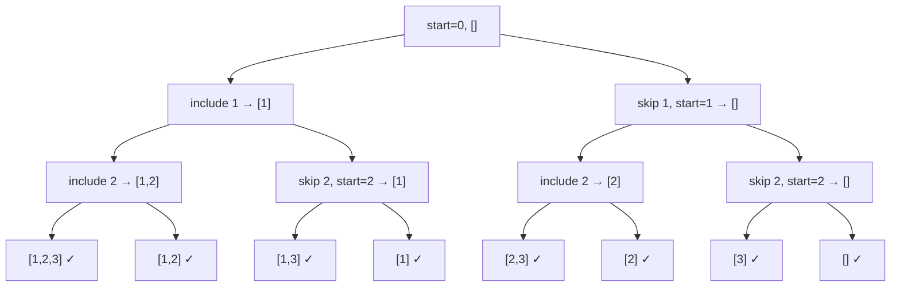
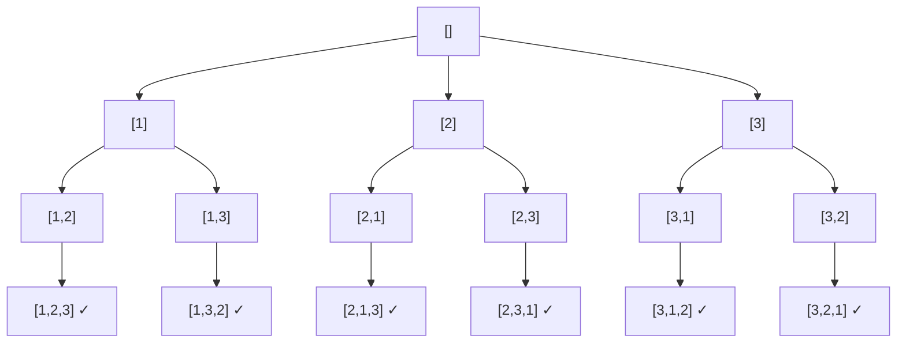

# Backtracking for Subsets and Permutations

> **One-line summary:**
> Subsets and permutations are the two most foundational backtracking patterns — subsets explore every include-or-skip decision using a start index, while permutations arrange all elements in every possible order using a boolean `used` array.

---

## Table of Contents

1. [What Are Subsets and Permutations?](#1-what-are-subsets-and-permutations)
2. [Quick Recap of Backtracking](#2-quick-recap-of-backtracking)
3. [Generating All Subsets](#3-generating-all-subsets)
4. [Subset Code Walkthrough](#4-subset-code-walkthrough)
5. [Dry Run for Subsets](#5-dry-run-for-subsets)
6. [Generating All Permutations](#6-generating-all-permutations)
7. [Permutation Code Walkthrough](#7-permutation-code-walkthrough)
8. [Dry Run for Permutations](#8-dry-run-for-permutations)
9. [Subsets vs Permutations — Key Differences](#9-subsets-vs-permutations--key-differences)
10. [Time and Space Complexity](#10-time-and-space-complexity)
11. [Common Beginner Mistakes](#11-common-beginner-mistakes)
12. [Key Takeaways](#12-key-takeaways)
13. [FAQs](#13-faqs)

---

## 1. What Are Subsets and Permutations?

Imagine you have a bag of three fruits: an apple, a banana, and a mango. How many different groups can you pick from that bag? That is exactly what **subset** problems solve. And if you want to know how many different ways you can arrange those three fruits in a row, that is a **permutation** problem.

These two problems appear constantly in coding interviews and competitive programming. Once you understand how backtracking handles them, a huge family of problems becomes much easier to solve.

| Concept          | Question it answers                              | Example for `[1, 2, 3]`                                |
| ---------------- | ------------------------------------------------ | ------------------------------------------------------ |
| **Subsets**      | Which groups of elements can I pick?             | `[], [1], [2], [3], [1,2], [1,3], [2,3], [1,2,3]`      |
| **Permutations** | In how many different orders can I arrange them? | `[1,2,3], [1,3,2], [2,1,3], [2,3,1], [3,1,2], [3,2,1]` |

In this post we will build on the [Backtracking Fundamentals](03_backtracking_fundamentals.md) post and write clean, well-commented code for both patterns.

---

## 2. Quick Recap of Backtracking

As we covered in the Backtracking Fundamentals post, backtracking works like exploring a maze. You walk down a path, and if it leads nowhere useful, you back up and try a different direction. The three key steps are:

**Choose → Explore → Unchoose**

In code this means:

1. Add an element to your current selection.
2. Call the function recursively.
3. Remove that element before trying the next one.

The undo step is what distinguishes backtracking from plain recursion. The state always returns to exactly what it was before a choice was made.

---

## 3. Generating All Subsets

### Understanding the Subset Problem

Given a list of distinct numbers, generate every possible subset — including the empty set `[]` and the full set itself.

For `[1, 2, 3]` the output has **8** subsets, which equals $2^3 = 8$.

Think of each element as a **yes-or-no decision**: do I include this item or not? For every element we branch into two choices, so the recursion tree has $2^n$ leaf nodes for an array of size $n$.



---

## 4. Subset Code Walkthrough

We use a helper function that takes the current `start` index and the `current` subset being built. At each step we either include the element at that index or skip it. Since **every state of `current` is a valid subset**, we record it immediately at the top of the function.

```python
# Python — Generate all subsets using backtracking

def backtrack(nums, start, current, result):
    # Every state is a valid subset — record a copy
    result.append(list(current))

    for i in range(start, len(nums)):
        current.append(nums[i])                      # Step 1: Choose nums[i]
        backtrack(nums, i + 1, current, result)      # Step 2: Explore
        current.pop()                                # Step 3: Unchoose


nums = [1, 2, 3]
result = []
backtrack(nums, 0, [], result)
print(result)
# Output: [[], [1], [1, 2], [1, 2, 3], [1, 3], [2], [2, 3], [3]]
```

```cpp
// C++ — Generate all subsets using backtracking
#include <iostream>
#include <vector>

void backtrack(const std::vector<int>& nums, int start,
               std::vector<int>& current,
               std::vector<std::vector<int>>& result) {

    result.push_back(current);   // Every state is a valid subset

    for (int i = start; i < (int)nums.size(); i++) {
        current.push_back(nums[i]);              // Step 1: Choose
        backtrack(nums, i + 1, current, result); // Step 2: Explore
        current.pop_back();                      // Step 3: Unchoose
    }
}

int main() {
    std::vector<int> nums = {1, 2, 3};
    std::vector<std::vector<int>> result;
    std::vector<int> current;
    backtrack(nums, 0, current, result);
    // Output: [], [1], [1,2], [1,2,3], [1,3], [2], [2,3], [3]
}
```

The `start` index ensures we never pick the same element twice and always move forward in the array, which prevents duplicate subsets.

---

## 5. Dry Run for Subsets

Let us trace every call for `nums = [1, 2]` step by step.

```
backtrack(start=0, current=[])
  → record []
  → i=0: choose 1 → current=[1]
      backtrack(start=1, current=[1])
        → record [1]
        → i=1: choose 2 → current=[1,2]
            backtrack(start=2, current=[1,2])
              → record [1,2]
              → loop ends (start=2 = length)
            return
        → unchoose 2 → current=[1]
        → loop ends (i exceeded length)
      return
  → unchoose 1 → current=[]
  → i=1: choose 2 → current=[2]
      backtrack(start=2, current=[2])
        → record [2]
        → loop ends
      return
  → unchoose 2 → current=[]
  → loop ends
```

**Final result:** `[], [1], [1,2], [2]` — exactly $2^2 = 4$ subsets for 2 elements.

---

## 6. Generating All Permutations

### Understanding the Permutation Problem

A permutation is a different **arrangement** of the same elements. For `[1, 2, 3]`, one permutation is `[1, 2, 3]` and another is `[3, 1, 2]`. The total count of permutations for $n$ distinct elements is $n!$ (n factorial).

$$3! = 3 \times 2 \times 1 = 6$$

Unlike subsets, **every permutation uses all elements** and **order matters**. Think of it like arranging three friends in a line for a photo — the same three people standing in a different order counts as a different arrangement.



---

## 7. Permutation Code Walkthrough

We use a boolean array called `used` to track which elements are already in our current permutation. At each step we loop through all elements, skip the ones already used, pick one, recurse, and then unmark it.

The base case is when `current` has the same size as `nums` — at that point we have a complete permutation.

```python
# Python — Generate all permutations using backtracking

def backtrack(nums, used, current, result):
    # Base case: all elements placed
    if len(current) == len(nums):
        result.append(list(current))
        return

    for i in range(len(nums)):
        if used[i]:
            continue                       # Skip elements already in current

        used[i] = True
        current.append(nums[i])            # Step 1: Choose

        backtrack(nums, used, current, result)  # Step 2: Explore

        current.pop()                      # Step 3: Unchoose
        used[i] = False


nums = [1, 2, 3]
result = []
backtrack(nums, [False] * len(nums), [], result)
print(result)
# Output: [[1,2,3], [1,3,2], [2,1,3], [2,3,1], [3,1,2], [3,2,1]]
```

```cpp
// C++ — Generate all permutations using backtracking
#include <iostream>
#include <vector>

void backtrack(const std::vector<int>& nums,
               std::vector<bool>& used,
               std::vector<int>& current,
               std::vector<std::vector<int>>& result) {

    if (current.size() == nums.size()) {
        result.push_back(current);
        return;
    }

    for (int i = 0; i < (int)nums.size(); i++) {
        if (used[i]) continue;

        used[i] = true;
        current.push_back(nums[i]);              // Step 1: Choose
        backtrack(nums, used, current, result);  // Step 2: Explore
        current.pop_back();                      // Step 3: Unchoose
        used[i] = false;
    }
}

int main() {
    std::vector<int> nums = {1, 2, 3};
    std::vector<std::vector<int>> result;
    std::vector<int> current;
    std::vector<bool> used(nums.size(), false);
    backtrack(nums, used, current, result);
    // Output: [1,2,3], [1,3,2], [2,1,3], [2,3,1], [3,1,2], [3,2,1]
}
```

The `used` array prevents placing the same number twice in one arrangement. Every time we return from a recursive call, we unmark the element so it can be used again in a different branch.

---

## 8. Dry Run for Permutations

Let us trace the first two complete paths for `nums = [1, 2]`.

```
backtrack(current=[], used=[F, F])
  → i=0: mark 1, current=[1], used=[T, F]
      backtrack(current=[1], used=[T, F])
        → i=0: used[0]=true, skip
        → i=1: mark 2, current=[1,2], used=[T, T]
            backtrack(current=[1,2])
              → size == 2 → record [1,2] ✓
            return
        → unmark 2, current=[1], used=[T, F]
        → loop ends
      return
  → unmark 1, current=[], used=[F, F]
  → i=1: mark 2, current=[2], used=[F, T]
      backtrack(current=[2], used=[F, T])
        → i=0: mark 1, current=[2,1], used=[T, T]
            backtrack(current=[2,1])
              → size == 2 → record [2,1] ✓
            return
        → unmark 1, current=[2], used=[F, T]
        → i=1: used[1]=true, skip
        → loop ends
      return
  → unmark 2, current=[], used=[F, F]
```

**Final result:** `[1,2], [2,1]` — exactly $2! = 2$ permutations.

---

## 9. Subsets vs Permutations — Key Differences

| Feature                  | Subsets              | Permutations              |
| ------------------------ | -------------------- | ------------------------- |
| Order matters?           | No                   | Yes                       |
| Uses all elements?       | No (any size subset) | Yes (always $n$ elements) |
| Total count              | $2^n$                | $n!$                      |
| Key mechanism            | `start` index        | `used[]` boolean array    |
| Record result when?      | Every recursive call | Only at base case         |
| Example output for $n=3$ | 8 subsets            | 6 permutations            |

The biggest practical difference is **how we avoid revisiting elements**:

- **Subsets** — use a `start` index so we only look ahead in the array, never backward.
- **Permutations** — use a `used` array because we look at every index in every call, so we need to explicitly track what is already placed.

---

## 10. Time and Space Complexity

### Subsets

| Metric       | Value            | Explanation                               |
| ------------ | ---------------- | ----------------------------------------- |
| Time         | $O(n \cdot 2^n)$ | $2^n$ subsets, each copied in $O(n)$ time |
| Stack space  | $O(n)$           | Recursion goes $n$ levels deep            |
| Output space | $O(n \cdot 2^n)$ | Storing all subsets                       |

### Permutations

| Metric       | Value           | Explanation                                   |
| ------------ | --------------- | --------------------------------------------- |
| Time         | $O(n \cdot n!)$ | $n!$ permutations, each copied in $O(n)$ time |
| Stack space  | $O(n)$          | Recursion goes $n$ levels deep                |
| Output space | $O(n \cdot n!)$ | Storing all permutations                      |

These are inherently expensive operations because the number of results grows very fast. That is expected since we are asking for every possible combination or arrangement. Backtracking problems in coding interviews typically have small input sizes (like $n \leq 20$ for subsets, $n \leq 8$ for permutations) for exactly this reason.

---

## 11. Common Beginner Mistakes

**1. Forgetting to copy the list before adding it to results**

In Python and C++, you must store a copy — not the live list object — when adding to results.

```python
# Python — Wrong: stores a reference
result.append(current)

# Python — Correct: stores a snapshot copy
result.append(list(current))
```

```cpp
// C++ — Correct: push_back copies the vector by value
result.push_back(current);
```

**2. Not resetting `used[i]` after the recursive call**

If you forget `used[i] = false` in the permutation code, the boolean stays `true` and future branches will incorrectly skip that element.

**3. Using the wrong base condition**

For subsets, every call is valid — record at the top. For permutations, only record when `current.size() == nums.length`. Mixing these up produces incomplete or duplicate results.

**4. Using a `start` index for permutations**

A `start` index prevents looking backward, which is correct for subsets but wrong for permutations. Permutations need every element at every level — that is why we iterate from index `0` every time and rely on the `used` array instead.

---

## 12. Key Takeaways

- Backtracking always follows **choose → explore → unchoose**. The structure does not change; only the details differ between problems.
- **Subsets**: record the result at every recursive call; use a `start` index to avoid duplicates and backward picks.
- **Permutations**: record only when the current list is full; use a `used` boolean array to prevent repeating an element within one arrangement.
- Always **copy** the current list when storing it in results — never store the live reference.
- Both patterns have exponential output, so they are used on small inputs where exploring all possibilities is acceptable.

---

## 13. FAQs

**What is the main difference between subsets and permutations?**

Subsets do not care about order and can include any number of elements from zero up to all of them. Permutations always use every element exactly once and the order matters. For the same array these problems have different output counts and different code logic.

**Why do we copy the list before adding it to results?**

In Java, lists are objects passed by reference. If you add the same list reference to your result, all stored entries will reflect the final state of that list. Creating a new copy with `new ArrayList<>(current)` captures the current state as a snapshot.

**Can backtracking be done without recursion?**

Yes, you can simulate the call stack with an explicit stack data structure. However, the recursive approach is much cleaner and easier to read. Almost all backtracking problems in interviews use recursion.

**What if the input array has duplicate numbers?**

The examples above assume all elements are distinct. If duplicates exist, you need extra logic to skip duplicate branches. A common trick is to sort the array first and then skip an element if it is the same as the previous one at the same recursion level. This variation is explored in the advanced backtracking problems that come later in this series.

**When should I use subsets vs permutations?**

Use the subset pattern when you need every possible selection of elements regardless of order (e.g., all possible teams, all possible feature sets). Use the permutation pattern when you need every possible ordering of elements (e.g., all possible schedules, all possible arrangements).
