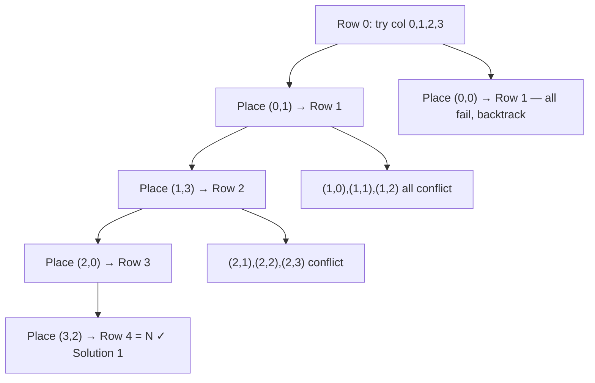

# N-Queens Problem — Backtracking Explained for Beginners

> **One-line summary:**
> The N-Queens problem places N queens on an N×N chessboard so no two queens share a row, column, or diagonal — solved by backtracking one row at a time, checking safety before each placement and undoing it when a branch fails.

---

## Table of Contents

1. [What is the N-Queens Problem?](#1-what-is-the-n-queens-problem)
2. [Understanding the Problem Visually](#2-understanding-the-problem-visually)
3. [The Diagonal Check Trick](#3-the-diagonal-check-trick)
4. [The Backtracking Approach](#4-the-backtracking-approach)
5. [The `is_safe` Function Explained](#5-the-is_safe-function-explained)
6. [Code Implementation](#6-code-implementation)
7. [Output for N = 4](#7-output-for-n--4)
8. [Dry Run of the Algorithm](#8-dry-run-of-the-algorithm)
9. [Complexity Analysis](#9-complexity-analysis)
10. [Backtracking vs Brute Force](#10-backtracking-vs-brute-force)
11. [Optimized Version Using Sets](#11-optimized-version-using-sets)
12. [Key Takeaways](#12-key-takeaways)
13. [FAQs](#13-faqs)

---

## 1. What is the N-Queens Problem?

Have you ever played chess? The queen is the most powerful piece on the board. She can attack any piece in the same row, column, or diagonal. Now imagine placing **N queens** on an **N×N chessboard** so that no two queens attack each other. That is the N-Queens problem.

For example, if N is 4, you need to place 4 queens on a 4×4 board without any two queens threatening each other. It sounds simple at first, but the number of possibilities grows fast as N increases.

> This is a classic backtracking problem. If you have read the [Backtracking Fundamentals](03_backtracking_fundamentals.md) post, you already know the idea: try a path, and if it fails, go back and try another. That is exactly what we do here.

---

## 2. Understanding the Problem Visually

Think of the chessboard as a grid of rows and columns. Each cell is identified by its row number and column number. A queen placed at row 2, column 3 can attack every cell in:

- Row 2 (the entire row)
- Column 3 (the entire column)
- Both diagonals passing through (2, 3)

Our goal is to place exactly **one queen per row** such that no two queens share a column or a diagonal. Since we place exactly one per row, queens can never share a row. So we only need to check **columns** and **diagonals**.

```
4×4 board — one valid solution:

  Col: 0 1 2 3
Row 0: . Q . .   ← queen at (0, 1)
Row 1: . . . Q   ← queen at (1, 3)
Row 2: Q . . .   ← queen at (2, 0)
Row 3: . . Q .   ← queen at (3, 2)
```

No two queens share a column. No two queens share a diagonal. This is a valid solution.

---

## 3. The Diagonal Check Trick

Here is a neat trick: for any two queens placed at positions $(r_1, c_1)$ and $(r_2, c_2)$, they are on the same diagonal if:

$$|r_1 - r_2| = |c_1 - c_2|$$

This single condition handles both the left diagonal and the right diagonal at the same time.

Equivalently:

- **Left (descending) diagonal** — two cells share it when `row - col` is equal for both.
- **Right (ascending) diagonal** — two cells share it when `row + col` is equal for both.

We will use both forms in the optimized version later.

---

## 4. The Backtracking Approach

Backtracking works like exploring a maze: walk down a path, and if you hit a dead end, back up and try a different turn. For N-Queens, the path is placing queens **row by row**.

**Step-by-step plan:**

1. Start from row 0.
2. Try placing a queen in each column of the current row.
3. Check if the placement is safe (no conflict with existing queens).
4. If safe, place the queen and recurse to the next row.
5. If you reach a row beyond the last row, you found a valid solution — record it.
6. If no column works in the current row, backtrack to the previous row and try the next column there.

This is depth-first exploration — go as deep as possible and back up only when stuck. This is exactly the [Recursion Tree Method](02_recursion_tree_method.md) we covered earlier, applied to a constraint satisfaction problem.



---

## 5. The `is_safe` Function Explained

Before placing a queen at `(row, col)`, we call a helper function to check if the placement is safe. Because we place queens top-to-bottom, we only need to look **upward** — there are no queens yet in rows below the current one.

### Three Checks

| Check                    | What we look for                            |
| ------------------------ | ------------------------------------------- |
| **Same column**          | Any previous queen in the same column       |
| **Upper-left diagonal**  | Any queen diagonally above and to the left  |
| **Upper-right diagonal** | Any queen diagonally above and to the right |

**Visual example** — board after placing queens at `(0,1)` and `(1,3)`, now trying `(2,0)`:

```
Row 0: . Q . .   queen at col 1
Row 1: . . . Q   queen at col 3
Row 2: ? . . .   trying col 0

Check col 0    → no queen in col 0 above         ✓
Check upper-left diagonal  → out of bounds        ✓
Check upper-right diagonal → (1,1): no queen      ✓
→ Safe to place!
```

---

## 6. Code Implementation

### Python — Board-based Solution

```python
# N-Queens Problem using Backtracking

def is_safe(board, row, col, n):
    # Check the column above
    for i in range(row):
        if board[i][col] == 1:
            return False

    # Check upper-left diagonal
    i, j = row - 1, col - 1
    while i >= 0 and j >= 0:
        if board[i][j] == 1:
            return False
        i -= 1
        j -= 1

    # Check upper-right diagonal
    i, j = row - 1, col + 1
    while i >= 0 and j < n:
        if board[i][j] == 1:
            return False
        i -= 1
        j += 1

    return True  # No conflicts found


def solve(board, row, n, solutions):
    # Base case: all queens are placed successfully
    if row == n:
        solution = []
        for r in board:
            solution.append("".join("Q" if c == 1 else "." for c in r))
        solutions.append(solution)
        return

    # Try each column in the current row
    for col in range(n):
        if is_safe(board, row, col, n):
            board[row][col] = 1                      # Place the queen
            solve(board, row + 1, n, solutions)      # Recurse to next row
            board[row][col] = 0                      # Backtrack: remove queen


def n_queens(n):
    board = [[0] * n for _ in range(n)]  # Empty N×N board
    solutions = []
    solve(board, 0, n, solutions)
    return solutions


# Run for N = 4
results = n_queens(4)
print(f"Total solutions for 4-Queens: {len(results)}")
for sol in results:
    for row in sol:
        print(row)
    print()
```

---

## 7. Output for N = 4

```
Total solutions for 4-Queens: 2

.Q..
...Q
Q...
..Q.

..Q.
Q...
...Q
.Q..
```

There are exactly **2** valid arrangements for a 4×4 board. Both solutions show one queen per row, per column, and per diagonal.

---

## 8. Dry Run of the Algorithm

Let us trace through what happens when we call `n_queens(4)` step by step.

```
Row 0, col 0: place (0,0)
  Row 1, col 0: same column as (0,0) → skip
  Row 1, col 1: diagonal conflict with (0,0) → skip
  Row 1, col 2: safe → place (1,2)
    Row 2, col 0: diagonal conflict with (1,2) → skip
    Row 2, col 1: diagonal conflict with (1,2) → skip
    Row 2, col 2: same column as (1,2) → skip
    Row 2, col 3: diagonal conflict with (0,0) → skip
    All columns failed → backtrack, remove (1,2)
  Row 1, col 3: safe → place (1,3)
    Row 2, col 0: no column or diagonal conflict → safe → place (2,0)
      Row 3, col 0: same column as (2,0) → skip
      Row 3, col 1: diagonal conflict with (2,0) → skip
      Row 3, col 2: safe → place (3,2)
        Row 4 = N → record solution 1: [.Q..] [...Q] [Q...] [..Q.]
      Remove (3,2). col 3: diagonal conflict → skip
      All columns failed → backtrack, remove (2,0)
    ... (remaining branches explored, all fail)
  Remove (1,3) → backtrack
Remove (0,0) → backtrack

Row 0, col 1: place (0,1)
  ... (finds solution 2: [..Q.] [Q...] [...Q] [.Q..])

Row 0, col 2: mirror of col 1 (found during exploration)
Row 0, col 3: mirror of col 0 (no new solutions)
```

Every time a branch fails, the algorithm backtracks and tries the next option. This is backtracking in action — no valid path is missed, no invalid path wastes extra work.

---

## 9. Complexity Analysis

### Time Complexity

In the worst case we try $N$ choices at each of $N$ rows. The safety check prunes many branches early, so the effective traversal is much smaller than $N^N$. The accepted upper bound is $O(N!)$, though in practice backtracking prunes it significantly.

### Space Complexity

| Resource        | Cost             | Explanation                     |
| --------------- | ---------------- | ------------------------------- |
| Board           | $O(N^2)$         | The N×N grid                    |
| Recursion stack | $O(N)$           | One frame per row, N rows deep  |
| Output storage  | $O(N^2 \cdot S)$ | $S$ = number of valid solutions |

### Solutions by N

| N   | Valid Solutions |
| --- | --------------- |
| 1   | 1               |
| 2   | 0               |
| 3   | 0               |
| 4   | 2               |
| 5   | 10              |
| 6   | 4               |
| 7   | 40              |
| 8   | 92              |

For $N = 2$ and $N = 3$ no solution exists. For $N \geq 4$ at least one solution always exists. The classic chessboard ($N = 8$) has 92 valid arrangements.

---

## 10. Backtracking vs Brute Force

Why use backtracking instead of checking every possible arrangement?

| Aspect        | Brute Force                   | Backtracking                 |
| ------------- | ----------------------------- | ---------------------------- |
| Strategy      | Try all $N^N$ cell placements | Prune invalid branches early |
| Efficiency    | Extremely slow for large N    | Much faster in practice      |
| Space         | $O(N^2)$                      | $O(N^2)$                     |
| Practical use | Never used for N-Queens       | Standard approach            |

Brute force would generate every possible way to assign N queens to $N^2$ cells. That is astronomically large even for $N = 8$. Backtracking skips entire subtrees the moment a conflict is detected — often cutting out millions of branches with a single check.

---

## 11. Optimized Version Using Sets

Instead of scanning columns and diagonals in loops ($O(N)$ per check), we can use **sets** to track which columns and diagonals are already occupied, making each safety check $O(1)$.

```python
# Optimized N-Queens using sets

def n_queens_optimized(n):
    solutions = []
    cols = set()          # Occupied columns
    diag1 = set()         # Occupied (row - col) left diagonals
    diag2 = set()         # Occupied (row + col) right diagonals
    placement = [-1] * n  # placement[row] = column index of queen

    def backtrack(row):
        if row == n:
            solution = []
            for r in range(n):
                line = "." * placement[r] + "Q" + "." * (n - placement[r] - 1)
                solution.append(line)
            solutions.append(solution)
            return

        for col in range(n):
            # O(1) safety check using sets
            if col in cols or (row - col) in diag1 or (row + col) in diag2:
                continue

            # Place the queen
            cols.add(col)
            diag1.add(row - col)
            diag2.add(row + col)
            placement[row] = col

            backtrack(row + 1)  # Recurse to next row

            # Backtrack: remove the queen
            cols.remove(col)
            diag1.remove(row - col)
            diag2.remove(row + col)
            placement[row] = -1

    backtrack(0)
    return solutions


results = n_queens_optimized(5)
print(f"Solutions for N=5: {len(results)}")
# Output: Solutions for N=5: 10
```

**Why this works:**

- Two queens share a **left diagonal** when `row - col` is the same for both.
- Two queens share a **right diagonal** when `row + col` is the same for both.

Storing these values in sets turns three separate loop scans into three constant-time lookups. The overall algorithm still explores the same backtracking tree — it just evaluates each node faster.

---

## 12. Key Takeaways

- The N-Queens problem is solved by placing one queen per row and backtracking whenever a conflict is found.
- We only look **upward** when checking safety because queens in lower rows do not exist yet during placement.
- Three things to check before placing a queen: **same column**, **upper-left diagonal**, **upper-right diagonal**.
- The diagonal trick: use `row - col` for left diagonals and `row + col` for right diagonals. Storing these in sets makes safety checks $O(1)$.
- Worst-case time complexity is $O(N!)$, but backtracking prunes the tree aggressively in practice.
- Mastering N-Queens builds the intuition for all constraint-based backtracking problems, including Sudoku solving and word search puzzles.

---

## 13. FAQs

**Why do we only look upward when checking safety?**

We place queens row by row from top to bottom. Queens in rows below the current row do not exist yet, so there is nothing to check there. Looking upward is sufficient to catch all conflicts.

**Does the N-Queens problem always have a solution?**

For $N = 1$ there is exactly one solution. For $N = 2$ and $N = 3$ there is no solution. For $N \geq 4$ a solution always exists. The number of solutions grows as $N$ increases.

**How is N-Queens different from subset and permutation problems?**

In subset and permutation problems you explore sequences of choices. In N-Queens you make exactly one choice per row and the conflict checks span rows, columns, and diagonals simultaneously. The constraint structure is **geometric** rather than combinatorial, which makes it a unique and more visual backtracking problem.

**What is the most efficient algorithm for N-Queens?**

For finding all solutions, backtracking with $O(1)$ set-based safety checks (as shown in the optimized version) is standard. For very large $N$ there are mathematical constructions that directly produce one valid arrangement in $O(N)$ time, but they do not enumerate all solutions.
