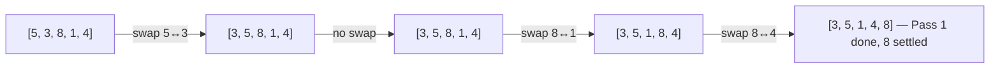

# Bubble, Selection, and Insertion Sort Explained

> **One-line summary:**
> Bubble, Selection, and Insertion Sort are three foundational $O(n^2)$ algorithms — Bubble repeatedly swaps neighbors, Selection picks the minimum each pass, and Insertion builds a sorted left section by shifting elements into place.

---

## Table of Contents

1. [What is Sorting and Why Does It Matter?](#1-what-is-sorting-and-why-does-it-matter)
2. [Bubble Sort](#2-bubble-sort)
3. [Bubble Sort Dry Run](#3-bubble-sort-dry-run)
4. [Bubble Sort Code](#4-bubble-sort-code)
5. [Bubble Sort Complexity](#5-bubble-sort-complexity)
6. [Selection Sort](#6-selection-sort)
7. [Selection Sort Dry Run](#7-selection-sort-dry-run)
8. [Selection Sort Code](#8-selection-sort-code)
9. [Selection Sort Complexity](#9-selection-sort-complexity)
10. [Insertion Sort](#10-insertion-sort)
11. [Insertion Sort Dry Run](#11-insertion-sort-dry-run)
12. [Insertion Sort Code](#12-insertion-sort-code)
13. [Insertion Sort Complexity](#13-insertion-sort-complexity)
14. [Comparing All Three Algorithms](#14-comparing-all-three-algorithms)
15. [Key Takeaways](#15-key-takeaways)
16. [FAQs](#16-faqs)

---

## 1. What is Sorting and Why Does It Matter?

Imagine you have a pile of books on your desk, all jumbled up. You want to arrange them alphabetically so you can find any book quickly. That process of arranging things in a specific order is exactly what sorting does in programming.

Sorting is one of the most fundamental operations in computer science. Before diving into advanced algorithms like Merge Sort or Quick Sort, it is important to understand these three beginner-friendly techniques that form the conceptual foundation.

In this post we will walk through **Bubble Sort**, **Selection Sort**, and **Insertion Sort** — each with a step-by-step dry run, clean code, and complexity analysis.

---

## 2. Bubble Sort

### How It Works

Think of bubbles rising in a glass of water — the heaviest sink and the lightest rise. Bubble Sort works the same way. It repeatedly compares two **adjacent** elements and swaps them if they are in the wrong order.

After each full pass through the array, the largest unsorted element "bubbles up" to its correct position at the end. We repeat this until the entire array is sorted.



---

## 3. Bubble Sort Dry Run

Input: `[5, 3, 8, 1, 4]`

```
Initial: [5, 3, 8, 1, 4]

Pass 1:
  Compare 5 and 3  → swap   → [3, 5, 8, 1, 4]
  Compare 5 and 8  → no swap → [3, 5, 8, 1, 4]
  Compare 8 and 1  → swap   → [3, 5, 1, 8, 4]
  Compare 8 and 4  → swap   → [3, 5, 1, 4, 8]   ← 8 settled

Pass 2:
  Compare 3 and 5  → no swap → [3, 5, 1, 4, 8]
  Compare 5 and 1  → swap   → [3, 1, 5, 4, 8]
  Compare 5 and 4  → swap   → [3, 1, 4, 5, 8]   ← 5 settled

Pass 3:
  Compare 3 and 1  → swap   → [1, 3, 4, 5, 8]
  Compare 3 and 4  → no swap → [1, 3, 4, 5, 8]   ← 4 settled

Pass 4:
  Compare 1 and 3  → no swap → [1, 3, 4, 5, 8]   ← done

Final: [1, 3, 4, 5, 8]
```

After each pass, one more element locks into its correct position at the end. Later passes do fewer comparisons because the tail is already sorted.

---

## 4. Bubble Sort Code

```python
# Python — Bubble Sort with early-exit optimisation

def bubble_sort(arr):
    n = len(arr)
    for i in range(n):
        swapped = False                    # Track if any swap happened this pass
        for j in range(0, n - i - 1):
            if arr[j] > arr[j + 1]:
                arr[j], arr[j + 1] = arr[j + 1], arr[j]   # Swap
                swapped = True
        if not swapped:                    # Array already sorted — exit early
            break
    return arr

arr = [5, 3, 8, 1, 4]
print(bubble_sort(arr))
# Output: [1, 3, 4, 5, 8]
```

**C++ (simple):**

```cpp
// C++ (simple) — Bubble Sort with early-exit optimisation
#include <vector>
#include <algorithm>

void bubbleSort(std::vector<int>& arr) {
    int n = arr.size();
    for (int i = 0; i < n; i++) {
        bool swapped = false;                    // Track if any swap happened this pass
        for (int j = 0; j < n - i - 1; j++) {
            if (arr[j] > arr[j + 1]) {
                std::swap(arr[j], arr[j + 1]);   // Swap adjacent out-of-order elements
                swapped = true;
            }
        }
        if (!swapped) break;                     // Already sorted — exit early
    }
}
```

**C++ (LeetCode class style):**

```cpp
// C++ (LeetCode class style) — Bubble Sort
#include <vector>

class Solution {
public:
    vector<int> sortArray(vector<int>& arr) {
        int n = arr.size();
        for (int i = 0; i < n; i++) {
            bool swapped = false;                    // Track if any swap happened this pass
            for (int j = 0; j < n - i - 1; j++) {
                if (arr[j] > arr[j + 1]) {
                    swap(arr[j], arr[j + 1]);        // Swap adjacent out-of-order elements
                    swapped = true;
                }
            }
            if (!swapped) break;                     // Already sorted — exit early
        }
        return arr;
    }
};
```

The `swapped` flag is the key optimisation. If an entire pass completes without a single swap, the array is already sorted and we exit early — bringing the best-case down to $O(n)$.

---

## 5. Bubble Sort Complexity

| Case                   | Time Complexity | Space Complexity |
| ---------------------- | --------------- | ---------------- |
| Best (already sorted)  | $O(n)$          | $O(1)$           |
| Average                | $O(n^2)$        | $O(1)$           |
| Worst (reverse sorted) | $O(n^2)$        | $O(1)$           |

- **Stable:** Yes — equal elements are never swapped, so their relative order is preserved.
- **Adaptive:** Yes (with the `swapped` flag) — performs better on nearly sorted input.
- **In-place:** Yes — no extra array needed.

---

## 6. Selection Sort

### How It Works

Imagine picking players for a sports team by always scanning the entire remaining group and choosing the shortest person first, then the next shortest, and so on. That is exactly how Selection Sort thinks.

Selection Sort divides the array into two parts: a **sorted left side** and an **unsorted right side**. In each pass it finds the minimum element from the unsorted part and swaps it to the front of the unsorted section.

It makes **at most one swap per pass**, which makes it predictable and easy to trace — but it always scans the full unsorted region regardless of the input.

---

## 7. Selection Sort Dry Run

Input: `[5, 3, 8, 1, 4]`

```
Initial: [5, 3, 8, 1, 4]

Pass 1: scan [5,3,8,1,4] → min = 1 at index 3
  Swap index 0 ↔ index 3 → [1, 3, 8, 5, 4]   ← 1 settled

Pass 2: scan [3,8,5,4] → min = 3 at index 1
  Already in place, no swap → [1, 3, 8, 5, 4]  ← 3 settled

Pass 3: scan [8,5,4] → min = 4 at index 4
  Swap index 2 ↔ index 4 → [1, 3, 4, 5, 8]   ← 4 settled

Pass 4: scan [5,8] → min = 5 at index 3
  Already in place, no swap → [1, 3, 4, 5, 8]  ← 5 settled

Final: [1, 3, 4, 5, 8]
```

Each pass locks in one more element on the left side. Unlike Bubble Sort, Selection Sort makes at most one swap per pass — never multiple swaps.

---

## 8. Selection Sort Code

```python
# Python — Selection Sort

def selection_sort(arr):
    n = len(arr)
    for i in range(n):
        min_index = i                           # Assume current index is minimum
        for j in range(i + 1, n):
            if arr[j] < arr[min_index]:
                min_index = j                   # Update minimum index
        arr[i], arr[min_index] = arr[min_index], arr[i]   # Swap minimum into place
    return arr

arr = [5, 3, 8, 1, 4]
print(selection_sort(arr))
# Output: [1, 3, 4, 5, 8]
```

**C++ (simple):**

```cpp
// C++ (simple) — Selection Sort
#include <vector>
#include <algorithm>

void selectionSort(std::vector<int>& arr) {
    int n = arr.size();
    for (int i = 0; i < n; i++) {
        int minIndex = i;                                  // Assume current index is minimum
        for (int j = i + 1; j < n; j++)
            if (arr[j] < arr[minIndex]) minIndex = j;     // Update minimum index
        std::swap(arr[i], arr[minIndex]);                  // Swap minimum into position
    }
}
```

**C++ (LeetCode class style):**

```cpp
// C++ (LeetCode class style) — Selection Sort
#include <vector>

class Solution {
public:
    vector<int> sortArray(vector<int>& arr) {
        int n = arr.size();
        for (int i = 0; i < n; i++) {
            int minIndex = i;                              // Assume current index is minimum
            for (int j = i + 1; j < n; j++)
                if (arr[j] < arr[minIndex]) minIndex = j; // Update minimum index
            swap(arr[i], arr[minIndex]);                   // Swap minimum into position
        }
        return arr;
    }
};
```

Selection Sort always runs exactly $O(n^2)$ comparisons regardless of the input. It never exits early. This makes it less adaptive than Bubble Sort or Insertion Sort, but it does the **fewest swaps** of the three.

---

## 9. Selection Sort Complexity

| Case    | Time Complexity | Space Complexity |
| ------- | --------------- | ---------------- |
| Best    | $O(n^2)$        | $O(1)$           |
| Average | $O(n^2)$        | $O(1)$           |
| Worst   | $O(n^2)$        | $O(1)$           |

- **Stable:** No — swapping the minimum to the front can change the relative order of equal elements.
- **Adaptive:** No — always scans the full unsorted portion regardless of input order.
- **In-place:** Yes.

Selection Sort is useful when the **cost of swapping is high** (e.g., writing to flash memory), because it minimises the total number of writes.

---

## 10. Insertion Sort

### How It Works

Think about how you sort playing cards in your hand. You pick up one card at a time and insert it into the correct position among the cards you already hold. That is exactly how Insertion Sort works.

Insertion Sort builds a **sorted portion** from left to right. For each new element (the "key"), it shifts all larger elements in the sorted portion one position to the right, then drops the key into the gap.

It is very efficient for nearly sorted arrays because very few shifts are needed.

---

## 11. Insertion Sort Dry Run

Input: `[5, 3, 8, 1, 4]`

```
Initial: [5, 3, 8, 1, 4]

Step 1: key = 3 (index 1)
  3 < 5 → shift 5 right → [5, 5, 8, 1, 4]
  Insert 3 at index 0  → [3, 5, 8, 1, 4]

Step 2: key = 8 (index 2)
  8 > 5 → no shift needed → [3, 5, 8, 1, 4]

Step 3: key = 1 (index 3)
  1 < 8 → shift 8  → [3, 5, 8, 8, 4]
  1 < 5 → shift 5  → [3, 5, 5, 8, 4]
  1 < 3 → shift 3  → [3, 3, 5, 8, 4]
  Insert 1 at index 0 → [1, 3, 5, 8, 4]

Step 4: key = 4 (index 4)
  4 < 8 → shift 8  → [1, 3, 5, 8, 8]
  4 < 5 → shift 5  → [1, 3, 5, 5, 8]
  4 > 3 → stop
  Insert 4 at index 2 → [1, 3, 4, 5, 8]

Final: [1, 3, 4, 5, 8]
```

Insertion Sort **shifts** elements rather than swapping them. This makes it efficient in terms of write operations when the array is partially sorted.

---

## 12. Insertion Sort Code

```python
# Python — Insertion Sort

def insertion_sort(arr):
    n = len(arr)
    for i in range(1, n):
        key = arr[i]       # Element to be inserted into the sorted portion
        j = i - 1
        while j >= 0 and arr[j] > key:
            arr[j + 1] = arr[j]    # Shift element one position right
            j -= 1
        arr[j + 1] = key           # Insert key at correct position
    return arr

arr = [5, 3, 8, 1, 4]
print(insertion_sort(arr))
# Output: [1, 3, 4, 5, 8]
```

**C++ (simple):**

```cpp
// C++ (simple) — Insertion Sort
#include <vector>

void insertionSort(std::vector<int>& arr) {
    int n = arr.size();
    for (int i = 1; i < n; i++) {
        int key = arr[i];              // Element to be inserted into the sorted portion
        int j = i - 1;
        while (j >= 0 && arr[j] > key) {
            arr[j + 1] = arr[j];       // Shift element one position right
            j--;
        }
        arr[j + 1] = key;             // Insert key at correct position
    }
}
```

**C++ (LeetCode class style):**

```cpp
// C++ (LeetCode class style) — Insertion Sort
#include <vector>

class Solution {
public:
    vector<int> sortArray(vector<int>& arr) {
        int n = arr.size();
        for (int i = 1; i < n; i++) {
            int key = arr[i];              // Element to be inserted into the sorted portion
            int j = i - 1;
            while (j >= 0 && arr[j] > key) {
                arr[j + 1] = arr[j];       // Shift element one position right
                j--;
            }
            arr[j + 1] = key;             // Insert key at correct position
        }
        return arr;
    }
};
```

The outer loop picks each element as the `key`. The inner `while` loop shifts all elements greater than `key` one step to the right, making room for the key to slot into the correct position.

---

## 13. Insertion Sort Complexity

| Case                   | Time Complexity | Space Complexity |
| ---------------------- | --------------- | ---------------- |
| Best (already sorted)  | $O(n)$          | $O(1)$           |
| Average                | $O(n^2)$        | $O(1)$           |
| Worst (reverse sorted) | $O(n^2)$        | $O(1)$           |

- **Stable:** Yes — equal elements are never moved past each other.
- **Adaptive:** Yes — on nearly sorted input very few shifts occur, running close to $O(n)$.
- **In-place:** Yes.

> Many standard library sort implementations (like `std::sort` in C++) switch to Insertion Sort automatically for small sub-arrays because of its low overhead and cache-friendliness.

---

## 14. Comparing All Three Algorithms

| Feature        | Bubble Sort        | Selection Sort      | Insertion Sort        |
| -------------- | ------------------ | ------------------- | --------------------- |
| Best time      | $O(n)$             | $O(n^2)$            | $O(n)$                |
| Average time   | $O(n^2)$           | $O(n^2)$            | $O(n^2)$              |
| Worst time     | $O(n^2)$           | $O(n^2)$            | $O(n^2)$              |
| Space          | $O(1)$             | $O(1)$              | $O(1)$                |
| Stable         | Yes                | No                  | Yes                   |
| Adaptive       | Yes (with flag)    | No                  | Yes                   |
| Swaps per pass | Multiple           | At most 1           | Multiple shifts       |
| Best use case  | Nearly sorted data | Minimise swap count | Nearly sorted / small |

**Stable** means two elements with equal values maintain their original relative order after sorting.

**Adaptive** means the algorithm performs better (fewer operations) when the input is partially sorted.

---

## 15. Key Takeaways

- All three algorithms have $O(n^2)$ average and worst-case time complexity — they are not suited for large datasets.
- **Bubble Sort** — simplest to understand; use with the `swapped` flag when the array is almost sorted.
- **Selection Sort** — minimises the number of actual swaps; useful when write operations are expensive.
- **Insertion Sort** — most practical of the three for small or nearly sorted arrays; used internally by many standard libraries.
- These algorithms build the intuition needed to understand more powerful techniques like Merge Sort and Quick Sort, which we cover next in this series.

---

## 16. FAQs

**Which of the three is the fastest in practice?**

For nearly sorted data, both Bubble Sort (with the `swapped` flag) and Insertion Sort reach their $O(n)$ best case, making them faster than Selection Sort in that scenario. For random data, all three perform similarly at $O(n^2)$.

**Is Selection Sort stable?**

No. When the minimum element is swapped to the front of the unsorted region, it can leapfrog over equal elements and break their original relative order. Bubble Sort and Insertion Sort are both stable.

**When should I use Insertion Sort in real projects?**

Insertion Sort is a good choice for arrays with fewer than roughly 20 elements or for data that is already nearly sorted. Many standard library sort functions switch to Insertion Sort for small sub-arrays internally because of its low constant factor and cache-friendly access pattern.

**Why does Selection Sort always take $O(n^2)$ even on sorted input?**

Because it has no mechanism to detect that the array is already sorted. It always scans the full remaining unsorted region to find the minimum, making exactly $\frac{n(n-1)}{2}$ comparisons regardless of the input order.
