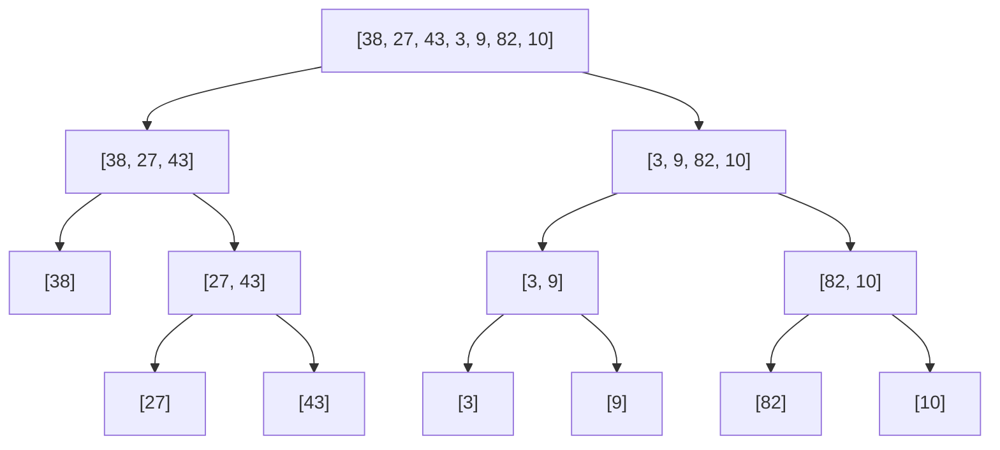

# Merge Sort Explained — Step-by-Step Dry Run

> **One-line summary:**
> Merge Sort uses Divide and Conquer — it recursively splits the array down to single elements, then merges those pieces back in sorted order, guaranteeing $O(n \log n)$ time in every case.

---

## Table of Contents

1. [What is Merge Sort?](#1-what-is-merge-sort)
2. [The Divide and Conquer Idea](#2-the-divide-and-conquer-idea)
3. [How Merge Sort Works — Three Stages](#3-how-merge-sort-works--three-stages)
4. [Dry Run — Divide Phase](#4-dry-run--divide-phase)
5. [Dry Run — Merge Phase](#5-dry-run--merge-phase)
6. [Code Implementation](#6-code-implementation)
7. [Time Complexity](#7-time-complexity)
8. [Space Complexity](#8-space-complexity)
9. [Merge Sort vs Bubble Sort](#9-merge-sort-vs-bubble-sort)
10. [Why Merge Sort is Stable](#10-why-merge-sort-is-stable)
11. [Common Mistakes Beginners Make](#11-common-mistakes-beginners-make)
12. [Real-World Uses](#12-real-world-uses)
13. [Key Takeaways](#13-key-takeaways)
14. [FAQs](#14-faqs)

---

## 1. What is Merge Sort?

Imagine you have two piles of already-sorted playing cards and you want to combine them into one sorted pile. You pick the smaller card from the top of either pile, one at a time, until both piles are empty. That simple idea is exactly how Merge Sort works.

Merge Sort is a classic sorting algorithm that follows the **Divide and Conquer** strategy. It breaks the array into smaller pieces, sorts each piece, and then merges them back together in the correct order.

> Merge Sort is used in real-world systems — Python's built-in `sort()` (Timsort) is derived from it, and it is the preferred algorithm for external sorting and sorting linked lists.

---

## 2. The Divide and Conquer Idea

Divide and Conquer means solving a problem by splitting it into smaller subproblems, solving each one independently, and combining the results. Merge Sort applies this in three stages:

| Stage       | What happens                                        |
| ----------- | --------------------------------------------------- |
| **Divide**  | Split the array into two halves                     |
| **Conquer** | Recursively sort each half                          |
| **Merge**   | Combine the two sorted halves into one sorted array |

The recursion bottoms out when a piece has only one element. A single element is always sorted by definition, so no work is needed there.



---

## 3. How Merge Sort Works — Three Stages

**Stage 1 — Keep Dividing**

Take the array and split it at the midpoint. Keep splitting each half until every piece has exactly one element.

**Stage 2 — Merge Sorted Halves**

Start combining pieces two at a time. When merging two sorted arrays, compare the front elements of each and pick the smaller one. Repeat until all elements are placed.

**Stage 3 — Build Back Up**

As each merge completes, you get a larger sorted piece. Continue merging upward until the entire array is reassembled in sorted order.

---

## 4. Dry Run — Divide Phase

Input: `[38, 27, 43, 3, 9, 82, 10]`

```
Level 0:  [38, 27, 43, 3, 9, 82, 10]

Level 1:  [38, 27, 43]        [3, 9, 82, 10]

Level 2:  [38]  [27, 43]      [3, 9]  [82, 10]

Level 3:  [38]  [27]  [43]    [3]  [9]  [82]  [10]
          ↑ single elements — all trivially sorted
```

The divide phase does no sorting. It just splits. The real work happens during the merge.

---

## 5. Dry Run — Merge Phase

Working bottom-up from Level 3:

```
Merge [27] and [43]:
  27 < 43 → pick 27, then 43
  → [27, 43]

Merge [38] and [27, 43]:
  38 vs 27 → pick 27
  38 vs 43 → pick 38
  remaining → pick 43
  → [27, 38, 43]

Merge [3] and [9]:
  → [3, 9]

Merge [82] and [10]:
  82 vs 10 → pick 10, then 82
  → [10, 82]

Merge [3, 9] and [10, 82]:
  3 vs 10 → pick 3
  9 vs 10 → pick 9
  remaining → pick 10, 82
  → [3, 9, 10, 82]

Final merge [27, 38, 43] and [3, 9, 10, 82]:
  27 vs 3  → pick 3
  27 vs 9  → pick 9
  27 vs 10 → pick 10
  27 vs 82 → pick 27
  38 vs 82 → pick 38
  43 vs 82 → pick 43
  remaining → pick 82
  → [3, 9, 10, 27, 38, 43, 82]  ✓
```

Each merge step is straightforward because both halves are already sorted going in.

---

## 6. Code Implementation

### Python

```python
# Python — Merge Sort

def merge_sort(arr):
    # Base case: a single element is already sorted
    if len(arr) <= 1:
        return arr

    mid = len(arr) // 2
    left  = merge_sort(arr[:mid])   # Recursively sort left half
    right = merge_sort(arr[mid:])   # Recursively sort right half

    return merge(left, right)


def merge(left, right):
    result = []
    i = 0   # Pointer for left array
    j = 0   # Pointer for right array

    # Pick the smaller front element from either half
    while i < len(left) and j < len(right):
        if left[i] <= right[j]:
            result.append(left[i])
            i += 1
        else:
            result.append(right[j])
            j += 1

    # Append whatever remains (already sorted)
    result.extend(left[i:])
    result.extend(right[j:])
    return result


arr = [38, 27, 43, 3, 9, 82, 10]
print(merge_sort(arr))
# Output: [3, 9, 10, 27, 38, 43, 82]
```

### C++

```cpp
// C++ — Merge Sort
#include <iostream>
#include <vector>

std::vector<int> merge(const std::vector<int>& left,
                       const std::vector<int>& right) {
    std::vector<int> result;
    int i = 0, j = 0;

    while (i < (int)left.size() && j < (int)right.size()) {
        if (left[i] <= right[j]) result.push_back(left[i++]);
        else                     result.push_back(right[j++]);
    }

    while (i < (int)left.size())  result.push_back(left[i++]);
    while (j < (int)right.size()) result.push_back(right[j++]);
    return result;
}

std::vector<int> mergeSort(std::vector<int> arr) {
    if (arr.size() <= 1) return arr;

    int mid = arr.size() / 2;
    auto left  = mergeSort(std::vector<int>(arr.begin(), arr.begin() + mid));
    auto right = mergeSort(std::vector<int>(arr.begin() + mid, arr.end()));

    return merge(left, right);
}

int main() {
    std::vector<int> arr = {38, 27, 43, 3, 9, 82, 10};
    auto sorted = mergeSort(arr);
    // Output: 3 9 10 27 38 43 82
}
```

---

## 7. Time Complexity

At each level of the recursion tree, we do $O(n)$ total work during the merge step. The number of levels is $\log_2 n$ because we keep dividing by 2. Multiplying:

$$T(n) = O(n \log n)$$

| Case    | Time Complexity | Reason                                              |
| ------- | --------------- | --------------------------------------------------- |
| Best    | $O(n \log n)$   | Always splits and merges the same way               |
| Average | $O(n \log n)$   | Consistent behavior regardless of input             |
| Worst   | $O(n \log n)$   | Input order does not change the recursive structure |

This **consistency** is one of Merge Sort's biggest strengths. It performs identically whether the input is sorted, reversed, or random.

---

## 8. Space Complexity

Merge Sort uses extra memory to hold the left and right temporary arrays during each merge step.

| Resource        | Cost        | Explanation                               |
| --------------- | ----------- | ----------------------------------------- |
| Auxiliary array | $O(n)$      | Temporary space for merging               |
| Recursion stack | $O(\log n)$ | One frame per level of the recursion tree |
| **Total**       | $O(n)$      | Dominated by the auxiliary array          |

Unlike Bubble Sort which sorts in place with $O(1)$ space, Merge Sort trades memory for guaranteed speed.

---

## 9. Merge Sort vs Bubble Sort

| Feature                | Bubble Sort           | Merge Sort            |
| ---------------------- | --------------------- | --------------------- |
| Worst-case time        | $O(n^2)$              | $O(n \log n)$         |
| Best-case time         | $O(n)$                | $O(n \log n)$         |
| Space                  | $O(1)$ — in-place     | $O(n)$ — extra memory |
| Stable                 | Yes                   | Yes                   |
| Consistent performance | No                    | Yes                   |
| Best for               | Small / nearly sorted | Large datasets        |

For small arrays, simple sorts like Bubble or Insertion Sort are fine. When data grows large, Merge Sort's $O(n \log n)$ time makes a dramatic difference.

---

## 10. Why Merge Sort is Stable

A sorting algorithm is **stable** if two elements with equal values keep their original relative order after sorting.

Merge Sort is stable because during the merge step, when `left[i] == right[j]`, we always pick from the **left** array first (`left[i] <= right[j]`). This preserves the original ordering of equal elements.

> **Why this matters:** Sorting a list of students by score where two students have the same score — a stable sort keeps them in their original order. This is important in database queries, spreadsheet sorts, and any multi-key sort.

---

## 11. Common Mistakes Beginners Make

**1. Forgetting the base case**

Without `if len(arr) <= 1: return arr`, the function recurses infinitely.

**2. Losing leftover elements after the while loop**

After the main comparison loop ends, one of the halves may still have elements. Always extend with the remaining slice:

```python
result.extend(left[i:])
result.extend(right[j:])
```

**3. Thinking the array sorts itself during splitting**

Splitting does absolutely nothing to the order. All sorting happens during the merge step.

**4. Confusing the two functions**

`merge_sort` handles splitting and recursion. `merge` handles combining two already-sorted arrays. Keep them separate for clarity.

---

## 12. Real-World Uses

| Use case                       | Why Merge Sort fits                                             |
| ------------------------------ | --------------------------------------------------------------- |
| Python's `sort()` / `sorted()` | Timsort is a hybrid based on Merge Sort                         |
| External sorting               | Data too large for RAM is sorted in chunks and merged from disk |
| Sorting linked lists           | No random access needed — Merge Sort traverses sequentially     |
| Counting inversions            | A classic variation counts out-of-order pairs in $O(n \log n)$  |
| Stable multi-key sorting       | Stability preserves prior sort order when adding a new sort key |

---

## 13. Key Takeaways

- Merge Sort follows **Divide and Conquer**: split → sort recursively → merge.
- It guarantees $O(n \log n)$ in all cases — best, average, and worst.
- It is **stable**: equal elements preserve their original relative order.
- It costs $O(n)$ extra space, which is the trade-off for its speed and consistency.
- The patterns used here — recursion, dividing problems, and combining results — reappear in trees, graphs, and dynamic programming throughout this series.

---

## 14. FAQs

**When should I use Merge Sort over other sorting algorithms?**

Use Merge Sort when you need guaranteed $O(n \log n)$ performance and stability. It is especially useful for large datasets or when sorting linked lists, where Quick Sort's random-access pivot selection is a disadvantage.

**Is Merge Sort an in-place algorithm?**

No. Standard Merge Sort uses $O(n)$ extra space for the temporary arrays during the merge step. In-place variants exist but are significantly more complex and rarely used in practice.

**What is the main difference between Merge Sort and Quick Sort?**

Merge Sort always runs in $O(n \log n)$ and is stable. Quick Sort is often faster in practice due to better cache behaviour, but has a worst case of $O(n^2)$ if the pivot is chosen poorly. Quick Sort is covered in the next post.

**Why does the merge step use `<=` instead of `<` when comparing elements?**

Using `<=` (pick from the left when equal) is what makes Merge Sort stable. If you used `<` instead and picked from the right on ties, equal elements from the left half would shift behind equal elements from the right half, breaking stability.
