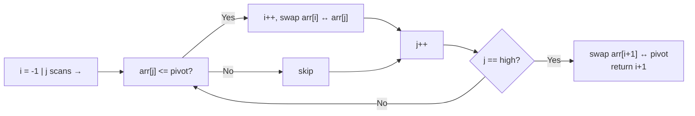

# Quick Sort Explained — Partition Logic Step by Step

> **One-line summary:**
> Quick Sort picks a pivot, partitions the array so everything smaller is left of the pivot and everything larger is right, then recursively sorts each side — averaging $O(n \log n)$ time with $O(\log n)$ in-place space.

---

## Table of Contents

1. [What is Quick Sort?](#1-what-is-quick-sort)
2. [Core Concepts Before We Begin](#2-core-concepts-before-we-begin)
3. [Understanding the Pivot](#3-understanding-the-pivot)
4. [Partition Logic — The Heart of Quick Sort](#4-partition-logic--the-heart-of-quick-sort)
5. [Partition Dry Run](#5-partition-dry-run)
6. [Full Algorithm Code](#6-full-algorithm-code)
7. [Step-by-Step Dry Run of Quick Sort](#7-step-by-step-dry-run-of-quick-sort)
8. [Time Complexity](#8-time-complexity)
9. [Space Complexity](#9-space-complexity)
10. [Quick Sort vs Merge Sort](#10-quick-sort-vs-merge-sort)
11. [Choosing a Better Pivot](#11-choosing-a-better-pivot)
12. [Randomized Quick Sort](#12-randomized-quick-sort)
13. [When to Use Quick Sort](#13-when-to-use-quick-sort)
14. [Key Takeaways](#14-key-takeaways)
15. [FAQs](#15-faqs)

---

## 1. What is Quick Sort?

Imagine you are sorting a pile of books by page count. You pick one book as a reference and split the rest into two groups: books with fewer pages and books with more pages. Then you repeat the same process for each group. That is exactly how Quick Sort works.

Quick Sort is a **divide-and-conquer** sorting algorithm. It picks a **pivot** element, rearranges the array so that all elements smaller than the pivot come before it and all elements larger come after it, then recursively sorts each side.

---

## 2. Core Concepts Before We Begin

Quick Sort builds on two ideas covered earlier in this series:

- **Arrays** — we sort in-place, so understanding index manipulation is key.
- **Recursion** — each call to `quick_sort` reduces the problem size until we reach a sub-array of size 0 or 1.

Also recall from [Merge Sort](02_merge_sort.md) that divide-and-conquer breaks the problem into smaller parts, solves each part, and combines the results. Quick Sort follows the same philosophy but divides by **partitioning** rather than splitting at the midpoint.

---

## 3. Understanding the Pivot

The pivot is the element that drives every step of Quick Sort.

### What is a Pivot?

A pivot is any element chosen from the array. After partitioning, the pivot lands in its **correct final position** in the sorted array. Elements to its left are smaller or equal; elements to its right are larger.

> Think of the pivot like a checkpoint in a race. Runners slower than the checkpoint go left, faster runners go right, and the checkpoint itself stays fixed in place.

### Common Pivot Choices

| Strategy        | Description                      | Notes                               |
| --------------- | -------------------------------- | ----------------------------------- |
| Last element    | `arr[high]`                      | Simple; worst-case on sorted input  |
| First element   | `arr[low]`                       | Same weakness as last element       |
| Middle element  | `arr[(low + high) // 2]`         | Better for nearly sorted data       |
| Median of three | Median of first, middle, last    | Practical default in libraries      |
| Random element  | `arr[random.randint(low, high)]` | Makes worst case statistically rare |

For simplicity throughout this post, we pick the **last element** as the pivot — the most common choice in textbooks and interviews.

---

## 4. Partition Logic — The Heart of Quick Sort

The partition step is where all the real work happens. Understand this and you understand Quick Sort.

### How Partition Works

We maintain two pointers:

- **`i`** — tracks the boundary of the "smaller than pivot" region (starts at `low - 1`).
- **`j`** — scans through the array from `low` to `high - 1`.

Whenever `arr[j] <= pivot`:

1. Increment `i`.
2. Swap `arr[i]` with `arr[j]` to move the element into the smaller region.

After the loop, place the pivot in its correct position by swapping it with `arr[i + 1]`.



---

## 5. Partition Dry Run

Input: `[8, 3, 1, 5, 2]`, pivot = `2` (last element), `i = -1`

```
j=0: arr[0]=8, 8 > 2  → skip           [8, 3, 1, 5, 2]
j=1: arr[1]=3, 3 > 2  → skip           [8, 3, 1, 5, 2]
j=2: arr[2]=1, 1 <= 2 → i=0, swap arr[0] ↔ arr[2]
                                        [1, 3, 8, 5, 2]
j=3: arr[3]=5, 5 > 2  → skip           [1, 3, 8, 5, 2]

End of loop: swap arr[i+1]=arr[1] ↔ arr[4] (pivot)
                                        [1, 2, 8, 5, 3]
                                             ↑
                            pivot (2) is now at index 1 — its correct sorted position!
```

After partition, everything before index 1 is `<= 2` and everything after is `> 2`. We now recursively sort `[1]` and `[8, 5, 3]` separately.

---

## 6. Full Algorithm Code

### Python

```python
# Python — Quick Sort (last-element pivot)

def partition(arr, low, high):
    pivot = arr[high]    # Choose last element as pivot
    i = low - 1          # i tracks the smaller-element boundary

    for j in range(low, high):
        if arr[j] <= pivot:          # Current element belongs left of pivot
            i += 1
            arr[i], arr[j] = arr[j], arr[i]

    arr[i + 1], arr[high] = arr[high], arr[i + 1]  # Place pivot correctly
    return i + 1                                    # Return pivot's final index


def quick_sort(arr, low, high):
    if low < high:
        pi = partition(arr, low, high)   # pi = pivot's final index
        quick_sort(arr, low, pi - 1)     # Sort left of pivot
        quick_sort(arr, pi + 1, high)    # Sort right of pivot


arr = [10, 7, 8, 9, 1, 5]
quick_sort(arr, 0, len(arr) - 1)
print(arr)
# Output: [1, 5, 7, 8, 9, 10]
```

### Java

```java
// Java — Quick Sort (last-element pivot)
public class QuickSort {

    static int partition(int[] arr, int low, int high) {
        int pivot = arr[high];
        int i = low - 1;

        for (int j = low; j < high; j++) {
            if (arr[j] <= pivot) {
                i++;
                int temp = arr[i]; arr[i] = arr[j]; arr[j] = temp;
            }
        }

        int temp = arr[i + 1]; arr[i + 1] = arr[high]; arr[high] = temp;
        return i + 1;
    }

    static void quickSort(int[] arr, int low, int high) {
        if (low < high) {
            int pi = partition(arr, low, high);
            quickSort(arr, low, pi - 1);
            quickSort(arr, pi + 1, high);
        }
    }

    public static void main(String[] args) {
        int[] arr = {10, 7, 8, 9, 1, 5};
        quickSort(arr, 0, arr.length - 1);
        // Output: [1, 5, 7, 8, 9, 10]
    }
}
```

### C++

```cpp
// C++ — Quick Sort (last-element pivot)
#include <vector>
#include <algorithm>

int partition(std::vector<int>& arr, int low, int high) {
    int pivot = arr[high];
    int i = low - 1;

    for (int j = low; j < high; j++) {
        if (arr[j] <= pivot) {
            i++;
            std::swap(arr[i], arr[j]);
        }
    }

    std::swap(arr[i + 1], arr[high]);
    return i + 1;
}

void quickSort(std::vector<int>& arr, int low, int high) {
    if (low < high) {
        int pi = partition(arr, low, high);
        quickSort(arr, low, pi - 1);
        quickSort(arr, pi + 1, high);
    }
}
```

---

## 7. Step-by-Step Dry Run of Quick Sort

Input: `[3, 6, 8, 10, 1, 2, 1]`

**Level 1 — full array**

```
pivot = 1 (last element)
After partition: [1, 1, 8, 10, 3, 2, 6]   pivot index = 1
  Left:  [1]           ← size 1, already sorted
  Right: [8, 10, 3, 2, 6]
```

**Level 2 — right subarray `[8, 10, 3, 2, 6]`**

```
pivot = 6
After partition: [3, 2, 6, 10, 8]   pivot index = 2
  Left:  [3, 2]
  Right: [10, 8]
```

**Level 3 — smaller pieces**

```
[3, 2]  pivot = 2 → after partition: [2, 3]
[10, 8] pivot = 8 → after partition: [8, 10]
```

**Final reassembly:**

```
[1] + [1] + [2, 3] + [6] + [8, 10]
= [1, 1, 2, 3, 6, 8, 10]  ✓
```

Each recursive call shrinks the problem. Once sub-arrays reach size 0 or 1 they are trivially sorted, and the full sorted array assembles itself through the call stack.

---

## 8. Time Complexity

| Case    | Time Complexity | When it happens                                 |
| ------- | --------------- | ----------------------------------------------- |
| Best    | $O(n \log n)$   | Pivot always splits array into two equal halves |
| Average | $O(n \log n)$   | Random or reasonably balanced pivot choices     |
| Worst   | $O(n^2)$        | Pivot is always the smallest or largest element |

The **worst case** occurs when the array is already sorted and we always pick the first or last element. Every partition removes only one element, making the recursion tree as tall as the array itself.

$$\underbrace{n + (n-1) + (n-2) + \cdots + 1}_{n \text{ levels}} = O(n^2)$$

Using a randomized or median-of-three pivot strategy makes the worst case statistically negligible.

---

## 9. Space Complexity

Quick Sort sorts **in-place** — no extra array is needed. However, each recursive call occupies a stack frame.

| Case    | Stack depth | Space       |
| ------- | ----------- | ----------- |
| Average | $O(\log n)$ | $O(\log n)$ |
| Worst   | $O(n)$      | $O(n)$      |

Compare this to Merge Sort's $O(n)$ auxiliary array. Quick Sort wins on memory for the average case, but loses in the worst case unless tail-call optimisation or iterative implementation is applied.

---

## 10. Quick Sort vs Merge Sort

| Feature           | Quick Sort                  | Merge Sort                |
| ----------------- | --------------------------- | ------------------------- |
| Strategy          | Partition in-place          | Split then merge          |
| Average time      | $O(n \log n)$               | $O(n \log n)$             |
| Worst time        | $O(n^2)$                    | $O(n \log n)$             |
| Space             | $O(\log n)$ — in-place      | $O(n)$ — extra array      |
| Stable            | No (by default)             | Yes                       |
| Cache performance | Better (sequential access)  | Slightly worse            |
| Best for          | General-purpose, large data | Stable sort, linked lists |

Quick Sort is often faster in practice due to better **cache locality** — it accesses memory sequentially and avoids allocating extra arrays. That is why many standard libraries use Quick Sort variants internally.

---

## 11. Choosing a Better Pivot

### Median of Three

Look at the first, middle, and last elements and pick the **median** as pivot. This usually avoids the pathological worst case on sorted or reverse-sorted input.

```python
# Python — Median-of-three pivot selection

def median_of_three(arr, low, high):
    mid = (low + high) // 2

    # Sort the three candidate positions in place
    if arr[low] > arr[mid]:
        arr[low], arr[mid] = arr[mid], arr[low]
    if arr[low] > arr[high]:
        arr[low], arr[high] = arr[high], arr[low]
    if arr[mid] > arr[high]:
        arr[mid], arr[high] = arr[high], arr[mid]

    # arr[mid] is now the median — swap to arr[high] so partition logic is unchanged
    arr[mid], arr[high] = arr[high], arr[mid]
    return arr[high]
```

After calling this helper, use `arr[high]` as the pivot in the standard `partition` function — no other changes needed.

---

## 12. Randomized Quick Sort

Pick the pivot randomly. Swap it with the last element, then run the standard partition. This makes the worst case extremely unlikely in practice.

```python
# Python — Randomized Quick Sort

import random

def randomized_partition(arr, low, high):
    rand_index = random.randint(low, high)
    arr[rand_index], arr[high] = arr[high], arr[rand_index]  # Swap to last position
    return partition(arr, low, high)                          # Use standard partition


def randomized_quick_sort(arr, low, high):
    if low < high:
        pi = randomized_partition(arr, low, high)
        randomized_quick_sort(arr, low, pi - 1)
        randomized_quick_sort(arr, pi + 1, high)
```

The expected time complexity of randomized Quick Sort is $O(n \log n)$ regardless of the input order.

---

## 13. When to Use Quick Sort

| Situation                                    | Recommendation                                 |
| -------------------------------------------- | ---------------------------------------------- |
| General-purpose sorting, large dataset       | Quick Sort (randomized pivot)                  |
| Memory is limited                            | Quick Sort (in-place, $O(\log n)$ stack space) |
| Stability required (preserve equal elements) | Merge Sort                                     |
| Nearly sorted input, naive pivot             | Avoid — use randomized pivot or Insertion Sort |
| Sorting a linked list                        | Merge Sort (no random access needed)           |

---

## 14. Key Takeaways

- Quick Sort picks a **pivot**, **partitions** around it, and **recurses** on both sides.
- The partition step is the core: pointer `i` tracks the smaller-element boundary while `j` scans forward.
- Average time is $O(n \log n)$; worst case is $O(n^2)$ with a bad pivot strategy.
- It is **in-place** ($O(\log n)$ stack space on average) but **not stable**.
- Use a **randomized** or **median-of-three** pivot to make the worst case statistically negligible.
- Quick Sort beats Merge Sort on memory and cache performance in most practical scenarios.

---

## 15. FAQs

**Why is Quick Sort usually faster than other $O(n \log n)$ algorithms?**

Quick Sort works in-place, avoiding extra memory allocation. It also accesses memory in a sequential, cache-friendly pattern. These practical advantages make it faster in real benchmarks even though its Big-O matches Merge Sort.

**Is Quick Sort stable?**

No. The standard implementation is not stable — the partition step can change the relative order of equal elements. If stability matters, use Merge Sort instead.

**How can we avoid the worst case?**

The worst case happens when the pivot is always the minimum or maximum element. A **randomized pivot** or the **median-of-three** strategy both make this statistically negligible. Most production implementations use one of these approaches.

**What is dual-pivot Quick Sort?**

Java's `Arrays.sort()` for primitives uses a dual-pivot variant that picks two pivots and creates three partitions. This reduces the number of comparisons in practice and is faster than single-pivot Quick Sort on typical inputs.
