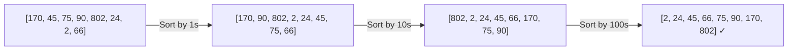

# Counting Sort and Radix Sort — Basics with Examples

> **One-line summary:**
> Counting Sort and Radix Sort are non-comparison sorts that bypass the $O(n \log n)$ lower bound — Counting Sort counts occurrences across a bounded range in $O(n + k)$, while Radix Sort extends that idea to large numbers by sorting one digit at a time in $O(d \cdot (n + k))$.

---

## Table of Contents

1. [What is Non-Comparison Sorting?](#1-what-is-non-comparison-sorting)
2. [Counting Sort Explained](#2-counting-sort-explained)
3. [Counting Sort — Step by Step](#3-counting-sort--step-by-step)
4. [Counting Sort Code](#4-counting-sort-code)
5. [Counting Sort Complexity](#5-counting-sort-complexity)
6. [Radix Sort Explained](#6-radix-sort-explained)
7. [Radix Sort — Step by Step](#7-radix-sort--step-by-step)
8. [Radix Sort Code](#8-radix-sort-code)
9. [Radix Sort Complexity](#9-radix-sort-complexity)
10. [Counting Sort vs Radix Sort](#10-counting-sort-vs-radix-sort)
11. [When to Use Each](#11-when-to-use-each)
12. [Common Mistakes Beginners Make](#12-common-mistakes-beginners-make)
13. [Key Takeaways](#13-key-takeaways)
14. [FAQs](#14-faqs)

---

## 1. What is Non-Comparison Sorting?

Think about sorting a stack of papers where each paper has a number from 1 to 10. Instead of comparing papers with each other, you could create 10 slots and drop each paper into its matching slot. That is essentially what non-comparison sorting does.

Algorithms like Bubble Sort, Merge Sort, and Quick Sort work by **comparing elements against each other**. The theoretical lower bound for any comparison-based sort is $O(n \log n)$.

Counting Sort and Radix Sort **skip comparisons entirely**. They use the actual values of elements to decide placement, which lets them run in linear time under the right conditions.

| Type             | Examples                  | Lower bound   |
| ---------------- | ------------------------- | ------------- |
| Comparison-based | Bubble, Merge, Quick Sort | $O(n \log n)$ |
| Non-comparison   | Counting Sort, Radix Sort | $O(n + k)$    |

---

## 2. Counting Sort Explained

Counting Sort works by **counting how many times each value appears** in the input, then using those counts to place every element at its correct position in the output.

Imagine you have a bag of colored balls numbered 1 to 5. You count how many balls of each color exist, then line them up in order. No comparisons needed.

**Requirements:**

- Elements must be **non-negative integers**.
- The range of values $k$ must be **reasonably small** relative to $n$.

---

## 3. Counting Sort — Step by Step

Input: `[4, 2, 2, 8, 3, 3, 1]` — max value = 8, so count array has indices 0–8.

**Step 1 — Count each element**

```
Index:  0  1  2  3  4  5  6  7  8
Count: [0, 1, 2, 2, 1, 0, 0, 0, 1]
```

**Step 2 — Accumulate counts (prefix sums)**

Each entry now holds how many elements are ≤ that index.

```
Index:       0  1  2  3  4  5  6  7  8
Accumulated:[0, 1, 3, 5, 6, 6, 6, 6, 7]
```

**Step 3 — Place elements into output**

Traverse the input right-to-left (for stability), place each element at `accumulated[value] - 1`, then decrement that count.

| Step   | Action                | Result                  |
| ------ | --------------------- | ----------------------- |
| Input  | Original array        | `[4, 2, 2, 8, 3, 3, 1]` |
| Count  | Count each value      | `[0,1,2,2,1,0,0,0,1]`   |
| Prefix | Prefix sum of counts  | `[0,1,3,5,6,6,6,6,7]`   |
| Output | Place in sorted order | `[1, 2, 2, 3, 3, 4, 8]` |

---

## 4. Counting Sort Code

### Python

```python
# Python — Counting Sort

def counting_sort(arr):
    if not arr:
        return arr

    max_val = max(arr)                        # Step 1: find range
    count = [0] * (max_val + 1)              # Step 2: count array

    for num in arr:                           # Step 3: count occurrences
        count[num] += 1

    output = []                               # Step 4: build sorted output
    for value, freq in enumerate(count):
        output.extend([value] * freq)         # place 'value' exactly 'freq' times

    return output


arr = [4, 2, 2, 8, 3, 3, 1]
print(counting_sort(arr))
# Output: [1, 2, 2, 3, 3, 4, 8]
```

### C++ (simple):

```cpp
// C++ (simple) — Counting Sort
#include <vector>
#include <algorithm>

std::vector<int> countingSort(std::vector<int> arr) {
    int maxVal = *std::max_element(arr.begin(), arr.end());  // Find the range
    std::vector<int> count(maxVal + 1, 0);                   // Count array

    for (int num : arr) count[num]++;                        // Count occurrences

    std::vector<int> output;                                 // Build sorted output
    for (int val = 0; val <= maxVal; val++)
        output.insert(output.end(), count[val], val);        // Place 'val' count[val] times

    return output;
}
```

### C++ (LeetCode class style):

```cpp
// C++ (LeetCode class style) — Counting Sort
#include <vector>
#include <algorithm>

class Solution {
public:
    vector<int> sortArray(vector<int>& arr) {
        int maxVal = *max_element(arr.begin(), arr.end());  // Find the range
        vector<int> count(maxVal + 1, 0);                   // Count array

        for (int num : arr) count[num]++;                   // Count each value

        vector<int> output;                                 // Build sorted output
        for (int val = 0; val <= maxVal; val++)
            output.insert(output.end(), count[val], val);   // Place val exactly count[val] times

        return output;
    }
};
```

Notice how no two elements are ever compared directly — elements are placed using their own value as an index.

---

## 5. Counting Sort Complexity

| Metric   | Value      | Explanation                                       |
| -------- | ---------- | ------------------------------------------------- |
| Time     | $O(n + k)$ | $n$ = elements, $k$ = value range                 |
| Space    | $O(n + k)$ | Count array of size $k$, output array of size $n$ |
| Stable   | Yes        | Right-to-left traversal preserves relative order  |
| In-place | No         | Requires auxiliary count and output arrays        |

**When $k$ is small** (e.g., scores 0–100), Counting Sort is extremely fast.

**When $k$ is huge** (e.g., values 0–1,000,000 with only 10 elements), the count array wastes enormous memory. That is Counting Sort's core limitation.

---

## 6. Radix Sort Explained

Radix Sort solves Counting Sort's large-range problem. Instead of sorting by the full value, it sorts **digit by digit** — from the **Least Significant Digit (LSD)** to the **Most Significant Digit (MSD)**.

Think of how a post office sorts mail: first by city, then by street, then by house number. Each pass adds more precision. Radix Sort does the same with digits.

**Key insight:** at each pass, the count array only ever needs 10 slots (digits 0–9), regardless of how large the numbers are.



---

## 7. Radix Sort — Step by Step

Input: `[170, 45, 75, 90, 802, 24, 2, 66]`

| Pass | Digit position  | Array after pass                      |
| ---- | --------------- | ------------------------------------- |
| 1    | Units (1s)      | `[170, 90, 802, 2, 24, 45, 75, 66]`   |
| 2    | Tens (10s)      | `[802, 2, 24, 45, 66, 170, 75, 90]`   |
| 3    | Hundreds (100s) | `[2, 24, 45, 66, 75, 90, 170, 802]` ✓ |

Each pass uses a **stable** sort (Counting Sort) on a single digit. Stability is critical — it ensures that the relative order established by earlier passes is not destroyed by later ones.

---

## 8. Radix Sort Code

### Python

```python
# Python — Radix Sort (LSD, uses Counting Sort as subroutine)

def counting_sort_by_digit(arr, place):
    """Stable sort of arr based on the digit at position 'place' (1, 10, 100...)."""
    n = len(arr)
    output = [0] * n
    count = [0] * 10             # Digits 0–9

    # Step 1: count occurrences of each digit at this place
    for num in arr:
        digit = (num // place) % 10
        count[digit] += 1

    # Step 2: prefix sums → actual positions in output
    for i in range(1, 10):
        count[i] += count[i - 1]

    # Step 3: build output right-to-left (stability)
    for i in range(n - 1, -1, -1):
        digit = (arr[i] // place) % 10
        output[count[digit] - 1] = arr[i]
        count[digit] -= 1

    return output


def radix_sort(arr):
    if not arr:
        return arr

    max_val = max(arr)
    place = 1
    while max_val // place > 0:
        arr = counting_sort_by_digit(arr, place)
        place *= 10              # Move to next digit position

    return arr


arr = [170, 45, 75, 90, 802, 24, 2, 66]
print(radix_sort(arr))
# Output: [2, 24, 45, 66, 75, 90, 170, 802]
```

### C++ (simple):

```cpp
// C++ (simple) — Radix Sort (LSD, uses Counting Sort as subroutine)
#include <vector>

void countingSortByDigit(std::vector<int>& arr, int place) {
    int n = arr.size();
    std::vector<int> output(n);
    std::vector<int> count(10, 0);   // Digits 0–9

    for (int num : arr)
        count[(num / place) % 10]++;   // Count each digit at this position

    for (int i = 1; i < 10; i++)
        count[i] += count[i - 1];      // Prefix sums → actual output positions

    for (int i = n - 1; i >= 0; i--) { // Right-to-left for stability
        int digit = (arr[i] / place) % 10;
        output[count[digit] - 1] = arr[i];
        count[digit]--;
    }
    arr = output;
}

std::vector<int> radixSort(std::vector<int> arr) {
    if (arr.empty()) return arr;
    int maxVal = *std::max_element(arr.begin(), arr.end());
    for (int place = 1; maxVal / place > 0; place *= 10)  // Process each digit position
        countingSortByDigit(arr, place);
    return arr;
}
```

### C++ (LeetCode class style):

```cpp
// C++ (LeetCode class style) — Radix Sort (LSD)
#include <vector>
#include <algorithm>

class Solution {
    void countingSortByDigit(vector<int>& arr, int place) {
        int n = arr.size();
        vector<int> output(n);
        vector<int> count(10, 0);    // Digits 0–9

        for (int num : arr)
            count[(num / place) % 10]++;  // Count each digit at this position

        for (int i = 1; i < 10; i++)
            count[i] += count[i - 1];     // Prefix sums → actual output positions

        for (int i = n - 1; i >= 0; i--) { // Right-to-left traversal for stability
            int digit = (arr[i] / place) % 10;
            output[count[digit] - 1] = arr[i];
            count[digit]--;
        }
        arr = output;
    }

public:
    vector<int> sortArray(vector<int>& nums) {
        if (nums.empty()) return nums;
        int maxVal = *max_element(nums.begin(), nums.end());
        for (int place = 1; maxVal / place > 0; place *= 10)  // Each digit position
            countingSortByDigit(nums, place);
        return nums;
    }
};
```

---

## 9. Radix Sort Complexity

| Metric   | Value              | Explanation                                       |
| -------- | ------------------ | ------------------------------------------------- |
| Time     | $O(d \cdot (n+k))$ | $d$ = digits, $n$ = elements, $k$ = 10 (decimal)  |
| Space    | $O(n + k)$         | Count array always size 10; output array size $n$ |
| Stable   | Yes                | Depends on using a stable subroutine              |
| In-place | No                 | Requires auxiliary output array per pass          |

For most practical inputs $d$ is very small (3–9 digits), making Radix Sort effectively $O(n)$.

---

## 10. Counting Sort vs Radix Sort

| Feature               | Counting Sort            | Radix Sort                     |
| --------------------- | ------------------------ | ------------------------------ |
| Works best when       | Value range $k$ is small | Numbers have many digits       |
| Time complexity       | $O(n + k)$               | $O(d \cdot (n + k))$           |
| Space complexity      | $O(n + k)$               | $O(n + k)$                     |
| Handles large values? | No — memory explodes     | Yes — processes digit by digit |
| Stable?               | Yes                      | Yes (with stable subroutine)   |
| Comparison-based?     | No                       | No                             |

---

## 11. When to Use Each

| Use case                                        | Best choice        |
| ----------------------------------------------- | ------------------ |
| Scores out of 100, ages, small bounded integers | Counting Sort      |
| Student IDs, phone numbers, ZIP codes           | Radix Sort         |
| Floating-point numbers (without modification)   | Neither            |
| Negative integers (without modification)        | Neither            |
| General-purpose sorting, unknown value range    | Merge / Quick Sort |

**Counting Sort beats Merge Sort** when $k \ll n \log n$. For example, sorting 1 million integers in the range 0–1000 runs in roughly $O(n + 1000)$ vs $O(n \log n)$.

---

## 12. Common Mistakes Beginners Make

**1. Using an unstable subroutine inside Radix Sort**

If the internal sort is not stable, earlier digit passes get scrambled by later ones and the final result is wrong. Always use Counting Sort (or another stable sort) as the subroutine.

**2. Applying Counting Sort when the range is huge**

Five numbers ranging from 0 to 1,000,000 creates a count array of one million entries for almost no benefit. Always verify that $k$ is small before choosing Counting Sort.

**3. Forgetting that both algorithms require non-negative integers**

Negative numbers and floating-point values require extra handling (shifting by the minimum value, or separating negative and positive passes). The basic implementations shown here do not cover those cases.

**4. Not traversing right-to-left in the stable placement step**

The right-to-left traversal in the output-building loop is what makes the sort stable. Reversing this direction breaks stability and corrupts Radix Sort results.

---

## 13. Key Takeaways

- Counting Sort and Radix Sort are **non-comparison** sorts — they place elements by value, not by comparing them against each other.
- **Counting Sort** — $O(n + k)$ time and space; ideal for small, bounded integer ranges.
- **Radix Sort** — $O(d \cdot (n + k))$ time; processes one digit at a time so the total value range does not matter.
- Both are **stable** when implemented correctly.
- Neither handles negative numbers or floating-point values without modification.
- The right algorithm depends on your **input constraints**, not just the general case.

---

## 14. FAQs

**Can Counting Sort handle negative numbers?**

Not directly in its basic form. Shift all values by the minimum value so the smallest element maps to index 0, sort, then shift back. This adds a small overhead but makes it work.

**Why does Radix Sort need a stable sorting subroutine?**

Each digit pass must preserve the relative order established by previous passes. If the subroutine is not stable, the gains from earlier passes are destroyed and the final result is incorrect.

**When is Counting Sort faster than Merge Sort?**

When the value range $k$ is much smaller than $n \log n$. Sorting 1 million integers in the range 0–1000 makes Counting Sort run in roughly $O(n + 1000)$, far faster than Merge Sort's $O(n \log n)$.

**Is Radix Sort always better than Counting Sort for large numbers?**

Not always. If $d$ (number of digits) is large and $n$ is small, Radix Sort's $O(d \cdot n)$ can be slower than a simple comparison sort. Choose based on the actual shape of your data.
