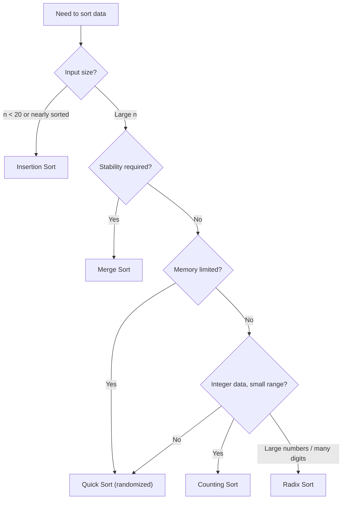

# Choosing the Right Sorting Algorithm for Your Data

> **One-line summary:**
> No single sorting algorithm wins every scenario — the right choice depends on input size, value range, memory budget, stability requirements, and data structure, so knowing the tradeoffs matters more than knowing the implementations.

---

## Table of Contents

1. [Why Choosing the Right Sort Matters](#1-why-choosing-the-right-sort-matters)
2. [Quick Recap of All Sorting Algorithms](#2-quick-recap-of-all-sorting-algorithms)
3. [Complexity Comparison Table](#3-complexity-comparison-table)
4. [What Does Stable Sorting Mean?](#4-what-does-stable-sorting-mean)
5. [Decision Guide — When to Use Which](#5-decision-guide--when-to-use-which)
6. [In-Place vs Not In-Place](#6-in-place-vs-not-in-place)
7. [Real-World Scenarios Mapped to Algorithms](#7-real-world-scenarios-mapped-to-algorithms)
8. [Common Interview Tips](#8-common-interview-tips)
9. [Key Takeaways](#9-key-takeaways)
10. [FAQs](#10-faqs)

---

## 1. Why Choosing the Right Sort Matters

Imagine you are organizing a deck of playing cards. If you have only 5 cards, any method works fine. But with 10,000 cards, your approach matters a lot. The same idea applies to sorting in code.

We have covered seven sorting algorithms in this series. Each has its own strengths and weaknesses. The real skill is knowing **when to use which one**.



---

## 2. Quick Recap of All Sorting Algorithms

| Algorithm      | Core idea                                              |
| -------------- | ------------------------------------------------------ |
| Bubble Sort    | Repeatedly swap adjacent out-of-order elements         |
| Selection Sort | Find the minimum each pass; swap once per pass         |
| Insertion Sort | Build a sorted left section by shifting elements right |
| Merge Sort     | Divide in half, sort each half, merge                  |
| Quick Sort     | Partition around a pivot, recurse on each side         |
| Counting Sort  | Count occurrences; place by index — no comparisons     |
| Radix Sort     | Sort digit by digit using Counting Sort as subroutine  |

---

## 3. Complexity Comparison Table

Use this as a reference card when making sorting decisions.

| Algorithm      | Best Case     | Average Case  | Worst Case    | Space       | Stable? |
| -------------- | ------------- | ------------- | ------------- | ----------- | ------- |
| Bubble Sort    | $O(n)$        | $O(n^2)$      | $O(n^2)$      | $O(1)$      | Yes     |
| Selection Sort | $O(n^2)$      | $O(n^2)$      | $O(n^2)$      | $O(1)$      | No      |
| Insertion Sort | $O(n)$        | $O(n^2)$      | $O(n^2)$      | $O(1)$      | Yes     |
| Merge Sort     | $O(n \log n)$ | $O(n \log n)$ | $O(n \log n)$ | $O(n)$      | Yes     |
| Quick Sort     | $O(n \log n)$ | $O(n \log n)$ | $O(n^2)$      | $O(\log n)$ | No      |
| Counting Sort  | $O(n + k)$    | $O(n + k)$    | $O(n + k)$    | $O(k)$      | Yes     |
| Radix Sort     | $O(d(n + k))$ | $O(d(n + k))$ | $O(d(n + k))$ | $O(n + k)$  | Yes     |

> $n$ = number of elements, $k$ = value range (Counting Sort) or digit range (Radix Sort), $d$ = number of digits.

---

## 4. What Does Stable Sorting Mean?

A **stable** sort preserves the relative order of equal elements after sorting.

**Example:** sort students first by grade, then by name. If two students share the same grade, a stable sort keeps them in the same relative order they had after the name sort — so the two-key sort works correctly.

| Stable algorithms             | Unstable algorithms        |
| ----------------------------- | -------------------------- |
| Bubble, Insertion, Merge Sort | Selection Sort             |
| Counting Sort, Radix Sort     | Quick Sort (standard form) |

Stability matters most when:

- Sorting objects with multiple fields.
- Applying multiple sequential sorts (each adds a new sort key).
- Maintaining user-visible ordering (e.g., table rows in a UI).

---

## 5. Decision Guide — When to Use Which

### Small input ($n < 20$) or nearly sorted data → **Insertion Sort**

Insertion Sort is simple, has minimal overhead, and runs in $O(n)$ best case when the data is already nearly sorted. Many built-in sort functions switch to Insertion Sort for small sub-arrays internally for exactly this reason.

```python
# Python — Insertion Sort
def insertion_sort(arr):
    for i in range(1, len(arr)):
        key = arr[i]
        j = i - 1
        while j >= 0 and arr[j] > key:
            arr[j + 1] = arr[j]
            j -= 1
        arr[j + 1] = key
    return arr

# [5, 3, 1, 4, 2] → [1, 2, 3, 4, 5]
```

**C++ (simple):**

```cpp
// C++ (simple) — Insertion Sort
#include <vector>

void insertionSort(std::vector<int>& arr) {
    int n = arr.size();
    for (int i = 1; i < n; i++) {
        int key = arr[i];              // Element to insert into sorted portion
        int j = i - 1;
        while (j >= 0 && arr[j] > key) {
            arr[j + 1] = arr[j];       // Shift right to make room
            j--;
        }
        arr[j + 1] = key;             // Insert at correct position
    }
}
```

**C++ (LeetCode class style):**

```cpp
// C++ (LeetCode class style) — Insertion Sort
#include <vector>

class Solution {
public:
    vector<int> sortArray(vector<int>& arr) {
        int n = arr.size();
        for (int i = 1; i < n; i++) {
            int key = arr[i];              // Element to insert into sorted portion
            int j = i - 1;
            while (j >= 0 && arr[j] > key) {
                arr[j + 1] = arr[j];       // Shift right to make room
                j--;
            }
            arr[j + 1] = key;             // Insert at correct position
        }
        return arr;
    }
};
```

---

### Large input, general purpose → **Quick Sort (randomized)** or **Merge Sort**

Both run in $O(n \log n)$ on average. Quick Sort is typically faster in practice due to better **cache locality** and in-place operation. However, standard Quick Sort degrades to $O(n^2)$ on sorted input — always use a randomized pivot.

```python
# Python — Randomized Quick Sort pivot selection
import random

def randomized_partition(arr, low, high):
    rand_index = random.randint(low, high)
    arr[rand_index], arr[high] = arr[high], arr[rand_index]
    return partition(arr, low, high)   # standard partition unchanged
```

**C++ (simple):**

```cpp
// C++ (simple) — Randomized Quick Sort pivot selection
#include <vector>
#include <cstdlib>

int partition(std::vector<int>& arr, int low, int high) {
    int pivot = arr[high];    // Standard partition using last element
    int i = low - 1;
    for (int j = low; j < high; j++)
        if (arr[j] <= pivot) { i++; std::swap(arr[i], arr[j]); }
    std::swap(arr[i + 1], arr[high]);
    return i + 1;
}

int randomizedPartition(std::vector<int>& arr, int low, int high) {
    int randIndex = low + rand() % (high - low + 1);  // Random index in [low, high]
    std::swap(arr[randIndex], arr[high]);              // Move random pivot to last
    return partition(arr, low, high);                  // Standard partition unchanged
}
```

**C++ (LeetCode class style):**

```cpp
// C++ (LeetCode class style) — Randomized Quick Sort
#include <vector>
#include <cstdlib>

class Solution {
    int partition(vector<int>& arr, int low, int high) {
        int pivot = arr[high];  // Pivot is the randomly selected element
        int i = low - 1;
        for (int j = low; j < high; j++)
            if (arr[j] <= pivot) { i++; swap(arr[i], arr[j]); }
        swap(arr[i + 1], arr[high]);
        return i + 1;
    }

    int randomizedPartition(vector<int>& arr, int low, int high) {
        int randIndex = low + rand() % (high - low + 1); // Pick random pivot index
        swap(arr[randIndex], arr[high]);                 // Move pivot to last position
        return partition(arr, low, high);                // Standard partition unchanged
    }

    void quickSort(vector<int>& arr, int low, int high) {
        if (low < high) {
            int pi = randomizedPartition(arr, low, high);
            quickSort(arr, low, pi - 1);
            quickSort(arr, pi + 1, high);
        }
    }

public:
    vector<int> sortArray(vector<int>& nums) {
        quickSort(nums, 0, nums.size() - 1);
        return nums;
    }
};
```

If the input might already be sorted or nearly sorted, prefer **Merge Sort** for its guaranteed $O(n \log n)$ worst case.

---

### Stability required with large input → **Merge Sort**

Merge Sort is the safe, predictable choice: $O(n \log n)$ in all cases and naturally stable. Java's `Arrays.sort()` for objects uses TimSort (a Merge Sort + Insertion Sort hybrid) for exactly this reason.

---

### Integer data with small value range → **Counting Sort**

When the maximum value $k$ is not much larger than $n$, Counting Sort runs in $O(n + k)$ — effectively $O(n)$.

```python
# Python — Counting Sort
def counting_sort(arr):
    max_val = max(arr)
    count = [0] * (max_val + 1)
    for num in arr: count[num] += 1
    return [val for val, freq in enumerate(count) for _ in range(freq)]

# [4, 2, 2, 8, 3, 3, 1] → [1, 2, 2, 3, 3, 4, 8]
```

**C++ (simple):**

```cpp
// C++ (simple) — Counting Sort
#include <vector>
#include <algorithm>

std::vector<int> countingSort(std::vector<int> arr) {
    int maxVal = *std::max_element(arr.begin(), arr.end());  // Find range
    std::vector<int> count(maxVal + 1, 0);                   // Count array
    for (int num : arr) count[num]++;                        // Count each value
    std::vector<int> output;
    for (int val = 0; val <= maxVal; val++)
        output.insert(output.end(), count[val], val);        // Place by index
    return output;
}
```

**C++ (LeetCode class style):**

```cpp
// C++ (LeetCode class style) — Counting Sort
#include <vector>
#include <algorithm>

class Solution {
public:
    vector<int> sortArray(vector<int>& arr) {
        int maxVal = *max_element(arr.begin(), arr.end());  // Find range
        vector<int> count(maxVal + 1, 0);                   // Count array
        for (int num : arr) count[num]++;                   // Count each value
        vector<int> output;
        for (int val = 0; val <= maxVal; val++)
            output.insert(output.end(), count[val], val);   // Place by index
        return output;
    }
};
```

> **Caution:** if $k$ is very large (e.g., values up to 1 billion), Counting Sort needs a billion-slot array — impractical. Use Radix Sort instead.

---

### Large integers or fixed-length strings → **Radix Sort**

Radix Sort applies Counting Sort one digit at a time, so the total value range never drives memory usage. It is ideal for phone numbers, ZIP codes, student IDs, and similar fixed-width keys.

---

### Memory is severely limited → **Quick Sort** or an $O(1)$ algorithm

Merge Sort needs $O(n)$ extra space. Quick Sort uses only $O(\log n)$ stack space. Bubble, Selection, and Insertion Sort are fully in-place at $O(1)$.

---

## 6. In-Place vs Not In-Place

An **in-place** sort modifies the array without allocating a separate output array.

| In-place ($O(1)$ extra)        | Not in-place               |
| ------------------------------ | -------------------------- |
| Bubble Sort                    | Merge Sort — $O(n)$        |
| Selection Sort                 | Counting Sort — $O(n + k)$ |
| Insertion Sort                 | Radix Sort — $O(n + k)$    |
| Quick Sort — $O(\log n)$ stack |                            |

When an interview question says _"sort without extra space"_, reach for an in-place algorithm.

---

## 7. Real-World Scenarios Mapped to Algorithms

| Scenario                                           | Best Algorithm          | Reason                                  |
| -------------------------------------------------- | ----------------------- | --------------------------------------- |
| Sort 10 student names                              | Insertion Sort          | Tiny input, minimal overhead            |
| Sort 1 million employee records by salary (stable) | Merge Sort              | Large input, stability required         |
| Sort age values (0–120)                            | Counting Sort           | Small value range, $O(n)$ achievable    |
| Sort a nearly-sorted leaderboard                   | Insertion Sort          | $O(n)$ best case for nearly sorted data |
| Sort random integers, memory limited               | Quick Sort (randomized) | Fast average, $O(\log n)$ space         |
| Sort 6-digit phone extensions                      | Radix Sort              | Fixed digit length, digit-by-digit sort |
| Sort a linked list                                 | Merge Sort              | No random access needed, natural fit    |
| Sort integers 0–1 million, $n$ = 1 million         | Counting Sort           | $k \approx n$, effectively $O(n)$       |

---

## 8. Common Interview Tips

**Ask before you implement.** When an interviewer asks you to sort something, pause and ask:

- How large is the input?
- Is the data nearly sorted?
- Does the range of values matter?
- Is stability required?
- Are there memory constraints?

Showing this thought process demonstrates strong problem-solving skills, even if you ultimately choose Merge Sort as a safe default.

**Safe defaults for interviews:**

| Priority             | Default choice                                |
| -------------------- | --------------------------------------------- |
| General large input  | Merge Sort (guaranteed $O(n \log n)$, stable) |
| Performance-critical | Quick Sort (randomized)                       |
| Small integer range  | Counting Sort                                 |
| Nearly sorted        | Insertion Sort                                |

Always explain **why** you chose one over another — that explanation is often worth more than the code itself.

---

## 9. Key Takeaways

- There is **no universally best** sorting algorithm. Every choice involves tradeoffs.
- **Insertion Sort** — small or nearly sorted data, minimal overhead.
- **Merge Sort** — large data, stability required, guaranteed $O(n \log n)$.
- **Quick Sort (randomized)** — large data, no stability needed, memory is limited.
- **Counting Sort** — integers in a small, bounded range.
- **Radix Sort** — large integers or fixed-length keys sorted digit by digit.
- **Stability** matters for multi-field sorts and sequential sorting pipelines.
- **Memory constraints** can make Merge Sort impractical; prefer Quick Sort or in-place $O(1)$ methods then.
- Real-world implementations (TimSort, IntroSort, dual-pivot Quick Sort) are hybrids that adapt to the data shape automatically.

---

## 10. FAQs

**Why not always use Merge Sort if it is always $O(n \log n)$?**

Merge Sort requires $O(n)$ extra space. For large datasets or memory-constrained systems, this overhead is costly. Quick Sort uses only $O(\log n)$ stack space and is faster in practice due to better cache locality, making it the preferred choice when worst-case guarantees are not critical.

**Can Counting Sort handle negative numbers?**

Not in its basic form. Shift all values by the minimum value to make them non-negative, sort, then shift back. The range $k$ must still be manageable — if the shifted range is huge, use Radix Sort instead.

**What algorithm does a language's built-in sort use?**

| Language | Primitive sort                       | Object / general sort |
| -------- | ------------------------------------ | --------------------- |
| Python   | TimSort (hybrid)                     | TimSort (hybrid)      |
| Java     | Dual-pivot Quick Sort                | TimSort               |
| C++ STL  | IntroSort (Quick + Heap + Insertion) | —                     |

These hybrids combine the best properties of multiple algorithms and switch between them based on input size and data shape.

**Is Quick Sort always faster than Merge Sort in practice?**

Usually yes, due to better cache locality and no auxiliary array. But on nearly sorted data with a naive pivot, Quick Sort degrades to $O(n^2)$ while Merge Sort stays at $O(n \log n)$. Always use a randomized or median-of-three pivot in production.
