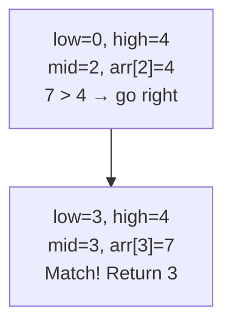

# Linear Search vs Binary Search — Key Differences

> **One-line summary:**
> Linear search checks every element one by one in $O(n)$ and works on any array; binary search eliminates half the search space each step in $O(\log n)$ but requires a sorted array.

---

## Table of Contents

1. [What is Searching in Programming?](#1-what-is-searching-in-programming)
2. [Linear Search](#2-linear-search)
3. [Linear Search Code](#3-linear-search-code)
4. [Linear Search Complexity](#4-linear-search-complexity)
5. [Binary Search](#5-binary-search)
6. [Binary Search Dry Run](#6-binary-search-dry-run)
7. [Binary Search Code](#7-binary-search-code)
8. [Binary Search Complexity](#8-binary-search-complexity)
9. [Side-by-Side Comparison](#9-side-by-side-comparison)
10. [When to Use Which](#10-when-to-use-which)
11. [Visual Walkthrough](#11-visual-walkthrough)
12. [Practical Tips for Interviews](#12-practical-tips-for-interviews)
13. [Key Takeaways](#13-key-takeaways)
14. [FAQs](#14-faqs)

---

## 1. What is Searching in Programming?

Imagine you lost your phone somewhere in your house. You could check every room one by one until you find it. Or, if you knew your phone was somewhere between the kitchen and the bedroom, you could start from the middle and narrow it down faster. That is exactly the difference between linear search and binary search.

Searching is one of the most common operations in programming — looking up a username, finding a product price, checking if a value exists in an array. In this post we will break down both algorithms and show you when to use which.

---

## 2. Linear Search

### How It Works

Linear search is the simplest searching algorithm. Start from the first element and check each one in order until you find the target or reach the end. Think of it like reading a book page by page looking for a specific word.

There is no shortcut. In the worst case you check every single element, which makes linear search straightforward but slow for large datasets.

**Example:** find `7` in `[3, 1, 7, 9, 4]`

```
Check index 0: value = 3 → no match
Check index 1: value = 1 → no match
Check index 2: value = 7 → match! Return index 2
```

---

## 3. Linear Search Code

```python
# Python — Linear Search

def linear_search(arr, target):
    for i in range(len(arr)):
        if arr[i] == target:
            return i       # Return index on match
    return -1              # -1 means not found

numbers = [3, 1, 7, 9, 4]
result = linear_search(numbers, 7)
print(f"Target found at index: {result}" if result != -1 else "Target not found")
# Output: Target found at index: 2
```

```cpp
// C++ — Linear Search
#include <vector>

int linearSearch(const std::vector<int>& arr, int target) {
    for (int i = 0; i < (int)arr.size(); i++)
        if (arr[i] == target) return i;
    return -1;
}
```

---

## 4. Linear Search Complexity

| Metric       | Value  | Explanation                                  |
| ------------ | ------ | -------------------------------------------- |
| Best case    | $O(1)$ | Target is the very first element             |
| Worst case   | $O(n)$ | Target is last or not present; check all $n$ |
| Average case | $O(n)$ | Expected to check roughly half the elements  |
| Space        | $O(1)$ | No extra memory beyond the input             |

---

## 5. Binary Search

### How It Works

Binary search is dramatically faster, but requires one critical condition: **the array must be sorted**.

Think of looking up a word in a dictionary. You do not start from page one — you open the middle, decide if your word comes before or after that page, and cut the remaining pages in half. With each comparison, binary search **eliminates half** of the remaining elements.



---

## 6. Binary Search Dry Run

Input: sorted array `[1, 3, 4, 7, 9]`, target = `7`

```
Step 1: low=0, high=4 → mid=2, arr[2]=4
        7 > 4 → search right half → low = mid+1 = 3

Step 2: low=3, high=4 → mid=3, arr[3]=7
        7 == 7 → match found! Return index 3
```

Found in **2 steps** instead of 4 (linear search would need 4 checks for index 3).

---

## 7. Binary Search Code

```python
# Python — Binary Search (iterative)

def binary_search(arr, target):
    low, high = 0, len(arr) - 1

    while low <= high:
        mid = (low + high) // 2      # Integer midpoint (avoids overflow)

        if arr[mid] == target:
            return mid               # Found
        elif arr[mid] < target:
            low = mid + 1            # Target is in right half
        else:
            high = mid - 1           # Target is in left half

    return -1                        # Not found

sorted_numbers = [1, 3, 4, 7, 9]
result = binary_search(sorted_numbers, 7)
print(f"Target found at index: {result}" if result != -1 else "Target not found")
# Output: Target found at index: 3
```

```cpp
// C++ — Binary Search (iterative)
#include <vector>

int binarySearch(const std::vector<int>& arr, int target) {
    int low = 0, high = (int)arr.size() - 1;

    while (low <= high) {
        int mid = low + (high - low) / 2;   // Safe midpoint

        if      (arr[mid] == target) return mid;
        else if (arr[mid] < target)  low  = mid + 1;
        else                         high = mid - 1;
    }
    return -1;
}
```

> **Note:** use `mid = low + (high - low) / 2` instead of `(low + high) / 2` to prevent integer overflow when `low + high` exceeds the maximum integer value.

---

## 8. Binary Search Complexity

| Metric       | Value       | Explanation                                         |
| ------------ | ----------- | --------------------------------------------------- |
| Best case    | $O(1)$      | Target is at the midpoint on the first check        |
| Worst case   | $O(\log n)$ | Array is halved each step; at most $\log_2 n$ steps |
| Average case | $O(\log n)$ | Same halving behaviour on average                   |
| Space        | $O(1)$      | Iterative version uses no extra memory              |

As covered in the logarithms post: $\log_2(1000) \approx 10$. Binary search on 1,000 elements takes at most **10 comparisons**. Linear search could take 1,000.

---

## 9. Side-by-Side Comparison

| Feature                   | Linear Search          | Binary Search                            |
| ------------------------- | ---------------------- | ---------------------------------------- |
| Works on unsorted array?  | Yes                    | No — must be sorted                      |
| Time complexity (worst)   | $O(n)$                 | $O(\log n)$                              |
| Time complexity (best)    | $O(1)$                 | $O(1)$                                   |
| Space complexity          | $O(1)$                 | $O(1)$ iterative / $O(\log n)$ recursive |
| Implementation complexity | Very simple            | Moderate                                 |
| Best used for             | Small or unsorted data | Large sorted data                        |
| Works on linked lists?    | Yes                    | No (no random access)                    |

---

## 10. When to Use Which

### Use Linear Search when:

- The array is **unsorted** and sorting it first would be too expensive.
- The array is **very small** (fewer than 20–30 elements).
- You are searching in a **linked list** (no random access available).
- You need to find **all occurrences**, not just the first one.

### Use Binary Search when:

- The array is already **sorted**, or can be sorted once and searched many times.
- The dataset is **large** (hundreds, thousands, or millions of elements).
- You need **repeated fast lookups** on the same dataset.
- The problem involves a **sorted array** — this is a direct signal in interviews.

---

## 11. Visual Walkthrough

Searching for `9` in `[1, 3, 4, 7, 9]`:

| Step | Linear Search                        | Binary Search                    |
| ---- | ------------------------------------ | -------------------------------- |
| 1    | Check index 0: value = 1             | mid=2, value=4. 9 > 4 → go right |
| 2    | Check index 1: value = 3             | mid=3, value=7. 9 > 7 → go right |
| 3    | Check index 2: value = 4             | mid=4, value=9. **Found!**       |
| 4    | Check index 3: value = 7             | —                                |
| 5    | Check index 4: value = 9. **Found!** | —                                |

Linear search: **5 steps**. Binary search: **3 steps**. This gap grows much larger as array size increases.

---

## 12. Practical Tips for Interviews

- A problem that says _"given a sorted array, find element X"_ is a direct signal to use **binary search**.
- Applying linear search on large sorted arrays in competitive programming often causes **Time Limit Exceeded (TLE)**. If the array size is $> 10^5$ and sorted, binary search is almost always required.
- If the array is unsorted and you plan to search **multiple times**, sorting once at $O(n \log n)$ and then using binary search at $O(\log n)$ per query is far faster than repeated linear searches at $O(n)$ each.
- Always use `low + (high - low) / 2` for the midpoint to avoid integer overflow, especially in Java and C++.

---

## 13. Key Takeaways

- **Linear search** — $O(n)$, works on any unsorted array, simple to implement, fine for small data.
- **Binary search** — $O(\log n)$, requires a sorted array, dramatically faster for large datasets.
- Neither is universally better — the right choice depends on whether the data is sorted and how large it is.
- The iterative binary search implementation uses $O(1)$ space; the recursive version uses $O(\log n)$ stack space.
- The next posts in this series cover binary search variations (first/last occurrence, boundaries) and binary search on rotated sorted arrays.

---

## 14. FAQs

**Can binary search work on an unsorted array?**

No. Binary search strictly requires a sorted array. If the array is unsorted, the logic of eliminating halves breaks down and binary search may return incorrect results.

**Is binary search always faster than linear search?**

Not for very small arrays (5–10 elements). Binary search has more overhead per step (the midpoint calculation and two comparisons). For tiny arrays, linear search is comparable or faster. Binary search truly outperforms linear search when the dataset is large and sorted.

**What happens if the target is not in the array?**

Both algorithms handle this gracefully. Linear search finishes the loop without a match and returns `-1`. Binary search exhausts the window (when `low > high`) and also returns `-1`. Always check the returned value before using it as an index.

**Why use `low + (high - low) / 2` instead of `(low + high) / 2`?**

When `low` and `high` are both large integers, `low + high` can overflow the maximum integer value in languages like Java and C++. The expression `low + (high - low) / 2` computes the same midpoint without the overflow risk.
