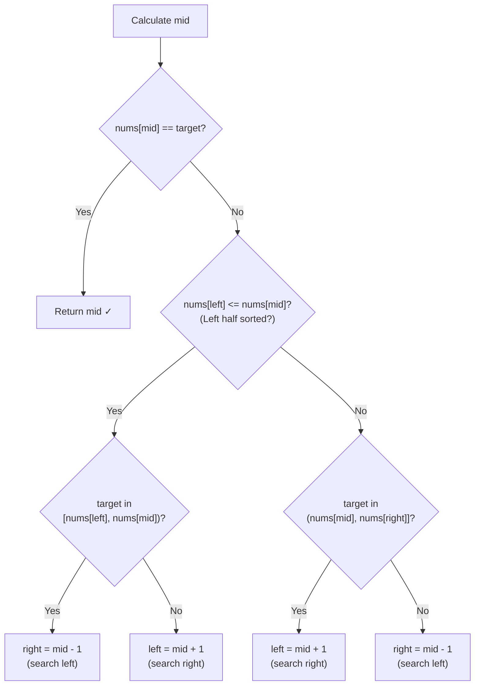

# Binary Search in a Rotated Sorted Array — Step-by-Step

> **One-line summary:**
> A rotated sorted array always has one fully sorted half — modified binary search identifies which half is sorted, checks if the target lives there, and eliminates the other half each step, keeping the time complexity at $O(\log n)$.

---

## Table of Contents

1. [What is a Rotated Sorted Array?](#1-what-is-a-rotated-sorted-array)
2. [Why Not Just Use Linear Search?](#2-why-not-just-use-linear-search)
3. [The Key Insight](#3-the-key-insight)
4. [How Rotation Changes Binary Search](#4-how-rotation-changes-binary-search)
5. [Step-by-Step Algorithm](#5-step-by-step-algorithm)
6. [Dry Run Example](#6-dry-run-example)
7. [Code Implementation](#7-code-implementation)
8. [Another Example with Different Rotation](#8-another-example-with-different-rotation)
9. [Edge Cases to Watch Out For](#9-edge-cases-to-watch-out-for)
10. [Time and Space Complexity](#10-time-and-space-complexity)
11. [Common Mistakes Beginners Make](#11-common-mistakes-beginners-make)
12. [Real-World Analogy](#12-real-world-analogy)
13. [Key Takeaways](#13-key-takeaways)
14. [FAQs](#14-faqs)

---

## 1. What is a Rotated Sorted Array?

Imagine you have a sorted list of numbers on a circular table. Someone picks a point and rotates the table. The numbers are still in order relative to each other, but they wrap around a break point.

That is exactly what a rotated sorted array looks like. The sorted array `[1, 2, 3, 4, 5, 6, 7]` rotated at index 3 becomes `[4, 5, 6, 7, 1, 2, 3]`.

```
Original sorted:  [1, 2, 3, 4, 5, 6, 7]
                          ↑ rotation point
After rotation:   [4, 5, 6, 7, 1, 2, 3]
                   ─────────────────────
                   Left half   Right half
                   sorted ↑    sorted ↑
```

The values are still sorted, but split into two sorted halves joined together at the rotation point. There is no single pivot that separates a smaller half from a larger one the way standard binary search assumes.

---

## 2. Why Not Just Use Linear Search?

You could scan every element one by one. That works, but it takes $O(n)$ time — slow for large arrays.

Since the array is _partially_ sorted, we can do better. A modified binary search runs in $O(\log n)$ time by exploiting the one property that always holds: **at least one half of the array is always fully sorted**, no matter where the rotation happened.

| Approach               | Time Complexity | Space Complexity |
| ---------------------- | --------------- | ---------------- |
| Linear Search          | $O(n)$          | $O(1)$           |
| Modified Binary Search | $O(\log n)$     | $O(1)$           |

---

## 3. The Key Insight

Look at `[4, 5, 6, 7, 1, 2, 3]` and pick any midpoint. Say `mid` lands at index 3, value `7`.

- Left half: `[4, 5, 6, 7]` — **sorted** because `nums[left] <= nums[mid]`
- Right half: `[1, 2, 3]` — also sorted, but starts at a smaller value

No matter where `mid` falls, one of the two halves is guaranteed to be in ascending order. We check which half is sorted, then ask: "does my target fall within this sorted half?" If yes, search there. If no, search the other half.



---

## 4. How Rotation Changes Binary Search

In standard binary search, one comparison (`arr[mid] < target`) is enough to decide direction. In a rotated array you need **two checks**:

1. Which half is sorted?
2. Does the target fall inside that sorted half?

Standard binary search collapses if you skip step 1 because the array is not monotonically increasing from `left` to `right`. The modified version adds step 1 as a guard before making the directional decision.

```
Standard BS assumption (WRONG for rotated):
  left ... mid ... right  →  always increasing ✗

Rotated array reality:
  4  5  6  7  |  1  2  3
  sorted half    sorted half
  ↑ we must find which half is sorted first ↑
```

---

## 5. Step-by-Step Algorithm

Here is the plan we follow at every step of the binary search loop:

1. Calculate `mid = (left + right) // 2`.
2. If `nums[mid] == target`, return `mid`.
3. Check if the **left half** (`nums[left]` to `nums[mid]`) is sorted by testing `nums[left] <= nums[mid]`.
   - If target falls in range `[nums[left], nums[mid])`, move `right = mid - 1`.
   - Otherwise, move `left = mid + 1`.
4. If the left half is **not** sorted, the right half must be sorted.
   - If target falls in range `(nums[mid], nums[right]]`, move `left = mid + 1`.
   - Otherwise, move `right = mid - 1`.
5. If the loop ends without finding the target, return `-1`.

---

## 6. Dry Run Example

**Array:** `[4, 5, 6, 7, 1, 2, 3]` **Target:** `2` (indices 0–6)

| Step | left | right | mid | nums[mid] | Decision                                                              |
| ---- | ---- | ----- | --- | --------- | --------------------------------------------------------------------- |
| 1    | 0    | 6     | 3   | 7         | Left half `[4,5,6,7]` sorted. 2 not in `[4,7)`. Go right → `left = 4` |
| 2    | 4    | 6     | 5   | 2         | `nums[mid] == target`. Return **5** ✓                                 |

Found at index 5 in just 2 steps instead of scanning all 7 elements.

**Trace for target `6`:**

| Step | left | right | mid | nums[mid] | Decision                                                             |
| ---- | ---- | ----- | --- | --------- | -------------------------------------------------------------------- |
| 1    | 0    | 6     | 3   | 7         | Left half `[4,5,6,7]` sorted. 6 is in `[4,7)`. Go left → `right = 2` |
| 2    | 0    | 2     | 1   | 5         | Left half `[4,5]` sorted. 6 not in `[4,5)`. Go right → `left = 2`    |
| 3    | 2    | 2     | 2   | 6         | `nums[mid] == target`. Return **2** ✓                                |

---

## 7. Code Implementation

### Python

```python
# Python — Search in a Rotated Sorted Array
def search_rotated(nums, target):
    left = 0
    right = len(nums) - 1

    while left <= right:
        mid = (left + right) // 2

        # Direct hit
        if nums[mid] == target:
            return mid

        # Check if the LEFT half is sorted
        if nums[left] <= nums[mid]:
            # Target lies within the sorted left half
            if nums[left] <= target < nums[mid]:
                right = mid - 1      # Search left
            else:
                left = mid + 1       # Search right
        else:
            # RIGHT half must be sorted
            # Target lies within the sorted right half
            if nums[mid] < target <= nums[right]:
                left = mid + 1       # Search right
            else:
                right = mid - 1      # Search left

    return -1   # Target not found


# Example 1
nums = [4, 5, 6, 7, 1, 2, 3]
print(search_rotated(nums, 2))   # Output: 5

# Example 2
print(search_rotated(nums, 6))   # Output: 2

# Example 3
print(search_rotated(nums, 9))   # Output: -1
```

### C++ (simple):

```cpp
// C++ (simple) — Search in a Rotated Sorted Array
#include <vector>

int searchRotated(const std::vector<int>& nums, int target) {
    int left = 0;
    int right = static_cast<int>(nums.size()) - 1;

    while (left <= right) {
        int mid = left + (right - left) / 2;

        // Direct hit
        if (nums[mid] == target)
            return mid;

        // Check if the LEFT half is sorted
        if (nums[left] <= nums[mid]) {
            // Target lies within the sorted left half
            if (nums[left] <= target && target < nums[mid])
                right = mid - 1;    // Search left
            else
                left = mid + 1;     // Search right
        } else {
            // RIGHT half must be sorted
            // Target lies within the sorted right half
            if (nums[mid] < target && target <= nums[right])
                left = mid + 1;     // Search right
            else
                right = mid - 1;    // Search left
        }
    }

    return -1;   // Target not found
}
```

### C++ (LeetCode class style):

```cpp
// C++ (LeetCode class style) — Search in Rotated Sorted Array (LeetCode 33)
#include <vector>

class Solution {
public:
    int search(vector<int>& nums, int target) {
        int left = 0, right = (int)nums.size() - 1;

        while (left <= right) {
            int mid = left + (right - left) / 2;

            if (nums[mid] == target) return mid;    // Direct hit

            if (nums[left] <= nums[mid]) {          // Left half is sorted
                if (nums[left] <= target && target < nums[mid])
                    right = mid - 1;               // Target in sorted left half
                else
                    left = mid + 1;                // Target in right half
            } else {                               // Right half is sorted
                if (nums[mid] < target && target <= nums[right])
                    left = mid + 1;                // Target in sorted right half
                else
                    right = mid - 1;               // Target in left half
            }
        }
        return -1;  // Target not found
    }
};
```

**Output explanation:**

- `target = 2` → returns `5` because `nums[5] = 2`
- `target = 6` → returns `2` because `nums[2] = 6`
- `target = 9` → returns `-1` because `9` is not in the array

---

## 8. Another Example with Different Rotation

Array `[6, 7, 1, 2, 3, 4, 5]` — rotation happened earlier, splitting the array differently.

### Python

```python
# Python — Different rotation point
nums = [6, 7, 1, 2, 3, 4, 5]
print(search_rotated(nums, 3))   # Output: 4
print(search_rotated(nums, 7))   # Output: 1
print(search_rotated(nums, 8))   # Output: -1
```

### C++ (simple):

```cpp
// C++ (simple) — Different rotation point (same searchRotated function)
std::vector<int> nums2 = {6, 7, 1, 2, 3, 4, 5};
std::cout << searchRotated(nums2, 3) << "\n";   // Output: 4
std::cout << searchRotated(nums2, 7) << "\n";   // Output: 1
std::cout << searchRotated(nums2, 8) << "\n";   // Output: -1
```

### C++ (LeetCode class style):

```cpp
// C++ (LeetCode class style) — Different rotation point (same Solution::search)
// Instantiate Solution and call search with the new array
Solution sol;
vector<int> nums2 = {6, 7, 1, 2, 3, 4, 5};
cout << sol.search(nums2, 3) << "\n";   // Output: 4
cout << sol.search(nums2, 7) << "\n";   // Output: 1
cout << sol.search(nums2, 8) << "\n";   // Output: -1
```

The same function handles any rotation point correctly because we always check which half is sorted before deciding where to look. This makes the approach robust and general.

---

## 9. Edge Cases to Watch Out For

### Single Element Array

If the array has only one element, `left == right == mid`. The function checks if that element equals the target and returns accordingly — no special handling needed.

### No Rotation at All

If the array is not rotated (`[1, 2, 3, 4, 5]`), `nums[left] <= nums[mid]` always holds. The function behaves exactly like standard binary search.

### Target at Boundary

Always be careful with the inequalities:

- Left half check: `nums[left] <= target < nums[mid]` (strict upper bound at `mid`)
- Right half check: `nums[mid] < target <= nums[right]` (strict lower bound at `mid`)

These mixed strict/non-strict inequalities prevent off-by-one errors at the edges.

```
nums = [4, 5, 6, 7, 1, 2, 3],  target = 4

Step 1: mid = 3, nums[mid] = 7
  Left half [4,5,6,7] sorted.
  Check: nums[left]=4 <= 4 < nums[mid]=7  →  TRUE
  → right = mid - 1 = 2

Step 2: mid = 1, nums[mid] = 5
  Left half [4,5] sorted.
  Check: nums[left]=4 <= 4 < nums[mid]=5  →  TRUE
  → right = mid - 1 = 0

Step 3: mid = 0, nums[mid] = 4  →  Direct hit, return 0 ✓
```

---

## 10. Time and Space Complexity

| Metric         | Modified Binary Search | Linear Search |
| -------------- | ---------------------- | ------------- |
| Time — Best    | $O(1)$                 | $O(1)$        |
| Time — Average | $O(\log n)$            | $O(n)$        |
| Time — Worst   | $O(\log n)$            | $O(n)$        |
| Space          | $O(1)$                 | $O(1)$        |

The extra condition checks for rotation do not add any extra iterations — we still eliminate exactly half the array each step. Overall time complexity stays at $O(\log n)$.

---

## 11. Common Mistakes Beginners Make

### Using Strict Inequality for the Sorted-Half Check

```python
# Wrong — misses the case where left == mid
if nums[left] < nums[mid]:   # strict <

# Correct — use <=
if nums[left] <= nums[mid]:  # non-strict <=
```

When `left` and `mid` point to the same element, `nums[left] == nums[mid]` is true and the left half (a single element) is trivially sorted. The strict version incorrectly falls into the else branch.

### Forgetting to Check Both Boundaries

```python
# Wrong — only checks one end
if target < nums[mid]:

# Correct — check both ends of the sorted half
if nums[left] <= target < nums[mid]:
```

Missing one boundary causes wrong results when the target sits exactly at the edge of the sorted half.

### Trying to Un-Rotate the Array First

Never physically un-rotate the array before searching. That costs $O(n)$ time and defeats the purpose. Work directly with the rotated array using pointer logic.

---

## 12. Real-World Analogy

Think of a library where books are alphabetically shelved, but someone shifted the entire row. Books `M–Z` are now at the start of the shelf, and `A–L` are at the end.

You want to find a specific book. You go to the middle. You check which side is in alphabetical order. If your book's letter falls in the ordered section, look there. Otherwise, look on the other side.

You never read every spine one by one — you use the partial order to jump to the right spot fast. That is exactly what our algorithm does.

---

## 13. Key Takeaways

- A rotated sorted array is a sorted array split at a rotation point and rejoined — one half will always be fully sorted.
- Modified binary search adds one extra check at each step: identify the sorted half before deciding which direction to search.
- The condition `nums[left] <= nums[mid]` tells you the left half is sorted; otherwise the right half is sorted.
- Always use `<=` (not `<`) when checking if the left half is sorted — it handles single-element subarrays correctly.
- Both pointer boundaries must be checked when testing if the target falls inside the sorted half.
- Overall time complexity is $O(\log n)$ — the rotation check does not add extra iterations.
- The same code handles the no-rotation case (a plain sorted array) transparently.

---

## 14. FAQs

**What if the array has duplicate values?**

The standard algorithm assumes all values are unique. With duplicates, the condition `nums[left] == nums[mid]` becomes ambiguous — both halves could be sorted. You need a modified approach that increments `left` (or decrements `right`) when `nums[left] == nums[mid]`, which degrades the worst case to $O(n)$.

**How do I find the rotation point itself?**

Use a similar binary search to locate the minimum element. Compare `nums[mid]` with `nums[right]`: if `nums[mid] > nums[right]`, the minimum is in the right half; otherwise it is in the left half. The index of the minimum is the rotation point. This is a common follow-up interview problem.

**Does this work for descending sorted rotated arrays?**

The approach assumes the original array is sorted in ascending order. For descending arrays, reverse the comparison logic — the core idea of using the sorted half still applies, but the inequality directions flip.

**Can I use recursion instead of a loop?**

Yes. The recursive version passes `left` and `right` as parameters and calls itself on the correct half. The logic is identical to the iterative version. Iterative is preferred in interviews since it avoids stack-overflow risk on very large inputs and is slightly more efficient in practice.

**What is the difference between this and finding the minimum in a rotated array?**

Both use modified binary search on a rotated array. Searching for a target returns the target's index. Finding the minimum ignores the target and instead tracks the smallest `nums[mid]` seen while always moving toward the unsorted (smaller-valued) half.
