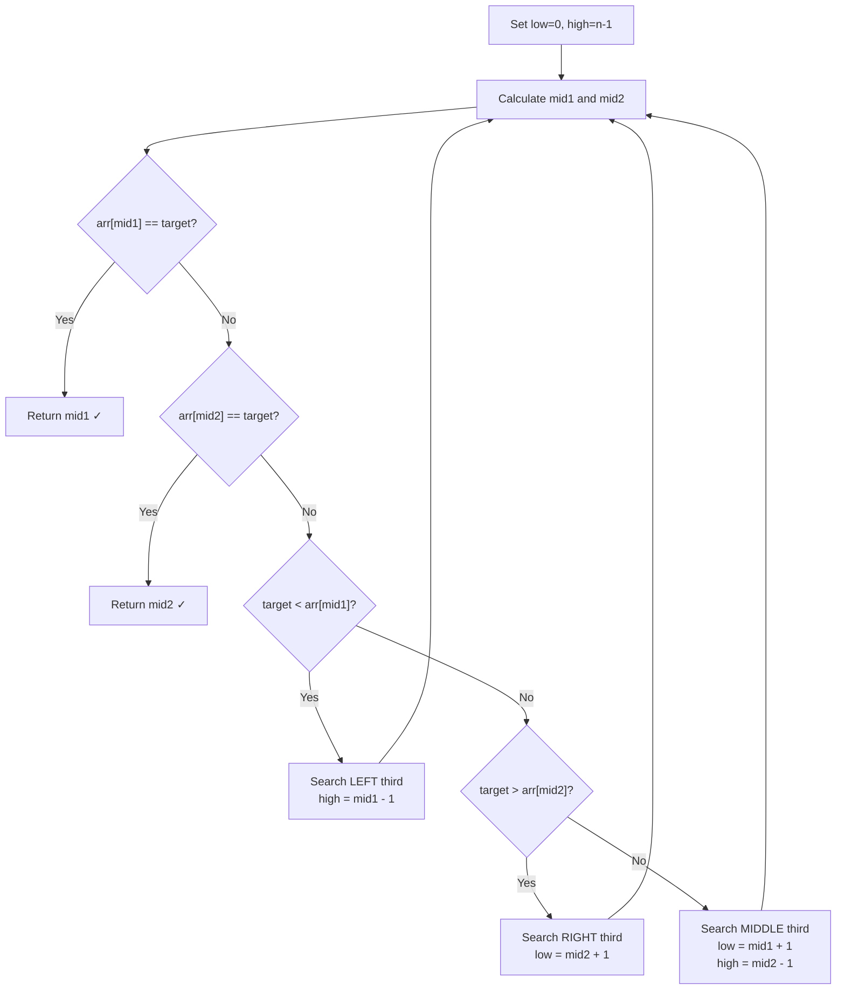

# Ternary Search Explained — Basics, Uses, and Examples

> **One-line summary:**
> Ternary search splits the search space into three parts using two midpoints and eliminates one-third per step — its real power is finding the maximum or minimum of a unimodal function, a problem binary search cannot solve directly.

---

## Table of Contents

1. [What is Ternary Search?](#1-what-is-ternary-search)
2. [How Ternary Search Works](#2-how-ternary-search-works)
3. [Step-by-Step Process](#3-step-by-step-process)
4. [Ternary Search on Sorted Arrays](#4-ternary-search-on-sorted-arrays)
5. [Iterative Implementation](#5-iterative-implementation)
6. [Ternary Search on Unimodal Functions](#6-ternary-search-on-unimodal-functions)
7. [Finding the Maximum of a Unimodal Function](#7-finding-the-maximum-of-a-unimodal-function)
8. [Recursive Ternary Search](#8-recursive-ternary-search)
9. [Ternary Search vs Binary Search](#9-ternary-search-vs-binary-search)
10. [Time and Space Complexity](#10-time-and-space-complexity)
11. [When to Use Ternary Search](#11-when-to-use-ternary-search)
12. [Common Mistakes to Avoid](#12-common-mistakes-to-avoid)
13. [Key Takeaways](#13-key-takeaways)
14. [FAQs](#14-faqs)

---

## 1. What is Ternary Search?

Imagine you are looking for a word in a dictionary. Instead of opening it in the middle like binary search, what if you split the dictionary into **three equal parts** and checked two dividing points at once? That is exactly what ternary search does.

Ternary search is a divide-and-conquer searching algorithm that splits the search space into three parts on every step. It is used to:

- Find an element in a **sorted array**.
- Find the **maximum or minimum of a unimodal function**.

We already covered linear search and binary search earlier in this series. Ternary search takes the same idea a step further by dividing the range into three segments instead of two.

```
Binary Search — splits into 2 parts, 1 midpoint:
  [ left  |  mid  |  right ]

Ternary Search — splits into 3 parts, 2 midpoints:
  [ left  | mid1 | middle | mid2 | right ]
```

---

## 2. How Ternary Search Works

The algorithm divides the array or search space into three equal parts using two midpoints: `mid1` and `mid2`. Based on comparisons at these two points, it eliminates **one-third** of the search space on each step.



---

## 3. Step-by-Step Process

1. Set `low = 0` and `high = n - 1`.
2. Calculate `mid1 = low + (high - low) // 3`.
3. Calculate `mid2 = high - (high - low) // 3`.
4. If `target == arr[mid1]`, return `mid1`.
5. If `target == arr[mid2]`, return `mid2`.
6. If `target < arr[mid1]`, search in the **left third** (`high = mid1 - 1`).
7. If `target > arr[mid2]`, search in the **right third** (`low = mid2 + 1`).
8. Otherwise, search in the **middle third** (`low = mid1 + 1`, `high = mid2 - 1`).

This process repeats iteratively or recursively until the target is found or the range becomes empty.

---

## 4. Ternary Search on Sorted Arrays

Let us look at a concrete example. Sorted array `[1, 2, 3, 4, 5, 6, 7, 8, 9, 10]`, searching for target `7`.

```
low = 0, high = 9
mid1 = 0 + (9 - 0) // 3 = 3  →  arr[3] = 4
mid2 = 9 - (9 - 0) // 3 = 6  →  arr[6] = 7

Is 7 == arr[mid1] (4)?  No
Is 7 == arr[mid2] (7)?  Yes! → Return index 6 ✓
```

Found in **one step** — the two midpoints let us cover three regions at once.

**Dry run for target `3`:**

| Step | low | high | mid1 | arr[mid1] | mid2 | arr[mid2] | Decision |
| ---- | --- | ---- | ---- | --------- | ---- | --------- | -------- |
| 1    | 0   | 9    | 3    | 4         | 6    | 7         | `3 < arr[mid1]=4` → search left: `high = 2` |
| 2    | 0   | 2    | 0    | 1         | 1    | 2         | `3 > arr[mid2]=2` → search right: `low = 2` |
| 3    | 2   | 2    | 2    | 3         | 2    | 3         | `arr[mid1] == 3` → Return **2** ✓ |

---

## 5. Iterative Implementation

### Python

```python
# Python — Ternary Search (Iterative) on a sorted array
def ternary_search(arr, target):
    low = 0
    high = len(arr) - 1

    while low <= high:
        # Calculate two midpoints that divide the range into thirds
        mid1 = low + (high - low) // 3
        mid2 = high - (high - low) // 3

        if arr[mid1] == target:
            return mid1          # Found at mid1
        if arr[mid2] == target:
            return mid2          # Found at mid2

        if target < arr[mid1]:
            high = mid1 - 1      # Search left third
        elif target > arr[mid2]:
            low = mid2 + 1       # Search right third
        else:
            low = mid1 + 1       # Search middle third
            high = mid2 - 1

    return -1   # Target not found


arr = [1, 2, 3, 4, 5, 6, 7, 8, 9, 10]
print(ternary_search(arr, 7))    # Output: 6
print(ternary_search(arr, 3))    # Output: 2
print(ternary_search(arr, 11))   # Output: -1
```

### C++

```cpp
// C++ — Ternary Search (Iterative) on a sorted array
#include <iostream>
#include <vector>

int ternarySearch(const std::vector<int>& arr, int target) {
    int low = 0;
    int high = static_cast<int>(arr.size()) - 1;

    while (low <= high) {
        // Calculate two midpoints that divide the range into thirds
        int mid1 = low + (high - low) / 3;
        int mid2 = high - (high - low) / 3;

        if (arr[mid1] == target) return mid1;   // Found at mid1
        if (arr[mid2] == target) return mid2;   // Found at mid2

        if (target < arr[mid1])
            high = mid1 - 1;     // Search left third
        else if (target > arr[mid2])
            low = mid2 + 1;      // Search right third
        else {
            low  = mid1 + 1;     // Search middle third
            high = mid2 - 1;
        }
    }

    return -1;   // Target not found
}

int main() {
    std::vector<int> arr = {1, 2, 3, 4, 5, 6, 7, 8, 9, 10};
    std::cout << ternarySearch(arr, 7)  << "\n";   // Output: 6
    std::cout << ternarySearch(arr, 3)  << "\n";   // Output: 2
    std::cout << ternarySearch(arr, 11) << "\n";   // Output: -1
    return 0;
}
```

---

## 6. Ternary Search on Unimodal Functions

Ternary search is **especially powerful** when finding the maximum or minimum of a **unimodal function** — one that rises to a single peak and then falls (like a hill), or falls to a single valley and then rises (like a bowl).

```
Unimodal (peak):          Unimodal (valley):
    *                             
   * *                     *   *
  *   *                   * * * *
 *     *                 *       *
```

Think of throwing a ball in the air. Its height increases until it reaches the peak, then decreases. The height over time is a unimodal function. Ternary search finds that peak efficiently without evaluating every point.

**Why ternary search works here:** At any two interior points `mid1` and `mid2`:
- If `f(mid1) < f(mid2)`, the peak is in the right portion — discard the left third.
- If `f(mid1) >= f(mid2)`, the peak is in the left portion — discard the right third.

Binary search cannot do this because it relies on comparing the value to a fixed target. There is no fixed target here — we are searching for the location of the peak itself.

---

## 7. Finding the Maximum of a Unimodal Function

Consider the function $f(x) = -(x - 3)^2 + 9$. Its maximum is at $x = 3$.

### Python

```python
# Python — Ternary Search on a unimodal function (find maximum)
def f(x):
    return -(x - 3) ** 2 + 9    # Peak at x = 3

def find_max(low, high, iterations=200):
    # Run enough iterations for floating-point precision
    for _ in range(iterations):
        mid1 = low + (high - low) / 3
        mid2 = high - (high - low) / 3

        if f(mid1) < f(mid2):
            low = mid1           # Peak is in the right portion
        else:
            high = mid2          # Peak is in the left portion

    return (low + high) / 2      # Approximate peak location


peak_x = find_max(0, 10)
print(f"Peak at x = {peak_x:.4f}")          # Output: Peak at x = 3.0000
print(f"Peak value f(x) = {f(peak_x):.4f}") # Output: Peak value f(x) = 9.0000
```

### C++

```cpp
// C++ — Ternary Search on a unimodal function (find maximum)
#include <iostream>
#include <cmath>

double f(double x) {
    return -(x - 3) * (x - 3) + 9;   // Peak at x = 3
}

double findMax(double low, double high, int iterations = 200) {
    // Run enough iterations for floating-point precision
    for (int i = 0; i < iterations; i++) {
        double mid1 = low + (high - low) / 3.0;
        double mid2 = high - (high - low) / 3.0;

        if (f(mid1) < f(mid2))
            low = mid1;    // Peak is in the right portion
        else
            high = mid2;   // Peak is in the left portion
    }
    return (low + high) / 2.0;   // Approximate peak location
}

int main() {
    double peak_x = findMax(0.0, 10.0);
    std::cout << "Peak at x = " << peak_x << "\n";    // Output: Peak at x = 3
    std::cout << "Peak value = " << f(peak_x) << "\n"; // Output: Peak value = 9
    return 0;
}
```

We run 200 iterations to get high precision with floating-point values. After each iteration the interval shrinks to $\frac{2}{3}$ of its previous size, so after 200 steps the remaining interval width is $10 \times \left(\frac{2}{3}\right)^{200} \approx 10^{-34}$.

---

## 8. Recursive Ternary Search

Ternary search can also be written recursively. Some developers find the recursive style easier to follow when the logic is clear.

### Python

```python
# Python — Ternary Search (Recursive) on a sorted array
def ternary_search_recursive(arr, low, high, target):
    if low > high:
        return -1   # Base case: not found

    mid1 = low + (high - low) // 3
    mid2 = high - (high - low) // 3

    if arr[mid1] == target:
        return mid1
    if arr[mid2] == target:
        return mid2

    if target < arr[mid1]:
        return ternary_search_recursive(arr, low, mid1 - 1, target)  # Left third
    elif target > arr[mid2]:
        return ternary_search_recursive(arr, mid2 + 1, high, target) # Right third
    else:
        return ternary_search_recursive(arr, mid1 + 1, mid2 - 1, target) # Middle third


arr = [2, 4, 6, 8, 10, 12, 14, 16]
print(ternary_search_recursive(arr, 0, len(arr) - 1, 12))  # Output: 5
```

### C++

```cpp
// C++ — Ternary Search (Recursive) on a sorted array
#include <iostream>
#include <vector>

int ternarySearchRecursive(const std::vector<int>& arr,
                           int low, int high, int target) {
    if (low > high) return -1;   // Base case: not found

    int mid1 = low + (high - low) / 3;
    int mid2 = high - (high - low) / 3;

    if (arr[mid1] == target) return mid1;
    if (arr[mid2] == target) return mid2;

    if (target < arr[mid1])
        return ternarySearchRecursive(arr, low, mid1 - 1, target);     // Left third
    else if (target > arr[mid2])
        return ternarySearchRecursive(arr, mid2 + 1, high, target);    // Right third
    else
        return ternarySearchRecursive(arr, mid1 + 1, mid2 - 1, target); // Middle third
}

int main() {
    std::vector<int> arr = {2, 4, 6, 8, 10, 12, 14, 16};
    std::cout << ternarySearchRecursive(arr, 0, arr.size() - 1, 12) << "\n";  // Output: 5
    return 0;
}
```

Output is `5` since `arr[5] = 12`. Each recursive call reduces the search space by one-third.

---

## 9. Ternary Search vs Binary Search

You might wonder: if ternary search eliminates more per step, is it faster than binary search?

| Feature                      | Binary Search        | Ternary Search                     |
| ---------------------------- | -------------------- | ---------------------------------- |
| Divisions per step           | 2 parts              | 3 parts                            |
| Comparisons per step         | 1 to 2               | 2 to 3                             |
| Time complexity              | $O(\log_2 n)$        | $O(\log_3 n)$                      |
| Best use case                | Sorted array lookup  | Unimodal functions, sorted arrays  |
| Simpler to implement         | Yes                  | Slightly more complex              |
| Fewer total comparisons      | **Yes**              | No — more comparisons per step     |

Even though ternary search eliminates one-third per step (vs one-half), **binary search uses fewer total comparisons** because it does only 1–2 comparisons per step instead of 2–3.

$$
\frac{\log_2 n}{\log_3 n} = \frac{\ln n / \ln 2}{\ln n / \ln 3} = \frac{\ln 3}{\ln 2} \approx 1.585
$$

Ternary search makes roughly 1.585× more comparison operations than binary search for the same array size. **Binary search is preferred for sorted array lookups.** Ternary search is the specialist tool for unimodal optimization.

---

## 10. Time and Space Complexity

### Time Complexity

| Case         | Ternary Search    | Notes                                          |
| ------------ | ----------------- | ---------------------------------------------- |
| Best         | $O(1)$            | Target is at `mid1` or `mid2` on the first step |
| Average      | $O(\log_3 n)$     | Divide by 3 each step                          |
| Worst        | $O(\log_3 n)$     | Target at edge or not present                  |

Since $\log_3 n = \log_2 n / \log_2 3 \approx 0.63 \cdot \log_2 n$, ternary search has fewer *iterations* but more comparisons per iteration — the net effect is more total comparisons.

### Space Complexity

| Version   | Space Complexity  | Reason                                     |
| --------- | ----------------- | ------------------------------------------ |
| Iterative | $O(1)$            | Only a few pointer variables               |
| Recursive | $O(\log_3 n)$     | Call stack depth equals number of steps    |

---

## 11. When to Use Ternary Search

| Situation                                                   | Use Ternary Search? |
| ----------------------------------------------------------- | ------------------- |
| Find the maximum/minimum of a unimodal function             | ✅ Yes              |
| Optimization problems with a single peak or valley          | ✅ Yes              |
| Continuous search space (e.g., floating-point range)        | ✅ Yes              |
| Simple element lookup in a sorted array                     | ❌ Prefer binary search |
| Array with duplicates or non-unimodal structure             | ❌ No               |

Ternary search is a **specialized tool for optimization problems** on unimodal data. For element lookup, binary search always wins because it makes fewer comparisons.

---

## 12. Common Mistakes to Avoid

**1. Forgetting to update `low` and `high` correctly**

In the middle-third case, both pointers must move: `low = mid1 + 1` **and** `high = mid2 - 1`. Forgetting either one causes an infinite loop.

**2. Using integer division carelessly on floating-point problems**

```python
# Wrong for floats — truncates, loses precision
mid1 = low + (high - low) // 3

# Correct for floats — use true division
mid1 = low + (high - low) / 3
```

**3. Applying ternary search to a non-unimodal or unsorted array**

Ternary search **requires** either a sorted array (for element lookup) or a strictly unimodal function (for optimization). Applying it to arbitrary data produces wrong results silently.

**4. Confusing the three regions**

Always check in this order:
1. `target < arr[mid1]` → left third
2. `target > arr[mid2]` → right third
3. Otherwise → middle third

Swapping steps 1 and 2 leads to wrong direction choices.

---

## 13. Key Takeaways

- Ternary search divides the search space into **three equal parts** using two midpoints `mid1` and `mid2`, eliminating one-third per step.
- Its real strength is **finding the peak or valley of a unimodal function** — a problem binary search cannot solve directly.
- For sorted array element lookup, binary search is better because it makes fewer total comparisons ($O(\log_2 n)$ vs more comparisons per step with ternary).
- The condition order matters: check `< arr[mid1]` first, then `> arr[mid2]`, then fall through to the middle third.
- For floating-point optimization, run a **fixed number of iterations** (typically 100–300) rather than a `while` loop, since convergence is smooth.
- The iterative version is $O(1)$ space; the recursive version is $O(\log_3 n)$ space due to the call stack.
- Ternary search on continuous functions converges because the interval shrinks to $\left(\frac{2}{3}\right)^k$ of the original size after $k$ iterations.

---

## 14. FAQs

**Is ternary search faster than binary search?**

Not for sorted array lookups. While ternary search reduces the interval by one-third per step, it performs 2–3 comparisons per step versus 1–2 for binary search. The total comparison count is higher for ternary search. Binary search is faster in practice for element lookup.

**Can ternary search work on unsorted arrays?**

No. Ternary search requires either a sorted array or a unimodal function. Applying it to unsorted data gives incorrect results without raising any error.

**When should I use ternary search over binary search?**

Use ternary search when you need to find the peak or minimum of a unimodal function — common in mathematical optimization, geometry, and competitive programming. For simple element lookup in a sorted array, stick with binary search.

**Why use 200 iterations for the floating-point version?**

Each iteration shrinks the interval to $\frac{2}{3}$ of its size. After 200 iterations, the interval is $\left(\frac{2}{3}\right)^{200} \approx 10^{-35}$ times the original — far smaller than any floating-point precision requirement. The exact number can be tuned down to 100 for most practical purposes.

**Does ternary search work on a valley (minimum) as well?**

Yes. Flip the comparison: if `f(mid1) > f(mid2)`, move `low = mid1` (minimum is in the right portion). If `f(mid1) <= f(mid2)`, move `high = mid2`. The same structure applies — just reverse the direction of the inequality.
