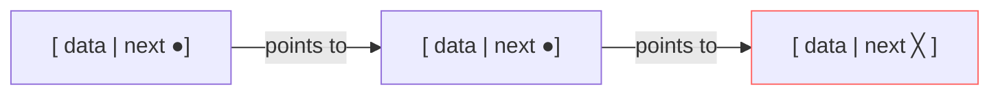

# Linked Lists Explained — Beginner Guide to DSA

> **One-line summary:**
> A linked list is a dynamic, pointer-based data structure where each node holds data and a reference to the next node — unlike arrays, elements live anywhere in memory and insertions or deletions at the head are $O(1)$, but random access by index costs $O(n)$.

---

## Table of Contents

1. [What is a Linked List?](#1-what-is-a-linked-list)
2. [How Linked Lists Differ from Arrays](#2-how-linked-lists-differ-from-arrays)
3. [Anatomy of a Linked List](#3-anatomy-of-a-linked-list)
4. [Creating a Simple Linked List](#4-creating-a-simple-linked-list)
5. [Traversing a Linked List](#5-traversing-a-linked-list)
6. [Inserting Nodes](#6-inserting-nodes)
7. [Deleting Nodes](#7-deleting-nodes)
8. [Searching in a Linked List](#8-searching-in-a-linked-list)
9. [Time and Space Complexity](#9-time-and-space-complexity)
10. [When to Use a Linked List](#10-when-to-use-a-linked-list)
11. [Full Linked List Class Example](#11-full-linked-list-class-example)
12. [Key Takeaways](#12-key-takeaways)
13. [FAQs](#13-faqs)

---

## 1. What is a Linked List?

Imagine a treasure hunt where each clue tells you where the next clue is hidden. You do not know where all the clues are at the start — you just follow one clue to the next. A linked list works exactly like that.

A **linked list** is a linear data structure where each element (called a **node**) holds some data and a reference (called a **pointer**) to the next node in the sequence. Unlike arrays, the elements are **not stored in contiguous memory locations**.

```
Memory layout — Array vs Linked List:

Array:      [10][20][30][40]    ← stored side-by-side, fixed block
             0   1   2   3

Linked List: [10|●]──→[20|●]──→[30|●]──→[40|╳]
              data next   data next        tail: next = null
              (can be anywhere in memory)
```

This is one of the most fundamental data structures in DSA, and understanding it well will help you tackle more advanced topics like stacks, queues, and trees — all covered later in this series.

---

## 2. How Linked Lists Differ from Arrays

Think of an array like seats in a movie theater — all numbered and fixed next to each other. A linked list is like a scavenger hunt — each stop only knows where the next stop is.

| Feature            | Array                   | Linked List               |
| ------------------ | ----------------------- | ------------------------- |
| Memory layout      | Contiguous              | Non-contiguous            |
| Size               | Fixed (static)          | Dynamic (grows / shrinks) |
| Access by index    | $O(1)$ — direct         | $O(n)$ — traverse         |
| Insertion at start | $O(n)$ — shift elements | $O(1)$ — update pointer   |
| Deletion at start  | $O(n)$ — shift elements | $O(1)$ — update pointer   |
| Memory overhead    | Low                     | Extra for pointers        |

Neither is better in every situation. Choosing between them depends on what operations you need most.

---

## 3. Anatomy of a Linked List

### The Node

Every linked list is made up of nodes. A node has two parts: the **data** it holds, and a **pointer** (also called `next`) that points to the next node.



### The Head Pointer

The **head** is a special pointer that always points to the first node. If the list is empty, `head` is `None` / `nullptr`. The head is your entry point — you always start traversal from here.

### The Tail Node

The **tail** is the last node. Its `next` pointer is always `None` / `nullptr`, marking the end of the list.

```
head
  ↓
[10|●]──→[20|●]──→[30|╳]
                    ↑ tail (next = None)
```

---

## 4. Creating a Simple Linked List

### Python

```python
# Python — Node class and manually linked list
class Node:
    def __init__(self, data):
        self.data = data   # The value stored in this node
        self.next = None   # Pointer to the next node (starts as None)


# Step 1: Create individual nodes
node1 = Node(10)
node2 = Node(20)
node3 = Node(30)

# Step 2: Link the nodes together
node1.next = node2   # node1  →  node2
node2.next = node3   # node2  →  node3
# node3.next is already None (end of list)

# Step 3: Set the head
head = node1         # head points to the first node
# Result: 10 → 20 → 30 → None
```

### C++ (simple)

```cpp
// C++ — Node struct and manually linked list
#include <iostream>

struct Node {
    int data;
    Node* next;

    Node(int val) : data(val), next(nullptr) {}
};

int main() {
    // Step 1: Create individual nodes
    Node* node1 = new Node(10);
    Node* node2 = new Node(20);
    Node* node3 = new Node(30);

    // Step 2: Link the nodes together
    node1->next = node2;   // node1  →  node2
    node2->next = node3;   // node2  →  node3
    // node3->next is already nullptr

    // Step 3: Set the head
    Node* head = node1;
    // Result: 10 → 20 → 30 → nullptr
}
```

### C++ (LeetCode class style)

```cpp
// C++ (LeetCode class style) — LeetCode defines nodes as ListNode
struct ListNode {
    int val;
    ListNode* next;
    ListNode(int x) : val(x), next(nullptr) {}
};

// In LeetCode problems the list is already built and passed as a parameter.
// This shows the equivalent node creation using LeetCode's naming convention.
class Solution {
public:
    ListNode* buildExample() {
        ListNode* node1 = new ListNode(10);  // create first node, val = 10
        ListNode* node2 = new ListNode(20);  // create second node, val = 20
        ListNode* node3 = new ListNode(30);  // create third node, val = 30
        node1->next = node2;                  // node1 → node2
        node2->next = node3;                  // node2 → node3
        return node1;                         // return head of the built list
    }
};
```

---

## 5. Traversing a Linked List

To visit every node, start at the head and follow `next` pointers until you hit `None` / `nullptr`. This is pointer-jumping instead of index incrementing.

### Python

```python
# Python — Traverse and print each node
def print_list(head):
    current = head              # Start at the head
    while current is not None:  # Keep going until end
        print(current.data, end=" -> ")
        current = current.next  # Move to the next node
    print("None")               # End-of-list marker

print_list(head)
# Output: 10 -> 20 -> 30 -> None
```

### C++ (simple)

```cpp
// C++ — Traverse and print each node
void printList(Node* head) {
    Node* current = head;
    while (current != nullptr) {
        std::cout << current->data << " -> ";
        current = current->next;   // move to the next node
    }
    std::cout << "nullptr\n";
}

// Output: 10 -> 20 -> 30 -> nullptr
```

### C++ (LeetCode class style)

```cpp
// C++ (LeetCode class style) — Traverse a list given a head pointer
#include <iostream>

struct ListNode {
    int val;
    ListNode* next;
    ListNode(int x) : val(x), next(nullptr) {}
};

class Solution {
public:
    void printList(ListNode* head) {
        ListNode* current = head;              // start at the head node
        while (current != nullptr) {           // stop when we reach the end
            std::cout << current->val << " -> ";
            current = current->next;           // advance to the next node
        }
        std::cout << "nullptr\n";             // mark end of list
    }
};
```

Notice we use a `while` loop instead of a `for` loop with an index — linked lists do not support direct index access. You must follow the chain.

---

## 6. Inserting Nodes

### Insert at the Beginning — $O(1)$

Create a new node, point its `next` to the current head, then update the head. No traversal needed.

```
Before:  head → [10] → [20] → [30] → None
Insert 5:
  new_node = [5], new_node.next = head
  head = new_node
After:   head → [5] → [10] → [20] → [30] → None
```

#### Python

```python
# Python — Insert at the beginning
def insert_at_beginning(head, data):
    new_node = Node(data)
    new_node.next = head   # Point new node to current head
    return new_node        # New node is the new head

head = insert_at_beginning(head, 5)
print_list(head)
# Output: 5 -> 10 -> 20 -> 30 -> None
```

#### C++ (simple)

```cpp
// C++ — Insert at the beginning
Node* insertAtBeginning(Node* head, int data) {
    Node* new_node = new Node(data);
    new_node->next = head;   // Point new node to current head
    return new_node;         // New node is the new head
}

head = insertAtBeginning(head, 5);
// Output: 5 -> 10 -> 20 -> 30 -> nullptr
```

#### C++ (LeetCode class style)

```cpp
// C++ (LeetCode class style) — Prepend a node and return the new head
struct ListNode {
    int val;
    ListNode* next;
    ListNode(int x) : val(x), next(nullptr) {}
};

class Solution {
public:
    ListNode* insertAtBeginning(ListNode* head, int val) {
        ListNode* new_node = new ListNode(val);   // create the new node
        new_node->next = head;                     // point it to current head
        return new_node;                           // new node is the new head
    }
};
```

---

### Insert at the End — $O(n)$

Traverse to the last node, then update its `next` to the new node.

#### Python

```python
# Python — Insert at the end
def insert_at_end(head, data):
    new_node = Node(data)
    if head is None:
        return new_node           # Empty list: new node becomes head
    current = head
    while current.next is not None:  # Walk to the last node
        current = current.next
    current.next = new_node       # Attach new node at the end
    return head

head = insert_at_end(head, 40)
print_list(head)
# Output: 5 -> 10 -> 20 -> 30 -> 40 -> None
```

#### C++ (simple)

```cpp
// C++ — Insert at the end
Node* insertAtEnd(Node* head, int data) {
    Node* new_node = new Node(data);
    if (head == nullptr) return new_node;

    Node* current = head;
    while (current->next != nullptr)   // Walk to the last node
        current = current->next;
    current->next = new_node;          // Attach new node at the end
    return head;
}

head = insertAtEnd(head, 40);
// Output: 5 -> 10 -> 20 -> 30 -> 40 -> nullptr
```

#### C++ (LeetCode class style)

```cpp
// C++ (LeetCode class style) — Append a node and return the head
struct ListNode {
    int val;
    ListNode* next;
    ListNode(int x) : val(x), next(nullptr) {}
};

class Solution {
public:
    ListNode* insertAtEnd(ListNode* head, int val) {
        ListNode* new_node = new ListNode(val);   // create new node
        if (head == nullptr) return new_node;      // empty list: new node becomes head
        ListNode* current = head;
        while (current->next != nullptr)           // walk to the last node
            current = current->next;
        current->next = new_node;                  // attach new node at the end
        return head;
    }
};
```

---

### Insert at a Given Position — $O(n)$

Traverse to the node just before the target position, then splice in the new node.

#### Python

```python
# Python — Insert at a specific position (0-indexed)
def insert_at_position(head, data, position):
    new_node = Node(data)
    if position == 0:
        new_node.next = head
        return new_node
    current = head
    for _ in range(position - 1):   # Walk to position - 1
        if current is None:
            return head             # Position out of range
        current = current.next
    new_node.next = current.next    # Link new node to the rest
    current.next = new_node         # Link previous node to new node
    return head

head = insert_at_position(head, 15, 2)
print_list(head)
# Output: 5 -> 10 -> 15 -> 20 -> 30 -> 40 -> None
```

#### C++ (simple)

```cpp
// C++ — Insert at a specific position (0-indexed)
Node* insertAtPosition(Node* head, int data, int position) {
    Node* new_node = new Node(data);
    if (position == 0) {
        new_node->next = head;
        return new_node;
    }
    Node* current = head;
    for (int i = 0; i < position - 1; i++) {
        if (current == nullptr) return head;   // Position out of range
        current = current->next;
    }
    new_node->next = current->next;   // Link new node to the rest
    current->next = new_node;         // Link previous node to new node
    return head;
}

head = insertAtPosition(head, 15, 2);
// Output: 5 -> 10 -> 15 -> 20 -> 30 -> 40 -> nullptr
```

#### C++ (LeetCode class style)

```cpp
// C++ (LeetCode class style) — Insert at a 0-indexed position
struct ListNode {
    int val;
    ListNode* next;
    ListNode(int x) : val(x), next(nullptr) {}
};

class Solution {
public:
    ListNode* insertAtPosition(ListNode* head, int val, int position) {
        ListNode* new_node = new ListNode(val);    // create new node
        if (position == 0) {
            new_node->next = head;                  // insert before current head
            return new_node;                        // new node becomes the head
        }
        ListNode* current = head;
        for (int i = 0; i < position - 1; i++) {   // walk to position - 1
            if (current == nullptr) return head;    // position out of range
            current = current->next;
        }
        new_node->next = current->next;             // link new node forward
        current->next  = new_node;                  // link previous node to new node
        return head;
    }
};
```

---

## 7. Deleting Nodes

### Delete from the Beginning — $O(1)$

Move the head pointer forward by one node.

#### Python

```python
# Python — Delete the first node
def delete_from_beginning(head):
    if head is None:
        return None           # List is already empty
    return head.next          # Move head forward

head = delete_from_beginning(head)
print_list(head)
# Output: 10 -> 15 -> 20 -> 30 -> 40 -> None
```

#### C++ (simple)

```cpp
// C++ — Delete the first node
Node* deleteFromBeginning(Node* head) {
    if (head == nullptr) return nullptr;
    Node* old_head = head;
    head = head->next;   // Move head forward
    delete old_head;     // Free memory
    return head;
}

head = deleteFromBeginning(head);
// Output: 10 -> 15 -> 20 -> 30 -> 40 -> nullptr
```

#### C++ (LeetCode class style)

```cpp
// C++ (LeetCode class style) — Delete the head node and return the new head
struct ListNode {
    int val;
    ListNode* next;
    ListNode(int x) : val(x), next(nullptr) {}
};

class Solution {
public:
    ListNode* deleteFromBeginning(ListNode* head) {
        if (head == nullptr) return nullptr;   // empty list: nothing to delete
        ListNode* old_head = head;             // save old head before moving
        head = head->next;                     // advance head past the deleted node
        delete old_head;                       // free the old head's memory
        return head;                           // return the new head
    }
};
```

---

### Delete by Value — $O(n)$

Traverse until you find the target value, then bypass that node by updating the previous node's `next`.

#### Python

```python
# Python — Delete the first node matching the given value
def delete_by_value(head, value):
    if head is None:
        return None
    if head.data == value:        # Head is the node to delete
        return head.next
    current = head
    while current.next is not None:
        if current.next.data == value:
            current.next = current.next.next   # Bypass the node
            return head
        current = current.next
    return head   # Value not found

head = delete_by_value(head, 15)
print_list(head)
# Output: 10 -> 20 -> 30 -> 40 -> None
```

#### C++ (simple)

```cpp
// C++ — Delete the first node matching the given value
Node* deleteByValue(Node* head, int value) {
    if (head == nullptr) return nullptr;

    if (head->data == value) {    // Head is the node to delete
        Node* to_delete = head;
        head = head->next;
        delete to_delete;
        return head;
    }

    Node* current = head;
    while (current->next != nullptr) {
        if (current->next->data == value) {
            Node* to_delete = current->next;
            current->next = current->next->next;   // Bypass the node
            delete to_delete;
            return head;
        }
        current = current->next;
    }
    return head;   // Value not found
}

head = deleteByValue(head, 15);
// Output: 10 -> 20 -> 30 -> 40 -> nullptr
```

#### C++ (LeetCode class style)

```cpp
// C++ (LeetCode class style) — Delete first node matching a value
struct ListNode {
    int val;
    ListNode* next;
    ListNode(int x) : val(x), next(nullptr) {}
};

class Solution {
public:
    ListNode* deleteByValue(ListNode* head, int value) {
        if (head == nullptr) return nullptr;        // empty list
        if (head->val == value) {                   // head is the target node
            ListNode* to_del = head;
            head = head->next;                      // advance head past deleted node
            delete to_del;
            return head;
        }
        ListNode* current = head;
        while (current->next != nullptr) {
            if (current->next->val == value) {
                ListNode* to_del = current->next;
                current->next = current->next->next; // bypass the target node
                delete to_del;
                return head;
            }
            current = current->next;                 // keep walking forward
        }
        return head;   // value not found
    }
};
```

---

## 8. Searching in a Linked List

Searching requires traversal from the head, checking each node one by one — a linear $O(n)$ operation. There is no way to jump directly to a position like we can with arrays.

### Python

```python
# Python — Search for a value and return its position
def search(head, target):
    current = head
    position = 0
    while current is not None:
        if current.data == target:
            return position   # Found at this position
        current = current.next
        position += 1
    return -1   # Not found

print("Found at position:", search(head, 30))
# Output: Found at position: 2
```

### C++ (simple)

```cpp
// C++ — Search for a value and return its position
int search(Node* head, int target) {
    Node* current = head;
    int position = 0;
    while (current != nullptr) {
        if (current->data == target)
            return position;   // Found
        current = current->next;
        position++;
    }
    return -1;   // Not found
}

std::cout << "Found at position: " << search(head, 30) << "\n";
// Output: Found at position: 2
```

### C++ (LeetCode class style)

```cpp
// C++ (LeetCode class style) — Search for a value and return its 0-based index
struct ListNode {
    int val;
    ListNode* next;
    ListNode(int x) : val(x), next(nullptr) {}
};

class Solution {
public:
    int search(ListNode* head, int target) {
        ListNode* current = head;   // start at the head node
        int position = 0;           // track index as we walk the list
        while (current != nullptr) {
            if (current->val == target)
                return position;    // target found — return its index
            current = current->next; // advance to next node
            position++;
        }
        return -1;   // target not found in the list
    }
};
```

---

## 9. Time and Space Complexity

| Operation              | Time Complexity | Notes                          |
| ---------------------- | --------------- | ------------------------------ |
| Access by index        | $O(n)$          | Must traverse from head        |
| Search by value        | $O(n)$          | Linear scan required           |
| Insert at beginning    | $O(1)$          | Just update head pointer       |
| Insert at end          | $O(n)$          | Must reach last node first     |
| Insert at position $k$ | $O(k)$          | Traverse to position $k-1$     |
| Delete at beginning    | $O(1)$          | Just move head forward         |
| Delete at end          | $O(n)$          | Must reach second-to-last node |
| Delete by value        | $O(n)$          | Linear scan to find the node   |

**Space complexity:** $O(n)$ — one node per element, each carrying an extra pointer field (4–8 bytes in C++). Slightly more overhead than a plain array of the same size.

---

## 10. When to Use a Linked List

**Prefer a linked list when:**

- You need frequent insertions or deletions at the **beginning** (or known positions) of the list.
- The data size is unknown upfront and grows / shrinks dynamically.
- You are building higher-level structures like stacks, queues, or adjacency lists.

**Prefer an array when:**

- You need **fast random access** by index ($O(1)$).
- Memory is tight and you want to avoid pointer overhead.
- Cache performance matters — arrays are cache-friendly, linked lists are not.

Real-world use cases: undo functionality in text editors, browser history navigation, music playlist management, and as the backbone for hash map chaining.

---

## 11. Full Linked List Class Example

A clean class-based implementation that bundles everything together — the style you would use in a real project or interview.

### Python

```python
# Python — Full LinkedList class
class Node:
    def __init__(self, data):
        self.data = data
        self.next = None


class LinkedList:
    def __init__(self):
        self.head = None       # Empty list

    def insert_at_end(self, data):
        new_node = Node(data)
        if self.head is None:
            self.head = new_node
            return
        current = self.head
        while current.next:
            current = current.next
        current.next = new_node

    def delete_by_value(self, value):
        if self.head is None:
            return
        if self.head.data == value:
            self.head = self.head.next
            return
        current = self.head
        while current.next:
            if current.next.data == value:
                current.next = current.next.next
                return
            current = current.next

    def print_list(self):
        current = self.head
        while current:
            print(current.data, end=" -> ")
            current = current.next
        print("None")


ll = LinkedList()
ll.insert_at_end(10)
ll.insert_at_end(20)
ll.insert_at_end(30)
ll.print_list()            # Output: 10 -> 20 -> 30 -> None
ll.delete_by_value(20)
ll.print_list()            # Output: 10 -> 30 -> None
```

### C++ (simple)

```cpp
// C++ — Full LinkedList class
#include <iostream>

struct Node {
    int data;
    Node* next;
    Node(int val) : data(val), next(nullptr) {}
};

class LinkedList {
public:
    Node* head;

    LinkedList() : head(nullptr) {}

    ~LinkedList() {                  // Free all nodes
        Node* current = head;
        while (current) {
            Node* next = current->next;
            delete current;
            current = next;
        }
    }

    void insertAtEnd(int data) {
        Node* new_node = new Node(data);
        if (!head) { head = new_node; return; }
        Node* current = head;
        while (current->next)
            current = current->next;
        current->next = new_node;
    }

    void deleteByValue(int value) {
        if (!head) return;
        if (head->data == value) {
            Node* to_del = head;
            head = head->next;
            delete to_del;
            return;
        }
        Node* current = head;
        while (current->next) {
            if (current->next->data == value) {
                Node* to_del = current->next;
                current->next = current->next->next;
                delete to_del;
                return;
            }
            current = current->next;
        }
    }

    void printList() const {
        Node* current = head;
        while (current) {
            std::cout << current->data << " -> ";
            current = current->next;
        }
        std::cout << "nullptr\n";
    }
};

int main() {
    LinkedList ll;
    ll.insertAtEnd(10);
    ll.insertAtEnd(20);
    ll.insertAtEnd(30);
    ll.printList();            // Output: 10 -> 20 -> 30 -> nullptr
    ll.deleteByValue(20);
    ll.printList();            // Output: 10 -> 30 -> nullptr
    return 0;
}
```

### C++ (LeetCode class style)

```cpp
// C++ (LeetCode class style) — Linked list operations using ListNode
#include <iostream>

struct ListNode {
    int val;
    ListNode* next;
    ListNode(int x) : val(x), next(nullptr) {}
};

class Solution {
public:
    // Append a value at the end; returns the (unchanged) head
    ListNode* insertAtEnd(ListNode* head, int val) {
        ListNode* new_node = new ListNode(val);   // create new node
        if (!head) return new_node;               // empty list: new node is head
        ListNode* current = head;
        while (current->next)                     // walk to the last node
            current = current->next;
        current->next = new_node;                 // attach new node at end
        return head;
    }

    // Delete first node matching value; returns the (possibly new) head
    ListNode* deleteByValue(ListNode* head, int value) {
        if (!head) return nullptr;                // empty list
        if (head->val == value) {                 // head is the target node
            ListNode* to_del = head;
            head = head->next;                    // advance head past deleted node
            delete to_del;
            return head;
        }
        ListNode* current = head;
        while (current->next) {
            if (current->next->val == value) {
                ListNode* to_del = current->next;
                current->next = current->next->next;  // bypass the target node
                delete to_del;
                return head;
            }
            current = current->next;              // keep walking forward
        }
        return head;
    }

    void printList(ListNode* head) {
        while (head) {
            std::cout << head->val << " -> ";    // print current node value
            head = head->next;                    // advance to next node
        }
        std::cout << "nullptr\n";
    }
};
```

---

## 12. Key Takeaways

- A linked list is a **dynamic, pointer-based** data structure — elements live anywhere in memory and are connected through `next` pointers.
- Unlike arrays, you **cannot access elements by index directly** — you must traverse from the head.
- The **head** is the entry point; the **tail node** always has `next = None / nullptr`.
- Insertions and deletions at the **beginning** are $O(1)$ — this is the key advantage over arrays.
- Insertions and deletions at the **end or middle** cost $O(n)$ because traversal is required first.
- In C++, always `delete` removed nodes to avoid memory leaks; Python's garbage collector handles this automatically.
- Linked lists are the foundation for stacks, queues, and adjacency lists in graphs — all covered later in this series.

---

## 13. FAQs

**When should I use a linked list over an array?**

Use a linked list when you need frequent insertions or deletions at the beginning or middle of your data, or when the list size changes frequently. Use an array when you need fast random access by index or when memory efficiency is a priority.

**What happens if I forget to set the last node's `next` to `None` / `nullptr`?**

Your traversal loop will not know where to stop, causing infinite loops or reading garbage memory. Always ensure the tail node's `next` is explicitly `None` in Python or `nullptr` in C++.

**Are linked lists used in real-world software?**

Yes. Linked lists are used in memory management systems, undo-redo features in editors, music playlist navigation, and as the backbone for structures like stacks, queues, and hash map chaining — covered in later sections.

**Why does C++ need a destructor but Python does not?**

C++ requires manual memory management. When you `new` a node, you own that memory until you `delete` it. Forgetting the destructor causes a memory leak. Python uses reference counting and garbage collection, so nodes are automatically freed when no variable references them.

**Can a linked list hold any data type?**

Yes. In Python, nodes can hold any object. In C++, you would use templates (`template<typename T>`) to make the `Node` struct generic, allowing it to store `int`, `string`, or any custom type.
