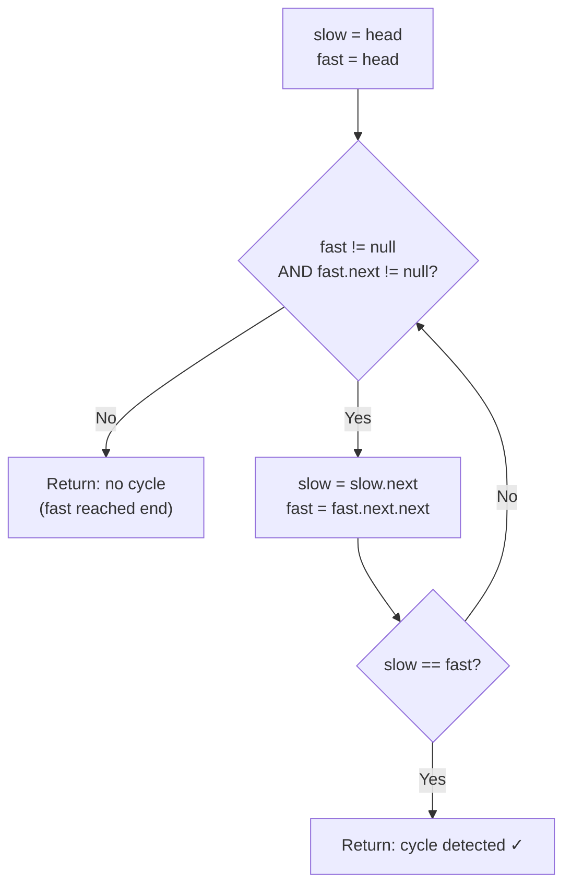

# Fast and Slow Pointer Technique for Linked Lists

> **One-line summary:**
> The fast and slow pointer technique (Floyd's Cycle Detection) moves one pointer one step and another two steps at a time — if a cycle exists the two pointers will always meet inside it, and when there is no cycle the slow pointer lands at the middle node the moment the fast pointer reaches the end; both run in $O(n)$ time and $O(1)$ space.

---

## Table of Contents

1. [What is the Fast and Slow Pointer Technique?](#1-what-is-the-fast-and-slow-pointer-technique)
2. [Why Use Fast and Slow Pointers?](#2-why-use-fast-and-slow-pointers)
3. [How the Technique Works](#3-how-the-technique-works)
4. [Why They Meet Inside a Cycle](#4-why-they-meet-inside-a-cycle)
5. [Detecting a Cycle in a Linked List](#5-detecting-a-cycle-in-a-linked-list)
6. [Finding the Middle Node](#6-finding-the-middle-node)
7. [Step-by-Step Dry Run — Cycle Detection](#7-step-by-step-dry-run--cycle-detection)
8. [Step-by-Step Dry Run — Middle Node](#8-step-by-step-dry-run--middle-node)
9. [Comparing Approaches](#9-comparing-approaches)
10. [Common Mistakes to Avoid](#10-common-mistakes-to-avoid)
11. [Key Takeaways](#11-key-takeaways)
12. [FAQs](#12-faqs)

---

## 1. What is the Fast and Slow Pointer Technique?

Imagine two runners on a circular track. One runs fast and one runs slow. If the track is circular, the fast runner will eventually lap the slow runner — they end up at the same spot. This simple idea powers one of the most elegant techniques in linked list problem solving.

The **fast and slow pointer technique** uses two pointers that move through a linked list at different speeds:
- **Slow pointer** — moves **one step** at a time
- **Fast pointer** — moves **two steps** at a time

This technique is also called **Floyd's Cycle Detection Algorithm**, named after computer scientist Robert Floyd. It appears in three classic problems: detecting cycles, finding midpoints, and locating the start of a cycle.

```
Linked list:  1 → 2 → 3 → 4 → 5 → null

Step 0:  slow = 1,  fast = 1
Step 1:  slow = 2,  fast = 3
Step 2:  slow = 3,  fast = 5
Step 3:  slow = 4,  fast = null  ← no cycle, list is finite
```

---

## 2. Why Use Fast and Slow Pointers?

Before this technique, developers stored visited nodes in a hash map to detect cycles. That works, but costs $O(n)$ extra memory. The fast and slow pointer approach solves the same problems in **$O(1)$ extra space** — no auxiliary data structure needed.

| Approach                    | Cycle Detection Time | Extra Space | Find Middle    |
| --------------------------- | -------------------- | ----------- | -------------- |
| Hash map (store visited)    | $O(n)$               | $O(n)$      | Not directly   |
| Count length, then traverse | N/A                  | $O(1)$      | $O(n)$ 2-pass  |
| Fast and slow pointer       | $O(n)$               | $O(1)$      | $O(n)$ 1-pass  |

Linked lists do not support direct index access — you must traverse from the head. The fast and slow pointer technique extracts useful information in a **single pass**.

---

## 3. How the Technique Works

Both pointers start at the **head**. On every step:

```
slow = slow.next          # advance 1 node
fast = fast.next.next     # advance 2 nodes
```

Two outcomes:
1. **No cycle** — `fast` reaches `null` before the pointers meet → list is finite.
2. **Cycle exists** — the pointers will eventually land on the same node inside the cycle.



---

## 4. Why They Meet Inside a Cycle

Think of the circular track analogy. The fast pointer gains **one node** on the slow pointer every step. If the cycle has length $k$, after both pointers enter the cycle, the fast pointer catches the slow pointer within at most $k$ steps.

```
Distance between fast and slow when they enter the cycle = d
Each step: fast gains 1 on slow → gap reduces by 1 each step
After d steps: gap = 0 → they meet
```

This guarantees a meeting point **if and only if** a cycle exists. The meeting happens inside the cycle, not necessarily at its start. (Finding the cycle start is a separate follow-up covered in the next post.)

---

## 5. Detecting a Cycle in a Linked List

If the list has a cycle, slow and fast will point to the same node. If there is no cycle, fast reaches `null`.

### Python

```python
# Python — Floyd's Cycle Detection
class Node:
    def __init__(self, value):
        self.value = value
        self.next = None


def has_cycle(head):
    slow = head
    fast = head

    while fast is not None and fast.next is not None:
        slow = slow.next         # Move one step
        fast = fast.next.next    # Move two steps

        if slow == fast:         # Pointers met → cycle exists
            return True

    return False   # Fast reached end → no cycle


# Example 1: No cycle — 1 → 2 → 3 → None
node1 = Node(1); node2 = Node(2); node3 = Node(3)
node1.next = node2; node2.next = node3
print(has_cycle(node1))   # Output: False

# Example 2: Cycle — 1 → 2 → 3 → 4 → (back to 2)
node4 = Node(1); node5 = Node(2); node6 = Node(3); node7 = Node(4)
node4.next = node5; node5.next = node6; node6.next = node7
node7.next = node5   # Cycle: node7 points back to node5
print(has_cycle(node4))   # Output: True
```

### C++

```cpp
// C++ — Floyd's Cycle Detection
#include <iostream>

struct Node {
    int value;
    Node* next;
    Node(int val) : value(val), next(nullptr) {}
};

bool hasCycle(Node* head) {
    Node* slow = head;
    Node* fast = head;

    while (fast != nullptr && fast->next != nullptr) {
        slow = slow->next;          // Move one step
        fast = fast->next->next;    // Move two steps

        if (slow == fast)           // Pointers met → cycle exists
            return true;
    }

    return false;   // Fast reached end → no cycle
}

int main() {
    // Example 1: No cycle — 1 → 2 → 3 → nullptr
    Node* n1 = new Node(1); Node* n2 = new Node(2); Node* n3 = new Node(3);
    n1->next = n2; n2->next = n3;
    std::cout << hasCycle(n1) << "\n";   // Output: 0 (false)

    // Example 2: Cycle — 1 → 2 → 3 → 4 → (back to 2)
    Node* n4 = new Node(1); Node* n5 = new Node(2);
    Node* n6 = new Node(3); Node* n7 = new Node(4);
    n4->next = n5; n5->next = n6; n6->next = n7;
    n7->next = n5;   // Cycle: n7 points back to n5
    std::cout << hasCycle(n4) << "\n";   // Output: 1 (true)

    delete n1; delete n2; delete n3; delete n4;
    // Note: n5, n6, n7 form a cycle — would require cycle-aware cleanup
}
```

**Complexity:** $O(n)$ time — pointers traverse at most the full list. $O(1)$ space — only two pointer variables used.

---

## 6. Finding the Middle Node

When the fast pointer reaches the end, the slow pointer is exactly at the **middle**. Fast travels twice as fast as slow, so when fast has covered the whole list, slow has covered half.

### Python

```python
# Python — Find the middle node using fast and slow pointers
def find_middle(head):
    slow = head
    fast = head

    while fast is not None and fast.next is not None:
        slow = slow.next         # Move one step
        fast = fast.next.next    # Move two steps

    return slow   # When fast is at the end, slow is at the middle


# Example: 5 nodes — 10 → 20 → 30 → 40 → 50
n1 = Node(10); n2 = Node(20); n3 = Node(30); n4 = Node(40); n5 = Node(50)
n1.next = n2; n2.next = n3; n3.next = n4; n4.next = n5

print(find_middle(n1).value)   # Output: 30  (3rd of 5 nodes)

# Example: 6 nodes — add Node(60) at the end
n6 = Node(60); n5.next = n6
print(find_middle(n1).value)   # Output: 40  (second middle for even length)
```

### C++

```cpp
// C++ — Find the middle node using fast and slow pointers
Node* findMiddle(Node* head) {
    Node* slow = head;
    Node* fast = head;

    while (fast != nullptr && fast->next != nullptr) {
        slow = slow->next;          // Move one step
        fast = fast->next->next;    // Move two steps
    }

    return slow;   // When fast is at the end, slow is at the middle
}

int main() {
    // 5 nodes: 10 → 20 → 30 → 40 → 50
    Node* n1 = new Node(10); Node* n2 = new Node(20); Node* n3 = new Node(30);
    Node* n4 = new Node(40); Node* n5 = new Node(50);
    n1->next = n2; n2->next = n3; n3->next = n4; n4->next = n5;

    std::cout << findMiddle(n1)->value << "\n";   // Output: 30

    // 6 nodes: add 60
    Node* n6 = new Node(60); n5->next = n6;
    std::cout << findMiddle(n1)->value << "\n";   // Output: 40

    delete n1; delete n2; delete n3; delete n4; delete n5; delete n6;
}
```

For even-length lists, this returns the **second** of the two middle nodes. This is the standard behavior expected in most interview problems.

**Complexity:** $O(n)$ time, $O(1)$ space — one pass, no length calculation needed.

---

## 7. Step-by-Step Dry Run — Cycle Detection

List structure: `1 → 2 → 3 → 4 → 5`, where node 5 points back to node 3.

```
1 → 2 → 3 → 4 → 5
        ↑         |
        └─────────┘  (cycle: 5.next = 3)
```

| Step | slow (node) | fast (node) | Action                                      |
| ---- | ----------- | ----------- | ------------------------------------------- |
| 0    | 1           | 1           | Initial position                            |
| 1    | 2           | 3           | slow→2, fast→1.next.next=3                  |
| 2    | 3           | 5           | slow→3, fast→3.next.next=5                  |
| 3    | 4           | 4           | slow→4, fast→5.next.next=3.next=4 ← **MEET** |

Both pointers land on node `4`. Cycle detected in 3 steps. ✓

---

## 8. Step-by-Step Dry Run — Middle Node

List: `10 → 20 → 30 → 40 → 50` (5 nodes)

| Step | slow (value) | fast (value) | Condition check                        |
| ---- | ------------ | ------------ | -------------------------------------- |
| 0    | 10           | 10           | fast=50≠null, fast.next=null? No (50 has next=null, but 10's fast.next.next=30) |
| 1    | 20           | 30           | fast=30≠null, fast.next=40≠null → continue |
| 2    | 30           | 50           | fast=50≠null, fast.next=null → loop exits |

Loop exits with `slow = 30`. Middle node returned: **30** ✓

For a 6-node list `10 → 20 → 30 → 40 → 50 → 60`:

| Step | slow (value) | fast (value) | Condition check                    |
| ---- | ------------ | ------------ | ---------------------------------- |
| 0    | 10           | 10           | fast≠null, fast.next≠null → continue |
| 1    | 20           | 30           | fast≠null, fast.next≠null → continue |
| 2    | 30           | 50           | fast≠null, fast.next≠null → continue |
| 3    | 40           | null         | fast=null → loop exits             |

Middle node returned: **40** (second middle for even length) ✓

---

## 9. Comparing Approaches

| Approach                 | Cycle Detection | Time     | Space  | Find Middle | Time     | Space  |
| ------------------------ | --------------- | -------- | ------ | ----------- | -------- | ------ |
| Hash map (store visited) | ✅ Yes          | $O(n)$   | $O(n)$ | ❌ No       | —        | —      |
| Count length, then walk  | ❌ No           | —        | —      | ✅ Yes      | $O(n)$   | $O(1)$ |
| Fast and slow pointer    | ✅ Yes          | $O(n)$   | $O(1)$ | ✅ Yes      | $O(n)$   | $O(1)$ |

The fast and slow pointer technique wins on **space efficiency** for cycle detection and on **simplicity** for middle-node finding (single pass vs two passes).

---

## 10. Common Mistakes to Avoid

**1. Not checking both `fast` and `fast.next` before advancing**

Fast moves two steps. If the list has an even number of nodes, `fast.next` could be the last valid node and `fast.next.next` would be `null` — then accessing `null.next` crashes.

```python
# Wrong — crashes when fast.next is None
while fast is not None:
    fast = fast.next.next   # fast.next could be None!

# Correct — guard both conditions
while fast is not None and fast.next is not None:
    fast = fast.next.next
```

```cpp
// Correct C++ guard
while (fast != nullptr && fast->next != nullptr) {
    fast = fast->next->next;
}
```

**2. Starting the pointers at different positions**

Both pointers must start from **head**. If you start fast from `head.next`, the relative distance changes and the logic breaks.

**3. Checking `slow == fast` before moving**

If you check equality before the first move, both pointers are at `head` and you immediately return `true` for every list. Always move first, then check.

```python
# Wrong — returns True immediately on any non-empty list
while fast is not None and fast.next is not None:
    if slow == fast:    # checked before any movement
        return True
    slow = slow.next
    fast = fast.next.next

# Correct — move first, then check
while fast is not None and fast.next is not None:
    slow = slow.next
    fast = fast.next.next
    if slow == fast:    # checked after movement
        return True
```

---

## 11. Key Takeaways

- The fast and slow pointer technique uses two pointers — slow moves 1 step, fast moves 2 steps.
- It is also called **Floyd's Cycle Detection Algorithm**.
- Pointers will meet inside a cycle if and only if one exists; the fast pointer gaining 1 node per step on the slow pointer guarantees convergence.
- When the fast pointer reaches the end of a cycle-free list, the slow pointer is exactly at the **middle node**.
- The technique runs in $O(n)$ time and $O(1)$ space — a major improvement over hash map approaches.
- Always guard the loop with `fast != null AND fast.next != null` before advancing two steps.
- Always move the pointers **before** checking if they are equal — not before.
- This pattern generalises: two-pointer strategies appear in arrays (sliding window), strings, and graphs throughout DSA.

---

## 12. FAQs

**Why does the fast pointer move exactly two steps and not three or more?**

Two steps is the simplest ratio that guarantees meeting inside any cycle. With three steps the pointers can sometimes "skip over" each other, requiring more careful analysis. Two steps keeps the proof and implementation clean.

**Does this technique work for doubly linked lists?**

Yes. A doubly linked list still has a `next` pointer, so the same fast/slow traversal applies. The extra `prev` pointer is unused and does not affect the logic.

**What happens if the list is empty or has only one node?**

- Empty list: `head` is `null` / `nullptr` → the while condition fails immediately → returns `false`. Handled correctly.
- One node with no `next`: `fast.next` is `null` → condition fails immediately → returns `false`. Handled correctly.

**Does the meeting point tell us where the cycle starts?**

No — the meeting point is somewhere inside the cycle, not necessarily its start. To find the exact start of the cycle, reset one pointer to the head after the meeting and advance both one step at a time. The point where they meet again is the cycle start. This is covered in the next post in this series.

**Can slow and fast ever meet on the very first step?**

Only if the first node's `next` points back to itself (a one-node cycle). In that case, after one step slow = `head.next` and fast = `head.next.next` = `head.next` = slow. They meet immediately and the cycle is detected correctly.
