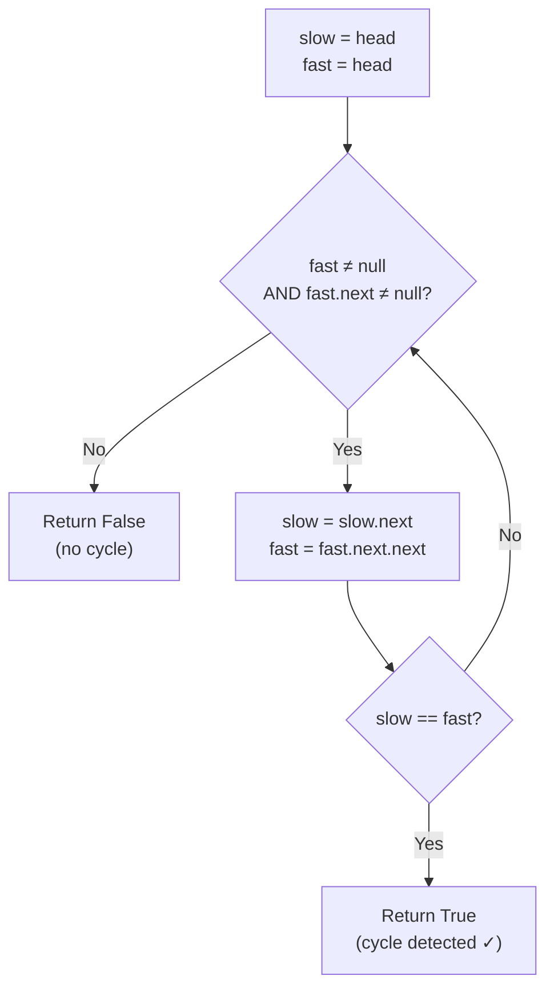

# Detect a Cycle in a Linked List — Fast-Slow Pointers

> **One-line summary:**
> A cycle exists when a node's `next` pointer points back to a previous node — the hash set approach detects it in $O(n)$ time but costs $O(n)$ space, while Floyd's fast-slow pointer algorithm (Tortoise and Hare) solves it in $O(n)$ time and $O(1)$ space by guaranteeing the two pointers will always meet inside any cycle.

---

## Table of Contents

1. [What is a Cycle in a Linked List?](#1-what-is-a-cycle-in-a-linked-list)
2. [Why Cycle Detection Matters](#2-why-cycle-detection-matters)
3. [Approach 1 — Hash Set](#3-approach-1--hash-set)
4. [Approach 2 — Floyd's Cycle Detection Algorithm](#4-approach-2--floyds-cycle-detection-algorithm)
5. [Floyd's Algorithm Code](#5-floyds-algorithm-code)
6. [Dry Run Walkthrough](#6-dry-run-walkthrough)
7. [Edge Cases to Consider](#7-edge-cases-to-consider)
8. [Comparison of Both Approaches](#8-comparison-of-both-approaches)
9. [Key Takeaways](#9-key-takeaways)
10. [FAQs](#10-faqs)

---

## 1. What is a Cycle in a Linked List?

Imagine walking through a hallway and suddenly ending up back where you started. You keep walking but never reach the exit. That is exactly what a cycle in a linked list looks like to a computer program.

A linked list has a **cycle** when one of the nodes points back to a **previous node** instead of pointing to `null`. This creates an infinite loop that can crash your program or cause it to run forever.

```
No cycle — terminates normally:
  1 → 2 → 3 → 4 → null

Cycle — infinite loop:
  1 → 2 → 3 → 4
          ↑       |
          └───────┘   (node 4 points back to node 2)
```

---

## 2. Why Cycle Detection Matters

When you traverse a linked list normally, you expect it to end at a `null` node. If there is a cycle, traversal never ends and your program hangs.

This is a very common interview problem and also appears in real-world systems like memory management and process scheduling. There are two main approaches — let us look at both.

---

## 3. Approach 1 — Hash Set

The simplest idea: store every visited node in a set. If you encounter a node already in the set, a cycle exists.

**Time:** $O(n)$ — **Space:** $O(n)$ (stores one entry per node)

### Python

```python
# Python — Cycle detection using a hash set
class Node:
    def __init__(self, value):
        self.value = value
        self.next = None


def has_cycle_hash(head):
    visited = set()          # Store references to visited nodes
    current = head
    while current is not None:
        if current in visited:   # Node seen before → cycle found
            return True
        visited.add(current)
        current = current.next
    return False             # Reached null → no cycle


# List with cycle: 1 → 2 → 3 → 4 → (back to 2)
node1 = Node(1); node2 = Node(2); node3 = Node(3); node4 = Node(4)
node1.next = node2; node2.next = node3; node3.next = node4
node4.next = node2   # cycle

print(has_cycle_hash(node1))   # Output: True
```

### C++ (simple)

```cpp
// C++ — Cycle detection using an unordered_set
#include <iostream>
#include <unordered_set>

struct Node {
    int value;
    Node* next;
    Node(int val) : value(val), next(nullptr) {}
};

bool hasCycleHash(Node* head) {
    std::unordered_set<Node*> visited;
    Node* current = head;
    while (current != nullptr) {
        if (visited.count(current))   // Node seen before → cycle found
            return true;
        visited.insert(current);
        current = current->next;
    }
    return false;   // Reached nullptr → no cycle
}

int main() {
    Node* n1 = new Node(1); Node* n2 = new Node(2);
    Node* n3 = new Node(3); Node* n4 = new Node(4);
    n1->next = n2; n2->next = n3; n3->next = n4;
    n4->next = n2;   // cycle back to n2

    std::cout << hasCycleHash(n1) << "\n";   // Output: 1 (true)
    // Note: cycle-aware cleanup needed before delete
}
```

### C++ (LeetCode class style)

```cpp
// C++ (LeetCode class style) — Cycle detection using hash set (LeetCode 141)
#include <unordered_set>

struct ListNode {
    int val;
    ListNode* next;
    ListNode(int x) : val(x), next(nullptr) {}
};

class Solution {
public:
    bool hasCycle(ListNode* head) {
        std::unordered_set<ListNode*> visited;  // store addresses of visited nodes
        ListNode* current = head;               // start at the head
        while (current != nullptr) {
            if (visited.count(current))         // node seen before → cycle found
                return true;
            visited.insert(current);            // mark this node as visited
            current = current->next;            // advance to next node
        }
        return false;   // reached nullptr → no cycle
    }
};
```

The set catches the cycle when node 2 is visited a second time. While correct, the $O(n)$ extra space is a drawback — we can do better.

---

## 4. Approach 2 — Floyd's Cycle Detection Algorithm

This is the most popular and efficient approach, also called the **Tortoise and Hare** algorithm. It uses the fast and slow pointer technique covered in the previous post.

Two runners on a circular track: the slow runner takes one step, the fast runner takes two. If the track is circular, the fast runner laps the slow runner and they meet. If the track is a straight road, the fast runner reaches the end first and they never meet.

```
slow  →  moves 1 node per step  (tortoise)
fast  →  moves 2 nodes per step (hare)

If cycle exists:  fast gains 1 node on slow per step
                  → they will always meet inside the cycle

If no cycle:      fast reaches null → loop exits → return false
```

**Time:** $O(n)$ — **Space:** $O(1)$ (only two pointer variables)



---

## 5. Floyd's Algorithm Code

### Python

```python
# Python — Floyd's Cycle Detection (Tortoise and Hare)
class Node:
    def __init__(self, value):
        self.value = value
        self.next = None


def has_cycle_floyd(head):
    slow = head   # tortoise: moves 1 step
    fast = head   # hare:     moves 2 steps

    while fast is not None and fast.next is not None:
        slow = slow.next         # move slow by 1
        fast = fast.next.next    # move fast by 2

        if slow == fast:         # they met → cycle detected
            return True

    return False   # fast reached null → no cycle


# Example 1: cycle — 1 → 2 → 3 → 4 → (back to 2)
node1 = Node(1); node2 = Node(2); node3 = Node(3); node4 = Node(4)
node1.next = node2; node2.next = node3; node3.next = node4
node4.next = node2   # cycle

print(has_cycle_floyd(node1))   # Output: True

# Example 2: no cycle — 1 → 2 → 3 → None
nodeA = Node(1); nodeB = Node(2); nodeC = Node(3)
nodeA.next = nodeB; nodeB.next = nodeC

print(has_cycle_floyd(nodeA))   # Output: False
```

### C++ (simple)

```cpp
// C++ — Floyd's Cycle Detection (Tortoise and Hare)
#include <iostream>

struct Node {
    int value;
    Node* next;
    Node(int val) : value(val), next(nullptr) {}
};

bool hasCycleFloyd(Node* head) {
    Node* slow = head;   // tortoise: moves 1 step
    Node* fast = head;   // hare:     moves 2 steps

    while (fast != nullptr && fast->next != nullptr) {
        slow = slow->next;          // move slow by 1
        fast = fast->next->next;    // move fast by 2

        if (slow == fast)           // they met → cycle detected
            return true;
    }

    return false;   // fast reached nullptr → no cycle
}

int main() {
    // Example 1: cycle — 1 → 2 → 3 → 4 → (back to 2)
    Node* n1 = new Node(1); Node* n2 = new Node(2);
    Node* n3 = new Node(3); Node* n4 = new Node(4);
    n1->next = n2; n2->next = n3; n3->next = n4;
    n4->next = n2;   // cycle

    std::cout << hasCycleFloyd(n1) << "\n";   // Output: 1 (true)

    // Example 2: no cycle — 1 → 2 → 3 → nullptr
    Node* nA = new Node(1); Node* nB = new Node(2); Node* nC = new Node(3);
    nA->next = nB; nB->next = nC;

    std::cout << hasCycleFloyd(nA) << "\n";   // Output: 0 (false)

    delete nA; delete nB; delete nC;
    // n1–n4 form a cycle; cycle-aware cleanup needed
}
```

### C++ (LeetCode class style)

```cpp
// C++ (LeetCode class style) — Floyd's Cycle Detection (LeetCode 141)
struct ListNode {
    int val;
    ListNode* next;
    ListNode(int x) : val(x), next(nullptr) {}
};

class Solution {
public:
    bool hasCycle(ListNode* head) {
        ListNode* slow = head;   // tortoise: moves 1 step
        ListNode* fast = head;   // hare:     moves 2 steps

        while (fast != nullptr && fast->next != nullptr) {
            slow = slow->next;          // advance slow by 1
            fast = fast->next->next;    // advance fast by 2
            if (slow == fast)           // pointers met → cycle detected
                return true;
        }
        return false;   // fast reached nullptr → no cycle
    }
};
```

---

## 6. Dry Run Walkthrough

List: `1 → 2 → 3 → 4 → (back to 2)`

```
1 → 2 → 3 → 4
    ↑           |
    └───────────┘
```

| Step  | slow (node value) | fast (node value)                      | Met? |
| ----- | ----------------- | -------------------------------------- | ---- |
| Start | 1                 | 1                                      | No   |
| 1     | 2                 | 3                                      | No   |
| 2     | 3                 | 2 (via 4→2)                            | No   |
| 3     | 4                 | 4 (via 2→3→4→... wait, 3→4 then 4→2→3) |      |

Let us trace more carefully:

- **Start:** slow=node1(1), fast=node1(1)
- **Step 1:** slow=node2(2), fast=node3(3)
- **Step 2:** slow=node3(3), fast=node3.next.next=node4.next=node2(2) → fast=node2(2)...

Wait, `fast = fast.next.next` from node3 means `node3.next=node4`, `node4.next=node2` → fast lands on node2(2).

- **Step 3:** slow=node4(4), fast=node2.next.next=node3.next=node4(4) → **slow == fast = node4** ✓

| Step  | slow | fast | fast path           | Met?      |
| ----- | ---- | ---- | ------------------- | --------- |
| Start | 1    | 1    | —                   | No        |
| 1     | 2    | 3    | 1→2→3               | No        |
| 2     | 3    | 2    | 3→4→2 (cycle wraps) | No        |
| 3     | 4    | 4    | 2→3→4               | **Yes ✓** |

Cycle detected at node4 in **3 steps**.

---

## 7. Edge Cases to Consider

| Case                            | Expected Result | How the algorithm handles it                     |
| ------------------------------- | --------------- | ------------------------------------------------ |
| Empty list (`head = null`)      | `False`         | While condition `fast != null` fails immediately |
| Single node, `next = null`      | `False`         | `fast.next` is null → while condition fails      |
| Single node pointing to itself  | `True`          | After step 1: slow=node, fast=node → they meet   |
| Two nodes, `node2.next = node1` | `True`          | After step 1: slow=node2, fast=node2 → they meet |
| Long list, no cycle             | `False`         | fast reaches null and loop exits cleanly         |

The guard `fast is not None and fast.next is not None` handles all these safely — no special casing needed.

---

## 8. Comparison of Both Approaches

| Feature               | Hash Set Approach      | Floyd's Algorithm      |
| --------------------- | ---------------------- | ---------------------- |
| Time complexity       | $O(n)$                 | $O(n)$                 |
| Space complexity      | $O(n)$                 | $O(1)$                 |
| Extra memory required | Yes — stores all nodes | No — only 2 pointers   |
| Ease of understanding | Very simple            | Slightly more involved |
| Interview preference  | Acceptable             | **Preferred**          |
| Finds cycle start     | Yes (first duplicate)  | Needs extra step       |

Floyd's algorithm is always preferred in interviews because it solves the problem in constant space. The hash set method is easier to think of first but costs $O(n)$ extra memory.

---

## 9. Key Takeaways

- A **cycle** in a linked list means a node's `next` pointer points back to a previous node, making traversal infinite.
- The **hash set approach** ($O(n)$ space) is simple but uses extra memory proportional to list size.
- **Floyd's Cycle Detection Algorithm** (Tortoise and Hare) detects cycles in $O(n)$ time and $O(1)$ space — the preferred approach in interviews.
- Both pointers must start at the **head**; slow moves 1 step, fast moves 2 steps.
- The loop condition `fast != null AND fast.next != null` is essential — missing it causes a null-pointer crash.
- Move the pointers **before** checking equality — checking before the first step gives a false positive on any non-empty list.
- Floyd's meeting point is inside the cycle but not necessarily its start. Finding the cycle start requires an additional step (covered in the next post).

---

## 10. FAQs

**Why does the fast pointer move two steps and not more?**

Two steps is the minimum speed difference that guarantees meeting inside any cycle. Moving three or more steps also works mathematically but can miss the meeting point in certain cycle lengths without extra analysis. Two steps keeps the proof and implementation simple.

**Can a linked list have more than one cycle?**

No. A singly linked list can have at most one cycle. Since each node has only one `next` pointer, once a loop is created it forms a single circular path. Multiple separate cycles are not possible in a standard singly linked list.

**Does Floyd's algorithm work for doubly linked lists?**

Yes. The `prev` pointer in a doubly linked list is unused by the algorithm. You traverse only via `next`, so the same fast-slow logic applies without modification.

**How do I find the exact node where the cycle starts?**

After slow and fast meet, reset one pointer to `head`. Then advance both pointers **one step at a time**. The node where they meet again is the start of the cycle. This works because of a mathematical property of the distances involved, and is covered as a separate problem in the next post.

**Which approach should I code first in an interview?**

State both approaches and their trade-offs. Then implement Floyd's algorithm since interviewers expect the $O(1)$ space solution. Mentioning the hash set approach first shows you understand the problem broadly before optimising.
