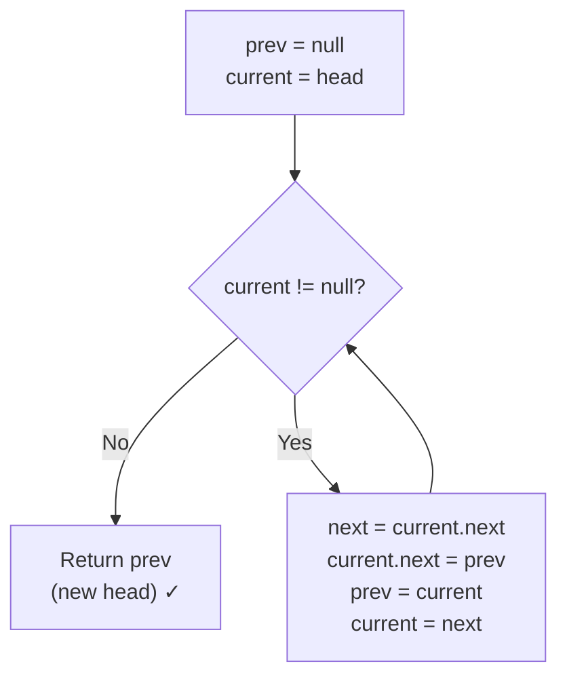

# Reverse a Linked List — Iterative and Recursive

> **One-line summary:**
> Reversing a linked list flips every `next` pointer so the tail becomes the new head — the iterative approach uses three pointers (`prev`, `current`, `next`) in $O(1)$ space, while the recursive approach uses the call stack to reach the end first and flips pointers on the way back in $O(n)$ space.

---

## Table of Contents

1. [What Does Reversing a Linked List Mean?](#1-what-does-reversing-a-linked-list-mean)
2. [Visual Goal](#2-visual-goal)
3. [Iterative Approach](#3-iterative-approach)
4. [Iterative Dry Run](#4-iterative-dry-run)
5. [Iterative Code](#5-iterative-code)
6. [Recursive Approach](#6-recursive-approach)
7. [Recursive Dry Run](#7-recursive-dry-run)
8. [Recursive Code](#8-recursive-code)
9. [Iterative vs Recursive — Comparison](#9-iterative-vs-recursive--comparison)
10. [Edge Cases to Watch Out For](#10-edge-cases-to-watch-out-for)
11. [Where Is This Used in Real Problems?](#11-where-is-this-used-in-real-problems)
12. [Key Takeaways](#12-key-takeaways)
13. [FAQs](#13-faqs)

---

## 1. What Does Reversing a Linked List Mean?

Imagine a train with wagons connected one after another. Reversing the train means the last wagon becomes the front and every connection flips its direction. That is exactly what reversing a linked list does.

In a singly linked list, each node points to the **next** node. After reversing, each node should point to the **previous** node instead. The tail becomes the new head, and the old head's `next` becomes `null`.

This is one of the most popular interview questions you will face, and it is a building block for many harder linked list problems.

---

## 2. Visual Goal

```
Before:
  head
   ↓
  [1] → [2] → [3] → [4] → [5] → null

After:
                              head
                               ↓
  null ← [1] ← [2] ← [3] ← [4] ← [5]

  Which reads as:  5 → 4 → 3 → 2 → 1 → null
```

Every `next` pointer flips direction. `null` moves from the tail to the head side.

---

## 3. Iterative Approach

The iterative method uses **three pointers** to flip one link at a time as we walk through the list. Think of it like redirecting traffic at one junction at a time.

```
Three pointers:
  prev     — the node behind current (starts as null)
  current  — the node we are processing right now
  next     — temporarily holds current.next before we overwrite it

Each step:
  1. Save next = current.next  (before we lose it)
  2. Flip  current.next = prev (point backward)
  3. Advance prev = current
  4. Advance current = next
```



---

## 4. Iterative Dry Run

List: `1 → 2 → 3 → null`

| Step | prev | current | next | Action                       | State after      |
| ---- | ---- | ------- | ---- | ---------------------------- | ---------------- |
| Init | null | 1       | —    | —                            | 1→2→3→null       |
| 1    | null | 1       | 2    | 1.next = null, prev=1, cur=2 | null←1 2→3→null  |
| 2    | 1    | 2       | 3    | 2.next = 1, prev=2, cur=3    | null←1←2 3→null  |
| 3    | 2    | 3       | null | 3.next = 2, prev=3, cur=null | null←1←2←3       |
| Done | 3    | null    | —    | Return prev=3 as new head    | **3→2→1→null** ✓ |

---

## 5. Iterative Code

### Python

```python
# Python — Reverse a linked list iteratively
class Node:
    def __init__(self, data):
        self.data = data
        self.next = None


def reverse_iterative(head):
    prev = None       # Will become null at the new tail
    current = head    # Start at the old head

    while current is not None:
        next_node = current.next   # 1. Save next before overwriting
        current.next = prev        # 2. Flip the pointer backward
        prev = current             # 3. Advance prev
        current = next_node        # 4. Advance current

    return prev   # prev is now the new head


# Build: 1 → 2 → 3 → 4 → 5
head = Node(1)
head.next = Node(2)
head.next.next = Node(3)
head.next.next.next = Node(4)
head.next.next.next.next = Node(5)

new_head = reverse_iterative(head)

temp = new_head
while temp:
    print(temp.data, end=" -> ")
    temp = temp.next
print("None")
# Output: 5 -> 4 -> 3 -> 2 -> 1 -> None
```

### C++ (simple)

```cpp
// C++ — Reverse a linked list iteratively
#include <iostream>

struct Node {
    int data;
    Node* next;
    Node(int val) : data(val), next(nullptr) {}
};

Node* reverseIterative(Node* head) {
    Node* prev    = nullptr;
    Node* current = head;

    while (current != nullptr) {
        Node* next_node = current->next;   // 1. Save next before overwriting
        current->next   = prev;            // 2. Flip the pointer backward
        prev            = current;         // 3. Advance prev
        current         = next_node;       // 4. Advance current
    }

    return prev;   // prev is now the new head
}

void printList(Node* head) {
    while (head) {
        std::cout << head->data << " -> ";
        head = head->next;
    }
    std::cout << "nullptr\n";
}

int main() {
    Node* head = new Node(1);
    head->next = new Node(2);
    head->next->next = new Node(3);
    head->next->next->next = new Node(4);
    head->next->next->next->next = new Node(5);

    Node* new_head = reverseIterative(head);
    printList(new_head);
    // Output: 5 -> 4 -> 3 -> 2 -> 1 -> nullptr

    // Clean up
    Node* cur = new_head;
    while (cur) { Node* tmp = cur->next; delete cur; cur = tmp; }
}
```

### C++ (LeetCode class style)

```cpp
// C++ (LeetCode class style) — Reverse a linked list iteratively (LeetCode 206)
struct ListNode {
    int val;
    ListNode* next;
    ListNode(int x) : val(x), next(nullptr) {}
};

class Solution {
public:
    ListNode* reverseList(ListNode* head) {
        ListNode* prev    = nullptr;   // will become the new tail (null)
        ListNode* current = head;      // start at the old head

        while (current != nullptr) {
            ListNode* next_node = current->next;   // 1. save next before overwriting
            current->next       = prev;            // 2. flip pointer backward
            prev                = current;         // 3. advance prev
            current             = next_node;       // 4. advance current
        }
        return prev;   // prev is now pointing to the new head
    }
};
```

> The critical insight: always save `current.next` **before** overwriting it. If you skip this step, you lose access to the rest of the list.

---

## 6. Recursive Approach

The recursive method uses the **call stack** to reach the end of the list first, then flips pointers on the way back. Think of walking to the last room in a hallway, then closing each door behind you as you return.

Each recursive call handles one node and passes the rest forward. The **base case** is the last node — it becomes the new head and is returned all the way back up the chain.

```
reverse(1)
  └── calls reverse(2)
        └── calls reverse(3)
              └── Base case: 3.next = null → return 3 as new_head
              ← Back in reverse(2):
                  3.next = 2    (flip: 2→3 becomes 3→2)
                  2.next = null (break old forward link)
                  return new_head (3)
        ← Back in reverse(1):
            2.next = 1    (flip: 1→2 becomes 2→1)
            1.next = null
            return new_head (3)

Final: 3 → 2 → 1 → null
```

---

## 7. Recursive Dry Run

List: `1 → 2 → 3 → null`

| Call frame    | Action                                | Links after action            |
| ------------- | ------------------------------------- | ----------------------------- |
| `reverse(1)`  | calls `reverse(2)`                    | waiting…                      |
| `reverse(2)`  | calls `reverse(3)`                    | waiting…                      |
| `reverse(3)`  | base case: `3.next = null` → return 3 | new_head = 3                  |
| back in `(2)` | `3.next = 2`, `2.next = null`         | null←2←3, new_head = 3        |
| back in `(1)` | `2.next = 1`, `1.next = null`         | **null←1←2←3** = 3→2→1→null ✓ |

---

## 8. Recursive Code

### Python

```python
# Python — Reverse a linked list recursively
class Node:
    def __init__(self, data):
        self.data = data
        self.next = None


def reverse_recursive(head):
    # Base case: empty list or single node — already reversed
    if head is None or head.next is None:
        return head

    # Recurse on the rest of the list
    new_head = reverse_recursive(head.next)

    # On the way back: flip the connection
    head.next.next = head   # next node now points back to head
    head.next = None        # break the old forward link

    return new_head   # always the original last node


# Build: 1 → 2 → 3 → 4 → 5
head = Node(1)
head.next = Node(2)
head.next.next = Node(3)
head.next.next.next = Node(4)
head.next.next.next.next = Node(5)

new_head = reverse_recursive(head)

temp = new_head
while temp:
    print(temp.data, end=" -> ")
    temp = temp.next
print("None")
# Output: 5 -> 4 -> 3 -> 2 -> 1 -> None
```

### C++ (simple)

```cpp
// C++ — Reverse a linked list recursively
#include <iostream>

struct Node {
    int data;
    Node* next;
    Node(int val) : data(val), next(nullptr) {}
};

Node* reverseRecursive(Node* head) {
    // Base case: empty list or single node
    if (head == nullptr || head->next == nullptr)
        return head;

    // Recurse on the rest of the list
    Node* new_head = reverseRecursive(head->next);

    // On the way back: flip the connection
    head->next->next = head;   // next node points back to head
    head->next = nullptr;      // break the old forward link

    return new_head;   // always the original last node
}

void printList(Node* head) {
    while (head) {
        std::cout << head->data << " -> ";
        head = head->next;
    }
    std::cout << "nullptr\n";
}

int main() {
    Node* head = new Node(1);
    head->next = new Node(2);
    head->next->next = new Node(3);
    head->next->next->next = new Node(4);
    head->next->next->next->next = new Node(5);

    Node* new_head = reverseRecursive(head);
    printList(new_head);
    // Output: 5 -> 4 -> 3 -> 2 -> 1 -> nullptr

    Node* cur = new_head;
    while (cur) { Node* tmp = cur->next; delete cur; cur = tmp; }
}
```

### C++ (LeetCode class style)

```cpp
// C++ (LeetCode class style) — Reverse a linked list recursively (LeetCode 206)
struct ListNode {
    int val;
    ListNode* next;
    ListNode(int x) : val(x), next(nullptr) {}
};

class Solution {
public:
    ListNode* reverseList(ListNode* head) {
        // Base case: empty list or single node — already reversed
        if (head == nullptr || head->next == nullptr)
            return head;

        // Recurse: go to the end of the list first
        ListNode* new_head = reverseList(head->next);

        // On the way back: flip the connection
        head->next->next = head;   // next node now points back to head
        head->next = nullptr;      // break the old forward link

        return new_head;   // original last node is now the head
    }
};
```

> The magic line is `head.next.next = head` — it makes the node that was ahead of `head` point **back** to `head`. Then `head.next = None` cuts the old forward link to prevent a cycle.

---

## 9. Iterative vs Recursive — Comparison

| Feature                 | Iterative                      | Recursive                    |
| ----------------------- | ------------------------------ | ---------------------------- |
| Space complexity        | $O(1)$ — no extra memory       | $O(n)$ — call stack per node |
| Time complexity         | $O(n)$                         | $O(n)$                       |
| Risk of stack overflow  | No                             | Yes — for very large lists   |
| Readability             | Slightly longer, very clear    | Short and elegant            |
| Beginner friendly       | Yes                            | Moderate                     |
| Preferred in production | ✅ Yes                         | Only for small lists         |
| Preferred in interviews | ✅ Both — show iterative first | Then offer recursive as well |

For production code or very large lists, always prefer the iterative approach. The recursive version is great for interview clarity, but mention the stack-overflow risk.

---

## 10. Edge Cases to Watch Out For

| Case             | Expected result   | Handled by…                                   |
| ---------------- | ----------------- | --------------------------------------------- |
| `head = null`    | Return `null`     | Base case: `if head is None return head`      |
| Single node      | Return same node  | Base case: `if head.next is None return head` |
| Two nodes `1→2`  | `2→1→null`        | Both approaches handle this correctly         |
| Already reversed | Returns correctly | Algorithm is direction-agnostic               |

Both implementations handle all edge cases through the single base-case check:

```python
if head is None or head.next is None:
    return head
```

```cpp
if (head == nullptr || head->next == nullptr)
    return head;
```

---

## 11. Where Is This Used in Real Problems?

Reversing a linked list is not just a standalone problem — it is a building block for many harder problems:

- **Palindrome linked list** — reverse the second half and compare with the first.
- **Reverse a sublist** — reverse only nodes between positions $m$ and $n$.
- **Reorder list** — interleave the first half with the reversed second half.
- **Undo operations** — use a reversed linked list as a stack to replay actions in reverse.
- **K-group reversal** — reverse every $k$ consecutive nodes (a popular hard interview problem).

Once you are comfortable with this technique, many medium and hard linked list problems become significantly easier to approach.

---

## 12. Key Takeaways

- Reversing a linked list means flipping every `next` pointer so the tail becomes the new head.
- **Iterative method**: three pointers (`prev`, `current`, `next`) — flip one link per step. $O(n)$ time, $O(1)$ space.
- **Recursive method**: reach the last node first (base case), flip connections on the way back up the call stack. $O(n)$ time, $O(n)$ space.
- Always save `current.next` before overwriting it in the iterative version — skipping this loses the rest of the list.
- The recursive magic line is `head.next.next = head` followed immediately by `head.next = None`.
- Both handle empty and single-node lists through the same base-case check.
- For production code or large lists, prefer iterative. For interview clarity, show both.

---

## 13. FAQs

**Which is better — iterative or recursive for reversing a linked list?**

The iterative approach is preferred for production code because it uses $O(1)$ space and has no stack-overflow risk. In interviews, show the iterative solution first, then offer the recursive version as an alternative and mention the space trade-off.

**Can we reverse a doubly linked list the same way?**

Not exactly. A doubly linked list has both `next` and `prev` pointers, so reversing it means **swapping** both pointers in every node. The logic is similar but requires updating two links per node instead of one.

**What is the time complexity?**

Both approaches visit every node exactly once → $O(n)$ time. The iterative approach uses $O(1)$ extra space; the recursive approach uses $O(n)$ space due to the call stack depth.

**Does reversing a linked list modify the original list?**

Yes — the original `head` pointer now points to what was the last node, and all `next` pointers are flipped in-place. After reversal the original variable (`head`) is the tail of the reversed list. Use the returned `new_head` to access the reversed list.

**How do I reverse only a portion of a linked list (positions m to n)?**

Traverse to position $m-1$, then apply the iterative reversal only on the sublist from $m$ to $n$, and reconnect the surrounding nodes. This is a common follow-up interview problem that builds directly on the full-list reversal technique.
