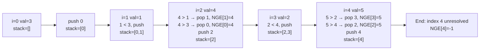

# Monotonic Stack Explained: Examples and When to Use

> **One-line summary:** A monotonic stack is a stack that enforces strict increasing or decreasing order — each push may pop multiple elements, letting you resolve "next/previous greater/smaller" queries for an entire array in $O(n)$ time.

---

## Table of Contents

1. [What is a Monotonic Stack?](#1-what-is-a-monotonic-stack)
2. [Types of Monotonic Stacks](#2-types-of-monotonic-stacks)
3. [How a Monotonic Stack Works Step by Step](#3-how-a-monotonic-stack-works-step-by-step)
4. [Next Greater Element — Code Example](#4-next-greater-element--code-example)
5. [Next Smaller Element with Monotonic Increasing Stack](#5-next-smaller-element-with-monotonic-increasing-stack)
6. [Real-Life Analogy](#6-real-life-analogy)
7. [Common Problems That Use Monotonic Stack](#7-common-problems-that-use-monotonic-stack)
8. [Previous Greater Element — Quick Example](#8-previous-greater-element--quick-example)
9. [Key Tips for Using Monotonic Stack](#9-key-tips-for-using-monotonic-stack)
10. [Monotonic Stack vs Regular Stack](#10-monotonic-stack-vs-regular-stack)
11. [Complexity Summary](#11-complexity-summary)
12. [Key Takeaways](#12-key-takeaways)
13. [FAQs](#13-faqs)

---

## 1. What is a Monotonic Stack?

A **monotonic stack** is a stack where elements are always maintained in either increasing or decreasing order from bottom to top. The word _monotonic_ simply means "always going in one direction."

A regular stack follows the Last In First Out (LIFO) rule with no constraint on element order. A monotonic stack adds one rule: **before pushing a new element, pop all elements that would violate the order**. Every popped element gets its answer (next/previous greater or smaller) resolved at that moment.

```
Regular stack (no order)     Monotonic Decreasing stack
  top →  [ 2 ]                 top →  [ 1 ]
         [ 7 ]                        [ 2 ]
         [ 3 ]                        [ 5 ]
         [ 9 ]                        [ 9 ]   ← bottom (largest)
```

This constraint is what makes the technique powerful — each element is pushed and popped **at most once**, giving an $O(n)$ solution to problems that would otherwise take $O(n^2)$.

---

## 2. Types of Monotonic Stacks

### Monotonic Increasing Stack

Elements go from **smallest at the bottom to largest at the top**.  
When pushing a new element $X$, pop all elements **greater than** $X$ first.

> Used to find the **Next Smaller Element** or **Previous Smaller Element**.

### Monotonic Decreasing Stack

Elements go from **largest at the bottom to smallest at the top**.  
When pushing a new element $X$, pop all elements **smaller than** $X$ first.

> Used to find the **Next Greater Element** or **Previous Greater Element**.

| Type             | Order (Bottom → Top) | Pop condition when pushing X | Common use case                 |
| ---------------- | -------------------- | ---------------------------- | ------------------------------- |
| Increasing Stack | Small → Large        | Pop if top **>** X           | Next / Previous Smaller Element |
| Decreasing Stack | Large → Small        | Pop if top **<** X           | Next / Previous Greater Element |

---

## 3. How a Monotonic Stack Works Step by Step

**Problem:** Given `[3, 1, 4, 2, 5]`, find the **Next Greater Element (NGE)** for each index.  
The NGE of an element is the first element to its **right** that is strictly greater.

We use a **monotonic decreasing stack** that stores **indices**, processing left to right.



**Dry run trace:**

| Step | i   | val | Action                         | Stack (indices) | result           |
| ---- | --- | --- | ------------------------------ | --------------- | ---------------- |
| 1    | 0   | 3   | push 0                         | [0]             | [-1,-1,-1,-1,-1] |
| 2    | 1   | 1   | 1 < 3 → push 1                 | [0, 1]          | [-1,-1,-1,-1,-1] |
| 3    | 2   | 4   | 4 > arr[1]=1 → pop 1, NGE[1]=4 | [0]             | [-1,4,-1,-1,-1]  |
| 4    | 2   | 4   | 4 > arr[0]=3 → pop 0, NGE[0]=4 | []              | [4,4,-1,-1,-1]   |
| 5    | 2   | 4   | push 2                         | [2]             | [4,4,-1,-1,-1]   |
| 6    | 3   | 2   | 2 < 4 → push 3                 | [2, 3]          | [4,4,-1,-1,-1]   |
| 7    | 4   | 5   | 5 > arr[3]=2 → pop 3, NGE[3]=5 | [2]             | [4,4,-1,5,-1]    |
| 8    | 4   | 5   | 5 > arr[2]=4 → pop 2, NGE[2]=5 | []              | [4,4,5,5,-1]     |
| 9    | 4   | 5   | push 4                         | [4]             | [4,4,5,5,-1]     |
| 10   | —   | —   | end: index 4 unresolved → -1   | []              | [4,4,5,5,-1]     |

**Final answer:** `[4, 4, 5, 5, -1]`

---

## 4. Next Greater Element — Code Example

**Python:**

```python
# Next Greater Element using Monotonic Decreasing Stack
# Time: O(n)  |  Space: O(n)

def next_greater_element(arr):
    n = len(arr)
    result = [-1] * n  # default: no greater element found
    stack = []         # stores indices

    for i in range(n):
        # While current element is greater than element at stack top
        while stack and arr[i] > arr[stack[-1]]:
            idx = stack.pop()
            result[idx] = arr[i]   # arr[i] is the NGE for idx
        stack.append(i)

    return result

arr = [3, 1, 4, 2, 5]
print(next_greater_element(arr))
# Output: [4, 4, 5, 5, -1]
```

**C++:**

```cpp
// Next Greater Element using Monotonic Decreasing Stack
// Time: O(n)  |  Space: O(n)
#include <iostream>
#include <vector>
#include <stack>
using namespace std;

vector<int> nextGreaterElement(vector<int>& arr) {
    int n = arr.size();
    vector<int> result(n, -1);  // default: no greater element
    stack<int> stk;             // stores indices

    for (int i = 0; i < n; i++) {
        // Pop while current element is greater than top
        while (!stk.empty() && arr[i] > arr[stk.top()]) {
            int idx = stk.top(); stk.pop();
            result[idx] = arr[i];   // arr[i] is the NGE for idx
        }
        stk.push(i);
    }

    return result;
}

int main() {
    vector<int> arr = {3, 1, 4, 2, 5};
    vector<int> res = nextGreaterElement(arr);
    for (int x : res) cout << x << " ";
    // Output: 4 4 5 5 -1
    return 0;
}
```

Each element is pushed and popped **at most once**, so the total cost across all iterations is $O(n)$ — far better than the brute-force $O(n^2)$ that checks every pair.

---

## 5. Next Smaller Element with Monotonic Increasing Stack

Flip the comparison: use a **monotonic increasing stack** and pop when the current element is **smaller** than the top.

**Python:**

```python
# Next Smaller Element using Monotonic Increasing Stack
# Time: O(n)  |  Space: O(n)

def next_smaller_element(arr):
    n = len(arr)
    result = [-1] * n
    stack = []   # stores indices

    for i in range(n):
        # Pop while current element is smaller than top
        while stack and arr[i] < arr[stack[-1]]:
            idx = stack.pop()
            result[idx] = arr[i]
        stack.append(i)

    return result

arr = [4, 2, 7, 1, 3]
print(next_smaller_element(arr))
# Output: [2, 1, 1, -1, -1]
```

**C++:**

```cpp
// Next Smaller Element using Monotonic Increasing Stack
// Time: O(n)  |  Space: O(n)
#include <iostream>
#include <vector>
#include <stack>
using namespace std;

vector<int> nextSmallerElement(vector<int>& arr) {
    int n = arr.size();
    vector<int> result(n, -1);
    stack<int> stk;   // stores indices

    for (int i = 0; i < n; i++) {
        while (!stk.empty() && arr[i] < arr[stk.top()]) {
            int idx = stk.top(); stk.pop();
            result[idx] = arr[i];
        }
        stk.push(i);
    }

    return result;
}

int main() {
    vector<int> arr = {4, 2, 7, 1, 3};
    vector<int> res = nextSmallerElement(arr);
    for (int x : res) cout << x << " ";
    // Output: 2 1 1 -1 -1
    return 0;
}
```

For `[4, 2, 7, 1, 3]`:

- NSE of 4 is **2** (first smaller to the right)
- NSE of 2 is **1**
- NSE of 7 is **1**
- 1 and 3 have no smaller element → **-1**

The **only difference** from NGE is the `<` vs `>` comparison in the while loop.

---

## 6. Real-Life Analogy

Imagine walking through a city skyline from left to right. For each building you pass, you want to know: _"What is the first taller building ahead of me?"_

As you walk, you keep a mental list of buildings whose answer is still unknown. The moment you see a taller building, you immediately resolve **all shorter buildings** in your list — their answer is now found. The taller building then joins the waiting list.

```
Buildings (heights): [3, 1, 4, 2, 5]

Walk →
  3: waiting...
  1: waiting...  (shorter than 3, added behind)
  4: taller! resolves 1 and 3 both → NGE = 4; 4 now waits
  2: waiting...  (shorter than 4)
  5: taller! resolves 2 and 4 both → NGE = 5; 5 never resolved → -1
```

The "waiting list" is the stack. Each resolved building is a pop. This is why every element is popped at most once.

---

## 7. Common Problems That Use Monotonic Stack

Once you master NGE and NSE, these problems all follow the same core pattern with minor variations:

| Problem                        | Stack type | Direction                        |
| ------------------------------ | ---------- | -------------------------------- |
| Next Greater Element           | Decreasing | Left → Right                     |
| Next Smaller Element           | Increasing | Left → Right                     |
| Previous Greater Element       | Decreasing | Left → Right (check before push) |
| Previous Smaller Element       | Increasing | Left → Right (check before push) |
| Largest Rectangle in Histogram | Increasing | Left → Right                     |
| Stock Span Problem             | Decreasing | Left → Right                     |
| Daily Temperatures             | Decreasing | Left → Right                     |
| Sum of Subarray Minimums       | Increasing | Left → Right                     |

All share the insight: **use a stack to track elements whose relationship with nearby elements is still unresolved, and resolve them in bulk when a new element triggers a pop.**

---

## 8. Previous Greater Element — Quick Example

For the **Previous Greater Element (PGE)**, process left to right but **check the stack top before pushing** — whatever is on top at that moment is the PGE for the current element.

**Python:**

```python
# Previous Greater Element using Monotonic Decreasing Stack
# Time: O(n)  |  Space: O(n)

def previous_greater_element(arr):
    n = len(arr)
    result = [-1] * n
    stack = []   # stores actual values

    for i in range(n):
        # Remove elements that are not greater than current
        while stack and stack[-1] <= arr[i]:
            stack.pop()

        # Top of stack (if any) is the PGE for arr[i]
        if stack:
            result[i] = stack[-1]

        stack.append(arr[i])

    return result

arr = [10, 4, 6, 3, 8]
print(previous_greater_element(arr))
# Output: [-1, 10, 10, 6, 10]
```

**C++:**

```cpp
// Previous Greater Element using Monotonic Decreasing Stack
// Time: O(n)  |  Space: O(n)
#include <iostream>
#include <vector>
#include <stack>
using namespace std;

vector<int> previousGreaterElement(vector<int>& arr) {
    int n = arr.size();
    vector<int> result(n, -1);
    stack<int> stk;   // stores actual values

    for (int i = 0; i < n; i++) {
        // Pop elements that are not greater than current
        while (!stk.empty() && stk.top() <= arr[i])
            stk.pop();

        // Top is the PGE for arr[i]
        if (!stk.empty())
            result[i] = stk.top();

        stk.push(arr[i]);
    }

    return result;
}

int main() {
    vector<int> arr = {10, 4, 6, 3, 8};
    vector<int> res = previousGreaterElement(arr);
    for (int x : res) cout << x << " ";
    // Output: -1 10 10 6 10
    return 0;
}
```

**Key difference from NGE:** We store **values** (not indices) and read the top _before_ pushing, instead of resolving on pop.

| Element | PGE | Reason                           |
| ------- | --- | -------------------------------- |
| 10      | -1  | Nothing before it                |
| 4       | 10  | 10 is first greater to its left  |
| 6       | 10  | 4 was popped (≤ 6), 10 remains   |
| 3       | 6   | 6 > 3                            |
| 8       | 10  | 6 and 4 popped (≤ 8), 10 remains |

---

## 9. Key Tips for Using Monotonic Stack

1. **Direction:** For NEXT element (right side) → process left to right. For PREVIOUS element (left side) → process left to right but _read the stack before pushing_.
2. **Stack type:** Decreasing stack for GREATER problems; Increasing stack for SMALLER problems.
3. **Indices vs values:** Store **indices** when you need to fill a result array by position or measure distances. Store **values** when you only need to compare magnitudes.
4. **Pop condition decides the type:** `while stack and arr[i] > arr[stack[-1]]` → decreasing. `while stack and arr[i] < arr[stack[-1]]` → increasing.
5. **Unresolved elements:** After the loop, anything still in the stack has no next greater/smaller element → default answer (usually -1 or 0).

---

## 10. Monotonic Stack vs Regular Stack

| Feature          | Regular Stack        | Monotonic Stack                           |
| ---------------- | -------------------- | ----------------------------------------- |
| Element order    | No constraint        | Always increasing or decreasing           |
| Push behaviour   | Always push directly | Pop first if order would break, then push |
| Pop trigger      | Manual / explicit    | Triggered by incoming element             |
| Use case         | General LIFO tasks   | Next/Previous Greater or Smaller problems |
| Time complexity  | $O(1)$ per push/pop  | $O(n)$ total for the entire array         |
| Space complexity | $O(n)$ worst case    | $O(n)$ worst case                         |

---

## 11. Complexity Summary

| Operation / Variant      | Time     | Space  |
| ------------------------ | -------- | ------ |
| Next Greater Element     | $O(n)$   | $O(n)$ |
| Next Smaller Element     | $O(n)$   | $O(n)$ |
| Previous Greater Element | $O(n)$   | $O(n)$ |
| Previous Smaller Element | $O(n)$   | $O(n)$ |
| Brute-force (all pairs)  | $O(n^2)$ | $O(1)$ |

Every element is pushed at most once and popped at most once, so the total work across all loop iterations is $O(n)$ regardless of how many pops happen at a given step.

---

## 12. Key Takeaways

- A monotonic stack is a regular stack with an enforced order — increasing (small → large) or decreasing (large → small) from bottom to top.
- Before pushing, pop all elements that violate the order; each pop resolves an answer.
- Use a **decreasing** stack for Next/Previous **Greater** Element problems.
- Use an **increasing** stack for Next/Previous **Smaller** Element problems.
- Process left to right for NEXT problems; use the top before pushing for PREVIOUS problems.
- Store **indices** for result-array problems; store **values** for magnitude comparisons.
- The algorithm is $O(n)$ because each element is pushed and popped at most once.
- Classic problems: NGE, NSE, PGE, PSE, Largest Rectangle in Histogram, Daily Temperatures, Stock Span.

---

## 13. FAQs

**When should I use a monotonic stack instead of brute force?**  
Whenever you need the next or previous greater/smaller element for _every_ element in an array. Brute force checks all pairs in $O(n^2)$; a monotonic stack does it in $O(n)$. For arrays of size $10^5$ or more, this difference is critical.

**How do I decide between an increasing and a decreasing stack?**  
Ask what you are looking for. GREATER element → decreasing stack (pop when new element is larger). SMALLER element → increasing stack (pop when new element is smaller). The pop condition mirrors the type.

**Should I store indices or values in the stack?**  
Store **indices** when you need to fill a result array by position or compute distances between elements. Store **values** when you only compare magnitudes. Indices are the safer default because they give you access to both the position (`i`) and the value (`arr[i]`).

**Why does each element get pushed and popped at most once?**  
Each element is appended to the stack exactly once (at `i`). It can only be popped once — the moment a later element triggers the pop condition. After that it is gone. So across all `n` iterations, the total number of pushes + pops is at most $2n$, giving $O(n)$ overall.

**What is the difference between NGE and PGE code structure?**  
NGE resolves elements **on pop** (the popped element gets `arr[i]` as its answer). PGE resolves elements **before push** (the element being pushed reads the stack top as its answer). Both use a decreasing stack; only the moment of resolution differs.
