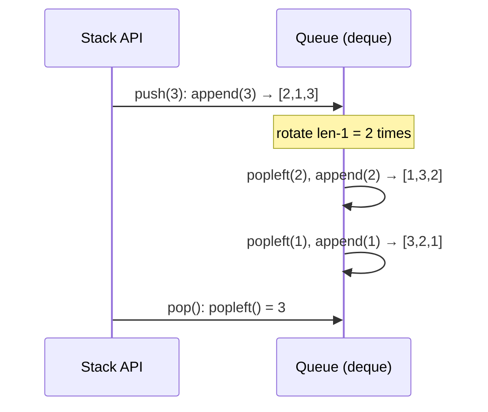
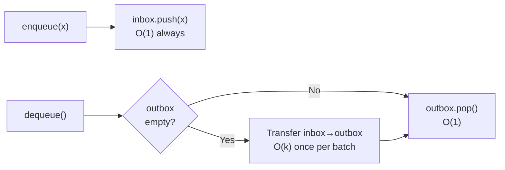

# Implement Stack Using Queue and Queue Using Stack

> **One-line summary:** By rotating elements or using a lazy-transfer trick between two structures, you can simulate LIFO with FIFO primitives and vice versa — a classic interview problem that reveals how deeply you understand both data structures.

---

## Table of Contents

1. [What Is This About and Why Does It Matter?](#1-what-is-this-about-and-why-does-it-matter)
2. [Quick Recap: Stack vs Queue](#2-quick-recap-stack-vs-queue)
3. [Implement Stack Using Queue](#3-implement-stack-using-queue)
   - [Approach 1 — Make Push Costly (Single Queue)](#approach-1--make-push-costly-single-queue)
   - [Approach 2 — Make Pop Costly (Two Queues)](#approach-2--make-pop-costly-two-queues)
4. [Implement Queue Using Stack](#4-implement-queue-using-stack)
   - [Approach 1 — Make Enqueue Costly](#approach-1--make-enqueue-costly)
   - [Approach 2 — Lazy Transfer (Amortized O(1))](#approach-2--lazy-transfer-amortized-o1)
5. [Complexity Comparison](#5-complexity-comparison)
6. [Key Takeaways](#6-key-takeaways)
7. [FAQs](#7-faqs)

---

## 1. What Is This About and Why Does It Matter?

Have you ever tried to open a door by pushing it when it clearly says *pull*? You used the wrong tool on purpose. That is exactly what we do here — and it teaches us something powerful about how stacks and queues work under the hood.

We will:
- Implement a **stack (LIFO)** using only queue operations.
- Implement a **queue (FIFO)** using only stack operations.

These are classic DSA interview questions at top tech companies. They test whether you truly understand each structure, not just its API. The constraint — "use only the other structure's primitives" — forces creative thinking about element ordering.

---

## 2. Quick Recap: Stack vs Queue

| Feature | Stack | Queue |
|---|---|---|
| Order | LIFO — Last In First Out | FIFO — First In First Out |
| Insert | `push()` — adds to top | `enqueue()` — adds to back |
| Remove | `pop()` — removes from top | `dequeue()` — removes from front |
| Peek | top element | front element |
| Analogy | Stack of plates | Movie ticket line |

```
Stack                   Queue
  top →  [ 3 ]          front → [ 1 | 2 | 3 ] ← back
         [ 2 ]
         [ 1 ]  ← bottom
push/pop from top      enqueue at back, dequeue from front
```

The core challenge: a queue's dequeue gives the *oldest* element, but a stack's pop needs the *newest*. These are opposites — bridging them requires deliberate rearrangement.

---

## 3. Implement Stack Using Queue

**Goal:** Build a stack that supports `push`, `pop`, `top`, and `empty` using only queue operations (`append` to back, `popleft` from front).

The trick is ensuring the most recently pushed element is always at the **front** of the queue so `pop` can remove it in $O(1)$.

### Approach 1 — Make Push Costly (Single Queue)

After every `push`, rotate all older elements to the back so the new element sits at the front.

```
push(1): queue = [1]
push(2): enqueue → [1,2], rotate 1 element → [2,1]
push(3): enqueue → [2,1,3], rotate 2 elements → [3,2,1]

pop() → popleft() = 3  ✓  (LIFO behaviour)
```



**Python:**

```python
from collections import deque

class StackUsingQueue:
    def __init__(self):
        self.q = deque()

    def push(self, x):
        self.q.append(x)
        # Rotate all previous elements to the back
        for _ in range(len(self.q) - 1):
            self.q.append(self.q.popleft())

    def pop(self):
        if not self.q:
            return -1
        return self.q.popleft()   # front is always the stack top

    def top(self):
        if not self.q:
            return -1
        return self.q[0]

    def empty(self):
        return len(self.q) == 0

# --- Testing ---
stack = StackUsingQueue()
stack.push(1)
stack.push(2)
stack.push(3)
print(stack.top())    # Output: 3
print(stack.pop())    # Output: 3
print(stack.pop())    # Output: 2
print(stack.empty())  # Output: False
```

**C++:**

```cpp
#include <iostream>
#include <queue>
using namespace std;

class StackUsingQueue {
    queue<int> q;
public:
    void push(int x) {
        q.push(x);
        // Rotate all previous elements to the back
        int sz = q.size();
        for (int i = 0; i < sz - 1; i++) {
            q.push(q.front());
            q.pop();
        }
    }

    int pop() {
        if (q.empty()) return -1;
        int val = q.front(); q.pop();
        return val;
    }

    int top() {
        if (q.empty()) return -1;
        return q.front();
    }

    bool empty() { return q.empty(); }
};

int main() {
    StackUsingQueue stack;
    stack.push(1); stack.push(2); stack.push(3);
    cout << stack.top() << "\n";   // 3
    cout << stack.pop() << "\n";   // 3
    cout << stack.pop() << "\n";   // 2
    cout << stack.empty() << "\n"; // 0 (false)
    return 0;
}
```

- `push`: $O(n)$ — rotates all $n-1$ existing elements
- `pop` / `top`: $O(1)$ — simple front access

---

### Approach 2 — Make Pop Costly (Two Queues)

`push` is $O(1)$ — just enqueue normally. When `pop` is needed, drain `q1` into `q2` leaving the last element alone, remove it, then swap.

```
push(1): q1=[1]
push(2): q1=[1,2]
push(3): q1=[1,2,3]

pop():
  move [1,2] to q2  →  q1=[3], q2=[1,2]
  result = q1.popleft() = 3
  swap: q1=[1,2], q2=[]
```

**Python:**

```python
from collections import deque

class StackUsingTwoQueues:
    def __init__(self):
        self.q1 = deque()   # main queue
        self.q2 = deque()   # helper queue

    def push(self, x):
        self.q1.append(x)   # O(1)

    def pop(self):
        if not self.q1:
            return -1
        # Move all but last element to q2
        while len(self.q1) > 1:
            self.q2.append(self.q1.popleft())
        result = self.q1.popleft()          # last element = stack top
        self.q1, self.q2 = self.q2, self.q1  # swap back
        return result

    def top(self):
        if not self.q1:
            return -1
        while len(self.q1) > 1:
            self.q2.append(self.q1.popleft())
        result = self.q1[0]
        self.q2.append(self.q1.popleft())
        self.q1, self.q2 = self.q2, self.q1
        return result

    def empty(self):
        return len(self.q1) == 0

# --- Testing ---
stack2 = StackUsingTwoQueues()
stack2.push(10)
stack2.push(20)
stack2.push(30)
print(stack2.pop())    # Output: 30
print(stack2.top())    # Output: 20
print(stack2.empty())  # Output: False
```

**C++:**

```cpp
#include <iostream>
#include <queue>
using namespace std;

class StackUsingTwoQueues {
    queue<int> q1, q2;
public:
    void push(int x) {
        q1.push(x);   // O(1)
    }

    int pop() {
        if (q1.empty()) return -1;
        // Drain all but last into q2
        while (q1.size() > 1) {
            q2.push(q1.front()); q1.pop();
        }
        int result = q1.front(); q1.pop();
        swap(q1, q2);   // q1 is back to main
        return result;
    }

    int top() {
        if (q1.empty()) return -1;
        while (q1.size() > 1) {
            q2.push(q1.front()); q1.pop();
        }
        int result = q1.front();
        q2.push(q1.front()); q1.pop();
        swap(q1, q2);
        return result;
    }

    bool empty() { return q1.empty(); }
};

int main() {
    StackUsingTwoQueues stack;
    stack.push(10); stack.push(20); stack.push(30);
    cout << stack.pop() << "\n";    // 30
    cout << stack.top() << "\n";    // 20
    cout << stack.empty() << "\n";  // 0 (false)
    return 0;
}
```

- `push`: $O(1)$
- `pop` / `top`: $O(n)$ — drains entire queue each time

---

## 4. Implement Queue Using Stack

**Goal:** Build a queue that supports `enqueue`, `dequeue`, `front`, and `empty` using only stack operations (`push` to top, `pop` from top).

The challenge: a stack gives the *newest* element first, but a queue needs the *oldest* first.

### Approach 1 — Make Enqueue Costly

Every enqueue moves all elements from `s1` to `s2`, pushes the new element onto `s1`, then moves everything back. This ensures the oldest element is always on top of `s1`.

```
enqueue(1): s1=[1]
enqueue(2): drain s1→s2=[1], push 2 → s1=[2], move back → s1=[1,2] (top=1)
enqueue(3): drain s1→s2=[1,2], push 3 → s1=[3], move back → s1=[1,2,3] (top=1... wait)
```

Actually after moving back: s1 top = first inserted = 1. `dequeue` is just `s1.pop()`.

**Python:**

```python
class QueueUsingStack:
    def __init__(self):
        self.s1 = []   # main stack
        self.s2 = []   # helper stack

    def enqueue(self, x):
        # Move all from s1 to s2
        while self.s1:
            self.s2.append(self.s1.pop())
        # Push new element to s1 (now it is at bottom)
        self.s1.append(x)
        # Move everything back
        while self.s2:
            self.s1.append(self.s2.pop())

    def dequeue(self):
        if not self.s1:
            return -1
        return self.s1.pop()   # top of s1 = oldest element

    def front(self):
        if not self.s1:
            return -1
        return self.s1[-1]

    def empty(self):
        return len(self.s1) == 0

# --- Testing ---
q = QueueUsingStack()
q.enqueue(1)
q.enqueue(2)
q.enqueue(3)
print(q.dequeue())  # Output: 1
print(q.front())    # Output: 2
print(q.empty())    # Output: False
```

**C++:**

```cpp
#include <iostream>
#include <stack>
using namespace std;

class QueueUsingStack {
    stack<int> s1, s2;
public:
    void enqueue(int x) {
        // Move all to s2
        while (!s1.empty()) { s2.push(s1.top()); s1.pop(); }
        s1.push(x);
        // Move back
        while (!s2.empty()) { s1.push(s2.top()); s2.pop(); }
    }

    int dequeue() {
        if (s1.empty()) return -1;
        int val = s1.top(); s1.pop();
        return val;
    }

    int front() {
        if (s1.empty()) return -1;
        return s1.top();
    }

    bool empty() { return s1.empty(); }
};

int main() {
    QueueUsingStack q;
    q.enqueue(1); q.enqueue(2); q.enqueue(3);
    cout << q.dequeue() << "\n";  // 1
    cout << q.front()   << "\n";  // 2
    cout << q.empty()   << "\n";  // 0 (false)
    return 0;
}
```

- `enqueue`: $O(n)$ — moves all elements twice per call
- `dequeue` / `front`: $O(1)$

---

### Approach 2 — Lazy Transfer (Amortized O(1))

This is the **preferred interview answer**. Use `inbox` for all pushes and `outbox` for all pops. Only transfer from `inbox` → `outbox` when `outbox` is empty. Each element crosses over **exactly once** in its lifetime.

```
inbox = []  outbox = []

enqueue(a): inbox=[a]
enqueue(b): inbox=[a,b]
enqueue(c): inbox=[a,b,c]

dequeue():  outbox empty → transfer: outbox=[c,b,a] (top=a), inbox=[]
            outbox.pop() = a  ✓

enqueue(d): inbox=[d]        outbox=[c,b]

dequeue():  outbox not empty → outbox.pop() = b  ✓
```



**Python:**

```python
class EfficientQueueUsingStack:
    def __init__(self):
        self.inbox  = []   # for enqueue
        self.outbox = []   # for dequeue

    def enqueue(self, x):
        self.inbox.append(x)   # always O(1)

    def dequeue(self):
        if not self.outbox:
            # Lazy transfer: only when outbox is empty
            while self.inbox:
                self.outbox.append(self.inbox.pop())
        if not self.outbox:
            return -1
        return self.outbox.pop()

    def front(self):
        if not self.outbox:
            while self.inbox:
                self.outbox.append(self.inbox.pop())
        if not self.outbox:
            return -1
        return self.outbox[-1]

    def empty(self):
        return not self.inbox and not self.outbox

# --- Testing ---
q2 = EfficientQueueUsingStack()
q2.enqueue('a')
q2.enqueue('b')
q2.enqueue('c')
print(q2.dequeue())  # Output: a
q2.enqueue('d')
print(q2.dequeue())  # Output: b
print(q2.dequeue())  # Output: c
print(q2.dequeue())  # Output: d
```

**C++:**

```cpp
#include <iostream>
#include <stack>
#include <string>
using namespace std;

class EfficientQueueUsingStack {
    stack<int> inbox, outbox;

    void transfer() {
        // Transfer only when outbox is empty
        if (outbox.empty()) {
            while (!inbox.empty()) {
                outbox.push(inbox.top());
                inbox.pop();
            }
        }
    }
public:
    void enqueue(int x) {
        inbox.push(x);   // O(1)
    }

    int dequeue() {
        transfer();
        if (outbox.empty()) return -1;
        int val = outbox.top(); outbox.pop();
        return val;
    }

    int front() {
        transfer();
        if (outbox.empty()) return -1;
        return outbox.top();
    }

    bool empty() { return inbox.empty() && outbox.empty(); }
};

int main() {
    EfficientQueueUsingStack q;
    q.enqueue(1); q.enqueue(2); q.enqueue(3);
    cout << q.dequeue() << "\n";  // 1
    q.enqueue(4);
    cout << q.dequeue() << "\n";  // 2
    cout << q.dequeue() << "\n";  // 3
    cout << q.dequeue() << "\n";  // 4
    return 0;
}
```

**Why amortized $O(1)$?**  
Each element moves from `inbox` to `outbox` exactly once. Over $n$ operations the total transfer cost is $O(n)$, so the average cost per operation is $O(1)$.

---

## 5. Complexity Comparison

| Implementation | Operation | Time Complexity |
|---|---|---|
| Stack using Queue (push costly) | `push` | $O(n)$ |
| Stack using Queue (push costly) | `pop` / `top` | $O(1)$ |
| Stack using Two Queues (pop costly) | `push` | $O(1)$ |
| Stack using Two Queues (pop costly) | `pop` / `top` | $O(n)$ |
| Queue using Stack (enqueue costly) | `enqueue` | $O(n)$ |
| Queue using Stack (enqueue costly) | `dequeue` / `front` | $O(1)$ |
| Queue using Stack (amortized) | `enqueue` | $O(1)$ |
| Queue using Stack (amortized) | `dequeue` / `front` | $O(1)$ amortized |

> For interviews, the **amortized two-stack queue** is the preferred answer — it demonstrates understanding of efficiency beyond just correctness.

---

## 6. Key Takeaways

- Implementing one structure with the other forces you to deeply understand **element ordering** in both.
- **Stack with single queue (push costly):** rotate all older elements to the back on every push so the newest element sits at the front. `pop` is then a trivial `popleft`.
- **Stack with two queues (pop costly):** push is free; drain all-but-last to the helper queue on `pop`, then swap.
- **Queue with two stacks (enqueue costly):** force the oldest element to the top by double-reversing on every enqueue.
- **Queue with two stacks (amortized):** never touch `outbox` unless it is empty; each element crosses from `inbox` to `outbox` exactly once, giving amortized $O(1)$ dequeue.
- All space complexities are $O(n)$ for all approaches.
- These problems test **thinking about structure design**, not just API knowledge — that is why they appear in top-tier interviews.

---

## 7. FAQs

**Why would anyone implement a stack using a queue in real life?**  
In real life, you would not. The problem tests whether you deeply understand both data structures. Interviewers use it to evaluate problem-solving flexibility, not your ability to memorise APIs.

**Which approach is better for implementing a queue using stacks?**  
The amortized two-stack approach (`inbox`/`outbox`). It gives $O(1)$ average time for both `enqueue` and `dequeue`. The enqueue-costly approach is simpler to understand but performs $O(n)$ work on every single insertion.

**Can I use a deque instead of a queue for these problems?**  
In Python, `collections.deque` supports both ends. In an interview, restrict yourself to `append()` and `popleft()` only — adding to the back and removing from the front — to honour the queue constraint. Using `appendleft` or `pop` would violate the spirit of the problem.

**How do I explain amortized $O(1)$ to an interviewer?**  
Say: "Each element is moved from `inbox` to `outbox` at most once in its lifetime. Even though a single dequeue can cost $O(k)$ during the transfer, the total cost over $n$ operations is $O(n)$, so the amortised cost per operation is $O(1)$."

**What is the space complexity of all these approaches?**  
All four implementations use $O(n)$ extra space, where $n$ is the number of elements currently stored. There is no way to avoid this because you must store the elements somewhere.
