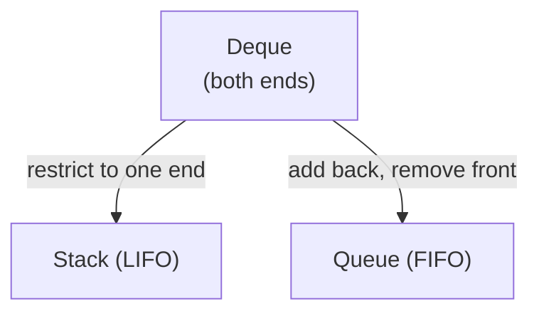

# Deque Data Structure: Beginner Use Cases and Examples

> **One-line summary:** A deque (Double-Ended Queue) supports $O(1)$ insertion and removal at both the front and rear, making it a superset of both stack and queue — and the go-to tool for sliding window problems.

---

## Table of Contents

1. [What is a Deque?](#1-what-is-a-deque)
2. [Deque vs Queue vs Stack](#2-deque-vs-queue-vs-stack)
3. [Types of Deque](#3-types-of-deque)
4. [Core Deque Operations](#4-core-deque-operations)
5. [Implementing Deque in Code](#5-implementing-deque-in-code)
6. [Real-World Use Cases](#6-real-world-use-cases)
   - [Sliding Window Maximum](#sliding-window-maximum)
   - [Palindrome Check](#palindrome-check)
   - [Undo and Redo Functionality](#undo-and-redo-functionality)
   - [Using Deque as Stack and Queue](#using-deque-as-stack-and-queue)
7. [Time and Space Complexity](#7-time-and-space-complexity)
8. [Common Mistakes](#8-common-mistakes)
9. [Key Takeaways](#9-key-takeaways)
10. [FAQs](#10-faqs)

---

## 1. What is a Deque?

Imagine a line of people at a buffet where new guests can join from **either end**, and people can also leave from **either end**. That is exactly how a deque works in programming.

A **deque** (pronounced *"deck"*, short for **Double-Ended Queue**) is a data structure that lets you add and remove elements from both the front and the rear. Unlike a regular queue — add at back, remove from front only — a deque gives you full control over both ends.

```
      push_front ──→ [ A | B | C | D ] ──→ push_back
      pop_front  ←── [ A | B | C | D ] ←── pop_back
                     front           back
```

This flexibility makes the deque one of the most powerful and versatile tools in your DSA toolkit.

---

## 2. Deque vs Queue vs Stack

| Feature | Stack | Queue | Deque |
|---|---|---|---|
| Insert at front | No | No | **Yes** |
| Insert at rear | Yes (`push`) | Yes (`enqueue`) | **Yes** |
| Remove from front | No | Yes (`dequeue`) | **Yes** |
| Remove from rear | Yes (`pop`) | No | **Yes** |
| Access pattern | LIFO | FIFO | **Both** |

A deque is a **superset** of both stack and queue. You can simulate either one using a deque by restricting which end you use.



---

## 3. Types of Deque

### Input-Restricted Deque

Insertion is allowed **only at the rear**, but deletion can happen from **both ends**.  
Think of it as a one-way entry but two-way exit.

### Output-Restricted Deque

Deletion is allowed **only from the front**, but insertion can happen from **both ends**.  
Think of it as a two-way entry but one-way exit.

| Type | Insert Front | Insert Rear | Remove Front | Remove Rear |
|---|---|---|---|---|
| Input-Restricted | ✗ | ✓ | ✓ | ✓ |
| Output-Restricted | ✓ | ✓ | ✓ | ✗ |
| Fully Flexible | ✓ | ✓ | ✓ | ✓ |

In most coding problems and interview questions, you use the **fully flexible** deque.

---

## 4. Core Deque Operations

| Operation | Description | Time |
|---|---|---|
| `push_front(x)` | Add element to the front | $O(1)$ |
| `push_back(x)` | Add element to the rear | $O(1)$ |
| `pop_front()` | Remove element from the front | $O(1)$ |
| `pop_back()` | Remove element from the rear | $O(1)$ |
| `front()` | Peek at front element (no removal) | $O(1)$ |
| `back()` | Peek at rear element (no removal) | $O(1)$ |
| `isEmpty()` | Check if deque has no elements | $O(1)$ |
| `size()` | Number of elements in deque | $O(1)$ |

All critical operations run in $O(1)$ — this is the key advantage over a regular list.

---

## 5. Implementing Deque in Code

### Python — `collections.deque`

Python's built-in `deque` inside the `collections` module is backed by a doubly-linked list, giving true $O(1)$ front and rear operations.

```python
from collections import deque

dq = deque()

# Add to rear
dq.append(10)       # deque: [10]
dq.append(20)       # deque: [10, 20]
dq.append(30)       # deque: [10, 20, 30]

# Add to front
dq.appendleft(5)    # deque: [5, 10, 20, 30]

# Remove from rear
dq.pop()            # removes 30  → deque: [5, 10, 20]

# Remove from front
dq.popleft()        # removes 5   → deque: [10, 20]

# Peek
print(dq[0])        # Output: 10  (front)
print(dq[-1])       # Output: 20  (back)

print(dq)           # Output: deque([10, 20])
```

### C++ — `std::deque`

C++ provides `std::deque` in the `<deque>` header. It supports $O(1)$ amortised push/pop at both ends.

```cpp
#include <iostream>
#include <deque>
using namespace std;

int main() {
    deque<int> dq;

    // Add to rear
    dq.push_back(10);   // deque: [10]
    dq.push_back(20);   // deque: [10, 20]
    dq.push_back(30);   // deque: [10, 20, 30]

    // Add to front
    dq.push_front(5);   // deque: [5, 10, 20, 30]

    // Remove from rear
    dq.pop_back();      // removes 30  → deque: [5, 10, 20]

    // Remove from front
    dq.pop_front();     // removes 5   → deque: [10, 20]

    // Peek
    cout << dq.front() << "\n";  // Output: 10
    cout << dq.back()  << "\n";  // Output: 20

    return 0;
}
```

---

## 6. Real-World Use Cases

### Sliding Window Maximum

**Problem:** Given an array and a window of size $k$, find the **maximum element** in each window as it slides left to right.

**Key idea:** Maintain a deque of **indices** in **decreasing order of values**. Elements outside the window or smaller than the current element are evicted.

```
arr = [1, 3, -1, -3, 5, 3, 6, 7],  k = 3

Window [1,3,-1]  → max = 3
Window [3,-1,-3] → max = 3
Window [-1,-3,5] → max = 5
Window [-3,5,3]  → max = 5
Window [5,3,6]   → max = 6
Window [3,6,7]   → max = 7
```

**Python:**

```python
from collections import deque

def sliding_window_max(arr, k):
    dq = deque()   # stores indices; front always = max of current window
    result = []

    for i in range(len(arr)):
        # Remove index that has left the window
        if dq and dq[0] < i - k + 1:
            dq.popleft()

        # Remove indices whose values are smaller than current
        # (they can never be the max for any future window)
        while dq and arr[dq[-1]] < arr[i]:
            dq.pop()

        dq.append(i)

        # Record result once the first full window is formed
        if i >= k - 1:
            result.append(arr[dq[0]])

    return result

arr = [1, 3, -1, -3, 5, 3, 6, 7]
print(sliding_window_max(arr, 3))
# Output: [3, 3, 5, 5, 6, 7]
```

**C++:**

```cpp
#include <iostream>
#include <vector>
#include <deque>
using namespace std;

vector<int> slidingWindowMax(vector<int>& arr, int k) {
    deque<int> dq;   // stores indices
    vector<int> result;

    for (int i = 0; i < (int)arr.size(); i++) {
        // Remove index outside window
        if (!dq.empty() && dq.front() < i - k + 1)
            dq.pop_front();

        // Remove smaller elements from back
        while (!dq.empty() && arr[dq.back()] < arr[i])
            dq.pop_back();

        dq.push_back(i);

        if (i >= k - 1)
            result.push_back(arr[dq.front()]);
    }
    return result;
}

int main() {
    vector<int> arr = {1, 3, -1, -3, 5, 3, 6, 7};
    vector<int> res = slidingWindowMax(arr, 3);
    for (int x : res) cout << x << " ";
    // Output: 3 3 5 5 6 7
    return 0;
}
```

Each index is pushed and popped **at most once**, giving $O(n)$ total — compared to $O(nk)$ brute force.

---

### Palindrome Check

A deque is a natural fit for palindrome checking. Push all characters in, then compare from both ends simultaneously.

**Python:**

```python
from collections import deque

def is_palindrome(s):
    dq = deque(s)

    while len(dq) > 1:
        if dq.popleft() != dq.pop():
            return False
    return True

print(is_palindrome("racecar"))  # Output: True
print(is_palindrome("hello"))    # Output: False
```

**C++:**

```cpp
#include <iostream>
#include <deque>
#include <string>
using namespace std;

bool isPalindrome(const string& s) {
    deque<char> dq(s.begin(), s.end());

    while (dq.size() > 1) {
        if (dq.front() != dq.back()) return false;
        dq.pop_front();
        dq.pop_back();
    }
    return true;
}

int main() {
    cout << isPalindrome("racecar") << "\n";  // 1 (true)
    cout << isPalindrome("hello")   << "\n";  // 0 (false)
    return 0;
}
```

Runs in $O(n)$ time with $O(n)$ space. Clean, readable, and mirrors the definition of a palindrome directly.

---

### Undo and Redo Functionality

Many applications (text editors, image tools) support undo/redo. A deque models this naturally:

- New actions → `push_back` onto the **action deque**
- **Undo** → `pop_back` from action deque, `push_back` onto redo deque
- **Redo** → `pop_back` from redo deque, `push_back` back onto action deque

```python
from collections import deque

actions = deque()
redo_stack = deque()

def do_action(action):
    actions.append(action)
    redo_stack.clear()       # new action clears redo history

def undo():
    if actions:
        redo_stack.append(actions.pop())

def redo():
    if redo_stack:
        actions.append(redo_stack.pop())

do_action("type A")
do_action("type B")
do_action("type C")
undo()
print(list(actions))     # ['type A', 'type B']
redo()
print(list(actions))     # ['type A', 'type B', 'type C']
```

---

### Using Deque as Stack and Queue

**As a Stack (LIFO)** — only use `append` and `pop` (same end):

```python
from collections import deque

stack = deque()
stack.append(1)
stack.append(2)
stack.append(3)
print(stack.pop())    # Output: 3  (last in, first out)
```

```cpp
#include <iostream>
#include <deque>
using namespace std;

int main() {
    deque<int> stack;
    stack.push_back(1);
    stack.push_back(2);
    stack.push_back(3);
    cout << stack.back() << "\n"; stack.pop_back();  // Output: 3
    return 0;
}
```

**As a Queue (FIFO)** — `append` to rear, `popleft` from front:

```python
from collections import deque

queue = deque()
queue.append(1)
queue.append(2)
queue.append(3)
print(queue.popleft())   # Output: 1  (first in, first out)
```

```cpp
#include <iostream>
#include <deque>
using namespace std;

int main() {
    deque<int> queue;
    queue.push_back(1);
    queue.push_back(2);
    queue.push_back(3);
    cout << queue.front() << "\n"; queue.pop_front();  // Output: 1
    return 0;
}
```

---

## 7. Time and Space Complexity

| Operation | Time Complexity | Notes |
|---|---|---|
| `push_front` / `push_back` | $O(1)$ | Constant time insertion |
| `pop_front` / `pop_back` | $O(1)$ | Constant time removal |
| `front` / `back` (peek) | $O(1)$ | No element is removed |
| Search (by value) | $O(n)$ | Linear scan required |
| Space | $O(n)$ | $n$ elements stored |

> Compare with Python `list`: `list.pop(0)` and `list.insert(0, x)` are both $O(n)$ because they shift every element. `deque.popleft()` and `deque.appendleft()` are always $O(1)$.

---

## 8. Common Mistakes

1. **Confusing `append` with `appendleft` in Python** — `append` adds to the *rear*; `appendleft` adds to the *front*. Getting these swapped produces mirror-image results.
2. **Not checking for empty before pop** — calling `pop()` or `popleft()` on an empty deque raises `IndexError` in Python and undefined behaviour in C++. Always guard with `if dq:` / `if (!dq.empty())`.
3. **Using `list.pop(0)` instead of `deque.popleft()`** — `list.pop(0)` is $O(n)$ because it shifts every element. Use `collections.deque` whenever you need fast front removal.
4. **Forgetting to evict outdated indices in sliding window** — if you skip the `dq[0] < i - k + 1` check, indices from old windows pollute the result.
5. **Confusing `std::deque` with `std::queue` in C++** — `std::queue` wraps a deque but restricts it to FIFO operations. Use `std::deque` directly when you need both-end access.

---

## 9. Key Takeaways

- A deque is a **double-ended queue** — $O(1)$ insert and remove at both front and rear.
- It is a superset of both stack and queue; you can simulate either by restricting which end you use.
- **Input-restricted deque:** insert only at rear; **Output-restricted deque:** delete only from front.
- Python: `collections.deque` with `append`/`appendleft`/`pop`/`popleft`. C++: `std::deque` with `push_back`/`push_front`/`pop_back`/`pop_front`.
- The **sliding window maximum** is the canonical deque problem — it reduces $O(nk)$ brute force to $O(n)$ by evicting useless elements immediately.
- Never use a Python `list` as a deque substitute — `list.pop(0)` is $O(n)$.
- Deque patterns also appear in BFS with priority levels, palindrome checking, and undo/redo systems.

---

## 10. FAQs

**Is a deque the same as a queue?**  
No. A regular queue only allows insertion at the rear and deletion from the front. A deque allows both operations at both ends, making it strictly more flexible.

**When should I use a deque instead of a list?**  
Use a deque whenever you need fast insertions or deletions at **both ends**. In Python, removing from the front of a `list` takes $O(n)$; `deque.popleft()` takes $O(1)$. For rear-only operations a `list` is fine.

**Is Python's `collections.deque` thread-safe?**  
`collections.deque` is thread-safe for `append` and `popleft` from opposite ends. For multi-step operations (check + modify), use proper thread synchronisation (`threading.Lock`) to avoid race conditions.

**Why does the sliding window maximum use indices instead of values?**  
Indices let you check whether an element has fallen outside the current window (`dq[0] < i - k + 1`). If you stored values you would lose positional information and could not evict stale entries correctly.

**Can I use `std::deque` as a stack in C++?**  
Yes. Use `push_back` / `pop_back` for stack (LIFO) behaviour, or `push_back` / `pop_front` for queue (FIFO) behaviour. `std::stack` and `std::queue` are thin wrappers over `std::deque` that enforce these restrictions for clarity.
