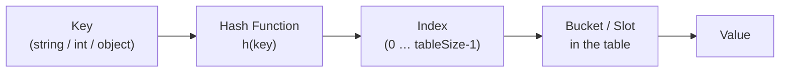

# Hashing and HashMaps: How Fast Key Lookup Works

> **One-line summary:** Hashing converts a key into an array index using a hash function, enabling $O(1)$ average-time insert, delete, and lookup — far faster than scanning arrays or linked lists.

---

## Table of Contents

1. [What is Hashing?](#1-what-is-hashing)
2. [Understanding a Hash Function](#2-understanding-a-hash-function)
3. [Simple Hash Function Example](#3-simple-hash-function-example)
4. [What is a Hash Table?](#4-what-is-a-hash-table)
5. [Time Complexity of Hashing](#5-time-complexity-of-hashing)
6. [HashMaps in Python and C++](#6-hashmaps-in-python-and-c)
7. [Real-World Use Cases](#7-real-world-use-cases)
8. [Example: Counting Frequencies](#8-example-counting-frequencies)
9. [What is a Collision?](#9-what-is-a-collision)
10. [HashMap vs Array vs Linked List](#10-hashmap-vs-array-vs-linked-list)
11. [Key Takeaways](#11-key-takeaways)
12. [FAQs](#12-faqs)

---

## 1. What is Hashing?

Have you ever used a dictionary to look up a word? You do not read every page from the start — you jump directly to the right section. Hashing works the same way inside a computer program.

**Hashing** is a technique that converts a key into an index using a special formula called a **hash function**. That index points to the exact location where the value is stored. Instead of searching through all elements, you jump straight to the answer.

```
Key  ──→  [ Hash Function ]  ──→  Index  ──→  Value
"Alice"        h("Alice")            1          90
"Bob"          h("Bob")              3          75
"Carol"        h("Carol")            4          88
```

This makes data retrieval incredibly fast, which is why hashing is one of the most important concepts in DSA.

---

## 2. Understanding a Hash Function

A hash function takes an input (like a string or a number) and returns a fixed-size integer called a **hash code**. Think of it like a locker system at a gym: you give your name at the counter, and the staff uses a formula to assign you a locker number. You always get the same locker for the same name.

A good hash function has these properties:

| Property | Description |
|---|---|
| Deterministic | Same input always produces the same output |
| Uniform distribution | Values spread evenly to avoid overcrowding one slot |
| Fast to compute | $O(1)$ calculation regardless of input size |
| Minimises collisions | Different keys should rarely map to the same index |



---

## 3. Simple Hash Function Example

The most basic hash function for integers is the **modulo operation**. For a table of size $n$, key $k$ maps to index $k \bmod n$.

$$\text{index} = k \bmod \text{tableSize}$$

**Python:**

```python
def hash_function(key, table_size):
    return key % table_size

# Examples (table_size = 10)
print(hash_function(25, 10))  # Output: 5  → stored at index 5
print(hash_function(43, 10))  # Output: 3  → stored at index 3
print(hash_function(72, 10))  # Output: 2  → stored at index 2
```

**C++:**

```cpp
#include <iostream>
using namespace std;

int hashFunction(int key, int tableSize) {
    return key % tableSize;  // index in range [0, tableSize-1]
}

int main() {
    // tableSize = 10
    cout << hashFunction(25, 10) << "\n";  // Output: 5
    cout << hashFunction(43, 10) << "\n";  // Output: 3
    cout << hashFunction(72, 10) << "\n";  // Output: 2
    return 0;
}
```

```
Table size = 10

key 25 → 25 % 10 = 5  ┐
key 43 → 43 % 10 = 3  │  each key lands at a predictable slot
key 72 → 72 % 10 = 2  ┘
```

---

## 4. What is a Hash Table?

A **hash table** (also called a **hash map**) is a data structure that stores **key-value pairs**. It uses a hash function internally to decide where to store each pair.

Imagine a cabinet with numbered drawers — the hash function tells you exactly which drawer to open for any key.

**Visualisation:**

| Index | Key | Value |
|---|---|---|
| 0 | — | — |
| 1 | `"alice"` | 90 |
| 2 | — | — |
| 3 | `"bob"` | 75 |
| 4 | `"carol"` | 88 |
| 5 | — | — |

Each name is hashed to produce an index. The score is stored at that index. **Retrieval is instant** because you always know which index to check.

---

## 5. Time Complexity of Hashing

One of the biggest reasons developers love hashing is its speed.

| Operation | Array / Linked List | Hash Table (Average) | Hash Table (Worst) |
|---|---|---|---|
| Search by key | $O(n)$ | $O(1)$ | $O(n)$ |
| Insert | $O(1)$ or $O(n)$ | $O(1)$ | $O(n)$ |
| Delete by key | $O(n)$ | $O(1)$ | $O(n)$ |

On **average**, all three core operations run in constant time $O(1)$. The worst case $O(n)$ occurs only when many collisions cluster into the same bucket — rare with a good hash function and an appropriately sized table.

---

## 6. HashMaps in Python and C++

Most modern languages provide a built-in hash table. In Python it is a **`dict`**; in C++ it is **`std::unordered_map`**.

### Python — `dict`

```python
# Create a dictionary to store student scores
scores = {}

# Insert key-value pairs
scores["Alice"] = 90
scores["Bob"]   = 75
scores["Carol"] = 88

# Access a value by key — O(1) average
print(scores["Alice"])      # Output: 90

# Check if a key exists
print("Bob" in scores)      # Output: True

# Remove a key-value pair
del scores["Bob"]

# Iterate over all pairs
for name, score in scores.items():
    print(name, "->", score)
# Output:
# Alice -> 90
# Carol -> 88
```

### C++ — `std::unordered_map`

```cpp
#include <iostream>
#include <unordered_map>
#include <string>
using namespace std;

int main() {
    // Create an unordered_map to store student scores
    unordered_map<string, int> scores;

    // Insert key-value pairs
    scores["Alice"] = 90;
    scores["Bob"]   = 75;
    scores["Carol"] = 88;

    // Access a value by key — O(1) average
    cout << scores["Alice"] << "\n";  // Output: 90

    // Check if a key exists
    if (scores.count("Bob"))
        cout << "Bob exists\n";  // Output: Bob exists

    // Remove a key-value pair
    scores.erase("Bob");

    // Iterate over all pairs
    for (auto& [name, score] : scores) {
        cout << name << " -> " << score << "\n";
    }
    // Output (order may vary):
    // Alice -> 90
    // Carol -> 88

    return 0;
}
```

> **Note:** `std::unordered_map` uses hashing and gives $O(1)$ average operations. `std::map` uses a balanced BST and gives $O(\log n)$ — use it when you need sorted keys.

---

## 7. Real-World Use Cases

| Use Case | Key | Value |
|---|---|---|
| Word frequency counter | word (string) | count (int) |
| Browser cache | URL (string) | page content |
| User sessions | session ID (string) | user object |
| Two-Sum problem | complement value | index |
| Phone book | person name | phone number |
| DNS lookup | domain name | IP address |

Hashing is not just a classroom concept — it is fundamental to databases, compilers, caches, and networking.

---

## 8. Example: Counting Frequencies

Counting how many times each element appears in an array is one of the most common hash map patterns in competitive programming and interviews.

**Python:**

```python
nums = [3, 1, 4, 1, 5, 9, 2, 6, 5, 3, 5]
freq = {}

for num in nums:
    freq[num] = freq.get(num, 0) + 1   # get returns 0 if key missing

for key, count in sorted(freq.items()):
    print(f"{key} appears {count} time(s)")
# Output:
# 1 appears 2 time(s)
# 2 appears 1 time(s)
# 3 appears 2 time(s)
# 4 appears 1 time(s)
# 5 appears 3 time(s)
# 6 appears 1 time(s)
# 9 appears 1 time(s)
```

**C++:**

```cpp
#include <iostream>
#include <unordered_map>
#include <vector>
using namespace std;

int main() {
    vector<int> nums = {3, 1, 4, 1, 5, 9, 2, 6, 5, 3, 5};
    unordered_map<int, int> freq;

    for (int num : nums)
        freq[num]++;    // operator[] inserts 0 if key is missing, then increments

    for (auto& [key, count] : freq)
        cout << key << " appears " << count << " time(s)\n";
    // Output (order may vary):
    // 3 appears 2 time(s)
    // 1 appears 2 time(s)
    // 5 appears 3 time(s)
    // ...

    return 0;
}
```

This pattern runs in $O(n)$ time — a single pass through the array. You will use it repeatedly in problems involving anagrams, duplicates, and majority elements.

---

## 9. What is a Collision?

Imagine two gym-goers assigned the same locker number. That is a **collision** in hashing.

A collision happens when two different keys produce the **same hash index**:

$$h(15) = 15 \bmod 10 = 5 \quad \text{and} \quad h(25) = 25 \bmod 10 = 5$$

Both keys 15 and 25 compete for index 5.

```
key 15 ──→ index 5 ──┐
                      ├── COLLISION!
key 25 ──→ index 5 ──┘
```

Collisions are unavoidable (the number of possible keys far exceeds the table size), but they are manageable. The two main strategies are:

- **Chaining** — each slot holds a linked list of all colliding entries
- **Open Addressing** — probe nearby slots until an empty one is found

Both are covered in detail in the next post. The built-in `dict` in Python and `std::unordered_map` in C++ handle collisions automatically.

---

## 10. HashMap vs Array vs Linked List

| Feature | Array | Linked List | HashMap |
|---|---|---|---|
| Access by index | $O(1)$ | $O(n)$ | N/A |
| Search by value | $O(n)$ | $O(n)$ | $O(1)$ avg |
| Insert at end | $O(1)$ amortised | $O(1)$ | $O(1)$ avg |
| Delete by key | $O(n)$ | $O(n)$ | $O(1)$ avg |
| Key-value storage | No | No | **Yes** |
| Order preserved | Yes | Yes | No (default) |

**When to use which:**
- **Array** — ordered data, index-based access
- **Linked List** — frequent insertions/deletions in the middle
- **HashMap** — fast lookup/insert/delete by an arbitrary key

---

## 11. Key Takeaways

- Hashing converts a key into an array index using a hash function, enabling $O(1)$ average-case insert, delete, and search.
- A **hash function** must be deterministic, fast, and distribute values evenly.
- A **hash table** stores key-value pairs; the hash function decides the storage index.
- Python's `dict` and C++'s `std::unordered_map` are production-ready hash table implementations.
- When two keys map to the same index it is called a **collision** — handled by chaining or open addressing (next post).
- The **frequency counting** pattern (`map[key]++`) is one of the most reused hash map idioms in competitive programming.
- Hash maps do not preserve insertion order by default (Python `dict` is an exception — it preserves order since Python 3.7).
- Worst-case performance degrades to $O(n)$ under heavy collisions; a good hash function keeps this rare.

---

## 12. FAQs

**What is a hash collision and should I worry about it?**  
A collision occurs when two different keys hash to the same index. You do not need to handle it yourself — built-in `dict` and `unordered_map` resolve collisions automatically. We cover the underlying techniques (chaining, open addressing) in the next post.

**Is HashMap always $O(1)$ for lookups?**  
On average, yes. In the worst case (many collisions in one bucket) it degrades to $O(n)$. A good hash function and an appropriately sized table keep average-case $O(1)$ the practical reality.

**What is the difference between `std::map` and `std::unordered_map` in C++?**  
`std::unordered_map` uses hashing: $O(1)$ average for all operations, no guaranteed order. `std::map` uses a red-black BST: $O(\log n)$ for all operations, keys are always sorted. Use `unordered_map` for speed and `map` when you need sorted iteration.

**When should I use a `dict` vs a `list` in Python?**  
Use a `dict` (hash map) when you need to look up, insert, or delete by a key. Use a `list` when you need ordered, index-based access. Searching a `list` by value is $O(n)$; searching a `dict` by key is $O(1)$.
