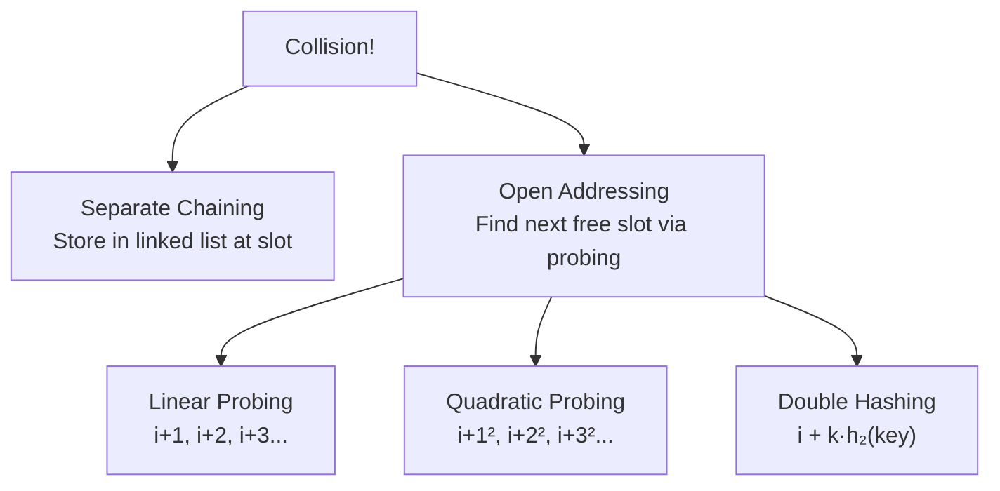

# Hash Collision Handling: Chaining vs Open Addressing

> **One-line summary:** When two keys hash to the same index, you either chain them in a list at that slot (separate chaining) or probe for the next free slot inside the table (open addressing) — both keep average operations at $O(1)$.

---

## Table of Contents

1. [What is a Hash Collision?](#1-what-is-a-hash-collision)
2. [Why Collisions Happen](#2-why-collisions-happen)
3. [Collision Handling Techniques](#3-collision-handling-techniques)
4. [Separate Chaining](#4-separate-chaining)
5. [Open Addressing](#5-open-addressing)
   - [Linear Probing](#linear-probing)
   - [Quadratic Probing](#quadratic-probing)
   - [Double Hashing](#double-hashing)
6. [Comparing Collision Techniques](#6-comparing-collision-techniques)
7. [Load Factor and Rehashing](#7-load-factor-and-rehashing)
8. [Real-World Usage](#8-real-world-usage)
9. [Key Takeaways](#9-key-takeaways)
10. [FAQs](#10-faqs)

---

## 1. What is a Hash Collision?

Imagine 10 lockers at school and 20 students. No matter how carefully you assign lockers, two students might end up with the same locker number. That is a **hash collision**.

A hash function maps a key to an index in an array. But sometimes two different keys produce the **same index**. That situation is called a collision.

```
key  3 → h(3)  = 3 % 7 = 3  ──┐
key 10 → h(10) = 10 % 7 = 3 ──┤  COLLISION at index 3
key 17 → h(17) = 17 % 7 = 3 ──┘
```

Collisions are **not bugs** — they are a natural consequence of compressing a large key space into a smaller table. What matters is how we handle them gracefully without losing data.

---

## 2. Why Collisions Happen

A hash function maps a large universe of keys into a smaller fixed-size table. Since we compress many possible keys into fewer slots, overlaps are **mathematically inevitable** (Pigeonhole Principle).

$$\text{If } |\text{keys}| > |\text{slots}|, \text{ at least one slot must hold} \geq 2 \text{ keys}$$

For example, with table size $m = 7$ and hash $h(k) = k \bmod 7$:

| Key | Hash         | Index             |
| --- | ------------ | ----------------- |
| 3   | $3 \bmod 7$  | 3                 |
| 10  | $10 \bmod 7$ | **3** ← collision |
| 17  | $17 \bmod 7$ | **3** ← collision |
| 5   | $5 \bmod 7$  | 5                 |

---

## 3. Collision Handling Techniques

There are two main families of collision-handling strategies:

| Technique             | Storage Location                                | Best For                                |
| --------------------- | ----------------------------------------------- | --------------------------------------- |
| **Separate Chaining** | Outside the table (linked list / dynamic array) | High load factors, easy implementation  |
| **Open Addressing**   | Inside the table (probing for free slot)        | Cache-friendly access, low load factors |



---

## 4. Separate Chaining

Each slot in the hash table holds a **list** of all key-value pairs that map to that index. When a collision occurs, the new pair is appended to the list at that slot. Searching scans only the list at the correct index.

```
Index 0: []
Index 1: []
Index 2: []
Index 3: [ (3,"apple") → (10,"banana") → (17,"cherry") ]
Index 4: []
Index 5: [ (5,"date") ]
Index 6: []
```

**Python:**

```python
class HashTable:
    def __init__(self, size):
        self.size = size
        self.table = [[] for _ in range(size)]  # list of lists

    def _hash(self, key):
        return key % self.size

    def insert(self, key, value):
        index = self._hash(key)
        for pair in self.table[index]:
            if pair[0] == key:        # update existing key
                pair[1] = value
                return
        self.table[index].append([key, value])

    def search(self, key):
        index = self._hash(key)
        for pair in self.table[index]:
            if pair[0] == key:
                return pair[1]
        return None

# Usage
ht = HashTable(7)
ht.insert(3, "apple")
ht.insert(10, "banana")  # 10 % 7 = 3 → collision, chained
ht.insert(17, "cherry")  # 17 % 7 = 3 → collision, chained

print(ht.search(3))   # Output: apple
print(ht.search(10))  # Output: banana
print(ht.search(17))  # Output: cherry
```

**C++:**

```cpp
#include <iostream>
#include <vector>
#include <list>
#include <utility>
using namespace std;

class HashTable {
    int size;
    vector<list<pair<int,string>>> table;

    int hashFn(int key) { return key % size; }

public:
    HashTable(int sz) : size(sz), table(sz) {}

    void insert(int key, const string& value) {
        int idx = hashFn(key);
        for (auto& p : table[idx]) {
            if (p.first == key) { p.second = value; return; }
        }
        table[idx].push_back({key, value});
    }

    string search(int key) {
        int idx = hashFn(key);
        for (auto& p : table[idx])
            if (p.first == key) return p.second;
        return "NOT FOUND";
    }
};

int main() {
    HashTable ht(7);
    ht.insert(3, "apple");
    ht.insert(10, "banana");  // 10 % 7 = 3 → collision
    ht.insert(17, "cherry");  // 17 % 7 = 3 → collision

    cout << ht.search(3)  << "\n";  // apple
    cout << ht.search(10) << "\n";  // banana
    cout << ht.search(17) << "\n";  // cherry
    return 0;
}
```

- **Average** time: $O(1)$ insert and search
- **Worst case** (all keys in one chain): $O(n)$

---

## 5. Open Addressing

All entries are stored **inside** the hash table array. When a collision occurs, we **probe** for the next available slot using a formula. No extra memory outside the table is needed.

> Think of assigned concert seating — if your seat is taken, you look for the next empty one nearby.

### Linear Probing

When a collision occurs at index $i$, check $i+1$, $i+2$, $i+3$, … (wrapping around with modulo).

$$\text{probe}(i, k) = (i + k) \bmod m \quad k = 1, 2, 3, \ldots$$

```
Insert 3  → index 3: [ _, _, _, 3, _, _, _ ]
Insert 10 → index 3 taken → try 4: [ _, _, _, 3, 10, _, _ ]
Insert 17 → index 3 taken → 4 taken → try 5: [ _, _, _, 3, 10, 17, _ ]
```

**Python:**

```python
class LinearProbingTable:
    def __init__(self, size):
        self.size = size
        self.keys   = [None] * size
        self.values = [None] * size

    def _hash(self, key):
        return key % self.size

    def insert(self, key, value):
        index = self._hash(key)
        while self.keys[index] is not None:
            if self.keys[index] == key:
                self.values[index] = value  # update
                return
            index = (index + 1) % self.size
        self.keys[index]   = key
        self.values[index] = value

    def search(self, key):
        index = self._hash(key)
        while self.keys[index] is not None:
            if self.keys[index] == key:
                return self.values[index]
            index = (index + 1) % self.size
        return None

# Usage
lt = LinearProbingTable(7)
lt.insert(3,  "apple")
lt.insert(10, "banana")  # collision at 3 → moves to 4
lt.insert(17, "cherry")  # collision at 3, 4 → moves to 5

print(lt.search(10))  # Output: banana
print(lt.search(17))  # Output: cherry
```

**C++:**

```cpp
#include <iostream>
#include <vector>
#include <string>
using namespace std;

class LinearProbingTable {
    int size;
    vector<int>    keys;
    vector<string> values;
    const int EMPTY = -1;

    int hashFn(int key) { return key % size; }

public:
    LinearProbingTable(int sz) : size(sz), keys(sz, -1), values(sz) {}

    void insert(int key, const string& value) {
        int idx = hashFn(key);
        while (keys[idx] != EMPTY && keys[idx] != key)
            idx = (idx + 1) % size;
        keys[idx]   = key;
        values[idx] = value;
    }

    string search(int key) {
        int idx = hashFn(key);
        while (keys[idx] != EMPTY) {
            if (keys[idx] == key) return values[idx];
            idx = (idx + 1) % size;
        }
        return "NOT FOUND";
    }
};

int main() {
    LinearProbingTable lt(7);
    lt.insert(3,  "apple");
    lt.insert(10, "banana");
    lt.insert(17, "cherry");

    cout << lt.search(10) << "\n";  // banana
    cout << lt.search(17) << "\n";  // cherry
    return 0;
}
```

**Problem — Primary Clustering:** Long consecutive runs of filled slots form, slowing future probes.

---

### Quadratic Probing

Probe with quadratic steps to spread keys further apart and reduce clustering.

$$\text{probe}(i, k) = (i + k^2) \bmod m \quad k = 1, 2, 3, \ldots$$

Steps: $i+1$, $i+4$, $i+9$, $i+16$, …

**Python:**

```python
def insert_quadratic(table, size, key, value):
    index = key % size
    k = 1
    while table[index] is not None:
        index = (index + k * k) % size
        k += 1
    table[index] = (key, value)
    return table

table = [None] * 7
table = insert_quadratic(table, 7, 3,  "apple")
table = insert_quadratic(table, 7, 10, "banana")  # collision at 3 → tries 3+1=4
table = insert_quadratic(table, 7, 17, "cherry")  # collision at 3 → tries 4 → tries 3+4=0
print(table)
```

**C++:**

```cpp
#include <iostream>
#include <vector>
#include <utility>
#include <string>
using namespace std;

void insertQuadratic(vector<pair<int,string>>& table, int size, int key, const string& value) {
    int index = key % size;
    int k = 1;
    while (table[index].first != -1) {
        index = (index + k * k) % size;
        k++;
    }
    table[index] = {key, value};
}

int main() {
    int size = 7;
    vector<pair<int,string>> table(size, {-1, ""});

    insertQuadratic(table, size, 3,  "apple");
    insertQuadratic(table, size, 10, "banana");
    insertQuadratic(table, size, 17, "cherry");

    for (int i = 0; i < size; i++)
        if (table[i].first != -1)
            cout << "index " << i << ": (" << table[i].first << ", " << table[i].second << ")\n";
    return 0;
}
```

**Remaining issue — Secondary Clustering:** Keys with the same initial hash follow the same probe sequence. Double hashing solves this.

---

### Double Hashing

Use a **second hash function** to determine the step size. Each key gets a unique probe sequence.

$$\text{probe}(i, k) = (h_1(\text{key}) + k \cdot h_2(\text{key})) \bmod m$$

$$h_2(\text{key}) = 1 + (\text{key} \bmod (m - 1)) \quad \text{(must never return 0)}$$

**Python:**

```python
def hash1(key, size):
    return key % size

def hash2(key, size):
    return 1 + (key % (size - 1))  # must never be 0

def insert_double_hash(table, size, key, value):
    index = hash1(key, size)
    step  = hash2(key, size)
    i = 0
    while table[index] is not None:
        i += 1
        index = (hash1(key, size) + i * step) % size
    table[index] = (key, value)
    return table

table = [None] * 7
table = insert_double_hash(table, 7, 3,  "apple")
table = insert_double_hash(table, 7, 10, "banana")
print(table)
```

**C++:**

```cpp
#include <iostream>
#include <vector>
#include <utility>
#include <string>
using namespace std;

int h1(int key, int size) { return key % size; }
int h2(int key, int size) { return 1 + (key % (size - 1)); }  // never 0

void insertDoubleHash(vector<pair<int,string>>& table, int size, int key, const string& value) {
    int index = h1(key, size);
    int step  = h2(key, size);
    int i = 0;
    while (table[index].first != -1) {
        i++;
        index = (h1(key, size) + i * step) % size;
    }
    table[index] = {key, value};
}

int main() {
    int size = 7;
    vector<pair<int,string>> table(size, {-1, ""});

    insertDoubleHash(table, size, 3,  "apple");
    insertDoubleHash(table, size, 10, "banana");

    for (int i = 0; i < size; i++)
        if (table[i].first != -1)
            cout << "index " << i << ": (" << table[i].first << ", " << table[i].second << ")\n";
    return 0;
}
```

Double hashing is the most uniform probing method — each key gets its own unique stride through the table.

---

## 6. Comparing Collision Techniques

| Technique         | Clustering         | Extra Space       | Avg Time | Cache Friendly |
| ----------------- | ------------------ | ----------------- | -------- | -------------- |
| Separate Chaining | None               | Yes (linked list) | $O(1)$   | No             |
| Linear Probing    | **Primary** (runs) | No                | $O(1)$   | **Yes**        |
| Quadratic Probing | Secondary          | No                | $O(1)$   | Moderate       |
| Double Hashing    | Minimal            | No                | $O(1)$   | Moderate       |

- **Separate chaining** is the easiest to implement and handles high load factors gracefully.
- **Open addressing** methods are better for cache performance since all data lives in one contiguous array.
- **Double hashing** gives the best distribution but is slightly more complex to implement.

---

## 7. Load Factor and Rehashing

The **load factor** $\lambda$ measures how full the table is:

$$\lambda = \frac{n}{m} \quad \text{where } n = \text{entries stored},\ m = \text{table size}$$

| Load Factor              | Impact                                |
| ------------------------ | ------------------------------------- |
| $\lambda < 0.5$          | Very few collisions, fast operations  |
| $0.5 \leq \lambda < 0.7$ | Acceptable for open addressing        |
| $\lambda \geq 0.7$       | Collisions spike — time to **rehash** |
| $\lambda > 1$            | Only possible with chaining           |

**Rehashing** doubles the table size and reinserts all existing keys using the new hash function. It is expensive at that moment ($O(n)$) but restores $O(1)$ amortised performance going forward.

```python
# Conceptual rehash trigger
if len(entries) / table_size >= 0.7:
    new_table = create_table(table_size * 2)
    for key, value in all_entries:
        insert_into(new_table, key, value)
```

Python's `dict` and C++'s `unordered_map` both perform rehashing automatically — you never need to trigger it manually.

---

## 8. Real-World Usage

| Language | Built-in Structure   | Collision Strategy                                 |
| -------- | -------------------- | -------------------------------------------------- |
| Python   | `dict`               | Open addressing with custom probing                |
| C++      | `std::unordered_map` | Separate chaining                                  |
| Java     | `HashMap`            | Separate chaining (converts to tree at 8+ entries) |
| Go       | `map`                | Open addressing                                    |

Understanding these techniques matters in interviews where you may be asked to implement a hash map from scratch or explain how collisions are resolved. It also helps you choose the right structure when keys are expected to collide heavily.

---

## 9. Key Takeaways

- A **collision** occurs when two keys hash to the same index — mathematically unavoidable when the key space exceeds the table size.
- **Separate chaining** stores colliding keys in a linked list at each slot — simple, handles high load, uses extra memory.
- **Open addressing** finds the next free slot inside the table using a probing formula — cache-friendly, no extra memory.
- **Linear probing** ($i+k$) is simplest but causes primary clustering (long consecutive runs).
- **Quadratic probing** ($i+k^2$) reduces clustering but can still suffer secondary clustering.
- **Double hashing** ($i + k \cdot h_2(\text{key})$) gives each key a unique stride — best distribution, minimal clustering.
- The **load factor** $\lambda = n/m$ determines when to rehash; keep $\lambda < 0.7$ for open addressing.
- Python `dict` and C++ `unordered_map` handle all collision resolution and rehashing automatically.

---

## 10. FAQs

**What is the best collision handling technique for beginners?**  
Separate chaining is the easiest to understand and implement. A list at each slot handles multiple keys naturally without any probing logic to reason about.

**Can we completely avoid hash collisions?**  
No. As long as the key space is larger than the table size, collisions are mathematically unavoidable (Pigeonhole Principle). A good hash function minimises them but cannot eliminate them entirely.

**What is a good load factor for a hash table?**  
Keep $\lambda < 0.7$ for open addressing — beyond that, collisions spike sharply. For separate chaining you can go higher (even $\lambda > 1$) since each slot holds a list. Most built-in implementations rehash automatically when the threshold is crossed.

**Why must $h_2$ never return 0 in double hashing?**  
If $h_2(\text{key}) = 0$, the probe step is 0, so the algorithm keeps checking the same index forever — an infinite loop. The formula $1 + (k \bmod (m-1))$ guarantees a minimum step of 1.

**What happens during rehashing?**  
The table size is typically doubled, a new hash function (or the same one with the new size) is applied, and all existing entries are reinserted. It costs $O(n)$ at that moment but restores $O(1)$ amortised performance and is done automatically by built-in hash maps.
