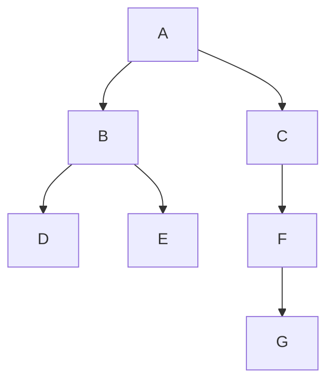

# Trees in Data Structures: Key Terms and Examples

> **One-line summary:** A tree is a hierarchical, acyclic data structure of nodes connected by edges — the foundation for binary search trees, heaps, tries, and more — where a well-balanced tree gives $O(\log n)$ insert, delete, and search all at once.

---

## Table of Contents

1. [What is a Tree?](#1-what-is-a-tree)
2. [Why Trees Matter in Programming](#2-why-trees-matter-in-programming)
3. [Key Tree Terminologies](#3-key-tree-terminologies)
4. [Visual Example with Labels](#4-visual-example-with-labels)
5. [Types of Trees](#5-types-of-trees)
6. [Tree vs Linked List](#6-tree-vs-linked-list)
7. [Representing a Tree in Code](#7-representing-a-tree-in-code)
8. [Important Properties of a Binary Tree](#8-important-properties-of-a-binary-tree)
9. [Real-World Applications](#9-real-world-applications)
10. [Key Takeaways](#10-key-takeaways)
11. [FAQs](#11-faqs)

---

## 1. What is a Tree?

Imagine your family tree. You start with your grandparents at the top, then their children below them, and then their grandchildren below that. A **tree** in data structures works exactly the same way — it is a **hierarchical structure** where data is organised in a parent-child relationship.

Arrays, linked lists, stacks, queues, and hash maps all store data in a linear or flat way. Trees break that pattern by letting us store data in a **branching, hierarchical** way, opening up powerful possibilities for searching, organising, and representing data.

```
        [root]
        /    \
    [child] [child]
    /    \
[leaf] [leaf]
```

A tree is made up of **nodes** connected by **edges**. Every tree has one special node at the top called the **root**. From the root, branches spread out downward.

---

## 2. Why Trees Matter in Programming

- Your **computer's file system** is a tree — root drive → subfolders → files.
- Your **browser's DOM** is a tree — `<html>` → `<head>` / `<body>` → nested elements.
- Searching in a sorted array takes $O(\log n)$ with binary search. A well-structured tree gives that **same speed for insertions, deletions, and lookups simultaneously**.

Trees are also the foundation for more advanced structures: Binary Search Trees (Section 11), Heaps (Section 12), Tries (Section 16), and Graphs (Section 13).

---

## 3. Key Tree Terminologies

| Term | Definition |
|---|---|
| **Root** | The topmost node; has no parent. Every tree has exactly one root. |
| **Node** | A single unit storing a value and references to child nodes. |
| **Edge** | The connection between a parent and a child. A tree with $N$ nodes has exactly $N-1$ edges. |
| **Parent** | A node that has one or more nodes directly below it. |
| **Child** | A node directly connected below a parent. |
| **Leaf** | A node with no children (also called an external node). |
| **Internal node** | Any node with at least one child (includes the root unless the tree has one node). |
| **Subtree** | Any node together with all of its descendants — useful for recursive solutions. |
| **Depth** | Number of edges from the root down to a node. Root depth = 0. |
| **Height** | Number of edges on the longest path from a node down to a leaf. Leaf height = 0. |
| **Level** | Depth + 1. Root is at level 1; some books start at level 0 (making level = depth). |
| **Degree** | Number of children a node has. The degree of the tree = max degree of any node. |
| **Siblings** | Nodes that share the same parent. |
| **Ancestor** | Any node on the path from the root to a given node. |
| **Descendant** | Any node in the subtree rooted at a given node. |

---

## 4. Visual Example with Labels

```
          A           ← Root | Level 1 | Depth 0 | Height 3
        /   \
       B     C        ← Level 2 | Depth 1 | B and C are siblings
      / \     \
     D   E     F      ← Level 3 | Depth 2 | D,E are children of B; F is child of C
                \
                 G    ← Level 4 | Depth 3 | Leaf node
```



| Node | Depth | Height | Degree | Is Leaf? |
|---|---|---|---|---|
| A | 0 | 3 | 2 | No |
| B | 1 | 1 | 2 | No |
| C | 1 | 2 | 1 | No |
| D | 2 | 0 | 0 | **Yes** |
| E | 2 | 0 | 0 | **Yes** |
| F | 2 | 1 | 1 | No |
| G | 3 | 0 | 0 | **Yes** |

- **Height of tree** = height of root A = **3**
- **Degree of tree** = max degree of any node = degree of A = B = **2**
- D, E are **siblings** (same parent B)
- B, C are **siblings** (same parent A)
- A is an **ancestor** of every other node; G is a **descendant** of all nodes above it

---

## 5. Types of Trees

### General Tree
No restriction on the number of children per node. A file system is a real-world general tree.

### Binary Tree
Every node has **at most two children** — a left child and a right child. Most interview tree problems involve binary trees.

### Binary Search Tree (BST)
A binary tree with an ordering rule:
- All values in the **left subtree** < parent value
- All values in the **right subtree** > parent value

This ordering makes search, insert, and delete $O(\log n)$ in a balanced BST. Covered in depth in Section 11.

### Balanced Tree
A tree where the height difference between left and right subtrees of every node is at most 1.

$$|\text{height}(\text{left}) - \text{height}(\text{right})| \leq 1 \quad \text{for every node}$$

Balanced trees guarantee $O(\log n)$ operations. An unbalanced tree (e.g., inserting sorted data into a BST) degrades to $O(n)$.

---

## 6. Tree vs Linked List

| Feature | Linked List | Tree |
|---|---|---|
| Structure | Linear (one direction) | Hierarchical (branching) |
| Children per node | 1 (next pointer) | 2 or more |
| Traversal | Sequential | Multiple paths (DFS, BFS) |
| Use cases | Stacks, queues, lists | File systems, databases, DOM |
| Search time (sorted) | $O(n)$ | $O(\log n)$ in balanced trees |

Trees are far more flexible and powerful for hierarchical problems. Linked lists are great for sequential data; trees shine when data has natural hierarchy or when you need fast lookups with structure.

---

## 7. Representing a Tree in Code

The most common way is a **Node class** where each node holds a value and left/right child references.

**Python:**

```python
class Node:
    def __init__(self, value):
        self.value = value
        self.left  = None   # left child
        self.right = None   # right child

# Build a simple binary tree manually
root            = Node(1)
root.left       = Node(2)
root.right      = Node(3)
root.left.left  = Node(4)
root.left.right = Node(5)

#        1
#       / \
#      2   3
#     / \
#    4   5

print(root.value)             # Output: 1
print(root.left.value)        # Output: 2
print(root.left.left.value)   # Output: 4
```

**C++:**

```cpp
#include <iostream>
using namespace std;

struct Node {
    int value;
    Node* left;
    Node* right;

    Node(int val) : value(val), left(nullptr), right(nullptr) {}
};

int main() {
    // Build the same tree
    Node* root        = new Node(1);
    root->left        = new Node(2);
    root->right       = new Node(3);
    root->left->left  = new Node(4);
    root->left->right = new Node(5);

    //        1
    //       / \
    //      2   3
    //     / \
    //    4   5

    cout << root->value            << "\n";  // Output: 1
    cout << root->left->value      << "\n";  // Output: 2
    cout << root->left->left->value << "\n"; // Output: 4

    // Clean up (in production use smart pointers)
    delete root->left->left;
    delete root->left->right;
    delete root->left;
    delete root->right;
    delete root;
    return 0;
}
```

We navigate the tree by following `left` and `right` pointers from the root, just like following `next` pointers in a linked list — but now branching in two directions.

---

## 8. Important Properties of a Binary Tree

Let $h$ = height of the tree, $N$ = number of nodes.

| Property | Formula |
|---|---|
| Max nodes in a tree of height $h$ | $2^{h+1} - 1$ |
| Max nodes at the last level | $2^h$ |
| Min height for $N$ nodes | $\lfloor \log_2 N \rfloor$ |
| Leaf nodes in a full binary tree | one more than internal nodes with two children |

These properties appear naturally in algorithm analysis:

$$\text{Minimum height} = \lfloor \log_2 N \rfloor$$

A **full binary tree** has every node with either 0 or 2 children (no node has exactly 1 child).  
A **complete binary tree** fills all levels left to right, with the last level possibly incomplete.  
A **perfect binary tree** has all internal nodes with exactly 2 children and all leaves at the same level.

---

## 9. Real-World Applications

| Domain | Tree Type | Role |
|---|---|---|
| File systems | General tree | Folders and files in a hierarchy |
| HTML DOM | General tree | `<html>` root, nested elements as children |
| Database indexes | B-Tree / B+ Tree | Fast $O(\log n)$ range queries |
| Compilers | Expression tree | Parse and evaluate mathematical expressions |
| Autocomplete | Trie | Prefix-based suggestions (Section 16) |
| Priority queues | Heap (binary tree) | Efficient min/max access (Section 12) |
| Network routing | Spanning tree | Minimum spanning tree algorithms |

---

## 10. Key Takeaways

- A **tree** is a hierarchical, acyclic structure of nodes connected by edges.
- Every tree has exactly one **root**; nodes with no children are **leaves**.
- **Depth** = edges from root to node (root = 0). **Height** = edges from node to farthest leaf (leaf = 0).
- A tree with $N$ nodes has exactly $N - 1$ edges.
- **Binary tree**: at most 2 children per node — the most common type in interviews.
- **Balanced** trees guarantee $O(\log n)$ operations; unbalanced ones degrade to $O(n)$.
- Represent a binary tree with a `Node` class holding `value`, `left`, and `right`.
- Trees underpin file systems, DOM, databases, compilers, and search — they are everywhere.

---

## 11. FAQs

**What is the difference between depth and height of a node?**  
**Depth** is measured *downward from the root* to the node (how far the node is from the root). **Height** is measured *upward from the farthest leaf* below the node. The root has depth 0 and the greatest height; a leaf has height 0 and varying depth.

**Can a tree have cycles?**  
No. A tree is by definition acyclic. If there is a cycle, the structure becomes a **graph**. Every node in a tree has exactly one parent (except the root, which has none), and there is exactly one path between any two nodes.

**What is the difference between a binary tree and a binary search tree?**  
A **binary tree** only requires each node to have at most two children — no constraint on values. A **binary search tree** adds an ordering rule: left subtree values < node value < right subtree values. All BSTs are binary trees, but not all binary trees are BSTs.

**What does "balanced" mean and why does it matter?**  
A tree is balanced when the height difference between the left and right subtrees of every node is at most 1. This keeps the height at $O(\log n)$, guaranteeing fast operations. Without balancing, inserting sorted data into a BST creates a linear chain with $O(n)$ operations.

**How is a tree different from a graph?**  
A tree is a **connected, acyclic, undirected graph** with exactly one path between any two nodes. A graph can have cycles, multiple paths between nodes, and disconnected components. Every tree is a graph, but not every graph is a tree.
