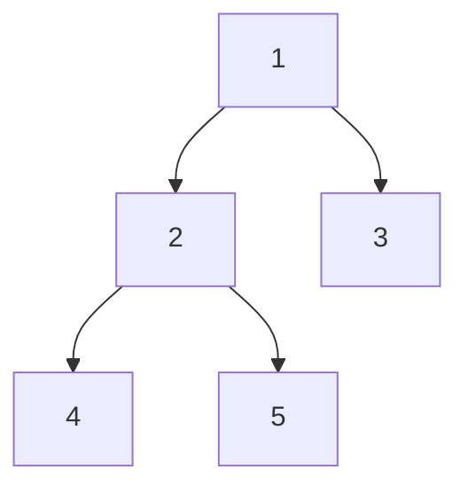
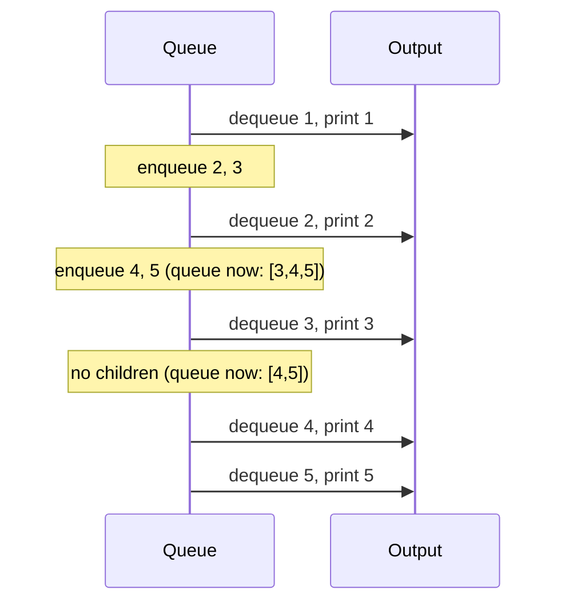

# Binary Tree Traversals: DFS and BFS Guide

> **One-line summary:** Tree traversal means visiting every node exactly once in a defined order — DFS explores one branch fully before backtracking (3 variants), while BFS visits level by level using a queue — both run in $O(n)$ time.

---

## Table of Contents

1. [What is Tree Traversal?](#1-what-is-tree-traversal)
2. [The Example Tree](#2-the-example-tree)
3. [Depth First Search (DFS)](#3-depth-first-search-dfs)
   - [Preorder — Root → Left → Right](#preorder--root--left--right)
   - [Inorder — Left → Root → Right](#inorder--left--root--right)
   - [Postorder — Left → Right → Root](#postorder--left--right--root)
4. [Breadth First Search (BFS) — Level Order](#4-breadth-first-search-bfs--level-order)
5. [All Four Traversals Side by Side](#5-all-four-traversals-side-by-side)
6. [DFS vs BFS: When to Use Which](#6-dfs-vs-bfs-when-to-use-which)
7. [Node Structure and Tree Setup](#7-node-structure-and-tree-setup)
8. [Key Takeaways](#8-key-takeaways)
9. [FAQs](#9-faqs)

---

## 1. What is Tree Traversal?

Imagine visiting every family member in a family tree. Do you go generation by generation? Or do you follow one branch all the way down before moving to the next? That choice is exactly what tree traversal is about.

**Tree traversal** means visiting every node in a tree **exactly once** in a specific order. There are two broad strategies:

| Strategy                       | Idea                                                       | Data Structure    |
| ------------------------------ | ---------------------------------------------------------- | ----------------- |
| **DFS** (Depth First Search)   | Go as deep as possible down one branch before backtracking | Stack / Recursion |
| **BFS** (Breadth First Search) | Visit all nodes at the current level before going deeper   | Queue             |

DFS has three variants based on **when you visit the root** relative to its children: Preorder, Inorder, Postorder.

---

## 2. The Example Tree

All traversals below use this same binary tree:

```
        1
       / \
      2   3
     / \
    4   5
```



---

## 3. Depth First Search (DFS)

DFS goes as deep as possible into one branch before backtracking. Think of exploring a maze by always taking the first available turn and only going back when you hit a dead end. All three DFS variants are naturally recursive.

---

### Preorder — Root → Left → Right

Visit the **root first**, then recursively the left subtree, then the right subtree.

> Analogy: reading a book's table of contents — you see the main heading before the details.

**Traversal of the example tree:** `1 → 2 → 4 → 5 → 3`

```
Visit 1 (root)
  Visit 2 (left of 1)
    Visit 4 (left of 2)  ← leaf
    Visit 5 (right of 2) ← leaf
  Visit 3 (right of 1) ← leaf
```

**Python:**

```python
def preorder(root):
    if root is None:
        return
    print(root.value, end=" ")   # Root first
    preorder(root.left)          # Then left subtree
    preorder(root.right)         # Then right subtree

# Output: 1 2 4 5 3
```

**C++ (simple):**

```cpp
void preorder(Node* root) {
    if (root == nullptr) return;

    cout << root->value << " ";  // Root first
    preorder(root->left);        // Then left subtree
    preorder(root->right);       // Then right subtree
}
// Output: 1 2 4 5 3
```

**C++ (LeetCode class style):**

```cpp
#include <vector>
using namespace std;

struct TreeNode {
    int val;
    TreeNode* left;
    TreeNode* right;
    TreeNode(int x) : val(x), left(nullptr), right(nullptr) {}
};

class Solution {
    void helper(TreeNode* root, vector<int>& result) {
        if (root == nullptr) return;       // base case: empty subtree
        result.push_back(root->val);       // visit root first
        helper(root->left, result);        // then recurse on left subtree
        helper(root->right, result);       // then recurse on right subtree
    }
public:
    vector<int> preorderTraversal(TreeNode* root) {
        vector<int> result;
        helper(root, result);
        return result;
    }
};
```

---

### Inorder — Left → Root → Right

Visit the **left subtree first**, then the root, then the right subtree.

> Key property: for a **Binary Search Tree**, inorder traversal produces nodes in **sorted ascending order**.

**Traversal of the example tree:** `4 → 2 → 5 → 1 → 3`

```
  Visit 4 (left of 2) ← leaf
Visit 2 (root of left subtree)
  Visit 5 (right of 2) ← leaf
Visit 1 (root)
Visit 3 (right of 1) ← leaf
```

**Python:**

```python
def inorder(root):
    if root is None:
        return
    inorder(root.left)           # Left subtree first
    print(root.value, end=" ")   # Then root
    inorder(root.right)          # Then right subtree

# Output: 4 2 5 1 3
```

**C++ (simple):**

```cpp
void inorder(Node* root) {
    if (root == nullptr) return;

    inorder(root->left);         // Left subtree first
    cout << root->value << " ";  // Then root
    inorder(root->right);        // Then right subtree
}
// Output: 4 2 5 1 3
```

**C++ (LeetCode class style):**

```cpp
#include <vector>
using namespace std;

struct TreeNode {
    int val;
    TreeNode* left;
    TreeNode* right;
    TreeNode(int x) : val(x), left(nullptr), right(nullptr) {}
};

class Solution {
    void helper(TreeNode* root, vector<int>& result) {
        if (root == nullptr) return;       // base case: empty subtree
        helper(root->left, result);        // recurse left subtree first
        result.push_back(root->val);       // visit root (middle)
        helper(root->right, result);       // recurse right subtree last
    }
public:
    vector<int> inorderTraversal(TreeNode* root) {
        vector<int> result;
        helper(root, result);
        return result;
    }
};
```

Node 4 is printed before node 2, even though 2 is higher in the tree — we only print a node **after fully finishing its left subtree**.

---

### Postorder — Left → Right → Root

Visit both subtrees first, then the **root last**.

> Analogy: cleaning a room — clear the left corner, the right corner, then sweep the main floor.  
> Use case: **deleting a tree** (children before parent) or **evaluating expression trees**.

**Traversal of the example tree:** `4 → 5 → 2 → 3 → 1`

```
  Visit 4 (left of 2) ← leaf
  Visit 5 (right of 2) ← leaf
Visit 2 (root of left subtree)
Visit 3 (right of 1) ← leaf
Visit 1 (root)
```

**Python:**

```python
def postorder(root):
    if root is None:
        return
    postorder(root.left)         # Left subtree first
    postorder(root.right)        # Then right subtree
    print(root.value, end=" ")   # Root last

# Output: 4 5 2 3 1
```

**C++ (simple):**

```cpp
void postorder(Node* root) {
    if (root == nullptr) return;

    postorder(root->left);       // Left subtree first
    postorder(root->right);      // Then right subtree
    cout << root->value << " ";  // Root last
}
// Output: 4 5 2 3 1
```

**C++ (LeetCode class style):**

```cpp
#include <vector>
using namespace std;

struct TreeNode {
    int val;
    TreeNode* left;
    TreeNode* right;
    TreeNode(int x) : val(x), left(nullptr), right(nullptr) {}
};

class Solution {
    void helper(TreeNode* root, vector<int>& result) {
        if (root == nullptr) return;       // base case: empty subtree
        helper(root->left, result);        // recurse left subtree first
        helper(root->right, result);       // recurse right subtree second
        result.push_back(root->val);       // visit root last
    }
public:
    vector<int> postorderTraversal(TreeNode* root) {
        vector<int> result;
        helper(root, result);
        return result;
    }
};
```

---

## 4. Breadth First Search (BFS) — Level Order

BFS visits nodes **level by level**, starting from the root. It uses a **queue** to keep track of which nodes to visit next.

> Analogy: filling a building floor by floor with water — ground floor first, then the next, and so on.

**Traversal of the example tree:** `1 → 2 → 3 → 4 → 5`



**Python:**

```python
from collections import deque

def level_order(root):
    if root is None:
        return
    queue = deque([root])

    while queue:
        node = queue.popleft()           # Dequeue front
        print(node.value, end=" ")       # Visit

        if node.left:
            queue.append(node.left)      # Enqueue left child
        if node.right:
            queue.append(node.right)     # Enqueue right child

# Output: 1 2 3 4 5
```

**C++ (simple):**

```cpp
#include <queue>
using namespace std;

void levelOrder(Node* root) {
    if (root == nullptr) return;

    queue<Node*> q;
    q.push(root);

    while (!q.empty()) {
        Node* current = q.front(); q.pop();  // Dequeue
        cout << current->value << " ";        // Visit

        if (current->left)  q.push(current->left);   // Enqueue left
        if (current->right) q.push(current->right);  // Enqueue right
    }
}
// Output: 1 2 3 4 5
```

**C++ (LeetCode class style):**

```cpp
#include <vector>
#include <queue>
using namespace std;

struct TreeNode {
    int val;
    TreeNode* left;
    TreeNode* right;
    TreeNode(int x) : val(x), left(nullptr), right(nullptr) {}
};

class Solution {
public:
    vector<vector<int>> levelOrder(TreeNode* root) {
        vector<vector<int>> result;
        if (root == nullptr) return result;    // empty tree
        queue<TreeNode*> q;
        q.push(root);                          // start BFS from root
        while (!q.empty()) {
            int levelSize = q.size();          // nodes at current level
            vector<int> level;
            for (int i = 0; i < levelSize; i++) {
                TreeNode* node = q.front(); q.pop();  // dequeue node
                level.push_back(node->val);           // collect value
                if (node->left)  q.push(node->left);  // enqueue left child
                if (node->right) q.push(node->right); // enqueue right child
            }
            result.push_back(level);           // save this level's values
        }
        return result;
    }
};
```

The queue ensures nodes at the same level are processed left to right before descending.

---

## 5. All Four Traversals Side by Side

Using the same tree `[1, 2, 3, 4, 5]`:

| Traversal         | Strategy            | Output          |
| ----------------- | ------------------- | --------------- |
| Preorder (DFS)    | Root → Left → Right | `1, 2, 4, 5, 3` |
| Inorder (DFS)     | Left → Root → Right | `4, 2, 5, 1, 3` |
| Postorder (DFS)   | Left → Right → Root | `4, 5, 2, 3, 1` |
| Level Order (BFS) | Level by level      | `1, 2, 3, 4, 5` |

Each traversal visits all five nodes exactly once — the **order** is what differs.

**Python — all four in one file:**

```python
from collections import deque

class Node:
    def __init__(self, value):
        self.value = value
        self.left  = None
        self.right = None

def preorder(root):
    if root is None: return
    print(root.value, end=" ")
    preorder(root.left); preorder(root.right)

def inorder(root):
    if root is None: return
    inorder(root.left)
    print(root.value, end=" ")
    inorder(root.right)

def postorder(root):
    if root is None: return
    postorder(root.left); postorder(root.right)
    print(root.value, end=" ")

def level_order(root):
    if root is None: return
    q = deque([root])
    while q:
        node = q.popleft()
        print(node.value, end=" ")
        if node.left:  q.append(node.left)
        if node.right: q.append(node.right)

# Build the example tree
root            = Node(1)
root.left       = Node(2)
root.right      = Node(3)
root.left.left  = Node(4)
root.left.right = Node(5)

print("Preorder:    ", end=""); preorder(root);     print()  # 1 2 4 5 3
print("Inorder:     ", end=""); inorder(root);      print()  # 4 2 5 1 3
print("Postorder:   ", end=""); postorder(root);    print()  # 4 5 2 3 1
print("Level Order: ", end=""); level_order(root);  print()  # 1 2 3 4 5
```

**C++ (simple):**

```cpp
#include <iostream>
#include <queue>
using namespace std;

struct Node {
    int value;
    Node* left;
    Node* right;
    Node(int val) : value(val), left(nullptr), right(nullptr) {}
};

void preorder(Node* root) {
    if (!root) return;
    cout << root->value << " ";   // root first
    preorder(root->left);         // then left
    preorder(root->right);        // then right
}

void inorder(Node* root) {
    if (!root) return;
    inorder(root->left);          // left first
    cout << root->value << " ";   // then root
    inorder(root->right);         // then right
}

void postorder(Node* root) {
    if (!root) return;
    postorder(root->left);        // left first
    postorder(root->right);       // right second
    cout << root->value << " ";   // root last
}

void levelOrder(Node* root) {
    if (!root) return;
    queue<Node*> q;
    q.push(root);
    while (!q.empty()) {
        Node* node = q.front(); q.pop();
        cout << node->value << " ";             // visit node
        if (node->left)  q.push(node->left);   // enqueue children
        if (node->right) q.push(node->right);
    }
}

int main() {
    Node* root        = new Node(1);
    root->left        = new Node(2);
    root->right       = new Node(3);
    root->left->left  = new Node(4);
    root->left->right = new Node(5);

    cout << "Preorder:    "; preorder(root);    cout << "\n";  // 1 2 4 5 3
    cout << "Inorder:     "; inorder(root);     cout << "\n";  // 4 2 5 1 3
    cout << "Postorder:   "; postorder(root);   cout << "\n";  // 4 5 2 3 1
    cout << "Level Order: "; levelOrder(root);  cout << "\n";  // 1 2 3 4 5
    return 0;
}
```

**C++ (LeetCode class style):**

```cpp
#include <vector>
#include <queue>
using namespace std;

struct TreeNode {
    int val;
    TreeNode* left;
    TreeNode* right;
    TreeNode(int x) : val(x), left(nullptr), right(nullptr) {}
};

class Solution {
    void preHelper(TreeNode* r, vector<int>& v) {
        if (!r) return;
        v.push_back(r->val);          // root first
        preHelper(r->left, v);        // then left
        preHelper(r->right, v);       // then right
    }
    void inHelper(TreeNode* r, vector<int>& v) {
        if (!r) return;
        inHelper(r->left, v);         // left first
        v.push_back(r->val);          // then root
        inHelper(r->right, v);        // then right
    }
    void postHelper(TreeNode* r, vector<int>& v) {
        if (!r) return;
        postHelper(r->left, v);       // left first
        postHelper(r->right, v);      // right second
        v.push_back(r->val);          // root last
    }
public:
    vector<int> preorderTraversal(TreeNode* root) {
        vector<int> v; preHelper(root, v); return v;
    }
    vector<int> inorderTraversal(TreeNode* root) {
        vector<int> v; inHelper(root, v); return v;
    }
    vector<int> postorderTraversal(TreeNode* root) {
        vector<int> v; postHelper(root, v); return v;
    }
    vector<vector<int>> levelOrder(TreeNode* root) {
        vector<vector<int>> result;
        if (!root) return result;
        queue<TreeNode*> q;
        q.push(root);
        while (!q.empty()) {
            int sz = q.size();                     // nodes at current level
            vector<int> level;
            for (int i = 0; i < sz; i++) {
                auto* node = q.front(); q.pop();
                level.push_back(node->val);              // collect level's values
                if (node->left)  q.push(node->left);     // enqueue left child
                if (node->right) q.push(node->right);    // enqueue right child
            }
            result.push_back(level);               // save this level's result
        }
        return result;
    }
};
```

---

## 6. DFS vs BFS: When to Use Which

| Criteria       | DFS                                           | BFS                                      |
| -------------- | --------------------------------------------- | ---------------------------------------- |
| Data structure | Stack (or recursion)                          | Queue                                    |
| Memory usage   | $O(h)$ — height of tree                       | $O(w)$ — max width of tree               |
| Best for       | Path finding, subtree checks, inorder sorting | Shortest path, level problems, min depth |
| Visits         | One branch at a time                          | One level at a time                      |
| Implementation | Recursive (simple)                            | Iterative with queue                     |

**Choose BFS when:**

- You need level-by-level information (print nodes by level, min depth)
- The answer is close to the root (shortest path)

**Choose DFS when:**

- You need to explore full paths or subtrees
- You need inorder output (sorted BST values)
- You are deleting/cloning a tree (postorder)
- You are serialising/deserialising (preorder)

---

## 7. Node Structure and Tree Setup

For reference, here is the complete node definition used throughout this post.

**Python:**

```python
class Node:
    def __init__(self, value):
        self.value = value
        self.left  = None
        self.right = None

# Build the example tree:  1 → (2 → 4, 5), 3
def build_tree():
    root            = Node(1)
    root.left       = Node(2)
    root.right      = Node(3)
    root.left.left  = Node(4)
    root.left.right = Node(5)
    return root
```

**C++ (simple):**

```cpp
#include <iostream>
#include <queue>
using namespace std;

struct Node {
    int value;
    Node* left;
    Node* right;
    Node(int val) : value(val), left(nullptr), right(nullptr) {}
};

Node* buildTree() {
    Node* root        = new Node(1);   // root node
    root->left        = new Node(2);   // left child of root
    root->right       = new Node(3);   // right child of root
    root->left->left  = new Node(4);   // left-left grandchild
    root->left->right = new Node(5);   // left-right grandchild
    return root;
}
```

**C++ (LeetCode class style):**

```cpp
#include <iostream>
using namespace std;

struct TreeNode {
    int val;
    TreeNode* left;
    TreeNode* right;
    TreeNode(int x) : val(x), left(nullptr), right(nullptr) {}
};

class Solution {
public:
    // Build the example binary tree and return its root
    TreeNode* buildTree() {
        TreeNode* root            = new TreeNode(1);  // root node
        root->left                = new TreeNode(2);  // left child of root
        root->right               = new TreeNode(3);  // right child of root
        root->left->left          = new TreeNode(4);  // left-left grandchild
        root->left->right         = new TreeNode(5);  // left-right grandchild
        return root;
    }
};
```

---

## 8. Key Takeaways

- **Tree traversal** visits every node exactly once — the order depends on which traversal you choose.
- **DFS has three variants:** Preorder (root first), Inorder (root middle), Postorder (root last).
- **Inorder on a BST** yields values in **sorted ascending order** — a critical property.
- **Postorder** is used when children must be processed before their parent (delete tree, evaluate expressions).
- **BFS / Level Order** uses a queue and processes the tree one level at a time.
- All four traversals have time complexity $O(n)$ — every node is visited once.
- Space: DFS costs $O(h)$ (recursion stack); BFS costs $O(w)$ (queue holds one full level).
- DFS is easier to implement recursively; BFS requires an explicit queue.

---

## 9. FAQs

**Which traversal is used most often in interviews?**  
Inorder is very common for BST problems (gives sorted output). Level order (BFS) is frequently asked for problems involving tree levels, minimum depth, or zigzag traversal. Preorder is used for serialisation and tree cloning.

**Can DFS be done without recursion?**  
Yes — use an explicit `stack` (Python `list` / C++ `std::stack`). Push the root, then for each popped node push its right child first, then left (so left is processed first). The recursive approach is simpler to read but can cause stack overflow on very deep trees.

**What is the time and space complexity of tree traversals?**  
All four traversals are $O(n)$ time — every node is visited exactly once. Space for DFS is $O(h)$ where $h$ is the tree height (recursion call stack). Space for BFS is $O(w)$ where $w$ is the maximum width (nodes in the widest level). For a balanced tree $h = O(\log n)$; for a skewed tree $h = O(n)$.

**What is the difference between DFS on a tree and DFS on a graph?**  
Tree DFS is simpler — trees have no cycles, so you never revisit a node. Graph DFS needs a `visited` set to avoid infinite loops. Tree DFS also has natural preorder/inorder/postorder variants that do not apply to graphs.

**When does inorder NOT give sorted output?**  
Inorder gives sorted output only for a **Binary Search Tree**. For a general binary tree (no ordering constraint), inorder output is just the left-root-right visiting order with no guaranteed sorting.
