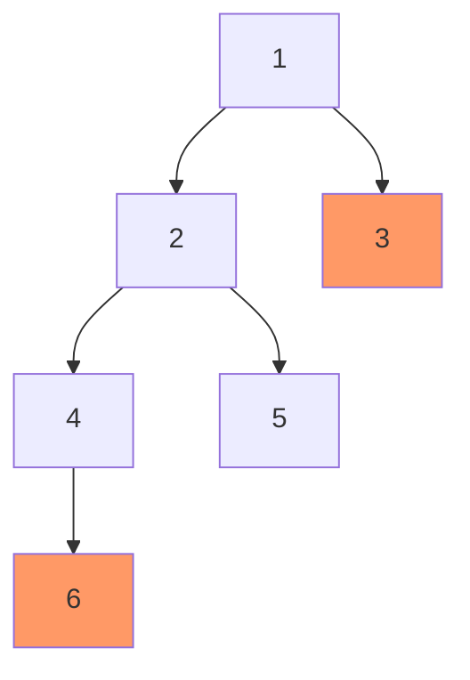

# Binary Tree Height, Depth, and Diameter Explained

> **One-line summary:** Height measures how deep a tree goes from a node down; depth measures how far a specific node is from the root; diameter is the longest edge-path between any two nodes — all three computed in $O(n)$ via a single post-order DFS pass.

---

## Table of Contents

1. [What Are Height, Depth, and Diameter?](#1-what-are-height-depth-and-diameter)
2. [Height of a Tree](#2-height-of-a-tree)
3. [Depth of a Node](#3-depth-of-a-node)
4. [Height vs Depth: Key Differences](#4-height-vs-depth-key-differences)
5. [Diameter of a Tree](#5-diameter-of-a-tree)
6. [When the Diameter Does Not Pass Through the Root](#6-when-the-diameter-does-not-pass-through-the-root)
7. [Time and Space Complexity](#7-time-and-space-complexity)
8. [Key Takeaways](#8-key-takeaways)
9. [FAQs](#9-faqs)

---

## 1. What Are Height, Depth, and Diameter?

Imagine a tree in your backyard — roots at the bottom, branches spreading upward. In computer science, we **flip that picture**: the root is at the top and leaves hang at the bottom.

Three natural questions arise:

- **How tall is the tree?** → **Height**
- **How far down is this particular node?** → **Depth**
- **How wide can you stretch across it?** → **Diameter**

```
           1          ← depth 0  |  height 2
          / \
         2   3        ← depth 1
        / \
       4   5          ← depth 2  |  height 0 (leaves)
```

All three concepts rely on tree traversal — specifically **post-order DFS** — covered in the previous post.

---

## 2. Height of a Tree

### What is Height?

The **height** of a tree (or a node) is the number of **edges** on the longest path from that node down to any leaf.

- A **leaf node** has height **0** (no edges below it).
- A **null node** has height **−1** (convention that makes leaf = 0 work out cleanly).
- The **height of the tree** = height of its root.

> Some textbooks count in nodes instead of edges (leaf height = 1). Always check the problem statement.

### Height Example

```
        1
       / \
      2   3
     / \
    4   5
```

Longest path from root: `1 → 2 → 4` (or `1 → 2 → 5`) = **2 edges** → height = **2**.

### Calculating Height Recursively

At each node: take the max height of the left and right subtrees, then add 1 for the current edge.

**Python:**

```python
class TreeNode:
    def __init__(self, val=0, left=None, right=None):
        self.val   = val
        self.left  = left
        self.right = right

def height(node):
    if node is None:
        return -1                              # null → -1 so leaf → 0

    left_h  = height(node.left)
    right_h = height(node.right)

    return 1 + max(left_h, right_h)           # add 1 for the current edge

# Build sample tree
root            = TreeNode(1)
root.left       = TreeNode(2)
root.right      = TreeNode(3)
root.left.left  = TreeNode(4)
root.left.right = TreeNode(5)

print("Height:", height(root))  # Output: 2
```

**C++:**

```cpp
#include <iostream>
#include <algorithm>
using namespace std;

struct TreeNode {
    int val;
    TreeNode* left;
    TreeNode* right;
    TreeNode(int v) : val(v), left(nullptr), right(nullptr) {}
};

int height(TreeNode* node) {
    if (node == nullptr) return -1;           // null → -1

    int leftH  = height(node->left);
    int rightH = height(node->right);

    return 1 + max(leftH, rightH);            // add 1 for current edge
}

int main() {
    TreeNode* root        = new TreeNode(1);
    root->left            = new TreeNode(2);
    root->right           = new TreeNode(3);
    root->left->left      = new TreeNode(4);
    root->left->right     = new TreeNode(5);

    cout << "Height: " << height(root) << "\n";  // Output: 2
    return 0;
}
```

The recursion returns −1 for null so that a leaf (both children null) correctly evaluates to $1 + \max(-1, -1) = 0$.

---

## 3. Depth of a Node

### What is Depth?

The **depth** of a node is the number of **edges from the root down to that node**.

- The **root** has depth **0**.
- Each level down adds 1.

> Depth is a property of an **individual node**; height is a property of a **subtree** or the whole tree.

### Depth Example

```
        1   (depth 0)
       / \
      2   3  (depth 1)
     / \
    4   5  (depth 2)
```

### Calculating Depth

Pass the current depth as a parameter; increment by 1 when descending to a child.

**Python:**

```python
def find_depth(root, target, current_depth=0):
    if root is None:
        return -1                             # target not found

    if root.val == target:
        return current_depth                  # found it

    # Search left subtree
    left = find_depth(root.left, target, current_depth + 1)
    if left != -1:
        return left

    # Search right subtree
    return find_depth(root.right, target, current_depth + 1)

print("Depth of node 4:", find_depth(root, 4))  # Output: 2
print("Depth of node 3:", find_depth(root, 3))  # Output: 1
print("Depth of node 1:", find_depth(root, 1))  # Output: 0
```

**C++:**

```cpp
int findDepth(TreeNode* root, int target, int currentDepth = 0) {
    if (root == nullptr) return -1;

    if (root->val == target) return currentDepth;

    int left = findDepth(root->left, target, currentDepth + 1);
    if (left != -1) return left;

    return findDepth(root->right, target, currentDepth + 1);
}

int main() {
    // (using the same root from above)
    cout << "Depth of 4: " << findDepth(root, 4) << "\n";  // 2
    cout << "Depth of 3: " << findDepth(root, 3) << "\n";  // 1
    cout << "Depth of 1: " << findDepth(root, 1) << "\n";  // 0
    return 0;
}
```

---

## 4. Height vs Depth: Key Differences

| Property      | Height                                | Depth                         |
| ------------- | ------------------------------------- | ----------------------------- |
| Measured from | Node to the **deepest leaf below it** | **Root** to the specific node |
| Direction     | Bottom-up                             | Top-down                      |
| Applies to    | A node or the whole tree              | A specific individual node    |
| Root value    | Height of tree = longest path down    | Depth of root = **0**         |
| Leaf value    | Height of leaf = **0**                | Depth varies by position      |

> **Memory trick:** Height = how _tall_ the tree is from that point going _down_. Depth = how _deep_ you are from the top.

---

## 5. Diameter of a Tree

### What is Diameter?

The **diameter** (also called the _width_) of a binary tree is the **length (in edges) of the longest path between any two nodes**. The path may or may not pass through the root.

### Diameter Example

```
           1
          / \
         2   3
        / \
       4   5
      /
     6
```

Longest path: `6 → 4 → 2 → 1 → 3` = **4 edges** → diameter = **4**.



The path `6 → 4 → 2 → 1 → 3` (highlighted) passes through the root.

### Calculating Diameter Recursively

At each node, the diameter **through that node** = (height of left subtree + 1) + (height of right subtree + 1) = the number of edges reaching both sides' deepest leaves.

We compute height and diameter in a **single DFS pass**, tracking the global maximum.

**Python:**

```python
class DiameterSolver:
    def __init__(self):
        self.max_diameter = 0

    def diameter(self, root):
        self._height(root)
        return self.max_diameter

    def _height(self, node):
        if node is None:
            return -1

        left_h  = self._height(node.left)
        right_h = self._height(node.right)

        # Edges on both sides of this node
        current_diameter = (left_h + 1) + (right_h + 1)
        self.max_diameter = max(self.max_diameter, current_diameter)

        return 1 + max(left_h, right_h)

# Build tree: 1→(2→(4→6, 5), 3)
root                     = TreeNode(1)
root.left                = TreeNode(2)
root.right               = TreeNode(3)
root.left.left           = TreeNode(4)
root.left.right          = TreeNode(5)
root.left.left.left      = TreeNode(6)

sol = DiameterSolver()
print("Diameter:", sol.diameter(root))  # Output: 4
```

**C++:**

```cpp
#include <iostream>
#include <algorithm>
using namespace std;

int maxDiameter = 0;  // global tracker

int heightForDiameter(TreeNode* node) {
    if (node == nullptr) return -1;

    int leftH  = heightForDiameter(node->left);
    int rightH = heightForDiameter(node->right);

    int currentDiameter = (leftH + 1) + (rightH + 1);
    maxDiameter = max(maxDiameter, currentDiameter);

    return 1 + max(leftH, rightH);
}

int diameter(TreeNode* root) {
    maxDiameter = 0;
    heightForDiameter(root);
    return maxDiameter;
}

int main() {
    TreeNode* root               = new TreeNode(1);
    root->left                   = new TreeNode(2);
    root->right                  = new TreeNode(3);
    root->left->left             = new TreeNode(4);
    root->left->right            = new TreeNode(5);
    root->left->left->left       = new TreeNode(6);

    cout << "Diameter: " << diameter(root) << "\n";  // Output: 4
    return 0;
}
```

---

## 6. When the Diameter Does Not Pass Through the Root

This is the tricky case that catches many beginners. Consider:

```
       1
      /
     2
    / \
   3   4
  /     \
 5       6
```

Longest path: `5 → 3 → 2 → 4 → 6` = **4 edges**. The root (1) is **not** part of this path.

Our algorithm handles this correctly because we check `current_diameter` at **every node**, not just the root. When we reach node 2, we compute:

$$\text{left height at 2} = 1 \quad (\text{via node 3}) \quad \text{right height at 2} = 1 \quad (\text{via node 4})$$
$$\text{diameter through 2} = (1+1) + (1+1) = 4$$

This becomes the global maximum even though we never check the root.

---

## 7. Time and Space Complexity

| Operation        | Time   | Space  |
| ---------------- | ------ | ------ |
| Height of tree   | $O(n)$ | $O(h)$ |
| Depth of a node  | $O(n)$ | $O(h)$ |
| Diameter of tree | $O(n)$ | $O(h)$ |

Where:

- $n$ = number of nodes (every node visited once)
- $h$ = height of the tree = recursion call stack depth
  - $O(\log n)$ for a **balanced** tree
  - $O(n)$ worst case for a **skewed** tree (resembles a linked list)

The diameter solution uses a single DFS pass to compute both height and diameter simultaneously — no extra traversal needed.

---

## 8. Key Takeaways

- **Height** of a node = edges to the deepest leaf below it. Height of a null node = −1; height of a leaf = 0.
- **Depth** of a node = edges from the root down to it. Root depth = 0.
- **Diameter** = longest edge-path between any two nodes; may or may not pass through the root.
- All three are computed with **post-order DFS** (process children before parent).
- The diameter algorithm tracks `max_diameter` as a side-effect during the height recursion — single $O(n)$ pass.
- Space is $O(h)$ for all three: $O(\log n)$ balanced, $O(n)$ skewed.
- Height and diameter both have the null→−1, leaf→0 pattern: returning −1 for null ensures a leaf correctly evaluates to $1 + \max(-1,-1) = 0$.

---

## 9. FAQs

**Is height counted in nodes or edges?**  
It depends on the problem. Edge-based: a single-node tree has height 0. Node-based: a single-node tree has height 1. Our code uses **edge-based** (null = −1, leaf = 0). Always check the problem statement before coding.

**Does the diameter always pass through the root?**  
No. The diameter is the longest path between **any** two nodes and can lie entirely within a subtree. This is why the algorithm checks the diameter at every node during recursion, not just at the root.

**What is the height of a leaf node?**  
Using edge-based definition: **0** (no edges below it). Using node-based: **1**. Our code returns −1 for null and 0 for a leaf, consistent with the edge-based approach.

**Why do we return −1 for a null node when calculating height?**  
So that a leaf node (whose both children are null) computes $1 + \max(-1, -1) = 0$ — correctly giving a leaf height of 0. If we returned 0 for null, a leaf would give height 1 instead.

**Can we find height using BFS instead of DFS?**  
Yes. BFS (level order) counts the number of levels minus 1. Each completed level increments a counter; when the queue empties the counter equals the height. The time and space are both $O(n)$, but the DFS approach is typically more concise.
