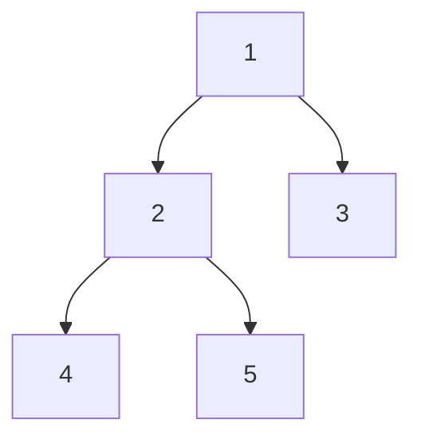
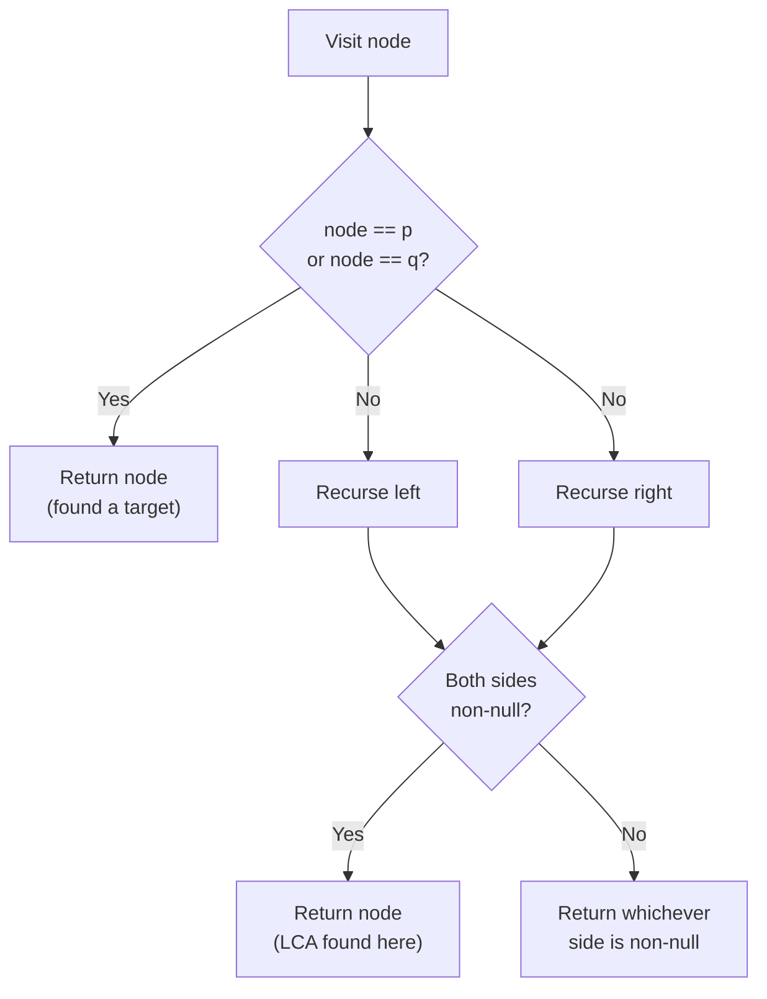

# Lowest Common Ancestor (LCA) in Binary Trees: Guide

> **One-line summary:** The LCA of two nodes is the deepest node that is an ancestor of both — found elegantly with a single post-order DFS that returns the node when it matches a target and combines left/right results to identify the split point.

---

## Table of Contents

1. [What is LCA?](#1-what-is-lca)
2. [Key Terminology Recap](#2-key-terminology-recap)
3. [Visualising LCA with an Example](#3-visualising-lca-with-an-example)
4. [The Recursive Approach](#4-the-recursive-approach)
5. [LCA Implementation in Code](#5-lca-implementation-in-code)
6. [Complete Traced Example](#6-complete-traced-example)
7. [Edge Cases to Watch Out For](#7-edge-cases-to-watch-out-for)
8. [Time and Space Complexity](#8-time-and-space-complexity)
9. [Why LCA Matters in Real Problems](#9-why-lca-matters-in-real-problems)
10. [LCA vs Other Tree Operations](#10-lca-vs-other-tree-operations)
11. [Key Takeaways](#11-key-takeaways)
12. [FAQs](#12-faqs)

---

## 1. What is LCA?

Imagine a family tree. You and your cousin both share a grandparent. That grandparent is the **lowest common ancestor** for both of you.

In a binary tree, the **Lowest Common Ancestor (LCA)** of two nodes $p$ and $q$ is the **deepest node that is an ancestor of both**. It sits the furthest down the tree while still being above (or equal to) both target nodes.

> A node is considered an **ancestor of itself**. So if $p$ is an ancestor of $q$, then LCA$(p, q) = p$.

---

## 2. Key Terminology Recap

| Term           | Definition                                            |
| -------------- | ----------------------------------------------------- |
| **Ancestor**   | Any node on the path from the root to a given node    |
| **Descendant** | Any node in the subtree rooted at a given node        |
| **Root**       | Topmost node — ancestor of every other node           |
| **Depth**      | Number of edges from root to a specific node          |
| **LCA**        | The deepest node that is ancestor to both $p$ and $q$ |

---

## 3. Visualising LCA with an Example

```
        1
       / \
      2   3
     / \
    4   5
```



| Node A | Node B | LCA                              |
| ------ | ------ | -------------------------------- |
| 4      | 5      | **2**                            |
| 4      | 2      | **2** (node is its own ancestor) |
| 4      | 3      | **1**                            |
| 2      | 3      | **1**                            |
| 1      | 5      | **1**                            |

---

## 4. The Recursive Approach

### Core Idea

We use a **post-order DFS** — process children first, then decide at the parent. At every node, ask three questions:

1. Is this node equal to either target node $p$ or $q$?
2. Does the **left subtree** contain one of the targets?
3. Does the **right subtree** contain one of the targets?

If **both** left and right return a non-null result → the current node is the **LCA** (the two paths diverge here).  
If **only one side** returns something → pass that result upward.



### Step-by-Step Dry Run — LCA(4, 5)

```
Tree:
        1
       / \
      2   3
     / \
    4   5

1. Visit 1 → not a target; recurse left
2.   Visit 2 → not a target; recurse left
3.     Visit 4 → matches p → return node 4
4.   Back at 2: left = node4; recurse right
5.     Visit 5 → matches q → return node 5
6.   Back at 2: left = node4, right = node5  → BOTH non-null → LCA = 2, return 2
7. Back at 1: left = node2; recurse right
8.   Visit 3 → not a target; recurse left (null) and right (null) → return null
9. Back at 1: left = node2, right = null → return node2

Answer: 2
```

---

## 5. LCA Implementation in Code

**Python:**

```python
class TreeNode:
    def __init__(self, val):
        self.val   = val
        self.left  = None
        self.right = None

def lowest_common_ancestor(root, p, q):
    # Base case: empty subtree
    if root is None:
        return None

    # If current node is one of the targets, return it immediately
    if root == p or root == q:
        return root

    # Search both subtrees
    left  = lowest_common_ancestor(root.left,  p, q)
    right = lowest_common_ancestor(root.right, p, q)

    # Both sides found a target → current node is the LCA
    if left is not None and right is not None:
        return root

    # Only one side found something → pass it upward
    return left if left is not None else right
```

**C++ (simple):**

```cpp
#include <iostream>
using namespace std;

struct TreeNode {
    int val;
    TreeNode* left;
    TreeNode* right;
    TreeNode(int v) : val(v), left(nullptr), right(nullptr) {}
};

TreeNode* lowestCommonAncestor(TreeNode* root, TreeNode* p, TreeNode* q) {
    if (root == nullptr) return nullptr;          // base case: empty subtree
    if (root == p || root == q) return root;      // current node matches a target

    TreeNode* left  = lowestCommonAncestor(root->left,  p, q);  // search left subtree
    TreeNode* right = lowestCommonAncestor(root->right, p, q);  // search right subtree

    if (left != nullptr && right != nullptr) return root;  // both found → LCA is here
    return (left != nullptr) ? left : right;               // pass up the non-null side
}
```

**C++ (LeetCode class style):**

```cpp
#include <iostream>
using namespace std;

struct TreeNode {
    int val;
    TreeNode* left;
    TreeNode* right;
    TreeNode(int x) : val(x), left(nullptr), right(nullptr) {}
};

class Solution {
public:
    TreeNode* lowestCommonAncestor(TreeNode* root, TreeNode* p, TreeNode* q) {
        if (root == nullptr) return nullptr;          // base case: empty subtree
        if (root == p || root == q) return root;      // current node is a target

        TreeNode* left  = lowestCommonAncestor(root->left,  p, q);  // search left
        TreeNode* right = lowestCommonAncestor(root->right, p, q);  // search right

        if (left != nullptr && right != nullptr) return root;  // split point → LCA
        return (left != nullptr) ? left : right;               // pass non-null side up
    }
};
```

---

## 6. Complete Traced Example

**Python — build tree and test:**

```python
# Build tree:
#        1
#       / \
#      2   3
#     / \
#    4   5

root            = TreeNode(1)
root.left       = TreeNode(2)
root.right      = TreeNode(3)
root.left.left  = TreeNode(4)
root.left.right = TreeNode(5)

# LCA of 4 and 5
p, q = root.left.left, root.left.right
print(lowest_common_ancestor(root, p, q).val)   # Output: 2

# LCA of 4 and 3
p2, q2 = root.left.left, root.right
print(lowest_common_ancestor(root, p2, q2).val)  # Output: 1

# LCA of 4 and 2 (ancestor case)
p3, q3 = root.left.left, root.left
print(lowest_common_ancestor(root, p3, q3).val)  # Output: 2
```

**C++ (simple):**

```cpp
int main() {
    TreeNode* root        = new TreeNode(1);
    root->left            = new TreeNode(2);
    root->right           = new TreeNode(3);
    root->left->left      = new TreeNode(4);
    root->left->right     = new TreeNode(5);

    // LCA(4, 5) — targets in different subtrees
    auto res1 = lowestCommonAncestor(root, root->left->left, root->left->right);
    cout << res1->val << "\n";   // Output: 2

    // LCA(4, 3) — targets in completely separate branches
    auto res2 = lowestCommonAncestor(root, root->left->left, root->right);
    cout << res2->val << "\n";   // Output: 1

    // LCA(4, 2) — one node is ancestor of the other
    auto res3 = lowestCommonAncestor(root, root->left->left, root->left);
    cout << res3->val << "\n";   // Output: 2

    return 0;
}
```

**C++ (LeetCode class style):**

```cpp
#include <iostream>
using namespace std;

int main() {
    Solution sol;
    TreeNode* root        = new TreeNode(1);
    root->left            = new TreeNode(2);
    root->right           = new TreeNode(3);
    root->left->left      = new TreeNode(4);
    root->left->right     = new TreeNode(5);

    // LCA(4, 5) — targets in different subtrees
    auto* res1 = sol.lowestCommonAncestor(root, root->left->left, root->left->right);
    cout << res1->val << "\n";   // Output: 2

    // LCA(4, 3) — targets in completely separate branches
    auto* res2 = sol.lowestCommonAncestor(root, root->left->left, root->right);
    cout << res2->val << "\n";   // Output: 1

    // LCA(4, 2) — one node is ancestor of the other
    auto* res3 = sol.lowestCommonAncestor(root, root->left->left, root->left);
    cout << res3->val << "\n";   // Output: 2

    return 0;
}
```

---

## 7. Edge Cases to Watch Out For

### One Node is an Ancestor of the Other

```python
# Tree:    1
#         /
#        2
#         \
#          3
#
# LCA(2, 3) = 2  (2 is an ancestor of 3)

root              = TreeNode(1)
root.left         = TreeNode(2)
root.left.right   = TreeNode(3)

p = root.left         # Node 2
q = root.left.right   # Node 3

print(lowest_common_ancestor(root, p, q).val)  # Output: 2
```

**C++ (simple):**

```cpp
struct TreeNode {
    int val;
    TreeNode* left;
    TreeNode* right;
    TreeNode(int x) : val(x), left(nullptr), right(nullptr) {}
};

int main() {
    // Build tree:    1
    //               /
    //              2
    //               \
    //                3
    TreeNode* root        = new TreeNode(1);
    root->left            = new TreeNode(2);        // node 2
    root->left->right     = new TreeNode(3);        // node 3 (child of 2)

    TreeNode* p = root->left;         // Node 2 — ancestor of q
    TreeNode* q = root->left->right;  // Node 3

    auto res = lowestCommonAncestor(root, p, q);
    cout << res->val << "\n";  // Output: 2
    return 0;
}
```

**C++ (LeetCode class style):**

```cpp
struct TreeNode {
    int val;
    TreeNode* left;
    TreeNode* right;
    TreeNode(int x) : val(x), left(nullptr), right(nullptr) {}
};

int main() {
    Solution sol;
    TreeNode* root        = new TreeNode(1);
    root->left            = new TreeNode(2);        // node 2
    root->left->right     = new TreeNode(3);        // node 3 (child of 2)

    TreeNode* p = root->left;         // Node 2 — ancestor of q
    TreeNode* q = root->left->right;  // Node 3

    auto* res = sol.lowestCommonAncestor(root, p, q);
    cout << res->val << "\n";  // Output: 2
    return 0;
}
```

This works because when we reach node 2 (which equals $p$), we **return immediately without descending further**. Node 2 is correctly returned as the LCA.

### Both Nodes Are the Same

If $p$ and $q$ point to the same node, the LCA is that node itself. Our function handles this automatically — it returns the node on the first match.

### A Node is Not in the Tree

The basic implementation assumes both nodes exist. If you must handle missing nodes, track whether each node was actually found during traversal and only return the LCA if both were confirmed present.

---

## 8. Time and Space Complexity

| Aspect           | Value       | Reason                                       |
| ---------------- | ----------- | -------------------------------------------- |
| Time             | $O(n)$      | We may visit all $n$ nodes in the worst case |
| Space (average)  | $O(h)$      | Recursion stack = height $h$ of tree         |
| Space (balanced) | $O(\log n)$ | $h = \log n$ for a balanced tree             |
| Space (skewed)   | $O(n)$      | $h = n$ for a linked-list-shaped tree        |

---

## 9. Why LCA Matters in Real Problems

| Problem                         | How LCA Helps                                    |
| ------------------------------- | ------------------------------------------------ |
| Shortest path between two nodes | Path = node A up to LCA, then down to node B     |
| Network routing                 | Closest common hub between two devices in a tree |
| Version control                 | Common commit from which two branches diverged   |
| File system                     | Common directory of two absolute file paths      |
| Distance between two nodes      | `depth(A) + depth(B) - 2 × depth(LCA)`           |

Whenever a problem involves two nodes in a tree and asks about their relationship, LCA is often the first tool to reach for.

---

## 10. LCA vs Other Tree Operations

| Operation   | What It Finds           | Traversal Style | Time   |
| ----------- | ----------------------- | --------------- | ------ |
| LCA         | Deepest shared ancestor | DFS post-order  | $O(n)$ |
| Height      | Max depth of subtree    | DFS post-order  | $O(n)$ |
| Diameter    | Longest path in tree    | DFS post-order  | $O(n)$ |
| Level Order | Nodes level by level    | BFS (queue)     | $O(n)$ |

LCA, height, and diameter all use the **same post-order DFS style** — process children before deciding at the parent. This is not a coincidence: all three require information bubbling up from children before a parent node can make its decision.

---

## 11. Key Takeaways

- LCA of $p$ and $q$ = the **deepest node that is ancestor to both**.
- A node is an ancestor of **itself** — if $p$ is on the path to $q$, then LCA$(p,q) = p$.
- The three-step pattern: (1) return `null` for empty nodes, (2) return the node if it matches, (3) if both subtrees return non-null → current node is LCA.
- The solution runs in $O(n)$ time and $O(h)$ space.
- The same post-order DFS template underlies LCA, height, and diameter — learn it once, apply it everywhere.
- The basic implementation assumes both nodes exist in the tree; add an existence check if that cannot be guaranteed.

---

## 12. FAQs

**Can we find LCA without recursion?**  
Yes — use an iterative approach with a parent-pointer map. Do a BFS to record each node's parent, then trace ancestors of both nodes upward until the first common one is found. The recursive approach is simpler and more commonly expected in interviews.

**Is LCA different in a Binary Search Tree?**  
Yes, and easier. In a BST: if both nodes are smaller than the current node, recurse left; if both are larger, recurse right; otherwise the current node is the LCA. This gives $O(h)$ time with no extra logic needed.

**Can we find LCA for more than two nodes?**  
Yes. Track how many target nodes are found in each subtree and return the current node as LCA when the found count equals the total number of targets.

**What is the shortest path between two nodes in a binary tree?**  
$$\text{distance}(A, B) = \text{depth}(A) + \text{depth}(B) - 2 \times \text{depth}(\text{LCA}(A, B))$$

**Why does early return at a matched node not miss cases where the node is an ancestor?**  
When we return at node $p$, we are saying "I found $p$ in this subtree." We do not need to keep searching below $p$ for $q$ because if $q$ is a descendant of $p$, then $p$ is already the LCA — the deepest ancestor of both. The caller above will receive $p$ from one side and nothing (or $p$ again) from the other, correctly identifying $p$ as the answer.
