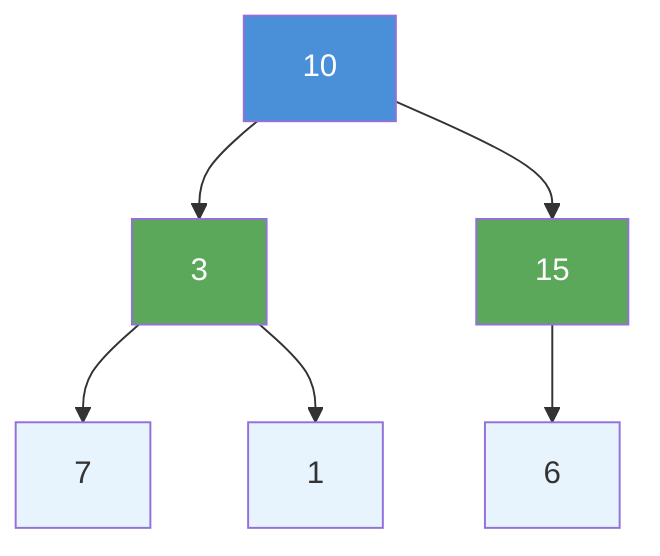
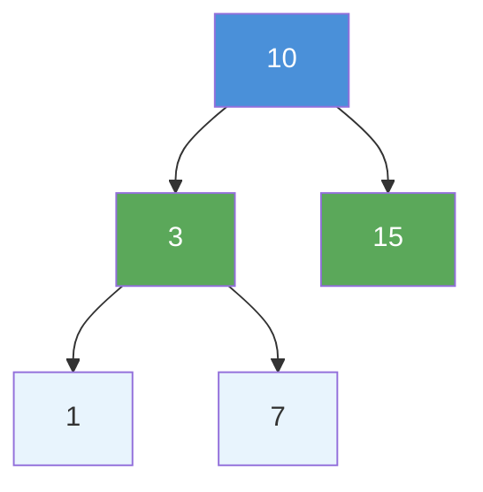
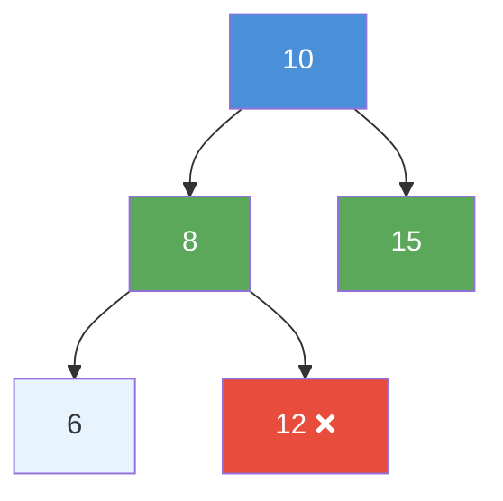

# Binary Tree vs Binary Search Tree: Key Differences

> **One-line summary:** A Binary Search Tree is a binary tree with a strict ordering rule — left subtree values are always smaller and right subtree values are always larger — making search, insert, and delete dramatically faster on average.

---

## Table of Contents

1. [What is a Binary Tree?](#1-what-is-a-binary-tree)
2. [What is a Binary Search Tree?](#2-what-is-a-binary-search-tree)
3. [Visual Comparison](#3-visual-comparison)
4. [Key Differences Between Binary Tree and BST](#4-key-differences-between-binary-tree-and-bst)
5. [Understanding the BST Property in Depth](#5-understanding-the-bst-property-in-depth)
6. [Searching: Binary Tree vs BST](#6-searching-binary-tree-vs-bst)
7. [Insertion: Binary Tree vs BST](#7-insertion-binary-tree-vs-bst)
8. [Complexity Comparison](#8-complexity-comparison)
9. [When to Use Binary Tree vs BST](#9-when-to-use-binary-tree-vs-bst)
10. [Common Mistakes Beginners Make](#10-common-mistakes-beginners-make)
11. [Key Takeaways](#11-key-takeaways)
12. [FAQs](#12-faqs)

---

## 1. What is a Binary Tree?

Imagine a family tree where every parent has **at most two children**. That is basically what a binary tree is in programming.

A **binary tree** is a tree data structure where each node has at most two children, called the **left child** and the **right child**. There are no special rules about where values go — you can place any value anywhere as long as each node has no more than two children.

This makes binary trees very flexible but not very searchable on their own.

```
Key properties:
- Each node has at most 2 children
- No ordering constraint on values
- Flexible structure (complete, full, skewed, etc.)
- Examples: expression trees, file system directories, decision trees
```

---

## 2. What is a Binary Search Tree?

A **Binary Search Tree (BST)** is a special kind of binary tree. It follows a strict rule:

> For every node, **all values in the left subtree must be less than** the node's value, and **all values in the right subtree must be greater than** the node's value.

Think of it like a sorted dictionary. When you look up a word, you do not start from the beginning every time — you jump to the middle and decide whether to go left or right. A BST works exactly the same way.

This ordering rule makes BSTs incredibly efficient for searching, inserting, and deleting values compared to a plain binary tree.

```
BST Property (for every node N):
- All nodes in N's LEFT  subtree  have value < N.val
- All nodes in N's RIGHT subtree  have value > N.val
- Both left and right subtrees are also valid BSTs (recursive)
```

---

## 3. Visual Comparison

### Binary Tree Example

Here is a simple binary tree. Notice there is **no ordering rule** applied to the values.

```
        10
       /  \
      3    15
     / \     \
    7   1    6

# No ordering rule here.
# 7 is on the left of 3, but 7 > 3  → valid in a plain binary tree
# 6 is on the right of 15, but 6 < 15 → also valid in a plain binary tree
```



In this tree, values are placed without any sorting logic. You cannot predict where a specific value will be without checking every node.

### BST Example

Now look at values arranged as a BST — the same root and a valid ordering.

```
        10
       /  \
      3    15
     / \
    1   7

# Left of 10:  3, 1, 7  — all < 10  ✓
# Right of 10: 15        — 15 > 10  ✓
# Left of 3:   1         — 1 < 3    ✓
# Right of 3:  7         — 7 > 3    ✓
```



Every node respects the BST property. You can find any value by simply going left or right at each step — just like binary search on an array.

---

## 4. Key Differences Between Binary Tree and BST

| Feature                   | Binary Tree                               | Binary Search Tree                         |
| ------------------------- | ----------------------------------------- | ------------------------------------------ |
| **Ordering Rule**         | None — values go anywhere                 | Left < Root < Right at every node          |
| **Search Efficiency**     | $O(n)$ — must visit every node            | $O(\log n)$ average case                   |
| **Insertion**             | Can insert anywhere                       | Must follow ordering rule strictly         |
| **Duplicates**            | Allowed anywhere                          | Usually not allowed (or handled specially) |
| **In-order Traversal**    | No guaranteed order                       | Always produces sorted output              |
| **Use Cases**             | Expression trees, file systems, decisions | Searching, sorting, range queries          |
| **Structure Flexibility** | Very flexible                             | Constrained by BST property                |
| **Deletion Complexity**   | $O(n)$ to find + remove                   | $O(\log n)$ average case                   |

---

## 5. Understanding the BST Property in Depth

### The Rule Applies to Every Node

One common mistake beginners make is checking the BST rule only for **parent-child pairs**. The rule must hold for the **entire subtree**, not just immediate children.

```
        10
       /  \
      8    15
     / \
    6   12

# Is this a valid BST?
# 12 is in the LEFT subtree of 10.
# But 12 > 10 — this VIOLATES the BST property!
# So this is NOT a valid BST, even though 12 > 8 locally.
```



This is why validating a BST requires tracking the **valid range of values** for each node (min/max bounds), not just comparing with the immediate parent.

### In-Order Traversal Gives Sorted Output

One beautiful property of a BST is that an **in-order traversal** (left → root → right) always yields values in **sorted ascending order**. This does not work for a plain binary tree unless it happens to also be a BST.

```
BST:
        10
       /  \
      3    15
     / \
    1   7

In-order traversal: 1, 3, 7, 10, 15   ← sorted! ✓

Plain Binary Tree:
        10
       /  \
      3    15
     / \     \
    7   1    6

In-order traversal: 7, 3, 1, 10, 15, 6  ← NOT sorted ✗
```

This sorted traversal property makes BSTs extremely useful for problems involving ranges, rankings, and ordered data.

---

## 6. Searching: Binary Tree vs BST

### Searching in a Plain Binary Tree

In a plain binary tree, searching for a value means **visiting every single node** in the worst case. You cannot skip any subtree because you have no idea where the value might be.

**Python:**

```python
class TreeNode:
    def __init__(self, val=0, left=None, right=None):
        self.val = val
        self.left = left
        self.right = right

def search_binary_tree(node: TreeNode, target: int) -> bool:
    """Search a plain binary tree — must check both subtrees."""
    if node is None:
        return False                      # Base case: reached a leaf, not found
    if node.val == target:
        return True                       # Found the value

    # Must search BOTH left AND right — no ordering to guide us
    return (search_binary_tree(node.left, target) or
            search_binary_tree(node.right, target))

# Time Complexity:  O(n) — visits all nodes in worst case
# Space Complexity: O(h) — recursion stack (h = tree height)
```

**C++ (simple):**

```cpp
struct TreeNode {
    int val;
    TreeNode* left;
    TreeNode* right;
    TreeNode(int x) : val(x), left(nullptr), right(nullptr) {}
};

bool searchBinaryTree(TreeNode* node, int target) {
    if (node == nullptr) return false;      // base case: reached a leaf, not found
    if (node->val == target) return true;   // found the target

    // Must search BOTH left AND right subtrees — no ordering to guide us
    return searchBinaryTree(node->left, target) ||
           searchBinaryTree(node->right, target);
}

// Time Complexity:  O(n) — visits every node in worst case
// Space Complexity: O(h) — call stack depth equals tree height
```

**C++ (LeetCode class style):**

```cpp
struct TreeNode {
    int val;
    TreeNode* left;
    TreeNode* right;
    TreeNode(int x) : val(x), left(nullptr), right(nullptr) {}
};

class Solution {
public:
    bool searchBT(TreeNode* node, int target) {
        if (node == nullptr) return false;       // base case: empty subtree
        if (node->val == target) return true;    // found the target
        // must check BOTH sides — no ordering to guide the search
        return searchBT(node->left, target) || searchBT(node->right, target);
    }
};
```

This is slow for large trees. Every search requires checking potentially every node.

### Searching in a BST

In a BST, you can **eliminate half the remaining nodes at every step**, just like binary search on a sorted array.

**Python:**

```python
def search_bst(node: TreeNode, target: int) -> bool:
    """Search a BST — eliminate half the tree at each step."""
    if node is None:
        return False                      # Not found
    if node.val == target:
        return True                       # Found it!

    if target < node.val:
        return search_bst(node.left, target)   # Go left, ignore right
    else:
        return search_bst(node.right, target)  # Go right, ignore left

# Time Complexity:  O(log n) average — eliminates half the tree each step
#                   O(n) worst case   — skewed tree (like a linked list)
# Space Complexity: O(h) — recursion depth

# Iterative version (avoids stack overflow on deep trees):
def search_bst_iterative(node: TreeNode, target: int) -> bool:
    while node:
        if node.val == target:
            return True
        elif target < node.val:
            node = node.left
        else:
            node = node.right
    return False
```

**C++ (simple):**

```cpp
bool searchBST(TreeNode* node, int target) {
    // Iterative BST search — O(1) space, no recursion needed
    while (node != nullptr) {
        if (node->val == target)
            return true;                        // found it
        else if (target < node->val)
            node = node->left;                  // go left: target is smaller
        else
            node = node->right;                 // go right: target is larger
    }
    return false;                               // not found
}

// Time Complexity:  O(log n) average, O(n) worst (skewed)
// Space Complexity: O(1) iterative version
```

**C++ (LeetCode class style):**

```cpp
struct TreeNode {
    int val;
    TreeNode* left;
    TreeNode* right;
    TreeNode(int x) : val(x), left(nullptr), right(nullptr) {}
};

class Solution {
public:
    // LeetCode 700: returns the subtree node if found, nullptr if not
    TreeNode* searchBST(TreeNode* root, int val) {
        if (root == nullptr) return nullptr;     // not found
        if (root->val == val) return root;       // found: return the node
        if (val < root->val)
            return searchBST(root->left, val);   // go left: val is smaller
        return searchBST(root->right, val);      // go right: val is larger
    }
};
```

For a BST with 1,000 nodes, you might find any value in just ~10 steps on average ($\log_2 1000 \approx 10$). That is the power of the BST ordering rule.

---

## 7. Insertion: Binary Tree vs BST

### Inserting in a Binary Tree

In a plain binary tree, you can insert a new node at **any position**. A common approach is level-order insertion to keep the tree complete.

**Python:**

```python
from collections import deque

def insert_binary_tree(root: TreeNode, val: int) -> TreeNode:
    """Level-order insertion — fills left to right, level by level."""
    new_node = TreeNode(val)
    if root is None:
        return new_node

    queue = deque([root])
    while queue:
        node = queue.popleft()
        if node.left is None:
            node.left = new_node           # First empty left slot found
            return root
        else:
            queue.append(node.left)

        if node.right is None:
            node.right = new_node          # First empty right slot found
            return root
        else:
            queue.append(node.right)

    return root

# No ordering needed — just fill the next available spot
# Time Complexity: O(n) — BFS scan to find first empty slot
```

**C++ (simple):**

```cpp
#include <queue>

TreeNode* insertBinaryTree(TreeNode* root, int val) {
    TreeNode* newNode = new TreeNode(val);
    if (root == nullptr) return newNode;    // empty tree: new node is root

    std::queue<TreeNode*> q;
    q.push(root);

    while (!q.empty()) {
        TreeNode* node = q.front();
        q.pop();

        if (node->left == nullptr) {
            node->left = newNode;          // first empty left slot found
            return root;
        } else {
            q.push(node->left);            // keep scanning left side
        }

        if (node->right == nullptr) {
            node->right = newNode;         // first empty right slot found
            return root;
        } else {
            q.push(node->right);           // keep scanning right side
        }
    }
    return root;
}
// Time Complexity: O(n) — BFS to find first empty slot
```

**C++ (LeetCode class style):**

```cpp
#include <queue>
using namespace std;

struct TreeNode {
    int val;
    TreeNode* left;
    TreeNode* right;
    TreeNode(int x) : val(x), left(nullptr), right(nullptr) {}
};

class Solution {
public:
    TreeNode* insertBinaryTree(TreeNode* root, int val) {
        TreeNode* newNode = new TreeNode(val);
        if (root == nullptr) return newNode;   // empty tree: new node is root
        queue<TreeNode*> q;
        q.push(root);
        while (!q.empty()) {
            TreeNode* node = q.front(); q.pop();
            if (node->left == nullptr) {
                node->left = newNode;           // first empty left slot
                return root;
            } else {
                q.push(node->left);             // scan next level
            }
            if (node->right == nullptr) {
                node->right = newNode;          // first empty right slot
                return root;
            } else {
                q.push(node->right);
            }
        }
        return root;
    }
};
```

### Inserting in a BST

In a BST, you must **follow the ordering rule** when inserting. You compare the new value with each node and go left or right until you find an empty spot.

```
# Insert 8 into this BST:
#        10
#       /  \
#      3    15
#     / \
#    1   7
#
# Step 1: Compare 8 with 10 → 8 < 10, go left
# Step 2: Compare 8 with 3  → 8 > 3,  go right
# Step 3: Compare 8 with 7  → 8 > 7,  go right
# Step 4: Right of 7 is empty → Insert 8 here
#
# Result:
#        10
#       /  \
#      3    15
#     / \
#    1   7
#         \
#          8
```

**Python:**

```python
def insert_bst(node: TreeNode, value: int) -> TreeNode:
    """Insert value into BST while maintaining ordering property."""
    if node is None:
        return TreeNode(value)             # Create new node at correct position

    if value < node.val:
        node.left = insert_bst(node.left, value)    # Go left
    elif value > node.val:
        node.right = insert_bst(node.right, value)  # Go right
    # If value == node.val: duplicate — return node unchanged

    return node

# Time Complexity:  O(log n) average, O(n) worst (skewed)
# Space Complexity: O(h) — recursion stack
```

**C++ (simple):**

```cpp
TreeNode* insertBST(TreeNode* node, int value) {
    if (node == nullptr)
        return new TreeNode(value);         // found the correct position: insert here

    if (value < node->val)
        node->left = insertBST(node->left, value);    // go left: value is smaller
    else if (value > node->val)
        node->right = insertBST(node->right, value);  // go right: value is larger
    // if value == node->val: duplicate — return unchanged

    return node;
}

// Time Complexity:  O(log n) average, O(n) worst (skewed)
// Space Complexity: O(h) — recursion depth
```

**C++ (LeetCode class style):**

```cpp
struct TreeNode {
    int val;
    TreeNode* left;
    TreeNode* right;
    TreeNode(int x) : val(x), left(nullptr), right(nullptr) {}
};

class Solution {
public:
    // LeetCode 701: insert val into BST, return updated root
    TreeNode* insertBST(TreeNode* root, int val) {
        if (root == nullptr)
            return new TreeNode(val);            // correct position found: insert
        if (val < root->val)
            root->left = insertBST(root->left, val);    // go left
        else if (val > root->val)
            root->right = insertBST(root->right, val);  // go right
        // if val == root->val: duplicate — return unchanged
        return root;
    }
};
```

---

## 8. Complexity Comparison

| Operation              | Binary Tree             | BST Average                  | BST Worst (Skewed) |
| ---------------------- | ----------------------- | ---------------------------- | ------------------ |
| **Search**             | $O(n)$                  | $O(\log n)$                  | $O(n)$             |
| **Insertion**          | $O(n)$ BFS to find slot | $O(\log n)$                  | $O(n)$             |
| **Deletion**           | $O(n)$                  | $O(\log n)$                  | $O(n)$             |
| **In-order traversal** | $O(n)$ (no ordering)    | $O(n)$ (gives sorted output) | $O(n)$             |
| **Find Min/Max**       | $O(n)$                  | $O(h)$ — leftmost/rightmost  | $O(n)$             |
| **Space (storage)**    | $O(n)$                  | $O(n)$                       | $O(n)$             |

> **When does BST degrade to $O(n)$?**  
> When you insert already-sorted data (e.g. 1, 2, 3, 4, 5), every new node becomes a right child, turning the BST into a straight line — identical in shape to a linked list. Self-balancing BSTs (AVL trees, Red-Black trees) prevent this by maintaining $O(\log n)$ height always.

---

## 9. When to Use Binary Tree vs BST

| Scenario                                                                                      | Choose                                                 |
| --------------------------------------------------------------------------------------------- | ------------------------------------------------------ |
| Represent hierarchical data with no ordering (file systems, expression trees, decision trees) | **Binary Tree**                                        |
| Need fast $O(\log n)$ search, insert, delete                                                  | **BST**                                                |
| Need elements in sorted order without extra sorting step                                      | **BST** (in-order traversal)                           |
| Structure matters more than searchability (recursive subproblems, syntax trees)               | **Binary Tree**                                        |
| Data has natural ordering (numbers, strings, dates)                                           | **BST**                                                |
| Need range queries ("find all values between 5 and 20")                                       | **BST**                                                |
| Working with heaps / priority queues                                                          | **Binary Tree** (not BST — heaps have different rules) |

---

## 10. Common Mistakes Beginners Make

### Checking Only Parent-Child Pairs for BST Validity

As seen in Section 5, the BST rule applies to the **entire subtree**, not just adjacent nodes. Node 12 placed in the left subtree of 10 violates the BST property even if it is locally valid under its direct parent 8.

**Always track the valid `(min, max)` range** for each node during BST validation — covered in detail in the next post on validating a BST.

### Assuming BST is Always $O(\log n)$

A BST is only $O(\log n)$ when it is **balanced**. If you insert sorted data, it degrades to a skewed tree:

```
# Inserting sorted: 1, 2, 3, 4, 5 → skewed BST:
#
# 1
#  \
#   2
#    \
#     3
#      \
#       4
#        \
#         5
#
# This looks like a linked list — all operations are O(n)!
```

**Python: Detecting a skewed BST:**

```python
def tree_height(node: TreeNode) -> int:
    """Height reveals skewness — a perfectly balanced BST has h ≈ log2(n)."""
    if node is None:
        return 0
    return 1 + max(tree_height(node.left), tree_height(node.right))

# For n=5 nodes:
# Balanced BST: height = 3  (log2(5) ≈ 2.3)
# Skewed BST:   height = 5  (linear — worst case)
```

**C++ (simple):**

```cpp
int treeHeight(TreeNode* node) {
    if (node == nullptr) return 0;           // null node has height 0
    return 1 + std::max(treeHeight(node->left), treeHeight(node->right));
}
// Compare height vs log2(n) to gauge how balanced the tree is
```

**C++ (LeetCode class style):**

```cpp
#include <algorithm>
using namespace std;

struct TreeNode {
    int val;
    TreeNode* left;
    TreeNode* right;
    TreeNode(int x) : val(x), left(nullptr), right(nullptr) {}
};

class Solution {
public:
    int treeHeight(TreeNode* node) {
        if (node == nullptr) return 0;           // null node has height 0
        int leftH  = treeHeight(node->left);     // height of left subtree
        int rightH = treeHeight(node->right);    // height of right subtree
        return 1 + max(leftH, rightH);           // count current node
    }
    // Compare height vs log2(n) to gauge how balanced the tree is
};
```

Balanced BSTs like **AVL trees** and **Red-Black trees** fix this automatically — those are more advanced topics covered later in the series.

### Confusing BST with a Sorted Array

A BST supports $O(\log n)$ operations **without** requiring contiguous memory or shifting elements on insertion/deletion. Unlike a sorted array, inserting into a BST does not require $O(n)$ shifts — it is a pure pointer update. This is the key advantage over sorted arrays for dynamic data sets.

---

## 11. Key Takeaways

1. **Every BST is a binary tree, but not every binary tree is a BST** — the ordering property is the distinguishing factor.
2. **The BST property is recursive** — left < node < right must hold for every node and its entire subtree, not just immediate children.
3. **In-order traversal of a BST always gives sorted output** — a unique and powerful property not shared by plain binary trees.
4. **BST operations are $O(\log n)$ average but $O(n)$ worst** when the tree is skewed due to sorted insertions.
5. **Plain binary trees shine for structure** (expression trees, heaps, file systems); **BSTs shine for searchability** (sorted data, range queries, ordered operations).
6. **Self-balancing BSTs** (AVL, Red-Black) guarantee $O(\log n)$ in all cases by automatically restructuring after insertions and deletions.

---

## 12. FAQs

**Q1: Is every BST also a Binary Tree?**  
Yes, absolutely. A BST is a specific type of binary tree. It has all the properties of a binary tree (at most two children per node) plus the additional ordering rule. Think of BSTs as a stricter subset of binary trees — the same way a square is a specific type of rectangle.

**Q2: How are duplicate values handled in a BST?**  
Different implementations handle duplicates differently. Some BSTs do not allow duplicates at all. Others place duplicates in the left subtree (values ≤ root) or right subtree (values ≥ root). In most DSA problems, you can assume no duplicates unless explicitly stated.

**Q3: Why is BST search $O(n)$ in the worst case?**  
If the tree becomes skewed (e.g. inserting already-sorted values like 1, 2, 3, 4, 5), it degrades into a structure identical to a linked list. In this case, you may have to visit every node to find your target, giving $O(n)$ time. Balanced BSTs prevent this by keeping the tree height at $O(\log n)$.

**Q4: Can I convert a plain binary tree into a BST?**  
Yes. One approach: perform an in-order traversal of the original tree to collect all values into an array, sort the array, then rebuild a BST from the sorted array using the "mid as root" strategy. This guarantees a balanced BST in $O(n \log n)$ time.

**Q5: What comes after BST in DSA learning?**  
The natural progression is: BST basics → BST validation → BST insertion/deletion → Self-balancing BSTs (AVL trees, Red-Black trees) → Heaps (a different kind of binary tree) → Graphs. Understanding BSTs deeply makes all of these significantly easier to grasp.
