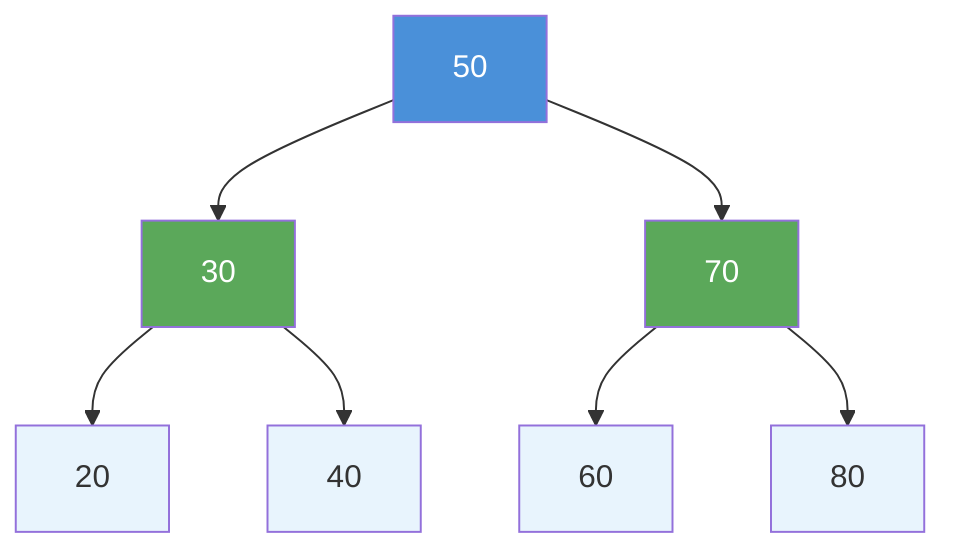
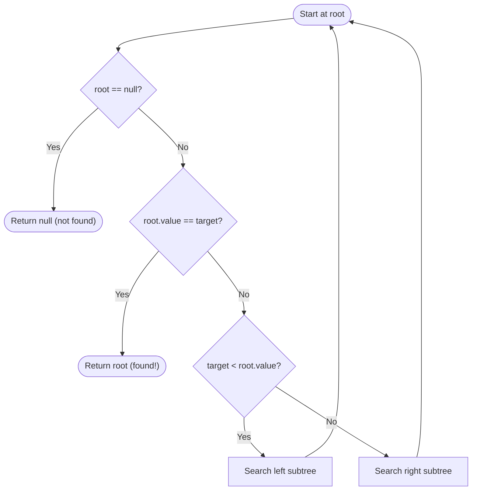
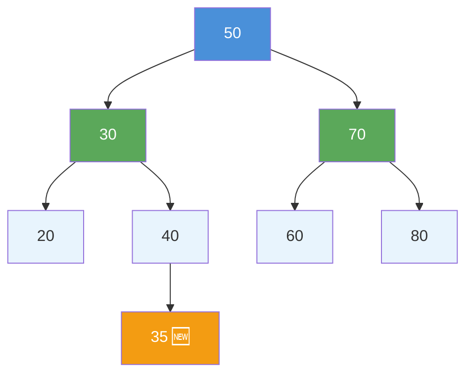

# Binary Search Tree Basics: Insert, Search, Delete

> **One-line summary:** A Binary Search Tree enforces a single rule at every node — left subtree values are smaller, right subtree values are larger — and this one rule gives you $O(\log n)$ search, insert, and find-min/max for free.

---

## Table of Contents

1. [What is a Binary Search Tree?](#1-what-is-a-binary-search-tree)
2. [The BST Property Explained](#2-the-bst-property-explained)
3. [A Simple BST Example](#3-a-simple-bst-example)
4. [BST Node Structure in Code](#4-bst-node-structure-in-code)
5. [Search Operation in a BST](#5-search-operation-in-a-bst)
6. [Insert Operation in a BST](#6-insert-operation-in-a-bst)
7. [Inorder Traversal Gives Sorted Output](#7-inorder-traversal-gives-sorted-output)
8. [Finding Minimum and Maximum](#8-finding-minimum-and-maximum)
9. [BST vs Binary Tree: Key Differences](#9-bst-vs-binary-tree-key-differences)
10. [Time Complexity of BST Operations](#10-time-complexity-of-bst-operations)
11. [Full BST Example: Build, Search, Traverse](#11-full-bst-example-build-search-traverse)
12. [Key Takeaways](#12-key-takeaways)
13. [FAQs](#13-faqs)

---

## 1. What is a Binary Search Tree?

Imagine you have a dictionary. You don't search from page one every time — you open the middle, decide if the word comes before or after, and keep narrowing it down. A **Binary Search Tree (BST)** works the same way.

A BST is a special type of binary tree where every node follows one simple rule: the **left child holds a smaller value**, and the **right child holds a larger value**. This rule applies to **every single node** in the tree — not just the root.

As we covered in the previous section on Trees, a binary tree lets each node have at most two children. A BST adds a strict ordering rule on top of that structure, making it powerful for searching and sorting data.

---

## 2. The BST Property Explained

For any node **N** in a BST:

- Every value in **N's left subtree** is **less than** N's value
- Every value in **N's right subtree** is **greater than** N's value
- Both subtrees are themselves valid BSTs (the property is recursive)

This is called the **BST property** or **BST invariant**.

Think of it like organizing books by page count on a shelf. Thinner books go left, thicker books go right. Finding a book with exactly 300 pages becomes fast because you always know which direction to look.

```
BST Property (formal):
  For every node N:
    ∀ x in left(N)  →  x < N.value
    ∀ x in right(N) →  x > N.value
```

> **Critical:** The property applies to the **entire subtree**, not just immediate children. A node with value 12 placed in the left subtree of 10 violates the BST property even if it looks locally valid under its direct parent.

---

## 3. A Simple BST Example

Let us look at a BST built from inserting: **50, 30, 70, 20, 40, 60, 80**.

```
        50
       /  \
     30    70
    /  \  /  \
   20  40 60  80

- Left of  50: 30, 20, 40  (all < 50) ✓
- Right of 50: 70, 60, 80  (all > 50) ✓
- Left of  30: 20           (20 < 30)  ✓
- Right of 30: 40           (40 > 30)  ✓
- Left of  70: 60           (60 < 70)  ✓
- Right of 70: 80           (80 > 70)  ✓
```



This tree satisfies the BST property at every node. Notice how the structure naturally keeps data organized and balanced in this case.

---

## 4. BST Node Structure in Code

Before we perform operations, we need to define a node. Each node stores a value and two pointers — one for the left child and one for the right child.

**Python:**

```python
class Node:
    def __init__(self, value):
        self.value = value
        self.left = None   # Points to smaller child
        self.right = None  # Points to larger child
```

**C++:**

```cpp
struct Node {
    int value;
    Node* left;
    Node* right;

    Node(int val) : value(val), left(nullptr), right(nullptr) {}
};
```

This is the building block for everything in a BST. Every insert, search, and traversal operation works on these node connections.

---

## 5. Search Operation in a BST

Searching in a BST is straightforward:

1. Start at the root
2. If target equals the current node → **found**
3. If target is smaller → go **left**
4. If target is larger → go **right**
5. Repeat until found or you hit `null`



**Python:**

```python
def search(root, target):
    # Base case: reached null or found the value
    if root is None or root.value == target:
        return root

    # Target is smaller: search left subtree
    if target < root.value:
        return search(root.left, target)

    # Target is larger: search right subtree
    return search(root.right, target)

# Step-by-step trace — searching for 40 in our BST (root = 50):
# At 50 → 40 < 50, go left
# At 30 → 40 > 30, go right
# At 40 → 40 == 40, FOUND!  (visited 3 of 7 nodes)
```

**C++:**

```cpp
Node* search(Node* root, int target) {
    // Base case: null or found
    if (root == nullptr || root->value == target)
        return root;

    // Go left or right based on comparison
    if (target < root->value)
        return search(root->left, target);
    return search(root->right, target);
}

// Iterative version (avoids call stack overhead):
Node* searchIterative(Node* root, int target) {
    while (root != nullptr) {
        if (root->value == target) return root;
        root = (target < root->value) ? root->left : root->right;
    }
    return nullptr;  // Not found
}
```

The time complexity for search is $O(h)$ where $h$ is the height of the tree. In a balanced BST, $h = O(\log n)$, making it very efficient. We only visited 3 nodes instead of all 7 in the example above.

---

## 6. Insert Operation in a BST

Inserting a new value follows the **same logic as searching**. Walk down the tree comparing values until you find an empty spot, then place the new node there.

**Python:**

```python
def insert(root, value):
    # If tree is empty or we found the right spot
    if root is None:
        return Node(value)

    # Value is smaller: go left
    if value < root.value:
        root.left = insert(root.left, value)

    # Value is larger: go right
    elif value > root.value:
        root.right = insert(root.right, value)

    # Value already exists: do nothing (no duplicates)
    return root

# Step-by-step trace — inserting 35 into BST (root = 50):
# At 50 → 35 < 50, go left
# At 30 → 35 > 30, go right
# At 40 → 35 < 40, go left
# Left of 40 is None → Insert 35 here!
```

**C++:**

```cpp
Node* insert(Node* root, int value) {
    // Found the correct empty position
    if (root == nullptr)
        return new Node(value);

    if (value < root->value)
        root->left = insert(root->left, value);    // Go left
    else if (value > root->value)
        root->right = insert(root->right, value);  // Go right
    // Duplicate: return unchanged

    return root;
}
```

After inserting 35, the tree looks like:

```
        50
       /  \
     30    70
    /  \  /  \
   20  40 60  80
      /
     35        ← newly inserted
```



Insert also runs in $O(h)$ time. Each step goes one level deeper, stopping as soon as an empty position is found.

---

## 7. Inorder Traversal Gives Sorted Output

If you do an **inorder traversal** (left → root → right) on a BST, you always get the values in **sorted ascending order**. This is one of the most useful properties of a BST.

**Python:**

```python
def inorder(root):
    if root is None:
        return

    inorder(root.left)        # Visit left subtree
    print(root.value, end=" ") # Print current node
    inorder(root.right)       # Visit right subtree

# For our BST with 20, 30, 35, 40, 50, 60, 70, 80:
# Output: 20 30 35 40 50 60 70 80  ← always sorted!
```

**C++:**

```cpp
void inorder(Node* root) {
    if (root == nullptr) return;

    inorder(root->left);                          // Left
    std::cout << root->value << " ";              // Root
    inorder(root->right);                         // Right
}

// Output for our BST: 20 30 35 40 50 60 70 80
```

> Inorder traversal = left → root → right.  
> In a BST, this **always outputs sorted values** — a very handy tool during problem solving, especially for finding the kth smallest element.

---

## 8. Finding Minimum and Maximum

The **minimum** value is always at the **leftmost** node. The **maximum** is always at the **rightmost** node. You just keep going in one direction until you can go no further.

**Python:**

```python
def find_min(root):
    # Keep going left until no more left child
    while root.left is not None:
        root = root.left
    return root.value

def find_max(root):
    # Keep going right until no more right child
    while root.right is not None:
        root = root.right
    return root.value

# For our BST:
# find_min(root) → 20  (leftmost node)
# find_max(root) → 80  (rightmost node)
```

**C++:**

```cpp
int findMin(Node* root) {
    // Leftmost node holds the minimum
    while (root->left != nullptr)
        root = root->left;
    return root->value;
}

int findMax(Node* root) {
    // Rightmost node holds the maximum
    while (root->right != nullptr)
        root = root->right;
    return root->value;
}

// findMin(root) → 20
// findMax(root) → 80
```

Both operations run in $O(h)$ time. They are simple but critical — the delete operation (covered in the next post) uses `findMin` to find the inorder successor during node removal.

---

## 9. BST vs Binary Tree: Key Differences

| Feature | Binary Tree | Binary Search Tree |
|---|---|---|
| **Ordering rule** | None | Left < root < right at every node |
| **Search efficiency** | $O(n)$ worst case | $O(h)$ — usually faster |
| **Inorder output** | Any order | Always sorted ascending |
| **Insert position** | Flexible (anywhere) | Determined by value comparison |
| **Find min/max** | $O(n)$ — must scan all | $O(h)$ — leftmost/rightmost node |
| **Use case** | General hierarchical structure | Search, sort, range queries |

Think of a binary tree as an **unorganized bookshelf** and a BST as one **sorted by title**. Searching is much faster on the sorted shelf.

---

## 10. Time Complexity of BST Operations

The efficiency of BST operations depends on the **height** of the tree. A balanced BST keeps height at $O(\log n)$, but an unbalanced one can degrade to $O(n)$.

| Operation | Average Case (Balanced) | Worst Case (Skewed) |
|---|---|---|
| **Search** | $O(\log n)$ | $O(n)$ |
| **Insert** | $O(\log n)$ | $O(n)$ |
| **Find Min / Max** | $O(\log n)$ | $O(n)$ |
| **Inorder Traversal** | $O(n)$ | $O(n)$ |
| **Space (recursion)** | $O(\log n)$ | $O(n)$ |

> **When does worst case occur?**  
> When you insert already-sorted values like 10 → 20 → 30 → 40, the tree becomes a straight line (identical to a linked list) and loses its efficiency advantage. Balanced BSTs like **AVL trees** and **Red-Black trees** fix this automatically.

```
Inserting sorted: 10, 20, 30, 40, 50

10
 \
  20
   \
    30
     \
      40
       \
        50
← Looks like a linked list. All operations are O(n) here.
```

---

## 11. Full BST Example: Build, Search, Traverse

Let us build a small BST from scratch, insert a few values, search for one, and print the sorted output.

**Python:**

```python
class Node:
    def __init__(self, value):
        self.value = value
        self.left = None
        self.right = None

def insert(root, value):
    if root is None:
        return Node(value)
    if value < root.value:
        root.left = insert(root.left, value)
    elif value > root.value:
        root.right = insert(root.right, value)
    return root

def search(root, target):
    if root is None or root.value == target:
        return root
    if target < root.value:
        return search(root.left, target)
    return search(root.right, target)

def inorder(root):
    if root is None:
        return
    inorder(root.left)
    print(root.value, end=" ")
    inorder(root.right)

def find_min(root):
    while root.left:
        root = root.left
    return root.value

def find_max(root):
    while root.right:
        root = root.right
    return root.value

# --- Build the BST ---
root = None
for val in [50, 30, 70, 20, 40, 60, 80]:
    root = insert(root, val)

# --- Inorder traversal (sorted output) ---
print("Inorder:", end=" ")
inorder(root)
# Output: 20 30 40 50 60 70 80

# --- Search ---
result = search(root, 60)
print("\nSearch 60:", "Found" if result else "Not found")
# Output: Found

result = search(root, 55)
print("Search 55:", "Found" if result else "Not found")
# Output: Not found

# --- Min and Max ---
print("Min:", find_min(root))  # 20
print("Max:", find_max(root))  # 80
```

**C++:**

```cpp
#include <iostream>
#include <vector>
using namespace std;

struct Node {
    int value;
    Node* left;
    Node* right;
    Node(int val) : value(val), left(nullptr), right(nullptr) {}
};

Node* insert(Node* root, int value) {
    if (root == nullptr) return new Node(value);
    if (value < root->value)
        root->left = insert(root->left, value);
    else if (value > root->value)
        root->right = insert(root->right, value);
    return root;
}

Node* search(Node* root, int target) {
    if (root == nullptr || root->value == target) return root;
    if (target < root->value) return search(root->left, target);
    return search(root->right, target);
}

void inorder(Node* root) {
    if (root == nullptr) return;
    inorder(root->left);
    cout << root->value << " ";
    inorder(root->right);
}

int findMin(Node* root) {
    while (root->left) root = root->left;
    return root->value;
}

int findMax(Node* root) {
    while (root->right) root = root->right;
    return root->value;
}

int main() {
    Node* root = nullptr;
    for (int val : {50, 30, 70, 20, 40, 60, 80})
        root = insert(root, val);

    cout << "Inorder: ";
    inorder(root);              // 20 30 40 50 60 70 80
    cout << endl;

    cout << "Search 60: " << (search(root, 60) ? "Found" : "Not found") << endl;
    cout << "Search 55: " << (search(root, 55) ? "Found" : "Not found") << endl;

    cout << "Min: " << findMin(root) << endl;  // 20
    cout << "Max: " << findMax(root) << endl;  // 80

    return 0;
}
```

**Output:**

```
Inorder: 20 30 40 50 60 70 80
Search 60: Found
Search 55: Not found
Min: 20
Max: 80
```

This shows how clean and simple BST logic is when everything is built step by step. You insert values, and the tree organizes itself automatically.

---

## 12. Key Takeaways

1. **BST rule:** left child < parent < right child — applies recursively to every subtree, not just immediate children.
2. **All core operations flow from one rule** — search, insert, and find-min/max all use the same left-or-right decision at each node.
3. **Inorder traversal always gives sorted output** — a uniquely powerful BST property useful in many interview problems.
4. **Minimum is the leftmost node; maximum is the rightmost** — finding them is a simple walk, not a full scan.
5. **$O(\log n)$ average, $O(n)$ worst** — a BST is only fast when balanced; sorted insertions create a degenerate linked-list shape.
6. **Delete is the trickiest operation** — covered in the next post with the inorder successor strategy for two-child nodes.

---

## 13. FAQs

**Q1: Can a BST have duplicate values?**  
By default, most BST implementations do not allow duplicates. If you need to handle duplicates, you can consistently place them in the left subtree (≤ root) or right subtree (≥ root), or store a count alongside each node value.

**Q2: Why use a BST instead of a sorted array?**  
A sorted array supports $O(\log n)$ search via binary search, but inserting or deleting takes $O(n)$ time due to element shifting. A BST supports $O(\log n)$ for all three operations in the average case, making it far better for **dynamic data** that changes frequently.

**Q3: When does a BST become slow?**  
A BST degrades when it becomes **unbalanced**. Inserting already-sorted values (1, 2, 3, 4…) produces a straight-line tree with height $n$, giving $O(n)$ for all operations. This is why self-balancing BSTs like AVL trees and Red-Black trees were invented — they automatically restructure to maintain $O(\log n)$ height.

**Q4: Is the recursive search approach safe for very deep trees?**  
For extremely deep trees (millions of nodes), recursive search can cause a stack overflow. The iterative version using a `while` loop is always safe since it uses $O(1)$ extra space. Prefer the iterative approach in production code.

**Q5: What is the relationship between inorder traversal and sorting?**  
BST inorder traversal is equivalent to collecting all keys in sorted order in $O(n)$ time and $O(h)$ space. This is the basis for the "BST sort" algorithm — inserting $n$ elements one by one ($O(n \log n)$ on average) then reading them back via inorder traversal.
