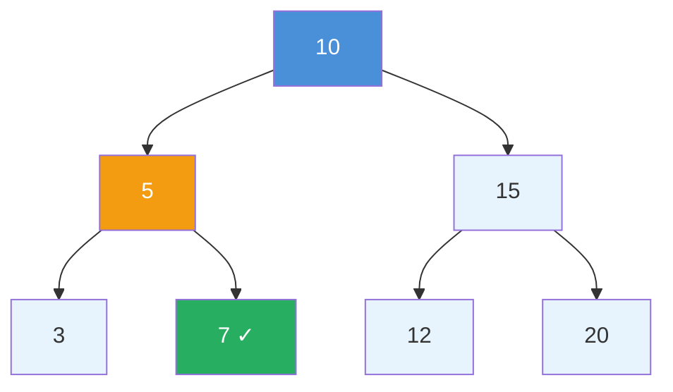
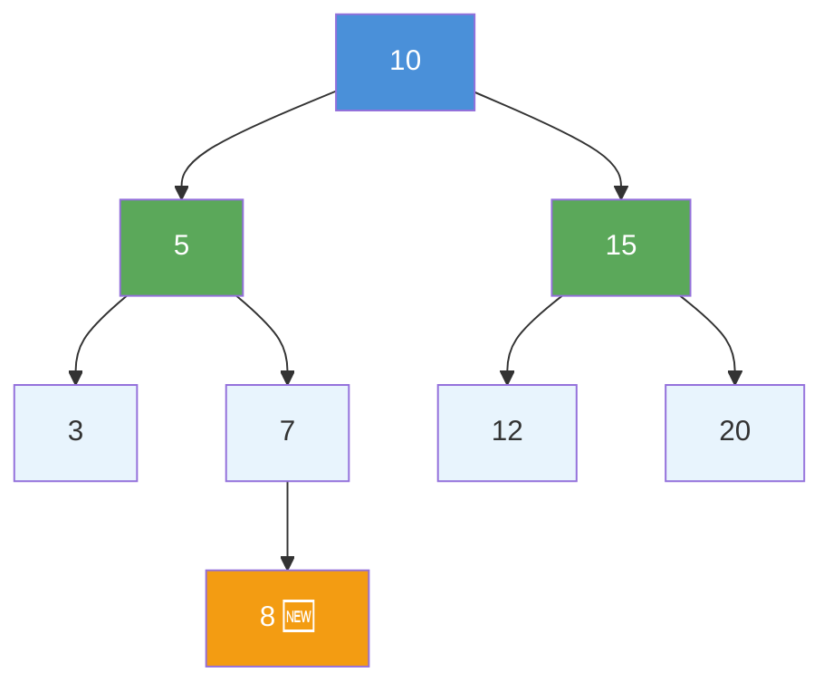
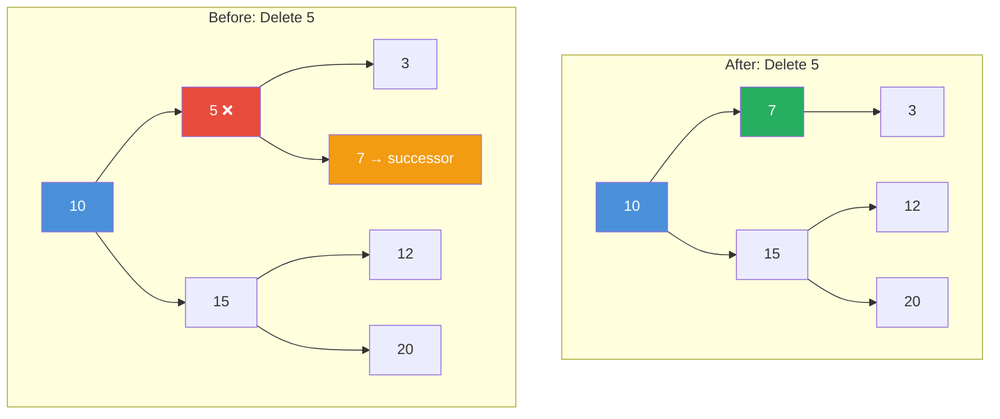

# BST Operations: Insert, Delete, and Search Explained

> **One-line summary:** BST search and insert both follow the same left-or-right decision at each node; delete is the trickiest operation because removing a two-child node requires finding its in-order successor to preserve the BST property.

---

## Table of Contents

1. [What is a BST — Quick Recap](#1-what-is-a-bst--quick-recap)
2. [Search in a BST](#2-search-in-a-bst)
3. [Insert in a BST](#3-insert-in-a-bst)
4. [Delete in a BST](#4-delete-in-a-bst)
5. [Three Cases of Deletion](#5-three-cases-of-deletion)
6. [Comparison of BST Operations](#6-comparison-of-bst-operations)
7. [Full Example: Build, Search, Delete](#7-full-example-build-search-delete)
8. [Key Takeaways](#8-key-takeaways)
9. [FAQs](#9-faqs)

---

## 1. What is a BST — Quick Recap

Imagine a library where books are arranged so that every book on the **left shelf** has a smaller number than the book in the middle, and every book on the **right shelf** has a larger number. That is exactly how a Binary Search Tree (BST) works.

In our previous post on BST Basics, we established that for every node:

- All values in the **left subtree** are **smaller**
- All values in the **right subtree** are **larger**

Now we learn how to actually **work** with a BST — how to insert, delete, and search for values. These three operations are the backbone of every BST-based solution you will ever write.

---

## 2. Search in a BST

Searching in a BST is like playing a guessing game where every wrong guess tells you which half to look in next. You start at the root and at each step you either go left or go right, eliminating half the tree each time.

This is the same idea as Binary Search on a sorted array — the BST structure naturally gives us the same advantage.

### How Search Works

1. Start at the root node
2. If target **equals** current node → **found**
3. If target is **smaller** → move to the **left** child
4. If target is **larger** → move to the **right** child
5. Repeat until found or reach `null`

### Search Example

Search for value **7** in this BST:

```
        10
       /  \
      5    15
     / \   / \
    3   7 12  20
```



| Step | Current Node | Compare with 7 | Move |
|---|---|---|---|
| 1 | 10 | 7 < 10 | Go Left |
| 2 | 5 | 7 > 5 | Go Right |
| 3 | 7 | 7 == 7 | **Found!** |

We only visited **3 of 7 nodes**. That is the power of BST search.

**Python:**

```python
class Node:
    def __init__(self, value):
        self.value = value
        self.left = None
        self.right = None

# Iterative approach — O(1) extra space, safe for deep trees
def search_bst(root, target):
    current = root
    while current is not None:
        if target == current.value:
            return current        # Found the node
        elif target < current.value:
            current = current.left   # Go left
        else:
            current = current.right  # Go right
    return None                   # Not found

# Recursive approach — cleaner, uses call stack
def search_bst_recursive(root, target):
    if root is None or root.value == target:
        return root               # Base case: null or found
    if target < root.value:
        return search_bst_recursive(root.left, target)   # Search left
    return search_bst_recursive(root.right, target)      # Search right

# Time Complexity:  O(h) — h is tree height
# Balanced BST:     O(log n)
# Skewed BST:       O(n)
```

**C++ (simple):**

```cpp
struct Node {
    int value;
    Node* left;
    Node* right;
    Node(int val) : value(val), left(nullptr), right(nullptr) {}
};

// Iterative search — preferred in production (no stack overflow risk)
Node* searchBST(Node* root, int target) {
    Node* current = root;
    while (current != nullptr) {
        if (target == current->value) return current;      // Found
        else if (target < current->value) current = current->left; // go left
        else current = current->right;                             // go right
    }
    return nullptr;  // Not found
}

// Recursive search
Node* searchBSTRecursive(Node* root, int target) {
    if (root == nullptr || root->value == target) return root; // base case
    if (target < root->value) return searchBSTRecursive(root->left, target);  // left
    return searchBSTRecursive(root->right, target);            // right
}
// Time: O(h) | Space: O(1) iterative, O(h) recursive
```

**C++ (LeetCode class style):**

```cpp
class Solution {
public:
    // LeetCode 700: Search in a Binary Search Tree
    TreeNode* searchBST(TreeNode* root, int val) {
        while (root != nullptr) {              // walk until null or match found
            if (val == root->val) return root; // exact match — return this node
            root = (val < root->val) ? root->left : root->right; // go left or right
        }
        return nullptr;  // val not present in tree
    }
};
```

---

## 3. Insert in a BST

Inserting a new value is like **searching for where the value should go**, then placing it at the empty spot you land on. You never move existing nodes around.

### How Insert Works

1. Start at the root and follow the same search logic
2. If the new value is **smaller** → go left
3. If **larger** → go right
4. When you reach a `null` position → **create a new node there**

Every new node in a BST is always inserted as a **leaf node**. It never disturbs the existing structure.

### Insert Example — Insert 8

```
Before inserting 8:          After inserting 8:
        10                           10
       /  \                         /  \
      5    15                      5    15
     / \   / \                    / \   / \
    3   7 12  20                 3   7 12  20
                                      \
                                       8  ← newly inserted
```



**Python:**

```python
# Iterative insert — avoids recursion overhead
def insert_bst(root, val):
    new_node = Node(val)
    if root is None:
        return new_node           # Empty tree: new node becomes root

    current = root
    while True:
        if val < current.value:
            if current.left is None:
                current.left = new_node   # Insert here
                break
            current = current.left        # Move left
        elif val > current.value:
            if current.right is None:
                current.right = new_node  # Insert here
                break
            current = current.right       # Move right
        else:
            break                         # Duplicate: do nothing
    return root

# Recursive insert — clean and idiomatic
def insert_bst_recursive(root, val):
    if root is None:
        return Node(val)                              # Create at correct position
    if val < root.value:
        root.left = insert_bst_recursive(root.left, val)    # Go left
    elif val > root.value:
        root.right = insert_bst_recursive(root.right, val)  # Go right
    return root                                       # Duplicate: return unchanged

# Time Complexity: O(h) | Balanced: O(log n) | Skewed: O(n)
```

**C++ (simple):**

```cpp
// Iterative insert — O(1) extra space
Node* insertBST(Node* root, int val) {
    Node* newNode = new Node(val);
    if (root == nullptr) return newNode;  // empty tree — new node becomes root

    Node* current = root;
    while (true) {
        if (val < current->value) {
            if (current->left == nullptr) { current->left = newNode; break; } // insert here
            current = current->left;   // keep going left
        } else if (val > current->value) {
            if (current->right == nullptr) { current->right = newNode; break; } // insert here
            current = current->right;  // keep going right
        } else {
            break;  // Duplicate: do nothing
        }
    }
    return root;
}

// Recursive insert — cleaner and easier to read
Node* insertBSTRecursive(Node* root, int val) {
    if (root == nullptr) return new Node(val);  // found the empty position
    if (val < root->value)
        root->left = insertBSTRecursive(root->left, val);   // go left
    else if (val > root->value)
        root->right = insertBSTRecursive(root->right, val); // go right
    return root;  // Duplicate: return unchanged
}
// Time: O(h) | Space: O(1) iterative, O(h) recursive
```

**C++ (LeetCode class style):**

```cpp
class Solution {
public:
    // LeetCode 701: Insert into a Binary Search Tree
    TreeNode* insertIntoBST(TreeNode* root, int val) {
        if (root == nullptr) return new TreeNode(val); // empty spot found — insert here
        if (val < root->val)
            root->left = insertIntoBST(root->left, val);   // val belongs in left subtree
        else
            root->right = insertIntoBST(root->right, val); // val belongs in right subtree
        return root;  // return updated root after linking new node
    }
};
```

The recursive version naturally handles everything by returning the node at each level and linking it back. The BST property is maintained because we always route the value to the correct side.

---

## 4. Delete in a BST

Deleting a node is the **trickiest** of the three operations. Unlike insert, removing a node can break the BST structure if not handled carefully. There are **three distinct cases** based on how many children the target node has.

Think of it like removing a person from a company org chart:
- No reports → just remove them
- One report → that person steps up directly
- Two reports → you must pick a careful replacement

---

## 5. Three Cases of Deletion

### Case 1 — Leaf Node (no children)

Simply remove it by setting its parent's pointer to `null`.

```
Delete 3:                After:
      5                      5
     / \                      \
    3   7          →           7
```

### Case 2 — One Child

Replace the node with its only child.

```
Delete 5 (only left child):    After:
      10                           10
     /                            /
    5           →                3
   /
  3
```

### Case 3 — Two Children (the tricky case)

Find the **in-order successor** (smallest value in the right subtree), replace the node's value with it, then delete the successor from the right subtree.

> **Why the in-order successor?**  
> The in-order successor is the smallest node in the right subtree. It is larger than everything in the left subtree and smaller than everything else in the right subtree — so replacing the deleted node's value with it preserves the BST property perfectly. The in-order predecessor (largest in the left subtree) also works.

### Delete Example — Delete Node 5 (two children)

```
Before:                    In-order successor of 5 = 7
        10                 (smallest in right subtree of 5)
       /  \                Replace 5's value with 7,
      5    15              then delete original 7.
     / \   / \
    3   7 12  20

After deleting 5:
        10
       /  \
      7    15
     /     / \
    3     12  20
```



**Python:**

```python
def find_min_node(node):
    """Find the node with the smallest value in a subtree (leftmost node)."""
    while node.left is not None:
        node = node.left
    return node

def delete_bst(root, val):
    if root is None:
        return None                          # Node not found

    if val < root.value:
        root.left = delete_bst(root.left, val)    # Search left
    elif val > root.value:
        root.right = delete_bst(root.right, val)  # Search right
    else:
        # Found the node to delete

        # Case 1: No children (leaf node)
        if root.left is None and root.right is None:
            return None

        # Case 2: One child — return the existing child
        if root.left is None:
            return root.right
        if root.right is None:
            return root.left

        # Case 3: Two children — find in-order successor
        successor = find_min_node(root.right)  # Smallest in right subtree
        root.value = successor.value           # Replace value with successor
        root.right = delete_bst(root.right, successor.value)  # Delete successor

    return root

# Time Complexity: O(h) | Balanced: O(log n) | Skewed: O(n)
# Space: O(h) recursion stack
```

**C++ (simple):**

```cpp
Node* findMinNode(Node* node) {
    // Leftmost node is the in-order successor (smallest in right subtree)
    while (node->left != nullptr)
        node = node->left;
    return node;
}

Node* deleteBST(Node* root, int val) {
    if (root == nullptr) return nullptr;   // Node not found — nothing to delete

    if (val < root->value)
        root->left = deleteBST(root->left, val);      // Search left subtree
    else if (val > root->value)
        root->right = deleteBST(root->right, val);    // Search right subtree
    else {
        // Found the node to delete

        // Case 1: No children (leaf) — simply remove
        if (root->left == nullptr && root->right == nullptr) {
            delete root;
            return nullptr;
        }
        // Case 2: One child — replace node with its only child
        if (root->left == nullptr) {
            Node* temp = root->right;  // right child takes this node's place
            delete root;
            return temp;
        }
        if (root->right == nullptr) {
            Node* temp = root->left;   // left child takes this node's place
            delete root;
            return temp;
        }
        // Case 3: Two children — replace with in-order successor
        Node* successor = findMinNode(root->right); // smallest node in right subtree
        root->value = successor->value;              // copy successor value here
        root->right = deleteBST(root->right, successor->value); // delete successor
    }
    return root;
}
// Time: O(h) | Space: O(h) recursion stack
```

**C++ (LeetCode class style):**

```cpp
class Solution {
public:
    // LeetCode 450: Delete Node in a BST
    TreeNode* deleteNode(TreeNode* root, int key) {
        if (root == nullptr) return nullptr;  // key not found
        if (key < root->val)
            root->left = deleteNode(root->left, key);    // search left subtree
        else if (key > root->val)
            root->right = deleteNode(root->right, key);  // search right subtree
        else {
            // Found the node to delete
            if (!root->left && !root->right) { delete root; return nullptr; } // leaf
            if (!root->left) { auto t = root->right; delete root; return t; }  // one child
            if (!root->right) { auto t = root->left; delete root; return t; }  // one child
            // Two children: replace with in-order successor
            TreeNode* s = root->right;
            while (s->left) s = s->left;  // find leftmost in right subtree
            root->val = s->val;            // copy successor value to current node
            root->right = deleteNode(root->right, s->val); // remove the successor
        }
        return root;
    }
};
```

The recursive approach cleanly handles all three cases by returning the updated subtree at each level and linking it back — exactly like insert.

---

## 6. Comparison of BST Operations

| Operation | Best Case | Average Case | Worst Case | Key Idea |
|---|---|---|---|---|
| **Search** | $O(1)$ | $O(\log n)$ | $O(n)$ | Follow left/right based on comparison |
| **Insert** | $O(1)$ | $O(\log n)$ | $O(n)$ | Search for position, add as leaf |
| **Delete** | $O(1)$ | $O(\log n)$ | $O(n)$ | Handle 3 cases; use in-order successor |
| **Find Min/Max** | $O(1)$ | $O(\log n)$ | $O(n)$ | Walk to leftmost/rightmost node |
| **Inorder Traversal** | $O(n)$ | $O(n)$ | $O(n)$ | Always visits all nodes |

> **Worst case $O(n)$** occurs when the BST is fully skewed (like a linked list) — this happens when inserting values in sorted order. Self-balancing trees like AVL trees and Red-Black trees prevent this by maintaining $O(\log n)$ height automatically.

---

## 7. Full Example: Build, Search, Delete

**Python:**

```python
class Node:
    def __init__(self, value):
        self.value = value
        self.left = None
        self.right = None

def insert_bst_recursive(root, val):
    if root is None:
        return Node(val)
    if val < root.value:
        root.left = insert_bst_recursive(root.left, val)
    elif val > root.value:
        root.right = insert_bst_recursive(root.right, val)
    return root

def search_bst(root, target):
    current = root
    while current:
        if target == current.value: return current
        current = current.left if target < current.value else current.right
    return None

def find_min_node(node):
    while node.left: node = node.left
    return node

def delete_bst(root, val):
    if root is None: return None
    if val < root.value:
        root.left = delete_bst(root.left, val)
    elif val > root.value:
        root.right = delete_bst(root.right, val)
    else:
        if root.left is None and root.right is None: return None
        if root.left is None: return root.right
        if root.right is None: return root.left
        successor = find_min_node(root.right)
        root.value = successor.value
        root.right = delete_bst(root.right, successor.value)
    return root

def inorder(root):
    if root is None: return
    inorder(root.left)
    print(root.value, end=" ")
    inorder(root.right)

# --- Step 1: Build BST by inserting 10, 5, 15, 3, 7 ---
root = None
for val in [10, 5, 15, 3, 7]:
    root = insert_bst_recursive(root, val)

# Tree:
#        10
#       /  \
#      5    15
#     / \
#    3   7

# --- Step 2: Search for 7 (present) ---
found = search_bst(root, 7)
print("Search 7:", found.value if found else "Not Found")  # 7

# --- Step 3: Search for 8 (absent) ---
not_found = search_bst(root, 8)
print("Search 8:", not_found.value if not_found else "Not Found")  # Not Found

# --- Step 4: Delete 5 (two children — successor is 7) ---
root = delete_bst(root, 5)

# Tree now:
#        10
#       /  \
#      7    15
#     /
#    3

# --- Step 5: Verify with inorder traversal (should be sorted) ---
print("Inorder after delete:", end=" ")
inorder(root)   # 3 7 10 15
```

**C++ (simple):**

```cpp
#include <iostream>
#include <vector>
using namespace std;

struct Node {
    int value;
    Node* left;
    Node* right;
    Node(int val) : value(val), left(nullptr), right(nullptr) {}
};

Node* insertBSTRecursive(Node* root, int val) {
    if (root == nullptr) return new Node(val);
    if (val < root->value) root->left = insertBSTRecursive(root->left, val);
    else if (val > root->value) root->right = insertBSTRecursive(root->right, val);
    return root;
}

Node* searchBST(Node* root, int target) {
    while (root) {
        if (target == root->value) return root;
        root = (target < root->value) ? root->left : root->right;
    }
    return nullptr;
}

Node* findMinNode(Node* node) {
    while (node->left) node = node->left;
    return node;
}

Node* deleteBST(Node* root, int val) {
    if (root == nullptr) return nullptr;
    if (val < root->value) root->left = deleteBST(root->left, val);
    else if (val > root->value) root->right = deleteBST(root->right, val);
    else {
        if (!root->left && !root->right) { delete root; return nullptr; }
        if (!root->left) { Node* t = root->right; delete root; return t; }
        if (!root->right) { Node* t = root->left; delete root; return t; }
        Node* successor = findMinNode(root->right);
        root->value = successor->value;
        root->right = deleteBST(root->right, successor->value);
    }
    return root;
}

void inorder(Node* root) {
    if (!root) return;
    inorder(root->left);
    cout << root->value << " ";
    inorder(root->right);
}

int main() {
    Node* root = nullptr;
    for (int val : {10, 5, 15, 3, 7})
        root = insertBSTRecursive(root, val);

    cout << "Search 7: " << (searchBST(root, 7) ? "Found" : "Not Found") << endl;
    cout << "Search 8: " << (searchBST(root, 8) ? "Found" : "Not Found") << endl;

    root = deleteBST(root, 5);   // Delete node with two children

    cout << "Inorder after delete: ";
    inorder(root);   // 3 7 10 15
    cout << endl;
    return 0;
}
```

**Output:**

```
Search 7: Found
Search 8: Not Found
Inorder after delete: 3 7 10 15
```

**C++ (LeetCode class style):**

```cpp
class Solution {
public:
    // LeetCode 701: Insert into a BST — new node always lands as a leaf
    TreeNode* insertIntoBST(TreeNode* root, int val) {
        if (root == nullptr) return new TreeNode(val);  // found empty spot — place here
        if (val < root->val)
            root->left = insertIntoBST(root->left, val);   // smaller values go left
        else
            root->right = insertIntoBST(root->right, val); // larger values go right
        return root;  // return updated root
    }

    // LeetCode 700: Search in BST — O(h) time by going left or right each step
    TreeNode* searchBST(TreeNode* root, int val) {
        while (root != nullptr) {
            if (val == root->val) return root;                         // found
            root = (val < root->val) ? root->left : root->right;      // narrow down
        }
        return nullptr;  // not found
    }

    // LeetCode 450: Delete Node in a BST — handle 3 cases
    TreeNode* deleteNode(TreeNode* root, int key) {
        if (root == nullptr) return nullptr;  // key not in tree
        if (key < root->val) root->left = deleteNode(root->left, key);   // go left
        else if (key > root->val) root->right = deleteNode(root->right, key); // go right
        else {
            if (!root->left) { auto t = root->right; delete root; return t; } // 0 or 1 child
            if (!root->right) { auto t = root->left; delete root; return t; } // 1 child
            TreeNode* s = root->right;
            while (s->left) s = s->left;  // find in-order successor (leftmost right)
            root->val = s->val;            // replace current with successor value
            root->right = deleteNode(root->right, s->val); // delete the successor
        }
        return root;
    }
};
```

Each operation maintains the BST property. You can always verify correctness by running an inorder traversal — if the BST is valid, the output will always be sorted ascending.

---

## 8. Key Takeaways

1. **Search and insert share the same logic** — both walk left or right based on value comparison until they reach a target or `null`.
2. **Every new node is inserted as a leaf** — insert never moves or restructures existing nodes.
3. **Delete has three cases** — leaf (just remove), one child (bypass), two children (replace with in-order successor, then delete successor).
4. **In-order successor = leftmost node of right subtree** — it is always safe to replace a deleted node with it because it maintains the left-smaller/right-larger invariant.
5. **All three operations are $O(h)$** — $O(\log n)$ for a balanced BST, $O(n)$ for a skewed one.
6. **Inorder traversal after any operation should still be sorted** — use this as your correctness check during practice.

---

## 9. FAQs

**Q1: What happens if I try to insert a duplicate value in a BST?**  
It depends on the implementation. Most BST implementations either ignore duplicates (return the tree unchanged) or place them consistently on one side (always left or always right). For simplicity in DSA problems, duplicates are usually skipped unless stated otherwise.

**Q2: Can I use the in-order predecessor instead of the successor when deleting?**  
Yes. Either the in-order successor (smallest in the right subtree) or the in-order predecessor (largest in the left subtree) can replace a deleted two-child node — both choices preserve the BST property. Most textbooks use the successor by convention.

**Q3: Why is the worst case for BST operations $O(n)$ and not $O(\log n)$?**  
If you insert elements in sorted order (1, 2, 3, 4, 5…), the BST becomes a straight line with no branching — essentially a linked list. In that case, every operation must visit all $n$ nodes in the worst case. Self-balancing BSTs (AVL, Red-Black) prevent this by restructuring the tree to maintain $O(\log n)$ height.

**Q4: After deleting a node with two children, how do I verify the tree is still a valid BST?**  
Run an inorder traversal. If the output is still fully sorted ascending, the BST property holds. This is the standard correctness check — any violation of the BST invariant will show up as an out-of-order value in the inorder output.

**Q5: Is there a difference between the iterative and recursive implementations in practice?**  
Functionally they produce identical results. The iterative version uses $O(1)$ extra space (no call stack) and is safer for very deep trees (no stack overflow risk). The recursive version is more readable and easier to reason about. In interviews, either is acceptable — mention both and explain the trade-off.
